| Java面试题及答案2019版（上） | https://blog.csdn.net/qq_41701956/article/details/86686492 |  |
| ---------------------------- | ---------------------------------------------------------- | ------------------------------------------------------------ |
| Java面试题及答案2019版（下） | https://blog.csdn.net/qq_41701956/article/details/86699263 |                                                              |

 

# 1. 重写与重载之间的区别

https://www.runoob.com/java/java-override-overload.html

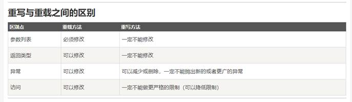

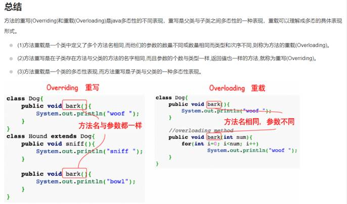

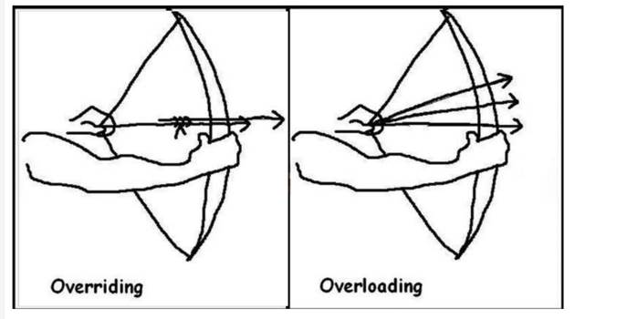

 

# 2. 什么是redis

https://www.toutiao.com/i6740616409446875659/

# 3. String、StringBuffer、StringBuilder区别

1）String是final修饰的，不可变的，StringBuffer、StringBuilder是可变的

2）StringBuffer是线程安全的，每个方法都有synchronized修饰

StringBuilder是线程不安全的

3)线程不安全性能更高，在开发中，优先采用StringBuilder

优先级：StringBuilder > StringBuffer > String

 

# 4. MVC编程模式

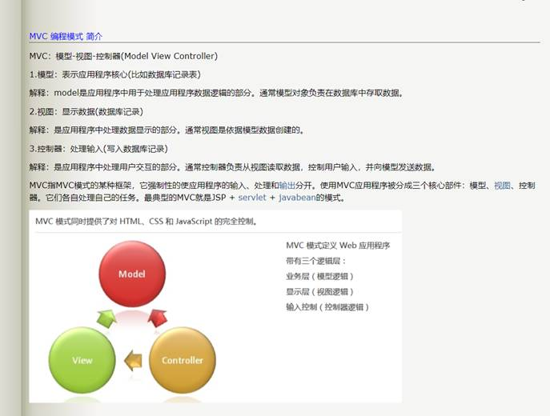

 

# 5. SSM框架

1.1、Spring是一个开源框架， 简单来说，Spring是一个轻量级的控制反转（IoC）和面向切面（AOP）的容器框架。

 

1.2、Spring MVC属于SpringFrameWork的后续产品，已经融合在Spring Web Flow里面。Spring MVC 分离了控制器、模型对象、分派器以及处理程序对象的角色，这种分离让它们更容易进行定制。

 

1.3、MyBatis是一个基于Java的持久层框架。MyBatis 使用简单的 XML或注解用于配置和原始映射，将接口和 Java 的POJOs（Plain Old Java Objects，普通的 Java对象）映射成数据库中的记录。

 

# 6.  项目结构

 

# 7.  spring MVC 常用组件

https://m.itshutong.com/articles/669/common-mvc-spring-components

DispatcherServlet、HandlerMapping、Handler、HandlerAdapter、View Resolver

组件加载

## DispatcherServlet(前端控制器)

用户请求到达前端控制器，它就相当于 mvc 模式中的 c，dispatcherServlet 是整个流程控制的中心，由它调用其它组件处理用户的请求，dispatcherServlet 的存在降低了组件之间的耦合性。

## HandlerMapping(处理器映射器)

负责根据用户请求找到 Handler 处理器，SpringMVC 提供了不同的映射器实现不同的映射方式，例如: 配置文件方式，实现接口方式，注解方式等。

## Handler(处理器)

它就是我们开发中要编写的具体业务控制器。由 DispatcherServlet 把用户请求转发到 Handler。由 Handler 对具体的用户请求进行处理。

## HandlerAdapter(处理器适配器)

通过 HandlerAdapter 对处理器进行执行，这是适配器模式的应用，通过扩展适配器可以对更多类型的处理器进行执行。

## View Resolver(视图解析器)

负责将处理结果生成 View 视图，View Resolver 首先根据逻辑视图名解析成物理视图名，即具体的页面地址，再生成 View 视图对象，最后对 View 进行渲染将处理结果通过页面展示给用户。

## 组件加载

在 SpringMVC 的各个组件中，处理器映射器、处理器适配器、视图解析器称为 SpringMVC 的三大组件。

使用 `<mvc:annotation-driven>` 自动加载 RequestMappingHandlerMapping(处理映射器)和 RequestMappingHandlerAdapter (处理适配器) ， 可替代注解处理器和适配器的配置

 

# 8. Mybatis中的 ${} 和 #{}区别与用法

1.#{}将传入的数据都当成一个字符串，会对自动传入的数据加一个引号（单引号？双引号？加了引号就对了）如：

//传入的值是sex

order by #{column}

解析后为

order by “sex” //将会出错

2、${}将传入的数据直接显示生成在sql中，如：

//传入的值是sex

order by ${column}

解析后为

order by sex //正确的

3、#{}可以在很大程度上防止sql注入，${}无法防止sql注入

4、${}一般用于传入数据库对象，例如传入表名（mybatis动态查询）

6、能用#就别用$

7、#使用了PreparedStatement来进行预处理，然后用set的方式对占位符进行设置；

$则是通过Statement直接进行查询，当有参数时直接进行拼接进行查询。（具体大家可以去看jdbc里面的PreparedStatement和Statement的处理方式不同）

8、但是#{}在动态解析的时候，会把参数部分解析成一个占位符？代替

9、而${}则是简单的字符替换，在动态解析阶段，该sql会被解析成

 

# 9. MySQL面试题

底层架构原理：https://blog.csdn.net/m0_38075425/article/details/82256315

## MySQL索引

概念：索引是帮助MySQL高效获取数据的排好序的数据结构

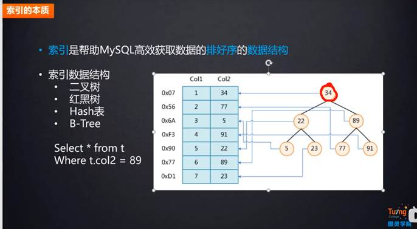

## MySQL存储引擎

a)    MySQL在5.1版本之前默认存储引擎为MyISAM，在此版本之后为InnoDB

b)    MyISAM存储引擎

MyIsam 的存储文件有三个，后缀名分别是 .frm、.MYD、MYI，其中 .frm 是表的定义文件，.MYD 是数据文件，.MYI 是索引文件。MyIsam 只支持表锁，不支持事务。MyIsam 由于有单独的索引文件，在读取数据方面的性能很高。Myisam是以堆结构进行组织数据，其表容易损坏。

c)    InnoDB

InnoDB 的存储文件有两个，后缀名分别是 .frm 和 .idb，其中 .frm 是表的定义文件，而 idb 是数据文件。InnoDB 中存在表锁和行锁，不过行锁是在命中索引的情况下才会起作用。InnoDB 支持事务，且支持四种隔离级别（读未提交、读已提交、可重复读、串行化），默认的为可重复读。

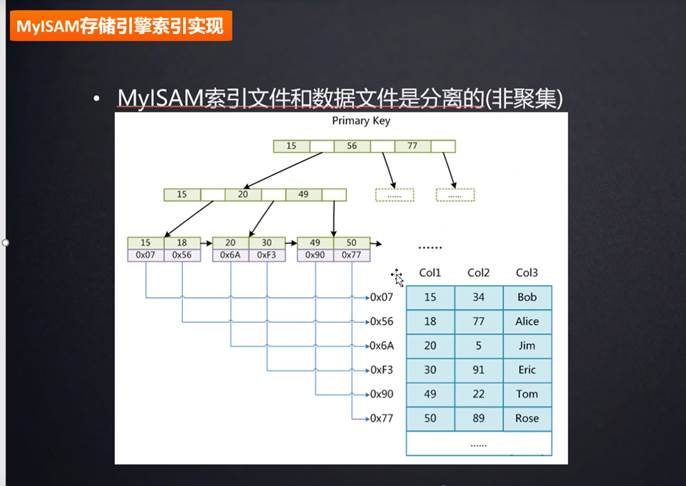

 

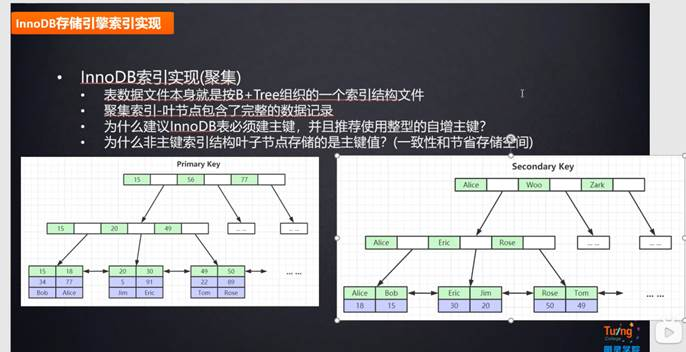

 

## MyISAM与InnoDB的区别（9个不同点）

MyISAM与InnoDB 的区别（9个不同点）：

https://blog.csdn.net/qq_35642036/article/details/82820178

Mysql 中 MyISAM 和 InnoDB 的区别有哪些？：

https://www.zhihu.com/question/20596402

mysql 创建表_MySql 数据库文件介绍和存放位置，以及如何修改默认存放位置？：

​    https://blog.csdn.net/weixin_39714565/article/details/110863839

 

 

\1. InnoDB支持事务，MyISAM不支持，对于InnoDB每一条SQL语言都默认封装成事务，自动提交，这样会影响速度，所以最好把多条SQL语言放在begin和commit之间，组成一个事务； 

 

\2. InnoDB支持外键，而MyISAM不支持。对一个包含外键的InnoDB表转为MYISAM会失败； 

 

\3. InnoDB是聚集索引，使用B+Tree作为索引结构，数据文件是和（主键）索引绑在一起的（表数据文件本身就是按B+Tree组织的一个索引结构），必须要有主键，通过主键索引效率很高。但是辅助索引需要两次查询，先查询到主键，然后再通过主键查询到数据。因此，主键不应该过大，因为主键太大，其他索引也都会很大。

 

​    MyISAM是非聚集索引，也是使用B+Tree作为索引结构，索引和数据文件是分离的，索引保存的是数据文件的指针。主键索引和辅助索引是独立的。

 

​    也就是说：InnoDB的B+树主键索引的叶子节点就是数据文件，辅助索引的叶子节点是主键的值；而MyISAM的B+树主键索引和辅助索引的叶子节点都是数据文件的地址指针。

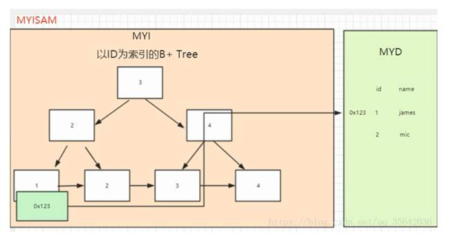

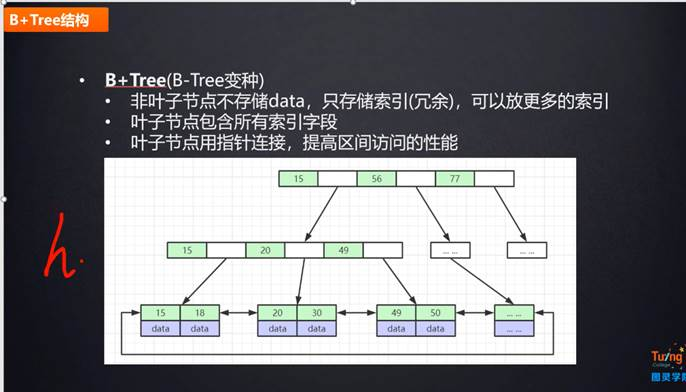

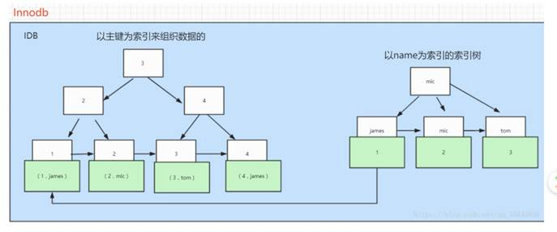

\4. InnoDB不保存表的具体行数，执行select count(*) from table时需要全表扫描。而MyISAM用一个变量保存了整个表的行数，执行上述语句时只需要读出该变量即可，速度很快（注意不能加有任何WHERE条件）；

 

那么为什么InnoDB没有了这个变量呢？

 

  因为InnoDB的事务特性，在同一时刻表中的行数对于不同的事务而言是不一样的，因此count统计会计算对于当前事务而言可以统计到的行数，而不是将总行数储存起来方便快速查询。InnoDB会尝试遍历一个尽可能小的索引除非优化器提示使用别的索引。如果二级索引不存在，InnoDB还会尝试去遍历其他聚簇索引。

  如果索引并没有完全处于InnoDB维护的缓冲区（Buffer Pool）中，count操作会比较费时。可以建立一个记录总行数的表并让你的程序在INSERT/DELETE时更新对应的数据。和上面提到的问题一样，如果此时存在多个事务的话这种方案也不太好用。如果得到大致的行数值已经足够满足需求可以尝试SHOW TABLE STATUS

 

 

\5. Innodb不支持全文索引，而MyISAM支持全文索引，在涉及全文索引领域的查询效率上MyISAM速度更快高；PS：5.7以后的InnoDB支持全文索引了

 

\6. MyISAM表格可以被压缩后进行查询操作

 

\7. InnoDB支持表、行(默认)级锁，而MyISAM支持表级锁

   InnoDB的行锁是实现在索引上的，而不是锁在物理行记录上。潜台词是，如果访问没有命中索引，也无法使用行锁，将要退化为表锁。

8、InnoDB表必须有唯一索引（如主键）（用户没有指定的话会自己找/生产一个隐藏列Row_id来充当默认主键），而Myisam可以没有

9、Innodb存储文件有frm、ibd，而Myisam是frm、MYD、MYI

​    Innodb：frm是表定义文件，ibd是数据文件

​    Myisam：frm是表定义文件，myd是数据文件，myi是索引文件

 

## MySQL去重

关键字：distinct

## MySQL的事务

https://www.cnblogs.com/limuzi1994/p/9684083.html

### 事务的四个特性

原子性、一致性、隔离性、持久性

#### 1、原子性（Atomicity）

原子性是指事务包含的所有操作要么全部成功，要么全部失败回滚，因此事务的操作如果成功就必须要完全应用到数据库，如果操作失败则不能对数据库有任何影响。

#### 2、一致性（Consistency）

一致性是指事务必须使数据库从一个一致性状态变换到另一个一致性状态，也就是说一个事务执行之前和执行之后都必须处于一致性状态。举例来说，假设用户A和用户B两者的钱加起来一共是1000，那么不管A和B之间如何转账、转几次账，事务结束后两个用户的钱相加起来应该还得是1000，这就是事务的一致性。

#### 3、隔离性（Isolation）

隔离性是当多个用户并发访问数据库时，比如同时操作同一张表时，数据库为每一个用户开启的事务，不能被其他事务的操作所干扰，多个并发事务之间要相互隔离。关于事务的隔离性数据库提供了多种隔离级别，稍后会介绍到。

#### 4、持久性（Durability）

持久性是指一个事务一旦被提交了，那么对数据库中的数据的改变就是永久性的，即便是在数据库系统遇到故障的情况下也不会丢失提交事务的操作。例如我们在使用JDBC操作数据库时，在提交事务方法后，提示用户事务操作完成，当我们程序执行完成直到看到提示后，就可以认定事务已经正确提交，即使这时候数据库出现了问题，也必须要将我们的事务完全执行完成。否则的话就会造成我们虽然看到提示事务处理完毕，但是数据库因为故障而没有执行事务的重大错误。这是不允许的。

### 事务的隔离级别

数据库事务的隔离级别有4个，由低到高依次为Read uncommitted(未授权读取、读未提交)、Read committed（授权读取、读提交）、Repeatable read（可重复读取）、Serializable（序列化），这四个级别可以逐个解决脏读、不可重复读、幻象读这几类问题。

 

## 聚集索引、辅助索引、覆盖索引、联合索引

*参考书籍：**《**MySQL**技术内幕* *InnoDB**存储引擎》*

a)    聚集索引

聚集索引就是按照每张表的主键构造一棵B+树，同时叶子节点中存放的即为整张表的行记录数据。

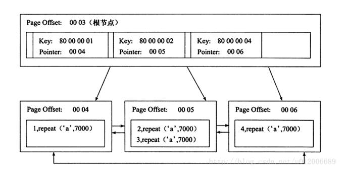

聚集索引的叶子节点称为数据页，每个数据页通过一个双向链表来进行链接，而且数据页按照主键的顺序进行排列。

每个数据页上存放的是完整的行记录，而在非数据页的索引页中，存放的仅仅是键值及指向数据页的偏移量，而不是一个完整的行记录。

如果定义了主键，InnoDB会自动使用主键来创建聚集索引。如果没有定义主键，InnoDB会选择一个唯一的非空索引代替主键。如果没有唯一的非空索引，InnoDB会隐式定义一个主键来作为聚集索引。

 

b)    辅助索引

辅助索引，也叫非聚集索引。和聚集索引相比，叶子节点中并不包含行记录的全部数据。叶子节点除了包含键值以外，每个叶子节点的索引行还包含了一个书签（bookmark），该书签用来告诉InnoDB哪里可以找到与索引相对应的行数据。

 

c)    覆盖索引

d)    联合索引

联合索引是指对表上的多个列进行索引。

# 10.    Java常见基础面试题

## 1)  Java的异常体系

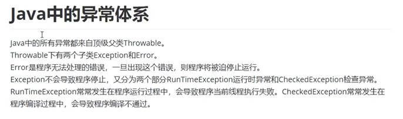

## 2)  equals 和 == 

https://blog.csdn.net/qq_36522306/article/details/80550210

 

答案一：

i.      ==对比的是栈中的值，基本数据类型是变量值，引用数据类型是堆中内存对象的地址

ii.      equals:Object中默认也是采用==比较，通常会重写equals()方法，比如String类

 

| Object类                                                     | String类                                                     |
| ------------------------------------------------------------ | ------------------------------------------------------------ |
| public boolean equals(Object obj) {        return (this == obj);    } | public boolean equals(Object anObject) {        if (this == anObject) {return true; }        if (anObject instanceof String) {          String anotherString = (String)anObject;          int n = value.length;          if (n == anotherString.value.length) {          char v1[] = value;          char v2[] =  anotherString.value;          int i = 0;          while (n-- != 0) {            if (v1[i] != v2[i])              return false;            i++;          }          return true;          }        }        return false; } |

上述代码可以看出，String类中被复写的equals()方法其实是比较两个字符串的内容

 

答案二：初步认识equals与==的区别：

a)    ==是判断两个变量或实例是不是指向同一个内存空间，equals是判断两个变量或实例所指向的内存空间的值是不是相同 

b)    ==是指对内存地址进行比较 ， equals()是对字符串的内容进行比较

c)    ==指引用是否相同， equals()指的是值是否相同

 

equals与==的区别详解：

​    == 比较的是变量(栈)内存中存放的对象的(堆)内存地址，用来判断两个对象的地址是否相同，即是否是指相同一个对象。比较的是真正意义上的指针操作。equals用来比较的是两个对象的内容是否相等，由于所有的类都是继承自java.lang.Object类的，所以适用于所有对象，如果没有对该方法进行覆盖的话，调用的仍然是Object类中的方法，而Object中的equals方法返回的却是==的判断。String s="abcd"是一种非常特殊的形式,和new 有本质的区别。它是java中唯一不需要new 就可以产生对象的途径。以String s="abcd";形式赋值在java中叫直接量,它是在常量池中而不是象new一样放在压缩堆中。 这种形式的字符串，在JVM内部发生字符串拘留，即当声明这样的一个字符串后，JVM会在常量池中先查找有有没有一个值为"abcd"的对象,如果有,就会把它赋给当前引用.即原来那个引用和现在这个引用指点向了同一对象, 如果没有,则在常量池中新创建一个"abcd",下一次如果有String s1 = "abcd";又会将s1指向"abcd"这个对象,即以这形式声明的字符串,只要值相等,任何多个引用都指向同一对象.

　　 而String s = new String("abcd");和其它任何对象一样.每调用一次就产生一个对象，只要它们调用。

 也可以这么理解: String str = "hello"; 先在内存中找是不是有"hello"这个对象,如果有，就让str指向那个"hello".

 

 如果内存里没有"hello"，就创建一个新的对象保存"hello". String str=new String ("hello") 就是不管内存里是不是已经有"hello"这个对象，都新建一个对象保存"hello"。

 

 

## 3)  runable 和 callable 有什么区别

Callable和Runnable有几点不同:

​    ①Callable规定的方法是call()，而Runnable规定的方法是run().

​    ②Callable的任务执行后可返回值，而Runnable的任务是不能返回值的

​    ③call()方法可抛出异常，而run()方法是不能抛出异常的。

​    ④运行Callable任务可拿到一个Future对象，Future表示异步计算的结果。它提供了检查计算是否完成的方法,以等待计算的完成,并检索计算的结果.通过Future对象可了解任务执行情况,可取消任务的执行,还可获取任务执行的结果

 

## 4)  java多线程都有几种方式实现

有三种：

### a)  继承Thread类，重写run函数

​    创建：

class xx extends Thread{

​     public void run(){

​      Thread.sleep(1000)  //线程休眠1000毫秒，sleep使线程进入Block状态，并释放资源

​    }}

 

​     开启线程：

​    对象.start()  //启动线程，run函数运行

### b)  实现Runnable接口，重写run函数

​    开启线程：

  

  Thread t = new Thread(对象)  //创建线程对象

​    t.start()

 

### c)   实现Callable接口，重写call函数

​    Callable是类似于Runnable的接口，实现Callable接口的类和实现Runnable的类都是可被其它线程执行的任务。

 

## 5)  进程和线程 

## 6)  线程的生命周期

进程与线程一样，都具有一定的生命周期，线程的生命周期包括四个状态：创建状态、就绪状态、阻塞状态、死亡状态。

a)    新建状态(new)：新创建了一个线程对象

b)    就绪状态(Runnable)：线程对象创建后，其他线程调用了该对象的start()。该状态的线程位于可运行线程池中，变得可运行，等待获取CPU的使用权。

c)    运行状态(Running)：就绪状态的线程获取了CPU，执行程序代码。

d)    阻塞状态：等待阻塞、同步阻塞、其他阻塞

​           i.      等待阻塞：运行的线程执行wait()方法，该线程会释放占用的所有资源，JVM会把该线程放入“等待池“中。进入这个状态后，是不能自动唤醒的，必须依靠其他线程调用notify或notifyAll方法才能被唤醒，wait()是Object类的方法

​          ii.      同步阻塞：运行的线程在获取对象的同步锁时，若该同步锁被别的线程占用，则JVM会把线程放入“锁池“中。

​         iii.      其他阻塞：运行的线程执行sleep()或join()方法，或者发出了I/O请求时，JVM会把该线程设置为阻塞状态。当sleep状态超时、join等待线程终止或者超时、或者I/O处理完毕时，线程重新转入就绪状态。Sleep是Thread类的方法。

解释：

​              i.      Sleep：不会释放持有的对象锁

​             ii.      Join：等待另一个线程执行完成

​            iii.      Wait：会释放持有的对象锁

​            iv.      Synchronized：运行同步代码，但是没有获得指定对象的锁，于是进入指定对象的锁池等待。

e)    终止（死亡）

​              i.      不建议使用stop、destroy终止，不会释放锁

​             ii.      建议通过Boolean变量，正常终止线程运行

## 7)  什么是线程安全？

a) 多线程环境下

b) 对这个对象的访问不想需要加入额外的同步控制

c) 操作的数据的结果依然是正确的

## 8)  实现线程安全

a)    加锁——同步代码（synchronized）

同步块

**synchronized** (**this**) {//（）中的内容 就是 ----“锁”---同步监视器

**。。。。**

**}**

同步方法

**public** **synchronized** **void** buy(){ 

。。。

} 

 

b)    Lock锁

//锁住：

lock.lock();

。。。。。

。。。

//解开锁：

lock.unlock();

 

## 9)  线程的优先级

a)    1-10，默认是5

b)    优先级低只是意味着调用的概率低，并不是不被调用

 

## 10)     int 可以使用equals吗

## 11)     hashCode和equals

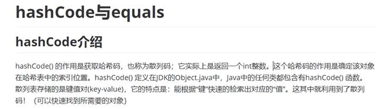

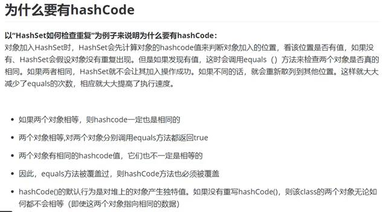

## 12)     有了thread 为什么还要runable

## 13)     Java中的run()方法和start()的区别

### a)  区别

Java中启动线程有两种方法，继承Thread类和实现Runnable接口，由于Java无法实现多重继承，所以一般通过实现Runnable接口来创建线程。但是无论哪种方法都可以通过start()和run()方法来启动线程，下面就来介绍一下他们的区别。

### b)  start方法：

通过该方法启动线程的同时也创建了一个线程，真正实现了多线程。无需等待run()方法中的代码执行完毕，就可以接着执行下面的代码。此时start()的这个线程处于就绪状态，当得到CPU的时间片后就会执行其中的run()方法。这个run()方法包含了要执行的这个线程的内容，run()方法运行结束，此线程也就终止了。

### c)   run方法：

通过run方法启动线程其实就是调用一个类中的方法，当作普通的方法的方式调用。并没有创建一个线程，程序中依旧只有一个主线程，必须等到run()方法里面的代码执行完毕，才会继续执行下面的代码，这样就没有达到写线程的目的。

 

## 14)     抽象类和接口(Interface)的区别

 

## 15)     集合相关

### list 有初始长度吗

使用默认的构造器，List list = new ArrayList();初始容量被设置为10

### list如何扩容的

扩容机制为：当前容量 * 1.5 + 1

### 如何给list中的元素进行排序

 

### ArrayList和LinkedList区别

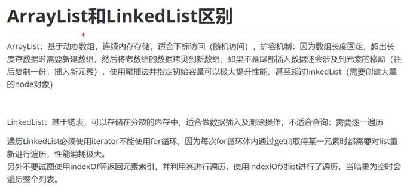

### list和set的区别

List：有序，按对象进入的顺序保存对象，可重复，允许多个Null元素对象，可以使用Iterator取出所有元素，再逐一遍历；也可以使用get(int index)获取指定下标的元素

Set：无序，不可重复，最多允许一个null元素对象存在，取元素时，只能使用Iterator接口取得所有元素，再逐一遍历各个元素

### HashMap和HashTable区别及底层实现

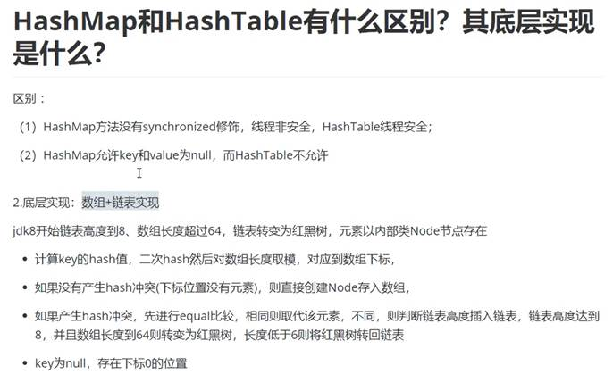

 

## 16)     IO流：输入输出流

字节流

​    字节输入流：键盘/文件  --》  程序

​    字节输出流

字符流

a)    InputStream

​           i.      FileInputStream

​          ii.      ByteArrayInputStream

​         iii.      ObjectInputStream：对象序列化，实现空接口serilizable

​         iv.      DataInputStream

​          v.      BufferedInputStream

 

b)    OutputStream

​           i.      FileOutputStream

​          ii.      ByteArrayIOutputStream

​         iii.      ObjectOutputStream

​         iv.      DataOutputStream

​          v.      PrintStream

​         vi.      BufferedOutputStream

c)    Reader

​           i.      FileReader

​          ii.      InputStreamReader：转换流，将字节流转化为字符流

​         iii.      BufferedReader

d)    Writer

​           i.      FileWriter

​          ii.      OutputStreamWriter：转换流

​         iii.      BufferedWriter

 

 

# 11.    微服务如何调用的

https://blog.csdn.net/rfidgroup/article/details/89519577

 

# 12.    springmvc 传参 传对象类型 后台需要怎么处理

# 13.    如何实现一个IOC容器

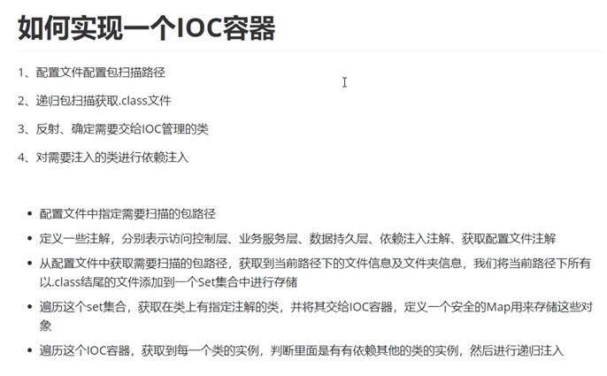

# 14.    springboot常用注解

## 1）    @SpringBootApplication

包含@Configuration、@EnableAutoConfiguration、@ComponentScan

 

通常用在主类上。

 

## 2）    @Repository

用于标注数据访问组件，即DAO组件。

 

## 3）    @Service

用于标注业务层组件。

 

## 4）    @RestController

用于标注控制层组件(如struts中的action)，包含@Controller和@ResponseBody

 

## 5）    @ResponseBody

表示该方法的返回结果直接写入HTTP response body中

 

一般在异步获取数据时使用，在使用@RequestMapping后，返回值通常解析为跳转路径，加上@responsebody后返回结果不会被解析

 

为跳转路径，而是直接写入HTTP response body中。比如异步获取json数据，加上@responsebody后，会直接返回json数据。

 

## 6）    @Component

泛指组件，当组件不好归类的时候，我们可以使用这个注解进行标注。

 

## 7）    @ComponentScan

组件扫描。相当于，如果扫描到有@Component @Controller @Service等这些注解的类，则把

 

这些类注册为bean。

 

## 8）    @Configuration

指出该类是 Bean 配置的信息源，相当于XML中的，一般加在主类上。

 

## 9）    @Bean

相当于XML中的,放在方法的上面，而不是类，意思是产生一个bean,并交给spring管理。

 

## 10）  @EnableAutoConfiguration

让 Spring Boot 根据应用所声明的依赖来对 Spring 框架进行自动配置，一般加在主类上。

 

## 11）  @AutoWired

byType方式。把配置好的Bean拿来用，完成属性、方法的组装，它可以对类成员变量、方法及构造函数进行标注，完成自动装配的工作。

当加上（required=false）时，就算找不到bean也不报错。

 

## 12）  @Qualifier

当有多个同一类型的Bean时，可以用@Qualifier("name")来指定。与@Autowired配合使用

 

## 13）  @Resource(name="name",type="type")

没有括号内内容的话，默认byName。与@Autowired干类似的事。

 

## 14）  @RequestMapping

RequestMapping是一个用来处理请求地址映射的注解，可用于类或方法上。用于类上，表示类中的所有响应请求的方法都是以该地址作为父路径。

 

该注解有六个属性：

 

params:指定request中必须包含某些参数值是，才让该方法处理。

 

headers:指定request中必须包含某些指定的header值，才能让该方法处理请求。

 

value:指定请求的实际地址，指定的地址可以是URI Template 模式

 

method:指定请求的method类型， RequestMethod.GET、POST、PUT、DELETE等

 

consumes:指定处理请求的提交内容类型（Content-Type），如application/json,text/html;

 

produces:指定返回的内容类型，仅当request请求头中的(Accept)类型中包含该指定类型才返回

 

## 15）  @RequestParam

用在方法的参数前面。

 

@RequestParam String a =request.getParameter("a")。

 

## 16）  @PathVariable

路径变量。参数与大括号里的名字一样要相同。

 

 

RequestMapping("user/get/mac/{macAddress}")

 

public String getByMacAddress(@PathVariable String macAddress){

 

　　//do something;

 

　　}

 

## 17）  @Profiles

Spring Profiles提供了一种隔离应用程序配置的方式，并让这些配置只能在特定的环境下生效。

 

任何@Component或@Configuration都能被@Profile标记，从而限制加载它的时机。

 

@Configuration

@Profile("prod")

public class ProductionConfiguration {  // ...}

 

## 18）  @ConfigurationProperties

Spring Boot将尝试校验外部的配置，默认使用JSR-303（如果在classpath路径中）。

 

你可以轻松的为你的@ConfigurationProperties类添加JSR-303 javax.validation约束注解：

 

@Component

@ConfigurationProperties(prefix="connection")

public class ConnectionSettings {

@NotNullprivate InetAddress remoteAddress;

 

// ... getters and setters

 

}

 

全局异常处理

 

## 19）  @ControllerAdvice

包含@Component。可以被扫描到。

统一处理异常

## 20）  @ExceptionHandler（Exception.class）：

用在方法上面表示遇到这个异常就执行以下方法

总结：以上就是本篇文章的全部内容了，希望对大家有所帮助。

以上就是springboot常用注解有哪些的详细内容，更多请关注php中文网其它相关文章！

# 15.    返回一个json格式 数据怎么做

# 16.    说说你最熟悉的项目 你做了什么

# 17.    说一个你熟悉的设计模式

https://juejin.cn/post/6844904125721772039

 

## 设计模式的六大原则：

### 开放封闭原则（Open Close Principle）

- 原则思想：尽量通过扩展软件实体来解决需求变化，而不是通过修改已有的代码来完成变化
- 描述：一个软件产品在生命周期内，都会发生变化，既然变化是一个既定的事实，我们就应该在设计的时候尽量适应这些变化，以提高项目的稳定性和灵活性。
- 优点：单一原则告诉我们，每个类都有自己负责的职责，里氏替换原则不能破坏继承关系的体系。

### 里氏代换原则（Liskov Substitution Principle）

- 原则思想：使用的基类可以在任何地方使用继承的子类，完美的替换基类。
- 大概意思是：子类可以扩展父类的功能，但不能改变父类原有的功能。子类可以实现父类的抽象方法，但不能覆盖父类的非抽象方法，子类中可以增加自己特有的方法。
- 优点：增加程序的健壮性，即使增加了子类，原有的子类还可以继续运行，互不影响。

### 依赖倒转原则（Dependence Inversion Principle）

·    依赖倒置原则的核心思想是面向接口编程.

·    依赖倒转原则要求我们在程序代码中传递参数时或在关联关系中，尽量引用层次高的抽象层类，

·    这个是开放封闭原则的基础，具体内容是：对接口编程，依赖于抽象而不依赖于具体。

### 接口隔离原则（Interface Segregation Principle）

- 这个原则的意思是：使用多个隔离的接口，比使用单个接口要好。还是一个降低类之间的耦合度的意思，从这儿我们看出，其实设计模式就是一个软件的设计思想，从大型软件架构出发，为了升级和维护方便。所以上文中多次出现：降低依赖，降低耦合。
- 例如：支付类的接口和订单类的接口，需要把这俩个类别的接口变成俩个隔离的接口

### 迪米特法则（最少知道原则）（Demeter Principle）

- 原则思想：一个对象应当对其他对象有尽可能少地了解，简称类间解耦
- 大概意思就是一个类尽量减少自己对其他对象的依赖，原则是低耦合，高内聚，只有使各个模块之间的耦合尽量的低，才能提高代码的复用率。
- 优点：低耦合，高内聚。

### 单一职责原则（Principle of single responsibility）

- 原则思想：一个方法只负责一件事情。
- 描述：单一职责原则很简单，一个方法 一个类只负责一个职责，各个职责的程序改动，不影响其它程序。 这是常识，几乎所有程序员都会遵循这个原则。
- 优点：降低类和类的耦合，提高可读性，增加可维护性和可拓展性，降低可变性的风险。

## 单例模式

### 1.什么是单例模式、

- 保证一个类只有一个实例，并且提供一个访问该全局访问点

### 2.那些地方用到了单例模式

1. 网站的计数器，一般也是采用单例模式实现，否则难以同步。
2. 应用程序的日志应用，一般都是单例模式实现，只有一个实例去操作才好，否则内容不好追加显示。
3. 多线程的线程池的设计一般也是采用单例模式，因为线程池要方便对池中的线程进行控制
4. Windows的（任务管理器）就是很典型的单例模式，他不能打开俩个
5. windows的（回收站）也是典型的单例应用。在整个系统运行过程中，回收站只维护一个实例。

### 3.单例优缺点

**优点：**

1. 在单例模式中，活动的单例只有一个实例，对单例类的所有实例化得到的都是相同的一个实例。这样就防止其它对象对自己的实例化，确保所有的对象都访问一个实例
2. 单例模式具有一定的伸缩性，类自己来控制实例化进程，类就在改变实例化进程上有相应的伸缩性。
3. 提供了对唯一实例的受控访问。
4. 由于在系统内存中只存在一个对象，因此可以节约系统资源，当需要频繁创建和销毁的对象时单例模式无疑可以提高系统的性能。
5. 允许可变数目的实例。
6. 避免对共享资源的多重占用。

**缺点：**

1. 不适用于变化的对象，如果同一类型的对象总是要在不同的用例场景发生变化，单例就会引起数据的错误，不能保存彼此的状态。
2. 由于单利模式中没有抽象层，因此单例类的扩展有很大的困难。
3. 单例类的职责过重，在一定程度上违背了“单一职责原则”。
4. 滥用单例将带来一些负面问题，如为了节省资源将数据库连接池对象设计为的单例类，可能会导致共享连接池对象的程序过多而出现连接池溢出；如果实例化的对象长时间不被利用，系统会认为是垃圾而被回收，这将导致对象状态的丢失。

### 4.单例模式使用注意事项：

1. 使用时不能用反射模式创建单例，否则会实例化一个新的对象
2. 使用懒单例模式时注意线程安全问题
3. 饿单例模式和懒单例模式构造方法都是私有的，因而是不能被继承的，有些单例模式可以被继承（如登记式模式）

### 5.单例创建方式

**（主要使用懒汉和懒汉式）**

1. 饿汉式:类初始化时,会立即加载该对象，线程天生安全,调用效率高。
2. 懒汉式: 类初始化时,不会初始化该对象,真正需要使用的时候才会创建该对象,具备懒加载功能。
3. 静态内部方式:结合了懒汉式和饿汉式各自的优点，真正需要对象的时候才会加载，加载类是线程安全的。
4. 枚举单例: 使用枚举实现单例模式 优点:实现简单、调用效率高，枚举本身就是单例，由jvm从根本上提供保障!避免通过反射和反序列化的漏洞， 缺点没有延迟加载。
5. 双重检测锁方式 (因为JVM本质重排序的原因，可能会初始化多次，不推荐使用)

#### 1.饿汉式

1. 饿汉式:类初始化时,会立即加载该对象，线程天生安全,调用效率高。

#### 2.懒汉式

1. 懒汉式: 类初始化时,不会初始化该对象,真正需要使用的时候才会创建该对象,具备懒加载功能。

#### 3.静态内部类

1. 静态内部方式:结合了懒汉式和饿汉式各自的优点，真正需要对象的时候才会加载，加载类是线程安全的。

#### 4.枚举单例式

1. 枚举单例: 使用枚举实现单例模式 优点:实现简单、调用效率高，枚举本身就是单例，由jvm从根本上提供保障!避免通过反射和反序列化的漏洞， 缺点没有延迟加载。

#### 5.双重检测锁方式

1. 双重检测锁方式 (因为JVM本质重排序的原因，可能会初始化多次，不推荐使用)

 

## 简单工厂模式

 

 

 

 

# 18.    注解和反射

## 1）    注解

### 什么是注解

​    i.      Annotation是从JDK5.0开始引入的新技术

   ii.      不是程序本身，可以对程序做出解释。（这一点和注释(comment)没什么区别）

  iii.       可以被其他程序(比如：编译器等)读取。

  iv.      格式：@注解名

   v.      使用：可以附加在package、class、method、field等上面，相当于给他们添加了额外辅助信息，我们可以通过反射机制编程实现对这些元数据的访问。

### 内置注解

@Override

@Deprecated

@SuppressWarnings

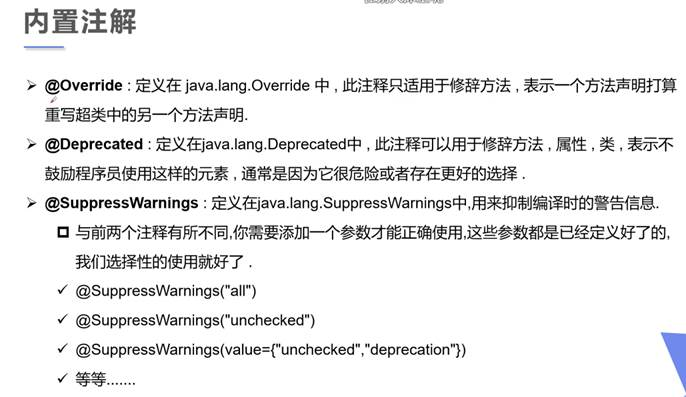

### 元注解

元注解的作用就是负责注解其他注解。Java定义了4个标准的meta-annotation类型，他们被用来提供对其他annotation类型作说明。

这些类型都从属于java,lang.annotation包

a)   @Target：用于描述注解的使用范围（即：被描述的注解可以用在什么地方）

@Target(ElementType.TYPE)  //接口、类、枚举

@Target(ElementType.FIELD) //字段、枚举的常量

@Target(ElementType.METHOD) //方法

@Target(ElementType.PARAMETER) //方法参数

@Target(ElementType.CONSTRUCTOR) //构造函数

@Target(ElementType.LOCAL_VARIABLE)//局部变量

@Target(ElementType.ANNOTATION_TYPE)//注解

@Target(ElementType.PACKAGE) ///包 

 

b)   @Retention：表示需要在什么级别保存该注解信息，用描述注解的生命周期。

RetentionPoicy

(SOURCE<CLASS<RUNTIME)

c)   @Document：表示是否将注解生成在Javadoc中

d)   @Inherited：说明子类可以继承父类中的该注解

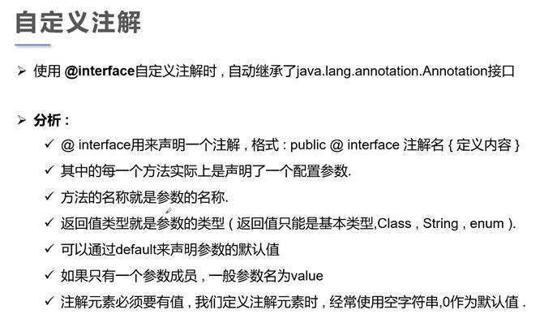

## 2）   反射机制

Java.Reflection

### Java的反射机制概述

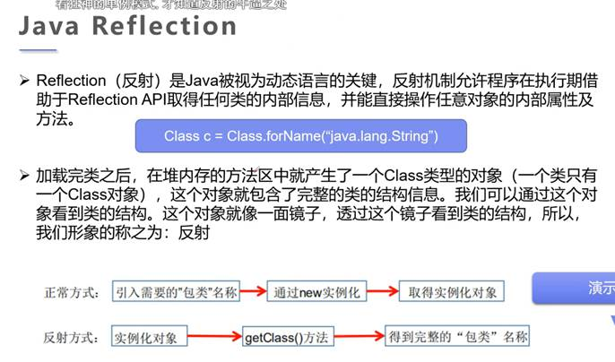

### Class类

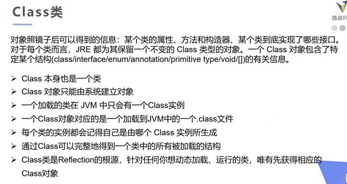

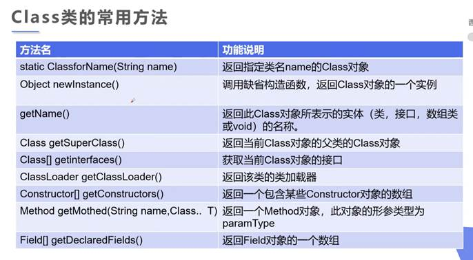

### 获取class类的三种方式

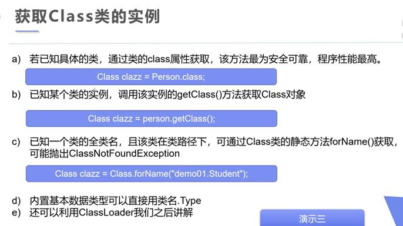

### Java内存分析

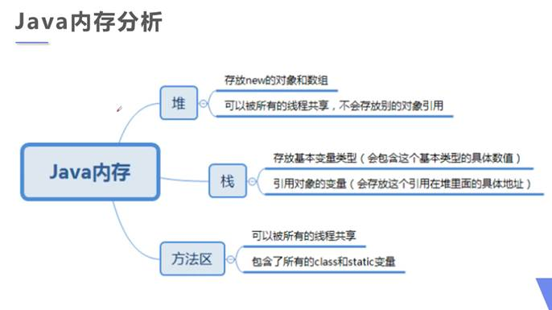

### 类加载过程

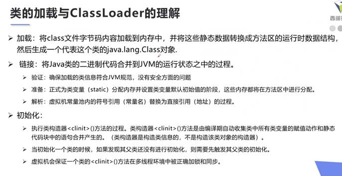

 

 

 

 

 

# 19.    过滤器和拦截器

## 过滤器（filter）

web.xml中设置字符编码

对请求进行过滤，比如过滤一些敏感文字

过滤器是基于函数回调

filter可以负责拦截多个请求或响应，一个请求或响应也可以被多个filter拦截

作用：过滤没用的参数、安全校验（是否登录）

## 拦截器（interceptor）

配置在springmvc里面，使用interceptors标签

依赖于springmvc框架，基于Java的反射机制，属于面向切面编程（AOP），可以同过spring的依赖注入（DI）进行一些业务操作，只能对controller请求拦截

 

# 20.    solr的运行原理： 

概念： 

顺序扫描: 

对数据挨个的进行比较，直到找出所有符合要求的数据。效率极地。 

全文检索: 

给数据创建一个索引目录，通过目录对符合要求的数据快速检索的方式。 

反向索引： 

保存了关键字和文档之间的对应关系的索引表，我们成为反向索引 

倒排表： 

保存了关键字对应的文档的ID数据的表 

词频： 

在词条化检索字段的数据后，词汇在文档中出现的频率。 

运行流程： 

1、数据在solr库中的存储流程 

将文档数据存储到solr库中(josn数据) 

----->使用词条化工具将检字段的值词条化：将数据分词，分成关键字 

----->将分词结果给语言组件：将分词结果转化为词根形式 

---->给检索字段创建索引目录（倒排索引） 

--->存储到索引库中(字段索引目录，文档数据 ) 

2、检索流程 

检索语句 

-->词条化工具分词 

-->根据分词后词汇信息，按照每个词汇检索索引目录 

-->返回所有的符合要求的文档数据 

注意： 

solr索引库的索引创建是基于字段创建的。 

Lucene和solr的区别： 

Lucene：Lucene是solr的底层 

solr：solr是对lucene的封装 

参照博客：http://www.importnew.com/12707.html 

 
 # 21. Java访问修饰符（有问题，详见 java基础知识总结归纳）

| 修饰符    | 当前类 | 同包 | 子类 | 其他包 |
| --------- | ------ | ---- | ---- | ------ |
| private   | √      | ×    | ×    | ×      |
| default   | √      | √    | ×    | ×      |
| protected | √      | √    | √    | ×      |
| public    | √      | √    | √    | √      |

# 22. solr的运行原理： 
概念： 
顺序扫描: 
对数据挨个的进行比较，直到找出所有符合要求的数据。效率极地。 
全文检索: 
给数据创建一个索引目录，通过目录对符合要求的数据快速检索的方式。 
反向索引： 
保存了关键字和文档之间的对应关系的索引表，我们成为反向索引 
倒排表： 
保存了关键字对应的文档的ID数据的表 
词频： 
在词条化检索字段的数据后，词汇在文档中出现的频率。 
运行流程： 
## 1、数据在solr库中的存储流程 
将文档数据存储到solr库中(josn数据) 
----->使用词条化工具将检字段的值词条化：将数据分词，分成关键字 
----->将分词结果给语言组件：将分词结果转化为词根形式 
---->给检索字段创建索引目录（倒排索引） 
--->存储到索引库中(字段索引目录，文档数据 ) 

## 2、检索流程 
检索语句 
-->词条化工具分词 
-->根据分词后词汇信息，按照每个词汇检索索引目录 
-->返回所有的符合要求的文档数据 
注意： 
solr索引库的索引创建是基于字段创建的。 
Lucene和solr的区别： 
Lucene：Lucene是solr的底层 
solr：solr是对lucene的封装 
参照博客：http://www.importnew.com/12707.html 

 

# 100.常见面试题(网址)

## Java面试题 | 锁定

https://blog.csdn.net/qq_41701956/article/details/86686492 | (1条消息) Java面试题及答案2019版（上）_Java笔记-CSDN博客_java面试题

https://blog.csdn.net/qq_41701956/article/details/86699263 | (1条消息) Java面试题及答案2019版（下）_Java笔记-CSDN博客_java面试题

https://www.bilibili.com/video/BV1er4y1A739?p=19&spm_id_from=pageDriver | 2021年JAVA面试必考篇，我肝了100道Java面试题直接给了30K，免费分享给大家！_哔哩哔哩 (゜-゜)つロ 干杯~-bilibili

https://www.bilibili.com/video/BV1uE411g77R?p=1 | 【面试必备】2020最新黑马Java就业班知识梳理_哔哩哔哩 (゜-゜)つロ 干杯~-bilibili

https://www.bilibili.com/video/BV11A411K7LE?p=17 | 九天Java面试突击集训，涨薪50%必备的JVM、多线程、Spring、MySQL、IO、分布式、微服务优质教程_哔哩哔哩 (゜-゜)つロ 干杯~-bilibili

https://www.bilibili.com/video/BV1oV411v71F | 马士兵Java大厂面试题全集（双清华主讲）-大厂高频面试题核心知识点（网络IO、TCP/IP、JVM、多线程、高性能）_哔哩哔哩 (゜-゜)つロ 干杯~-bilibili

https://github.com/Snailclimb/JavaGuide | Snailclimb/JavaGuide: 「Java学习+面试指南」一份涵盖大部分 Java 程序员所需要掌握的核心知识。准备 Java 面试，首选 JavaGuide！

https://leetcode-cn.com/leetbook/read/top-interview-questions/xm0u83/ | 算法面试题汇总 - LeetBook - 力扣（LeetCode）全球极客挚爱的技术成长平台

https://www.bilibili.com/video/BV1k74118721?p=6&spm_id_from=pageDriver | Java面试题突击100道！_哔哩哔哩 (゜-゜)つロ 干杯~-bilibili

https://www.bilibili.com/video/BV1oy4y1H7R6 | 【尚学堂】Java300集零基础适合初学者视频教程_Java300集零基础教程_Java初学入门视频基础巩固教程_Java语言入门到精通_哔哩哔哩 (゜-゜)つロ 干杯~-bilibili

 

## Spring框架学习 | 锁定

https://blog.csdn.net/ThinkWon/article/details/104397516 | Spring面试题（2020最新版）_ThinkWon的博客-CSDN博客_spring面试题2020

https://zhuanlan.zhihu.com/p/96901647 | Java面试题|105道框架面试题合集 - 知乎

https://zhuanlan.zhihu.com/p/40098726 | 最新JAVA面试题总结之框架（4） - 知乎

https://blog.csdn.net/qq_42914528/article/details/83684321 | (1条消息) 什么是spring，它能够做什么?_良月柒-CSDN博客_spring是什么

https://zhuanlan.zhihu.com/p/95504478 | 框架系列|Spring10道常见面试题！ - 知乎

https://www.jianshu.com/p/c89a3550588a | Spring @RestController、@Controller区别 - 简书

https://www.cnblogs.com/lixinjie/p/spring-tx-key-point-in-a-interview.html | 【面试】Spring事务面试考点吐血整理（建议珍藏） - 编程新说(李新杰) - 博客园

https://www.cnblogs.com/jasonZh/p/8953274.html | SSM框架中IoC、DI与AOP的理解 - Margaery - 博客园

https://www.jianshu.com/p/78ba8bafb90a | 理解Spring的AOP和IOC实现原理 - 简书

https://zhuanlan.zhihu.com/p/95507409 | 框架系列|SpringMVC 4道必看面试题！ - 知乎

https://blog.csdn.net/xwq911/article/details/51373258 | Spring MVC工作流程图_xwq911的专栏-CSDN博客

https://blog.csdn.net/qq_32671287/article/details/70212800 | Spring MVC ModelAndView详解_小小程序员-CSDN博客

https://blog.csdn.net/qq_33439525/article/details/78193190 | (1条消息) springmvc@RequestMapping-params参数规则_凉凉思语的博客-CSDN博客

https://zhuanlan.zhihu.com/p/96109192 | 框架系列|MyBatis 10道必看面试题 - 知乎

https://blog.csdn.net/PostersXu/article/details/79058365 | MyBatis学习——foreach标签的使用_t1heluosh1的博客-CSDN博客

https://www.php.cn/faq/417146.html | springboot常用注解有哪些-常见问题-PHP中文网

https://www.jianshu.com/p/39ee4f98575c | 简单讲讲@SpringBootApplication - 简书

https://zhuanlan.zhihu.com/p/95548893 | 框架系列|SpringBoot 6道必看面试题！ - 知乎

https://blog.csdn.net/rfidgroup/article/details/89519577 | (1条消息) SpringCloud底层服务之间是怎么相互调用的-微服务流程介绍_spring cloud 微服务技术开发-CSDN博客

https://juejin.cn/post/6844904125784653837 | Nginx面试题（总结最全面的面试题！！！）

https://blog.csdn.net/ThinkWon/article/details/103522351 | Redis面试题（2020最新版）_ThinkWon的博客-CSDN博客_redis面试题

https://www.toutiao.com/i6740616409446875659/ | Redis 21问，你接得住不？

 

## java多线程 | 解锁

https://segmentfault.com/a/1190000022648047 | 最近常问的99道Java多线程面试题 ！ - SegmentFault 思否

https://www.cnblogs.com/dolphin0520/p/3958019.html | Java线程面试题 Top 50 （转载） - Matrix海子 - 博客园

https://blog.csdn.net/Mypromise_TFS/article/details/81096007 | (1条消息) Java中的run()方法和start()的区别_Mr.Yin-CSDN博客

https://blog.csdn.net/grey_mouse/article/details/84193844 | (1条消息) java--进程和线程_grey_mouse的博客-CSDN博客_java 进程

 

## Java基础学习 | 解锁

https://www.cnblogs.com/zhuyeshen/p/10954275.html | equal与==的区别 - 那些年的代码 - 博客园

https://juejin.cn/post/6844904125721772039 | 设计模式面试题（总结最全面的面试题！！！）

https://www.runoob.com/java/java-override-overload.html | Java 重写(Override)与重载(Overload) | 菜鸟教程

https://www.cnblogs.com/chanshuyi/p/head_first_of_reflection.html | 大白话说Java反射：入门、使用、原理 - 陈树义 - 博客园

https://www.jianshu.com/p/9be58ee20dee | Java高级特性——反射 - 简书

https://blog.csdn.net/vivian_king/article/details/79610890 | (1条消息) Java的抽象类实例化_vivian的专栏-CSDN博客_java抽象类实例化

https://www.cnblogs.com/yesiamhere/p/6675067.html | java运算符 与（&）、非（~）、或（|）、异或（^） - 够硬的乙方 - 博客园

https://blog.csdn.net/czh500/article/details/88202971 | (1条消息) java中PreparedStatement和Statement详细讲解_冷囧囧-CSDN博客_preparedstatement

https://www.bilibili.com/video/BV1p4411P7V3?p=9 | 【狂神说Java】注解和反射_哔哩哔哩 (゜-゜)つロ 干杯~-bilibili

https://blog.csdn.net/m0_37116405/article/details/79421034 | [Java面试]六：常见面试题之设计模式_Louis的博客-CSDN博客_java常用的设计模式面试题

 

## MySQL面试题 | 解锁

https://blog.csdn.net/w_linux/article/details/79655073 | (1条消息) MySQL——约束(constraint)详解_浅然的专栏-CSDN博客

https://blog.csdn.net/xts5701046/article/details/81395958 | (1条消息) MySQL 表锁和行锁机制_xts5701046的博客-CSDN博客_mysql 行锁

https://blog.csdn.net/m0_38075425/article/details/82256315 | (1条消息) MySQL底层架构原理，工作流程和存储引擎的数据结构讲解_翻过一座座山-CSDN博客_mysql底层数据结构

https://blog.csdn.net/qq_35642036/article/details/82820178 | (1条消息) MyISAM与InnoDB 的区别（9个不同点）_张花生的博客-CSDN博客_innodb和myisam的区别

https://blog.csdn.net/qq_38224812/article/details/105636890 | (1条消息) mysql中drop、truncate和delete的区别_LBF的博客-CSDN博客

https://blog.csdn.net/ThinkWon/article/details/104778621 | MySQL数据库面试题（2020最新版）_ThinkWon的博客-CSDN博客_mysql面试题及答案2020

https://blog.csdn.net/ljinxin/article/details/78209496?utm_medium=distribute.pc_relevant.none-task-blog-OPENSEARCH-2.control&dist_request_id=7d42deb3-7fdc-4a33-a1aa-5eada459f5e2&depth_1-utm_source=distribute.pc_relevant.none-task-blog-OPENSEARCH-2.control | Oracle连接查询，彻底搞懂外连接（左外连接&右外连接）_ljinxin的博客-CSDN博客_oracle连接查询

 

## Java集合相关 | 解锁

https://blog.csdn.net/qq493820798/article/details/82257492 | 集合常用方法合集_辰小白-CSDN博客_集合常用方法

https://blog.csdn.net/jiuqiyuliang/article/details/32697903 | 【java读书笔记】——Collection集合之六大接口（Collection、Set、List、Map、Iterator和Comparable）_努力+坚持，而且还很年轻-CSDN博客_collection

https://blog.csdn.net/zlx312/article/details/79398557 | 面试常见的Linux命令及问题整理_zlx312的博客-CSDN博客_面试linux常考命令

https://blog.csdn.net/ThinkWon/article/details/104588551 | Java集合容器面试题（2020最新版）_ThinkWon的博客-CSDN博客_集合面试题java

https://github.com/Snailclimb/JavaGuide/blob/master/docs/java/collection/Java%E9%9B%86%E5%90%88%E6%A1%86%E6%9E%B6%E5%B8%B8%E8%A7%81%E9%9D%A2%E8%AF%95%E9%A2%98.md | JavaGuide/Java集合框架常见面试题.md at master · Snailclimb/JavaGuide

 

## 学习软件 | 解锁

https://www.notion.so/desktop | Mac & Windows – Notion

https://www.processon.com/ | ProcessOn - Create Flowcharts and Mindmaps Online for Free, Collaborate in Real-time

 