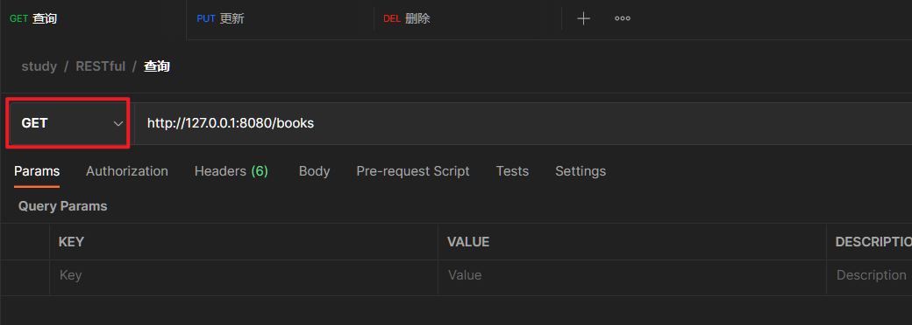
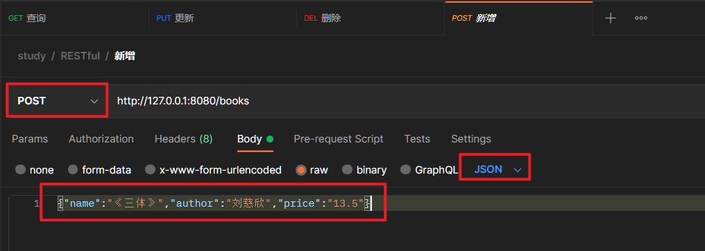
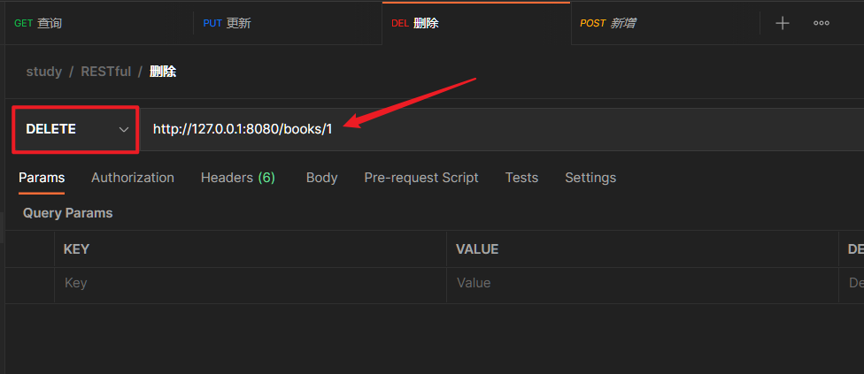
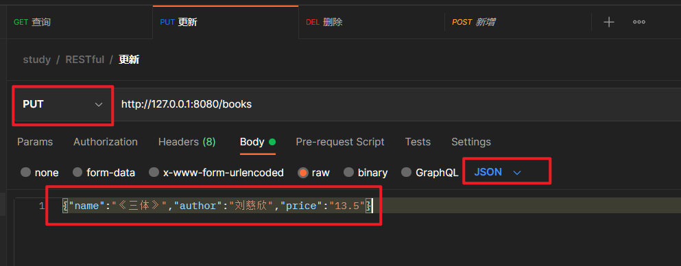

# REST风格简介

- 按照REST风格访问资源时，使用**行为动作**区分对资源进行了何种操作
  - http://127.0.0.1/users				   查询全部用户信息			GET（查询）
  - http://127.0.0.1/users/1				查询指定用户信息			GET（查询）
  - http://127.0.0.1/users				   添加用户信息			       POST（新增/保存）
  - http://127.0.0.1/users				   修改用户信息			       PUT（修改/更新）
  - http://127.0.0.1/users/1				删除用户信息			       DELETE（删除）

上述行为是约定方式，约定不是规范，可以打破，所以称为REST风格，而不是REST规范。

描述模块的名称通常使用复数，也就是加s的格式描述，表示此类资源，而非单个资源，例如：users、books、accounts...

请求路径：

## 1. 查询

```
http://127.0.0.1:8080/books
```




## 2. 新增

```
http://127.0.0.1:8080/books
{"name":"《三体》","author":"刘慈欣","price":"13.5"}
```




## 3. 删除

```
http://127.0.0.1:8080/books/1
```




## 4. 更新

```
http://127.0.0.1:8080/books
```




实例代码：

```java
package com.shubao.controller;

import com.shubao.domain.Book;
import org.springframework.web.bind.annotation.*;

/**
 * @version 1.0
 * @program: SpringBoot2022
 * @description: BookController 控制器类  Rest模式
 * @author: chris
 * @create: 2022-05-11 19:07
 * @since JDK1.8
 **/
// @Controller + @ResponseBody = @RestController
@RestController
@RequestMapping("/books")
public class BookController {

    // 查询所有 RequestMethod.GET
    @GetMapping
    public String getAll() {
        System.out.println("SpringBoot is running...2");
        return "Hello Books2";
    }

    // 根据id查询，使用@PathVariable注解接收参数 RequestMethod.GET
    // @RequestMapping(value = "/{id}", method = RequestMethod.GET)
    @GetMapping("/{id}")
    public String getById(@PathVariable Integer id) {
        System.out.println("book getById...");
        return "{'module':'book getById', 'status':'success'}";
    }

    // 新增、保存 RequestMethod.POST
    // @RequestMapping(method = RequestMethod.POST) 相当于 @PostMapping
    @PostMapping
    public String save(@RequestBody Book book) {
        System.out.println("book save...");
        System.out.println("book = " + book);
        return "{'module':'book save', 'status':'success'}";
    }

    // 更新、修改 RequestMethod.PUT
    // @RequestMapping(method = RequestMethod.PUT)
    @PutMapping
    public String update(@RequestBody Book book) {
        System.out.println("book update...");
        System.out.println("book = " + book);
        return "{'module':'book update', 'status':'success'}";
    }

    // 删除 RequestMethod.DELETE
    // @PathVariable: 形参注解，作用：绑定路径参数与处理器方法参数间的映射关系，要求路径参数和处理器方法参数名称一致，使用{参数名称}描述路径参数
    // @RequestBody: 用于接收JSON数据，并转换为对象
    // @RequestParam: 用于接收URL地址中的参数或者表单中的参数
    // @RequestMapping(value = "/{id}", method = RequestMethod.DELETE)
    @DeleteMapping("/{id}")
    public String delete(@PathVariable Integer id) {
        System.out.println("book delete...");
        return "{'module':'book delete', 'status':'success'}";
    }
}
```


