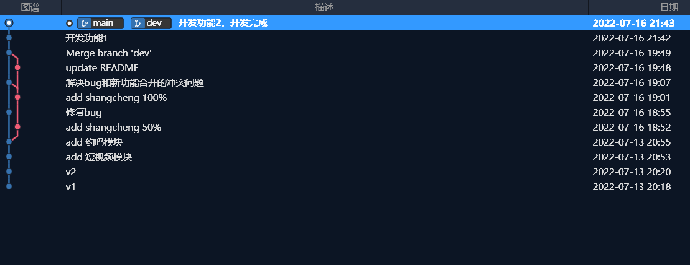
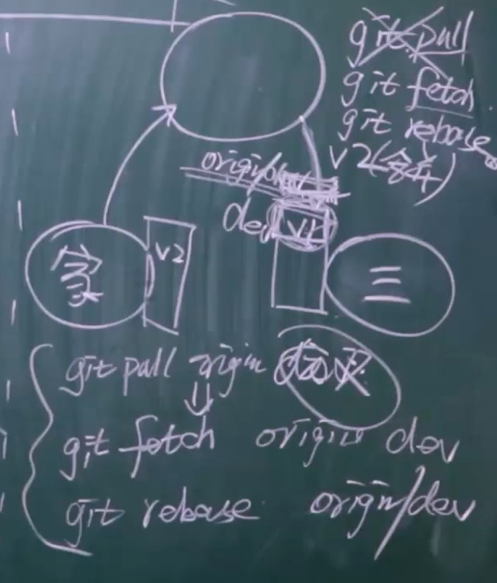
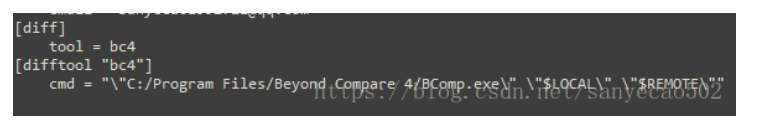
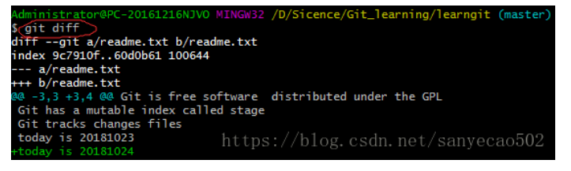
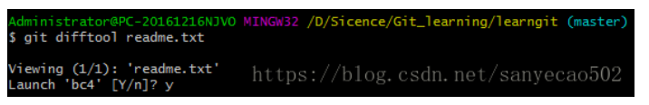
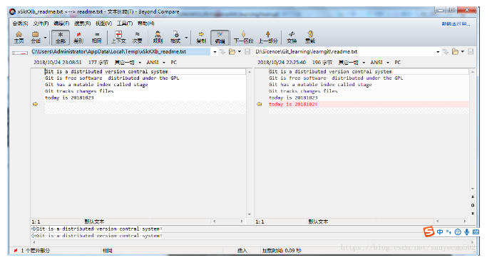
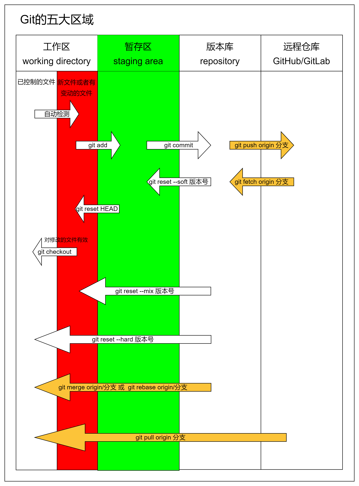

# Git基本操作

> Git学习参考：https://git-scm.com/book/zh/v2

## 一、Git操作本地项目

### 1. 初始化仓库

先进入项目文件夹，通过命令 git init 把这个目录变成git可以管理的仓库

```bash
git init
```

### 2. 查看仓库状态

```bash
git status
```

### 3. 把更新的文件添加到版本库中

使用命令 git add .添加到暂存区里面去，不要忘记后面的小数点 "."，意为添加文件夹下的所有文件

```bash
git add .
```

### 4. 提交更新

用命令 git commit告诉Git，把文件提交到仓库。引号内为提交说明。

```bash
git commit -m 'first commit'
```

### 5. 查看提交记录

```bash
git log
git log -p <file>
git blame <file>
```

### 6. commit之前查看更新内容，文件差异

```bash
git diff
```

## 二、Git分支管理

### 1. Git查看分支

```bash
$ git branch -a
* main
  master
  remotes/origin/main
```

### 2. 查看每一个分支的最后一次提交

```bash
$ git branch -v
  iss53   93b412c fix javascript issue
* master  7a98805 Merge branch 'iss53'
  testing 782fd34 add scott to the author list in the readmes
```

### 3. Git创建切换分支

创建本地分支，并切换到分支：

```bash
# 原文链接：Git-分支-分支的新建与合并
# https://git-scm.com/book/zh/v2/Git-%E5%88%86%E6%94%AF-%E5%88%86%E6%94%AF%E7%9A%84%E6%96%B0%E5%BB%BA%E4%B8%8E%E5%90%88%E5%B9%B6

# 新建与合并
$ git checkout -b iss53
Switched to a new branch "iss53"

# 它是下面两条命令的简写：
# 创建分支
$ git branch iss53
# 切换分支
$ git checkout iss53
```

### 4. 删除分支：

#### (1) 查看所有分支

```bash
$ git branch -a
* main
  master
  remotes/origin/main
```

#### (2) 删除本地分支

```bash
git branch -D BranchName

其中-D也可以是--delete，如：

git branch --delete BranchName
```

#### (3) 删除本地的远程分支(解除关联)

```bash
# 先查看查看远程库信息
$ git remote -v
origin  git@github.com:michaelliao/learn-git.git (fetch)
origin  git@github.com:michaelliao/learn-git.git (push)
# 然后，根据名字删除，比如删除origin：
$ git remote rm origin
```

#### (4) 远程删除Git服务器上的分支

```bash
git push origin -d BranchName

其中-d也可以是--delete，如：

git push origin --delete BranchName

注意：git命令区分大小写，例如-D和-d在不同的地方虽然都是删除的意思，并且它们的完整写法都是--delete，但简易写法用错大小写会执行失败。
```

## 三、Git操作远程项目

### 1. Git关联远程项目

```bash
git remote add origin 你的远程库地址。
如：
git remote add origin https://github.com/xxx/xxx.git
```

> 注：“origin” 并无特殊含义
>
> 远程仓库名字 “origin” 与分支名字 “master” 一样，在 Git 中并没有任何特别的含义一样。 同时 “master” 是当你运行 `git init` 时默认的起始分支名字，原因仅仅是它的广泛使用， “origin” 是当你运行 `git clone` 时默认的远程仓库名字。 如果你运行 `git clone -o booyah`，那么你默认的远程分支名字将会是 `booyah/master`。

### 2. Git获取远程库与本地同步合并

push之前先pull远程代码，如果远程库不为空必须做这一步，否则后面的提交会失败。

```bash
git pull --rebase origin develop
```

或者：

```bash
git pull origin develop
```

### 3. 把本地库的内容推送到远程

使用 git push命令，实际上是把当前分支develop推送到远程。第一次推送内容使用如下命令，执行此命令后会要求输入用户名、密码，验证通过后即开始上传。

```bash
git push -u origin develop
```

以后提交可以使用：

```bash
git push origin serverfix
```

> 这里有些工作被简化了。 Git 自动将 `serverfix` 分支名字展开为 `refs/heads/serverfix:refs/heads/serverfix`， 那意味着，“推送本地的 `serverfix` 分支来更新远程仓库上的 `serverfix` 分支。” 我们将会详细学习 [Git 内部原理](https://git-scm.com/book/zh/v2/ch00/ch10-git-internals) 的 `refs/heads/` 部分， 但是现在可以先把它放在儿。你也可以运行 `git push origin serverfix:serverfix`， 它会做同样的事——也就是说“推送本地的 `serverfix` 分支，将其作为远程仓库的 `serverfix` 分支” 可以通过这种格式来推送本地分支到一个命名不相同的远程分支。 如果并不想让远程仓库上的分支叫做 `serverfix`，可以运行 `git push origin serverfix:awesomebranch` 来将本地的 `serverfix` 分支推送到远程仓库上的 `awesomebranch` 分支。

## 四、Git Clone远程代码

```bash
git clone -b mutilrecall http://gitlab.avc.domain/ttengine/ttengine.git
或者：
git clone https://github.com/Chris-z-su/wallpaperProject.git
```

clone远程仓库到制定目录：

```bash
git clone xxx.git "指定目录"
```

## 五、Git合并分支

```bash
# 查看分支
$ git branch
* master
  newtest
# 合并某分支到当前分支：git merge <name>
$ git merge newtest
# 合并完之后就可以删除掉不需要的分支了
$ git branch -d newtest
Deleted branch newtest (was c1501a2).
```


## 九十、Git实战

```shell

chris@DESKTOP-26G0Q2K MINGW64 /e/study/myblog (master)
$ git log
commit 4e2bb67211b05c54be839106a024ae6974439d21 (HEAD -> master)
Author: chris <chris_z_su@163.com>
Date:   Wed Jul 13 20:55:29 2022 +0800

    add 约吗模块

commit b23f8e17aaa24f6ae95b6c333f06d9261df2525e
Author: chris <chris_z_su@163.com>
Date:   Wed Jul 13 20:53:24 2022 +0800

    add 短视频模块

commit ef26ac6324424dbb549bc6a30866312b96679558
Author: chris <chris_z_su@163.com>
Date:   Wed Jul 13 20:20:34 2022 +0800

    v2

commit 7111058e366216ad19018a09c8ac4d4438867098
Author: chris <chris_z_su@163.com>
Date:   Wed Jul 13 20:18:53 2022 +0800

    v1

chris@DESKTOP-26G0Q2K MINGW64 /e/study/myblog (master)
$ git branch -a
* master

# 创建dev分支
chris@DESKTOP-26G0Q2K MINGW64 /e/study/myblog (master)
$ git branch dev

chris@DESKTOP-26G0Q2K MINGW64 /e/study/myblog (master)
$ git branch -a
  dev
* master

chris@DESKTOP-26G0Q2K MINGW64 /e/study/myblog (master)
$ git checkout dev
Switched to branch 'dev'


# 在dev分支的正常开发
chris@DESKTOP-26G0Q2K MINGW64 /e/study/myblog (dev)
$ git status
On branch dev
Changes not staged for commit:
  (use "git add <file>..." to update what will be committed)
  (use "git restore <file>..." to discard changes in working directory)
        modified:   index.html

no changes added to commit (use "git add" and/or "git commit -a")

chris@DESKTOP-26G0Q2K MINGW64 /e/study/myblog (dev)
$ git add .

chris@DESKTOP-26G0Q2K MINGW64 /e/study/myblog (dev)
$ git status
On branch dev
Changes to be committed:
  (use "git restore --staged <file>..." to unstage)
        modified:   index.html


# 提交未开发完成的部分代码
chris@DESKTOP-26G0Q2K MINGW64 /e/study/myblog (dev)
$ git commit -m "add shangcheng 50%"
[dev 3c134b7] add shangcheng 50%
 1 file changed, 1 insertion(+)

chris@DESKTOP-26G0Q2K MINGW64 /e/study/myblog (dev)
$ git status
On branch dev
nothing to commit, working tree clean

chris@DESKTOP-26G0Q2K MINGW64 /e/study/myblog (dev)
$

# 切换到主分支，用于修复bug
chris@DESKTOP-26G0Q2K MINGW64 /e/study/myblog (dev)
$ git checkout master
Switched to branch 'master'

chris@DESKTOP-26G0Q2K MINGW64 /e/study/myblog (master)
$

# 新建bug001分支，紧急修复生产bug
chris@DESKTOP-26G0Q2K MINGW64 /e/study/myblog (master)
$ git branch bug001

chris@DESKTOP-26G0Q2K MINGW64 /e/study/myblog (master)
$ git branch
  bug001
  dev
* master

# 切换到bug001分支
chris@DESKTOP-26G0Q2K MINGW64 /e/study/myblog (master)
$ git checkout bug001
Switched to branch 'bug001'

chris@DESKTOP-26G0Q2K MINGW64 /e/study/myblog (bug001)
$ git status
On branch bug001
Changes not staged for commit:
  (use "git add <file>..." to update what will be committed)
  (use "git restore <file>..." to discard changes in working directory)
        modified:   index.html

no changes added to commit (use "git add" and/or "git commit -a")

chris@DESKTOP-26G0Q2K MINGW64 /e/study/myblog (bug001)
$ git add .

# 修复完bug，提交代码到bug分支
chris@DESKTOP-26G0Q2K MINGW64 /e/study/myblog (bug001)
$ git commit -m "修复bug"
[bug001 23b0c49] 修复bug
 1 file changed, 1 insertion(+), 1 deletion(-)

chris@DESKTOP-26G0Q2K MINGW64 /e/study/myblog (bug001)
$ git status
On branch bug001
nothing to commit, working tree clean

# 切换到主分支，进行合并bug分支的代码
chris@DESKTOP-26G0Q2K MINGW64 /e/study/myblog (bug001)
$ git checkout master
Switched to branch 'master'

chris@DESKTOP-26G0Q2K MINGW64 /e/study/myblog (master)
$ git branch
  bug001
  dev
* master

# 合并bug001分支的代码到master（当前）主分支
chris@DESKTOP-26G0Q2K MINGW64 /e/study/myblog (master)
$ git merge bug001
Updating 4e2bb67..23b0c49
Fast-forward
 index.html | 2 +-
 1 file changed, 1 insertion(+), 1 deletion(-)

chris@DESKTOP-26G0Q2K MINGW64 /e/study/myblog (master)
$ git log
commit 23b0c49c245101dcba6b3e274b1a62239492104b (HEAD -> master, bug001)
Author: chris <chris_z_su@163.com>
Date:   Sat Jul 16 18:55:22 2022 +0800

    修复bug

commit 4e2bb67211b05c54be839106a024ae6974439d21
Author: chris <chris_z_su@163.com>
Date:   Wed Jul 13 20:55:29 2022 +0800

    add 约吗模块

commit b23f8e17aaa24f6ae95b6c333f06d9261df2525e
Author: chris <chris_z_su@163.com>
Date:   Wed Jul 13 20:53:24 2022 +0800

    add 短视频模块

commit ef26ac6324424dbb549bc6a30866312b96679558
Author: chris <chris_z_su@163.com>
Date:   Wed Jul 13 20:20:34 2022 +0800

    v2

chris@DESKTOP-26G0Q2K MINGW64 /e/study/myblog (master)
$ git branch
  bug001
  dev
* master

# bug修复完成后，删除掉不再使用的分支
chris@DESKTOP-26G0Q2K MINGW64 /e/study/myblog (master)
$ git branch -d bug001
Deleted branch bug001 (was 23b0c49).

chris@DESKTOP-26G0Q2K MINGW64 /e/study/myblog (master)
$ git branch
  dev
* master

# 切换到dev分支继续完成开发工作
chris@DESKTOP-26G0Q2K MINGW64 /e/study/myblog (master)
$ git checkout dev
Switched to branch 'dev'

chris@DESKTOP-26G0Q2K MINGW64 /e/study/myblog (dev)
$ git status
On branch dev
Changes not staged for commit:
  (use "git add <file>..." to update what will be committed)
  (use "git restore <file>..." to discard changes in working directory)
        modified:   index.html

no changes added to commit (use "git add" and/or "git commit -a")

chris@DESKTOP-26G0Q2K MINGW64 /e/study/myblog (dev)
$ git add .

# dev分支的工作完成，提交代码
chris@DESKTOP-26G0Q2K MINGW64 /e/study/myblog (dev)
$ git commit -m "add shangcheng 100%"
[dev f77d471] add shangcheng 100%
 1 file changed, 1 insertion(+), 1 deletion(-)

chris@DESKTOP-26G0Q2K MINGW64 /e/study/myblog (dev)
$ git status
On branch dev
nothing to commit, working tree clean

chris@DESKTOP-26G0Q2K MINGW64 /e/study/myblog (dev)
$ git log
commit f77d4710c3fb6d6618255ac24afeee5039448743 (HEAD -> dev)
Author: chris <chris_z_su@163.com>
Date:   Sat Jul 16 19:01:44 2022 +0800

    add shangcheng 100%

commit 3c134b7b96cdce6a27cde78ffb96316a1e9d6ede
Author: chris <chris_z_su@163.com>
Date:   Sat Jul 16 18:52:34 2022 +0800

    add shangcheng 50%

commit 4e2bb67211b05c54be839106a024ae6974439d21
Author: chris <chris_z_su@163.com>
Date:   Wed Jul 13 20:55:29 2022 +0800

    add 约吗模块

commit b23f8e17aaa24f6ae95b6c333f06d9261df2525e
Author: chris <chris_z_su@163.com>
Date:   Wed Jul 13 20:53:24 2022 +0800

    add 短视频模块

# 切换到master分支，进行合并dev分支的代码
chris@DESKTOP-26G0Q2K MINGW64 /e/study/myblog (dev)
$ git checkout master
Switched to branch 'master'

chris@DESKTOP-26G0Q2K MINGW64 /e/study/myblog (master)
$ git branch
  dev
* master

# 合并dev分支的代码到master（当前）分支
# 合并出现冲突，需要手动修改文件解决冲突
chris@DESKTOP-26G0Q2K MINGW64 /e/study/myblog (master)
$ git merge dev
Auto-merging index.html
CONFLICT (content): Merge conflict in index.html
Automatic merge failed; fix conflicts and then commit the result.

chris@DESKTOP-26G0Q2K MINGW64 /e/study/myblog (master|MERGING)
$ git status
On branch master
You have unmerged paths.
  (fix conflicts and run "git commit")
  (use "git merge --abort" to abort the merge)

Unmerged paths:
  (use "git add <file>..." to mark resolution)
        both modified:   index.html

no changes added to commit (use "git add" and/or "git commit -a")

chris@DESKTOP-26G0Q2K MINGW64 /e/study/myblog (master|MERGING)
$ git add .

# 解决完冲突后，提交代码
chris@DESKTOP-26G0Q2K MINGW64 /e/study/myblog (master|MERGING)
$ git commit -m "解决bug和新功能合并的冲突问题"
[master 71f0fa7] 解决bug和新功能合并的冲突问题

chris@DESKTOP-26G0Q2K MINGW64 /e/study/myblog (master)
$ git status
On branch master
nothing to commit, working tree clean

chris@DESKTOP-26G0Q2K MINGW64 /e/study/myblog (master)
$ git log
commit 71f0fa7c950d1d8215156719f120291a64e80bba (HEAD -> master)
Merge: 23b0c49 f77d471
Author: chris <chris_z_su@163.com>
Date:   Sat Jul 16 19:07:05 2022 +0800

    解决bug和新功能合并的冲突问题

commit f77d4710c3fb6d6618255ac24afeee5039448743 (dev)
Author: chris <chris_z_su@163.com>
Date:   Sat Jul 16 19:01:44 2022 +0800

    add shangcheng 100%

commit 23b0c49c245101dcba6b3e274b1a62239492104b
Author: chris <chris_z_su@163.com>
Date:   Sat Jul 16 18:55:22 2022 +0800

    修复bug

commit 3c134b7b96cdce6a27cde78ffb96316a1e9d6ede
Author: chris <chris_z_su@163.com>
Date:   Sat Jul 16 18:52:34 2022 +0800


chris@DESKTOP-26G0Q2K MINGW64 /e/study/myblog (master)
$


################################################################
# Git操作远程仓库
# 将本地仓库连接到远程仓库
# origin表示远程仓库的别名
chris@DESKTOP-26G0Q2K MINGW64 /e/study/myblog (master)
$ git remote add origin git@github.com:Chris-z-su/myblog.git

# 将本地的master的分支推送到远程的main分支，这里推送失败是由于本地和远程的分支名不一致（？可能）
# 这里是简化了的命令，原始命令是：git push origin serverfix:awesomebranch，来将本地的serverfix分支推送到远程仓库上的awesomebranch分支
# 如果只是 git push -u origin main，那么就是将本地的main推送到远程仓库的main分支，但是本地没有main分支，所以会报错？
chris@DESKTOP-26G0Q2K MINGW64 /e/study/myblog (master)
$ git push -u origin main
error: src refspec main does not match any
error: failed to push some refs to 'github.com:Chris-z-su/myblog.git'

# 将本地的master分支名修改为main
chris@DESKTOP-26G0Q2K MINGW64 /e/study/myblog (master)
$ git branch -M main

# 推送
chris@DESKTOP-26G0Q2K MINGW64 /e/study/myblog (main)
$ git push -u origin main
Enumerating objects: 31, done.
Counting objects: 100% (31/31), done.
Delta compression using up to 8 threads
Compressing objects: 100% (29/29), done.
Writing objects: 100% (31/31), 3.61 KiB | 923.00 KiB/s, done.
Total 31 (delta 8), reused 0 (delta 0), pack-reused 0
remote: Resolving deltas: 100% (8/8), done.
To github.com:Chris-z-su/myblog.git
 * [new branch]      main -> main
branch 'main' set up to track 'origin/main'.

# 将本地的dev分支推送到远程仓库
chris@DESKTOP-26G0Q2K MINGW64 /e/study/myblog (main)
$ git push -u origin dev
Total 0 (delta 0), reused 0 (delta 0), pack-reused 0
remote:
remote: Create a pull request for 'dev' on GitHub by visiting:
remote:      https://github.com/Chris-z-su/myblog/pull/new/dev
remote:
To github.com:Chris-z-su/myblog.git
 * [new branch]      dev -> dev
branch 'dev' set up to track 'origin/dev'.

chris@DESKTOP-26G0Q2K MINGW64 /e/study/myblog (main)
$


```


研发完毕，上线

```shell
1. 将dev分支合并到master分支，进行上线
git checkout master
git merge dev
git push origin master

2. 把dev分支也推送到远程dev分支
git checkout dev
git merge master
git push origin dev
```


补充：

```shell
# 从远程仓库拉取代码到本地
git pull origin dev

# 相当于：
git fetch origin dev   +    git merge origin/dev


# 替换为rebase：
git fetch origin dev   +    git rebase origin/dev
```


### 1. git rebase第一种情形

```shell
$ git rebase -i HEAD~3  # 合并当前记录往前的三条记录

$ git rebase -i 版本号  # 合并当前记录到指定版本号的记录

# 执行之后，在编辑页面，修改 三条记录中的最后两个，pick --> s，表示后两条记录都合并第一条记录，保存并退出。
# 进入第二个编辑页面，修改记录提交log，修改为最终要输出的log，保存并退出。
```


> 注意：不要rebase已经提交到远程仓库中的记录！！！只合并本地commit的记录，不合并已经push的记录。


> 参考：https://blog.csdn.net/small_white_123/article/details/121563248


示例：

```shell
chris@DESKTOP-26G0Q2K MINGW64 /e/study/Git/pro_rebase (master)
$ git log
commit 1bc5766ebe804641542df9a84785d59611e1a352 (HEAD -> master)
Author: chris <chris_z_su@163.com>
Date:   Sun Jul 17 18:40:17 2022 +0800

    v4

commit a18b6bcee563ed169b180554fdb1ee56a4a78cfc
Author: chris <chris_z_su@163.com>
Date:   Sun Jul 17 18:39:53 2022 +0800

    v3

commit 61caa11b91b00342969f3d9d0365e14b09f6eb51
Author: chris <chris_z_su@163.com>
Date:   Sun Jul 17 18:39:22 2022 +0800

    v2

commit 10abab45ebd5e9cc54bb6a135519588c7697fbc1
Author: chris <chris_z_su@163.com>
Date:   Sun Jul 17 18:38:49 2022 +0800

    v1

chris@DESKTOP-26G0Q2K MINGW64 /e/study/Git/pro_rebase (master)
$ git rebase -i HEAD~3
[detached HEAD b21df84] v2 & v3 & v4
 Date: Sun Jul 17 18:39:22 2022 +0800
 3 files changed, 0 insertions(+), 0 deletions(-)
 create mode 100644 2.py
 create mode 100644 3.py
 create mode 100644 4.py
Successfully rebased and updated refs/heads/master.

chris@DESKTOP-26G0Q2K MINGW64 /e/study/Git/pro_rebase (master)
$ git log
commit b21df84899c1fb05d232ba9349440eb5ac14a2e2 (HEAD -> master)
Author: chris <chris_z_su@163.com>
Date:   Sun Jul 17 18:39:22 2022 +0800

    v2 & v3 & v4

commit 10abab45ebd5e9cc54bb6a135519588c7697fbc1
Author: chris <chris_z_su@163.com>
Date:   Sun Jul 17 18:38:49 2022 +0800

    v1

chris@DESKTOP-26G0Q2K MINGW64 /e/study/Git/pro_rebase (master)
$

```


```shell
git log --graph  # 以流程的样式显示log日志

chris@DESKTOP-26G0Q2K MINGW64 /e/study/myblog (main)
$ git log --graph
* commit b21a68988b6b78e4bfa15964b1cc6b3b1cb89769 (HEAD -> main, origin/main, origin/dev, dev)
| Author: chris <chris_z_su@163.com>
| Date:   Sat Jul 16 21:43:39 2022 +0800
|
|     开发功能2，开发完成
|
* commit 7eea26214a82d361a17f107853833c2c0da31dc9
| Author: chris <chris_z_su@163.com>
| Date:   Sat Jul 16 21:42:39 2022 +0800
|
|     开发功能1
|
*   commit 989b6ebec2368c4ac1843dc54dfcfc3b09f842cc
|\  Merge: 71f0fa7 25166ba
| | Author: chris <chris_z_su@163.com>
| | Date:   Sat Jul 16 19:49:23 2022 +0800
| |
| |     Merge branch 'dev'
| |
| * commit 25166bae4ce37818fd2153422acec3302f48e041
| | Author: chris <chris_z_su@163.com>
| | Date:   Sat Jul 16 19:48:50 2022 +0800
| |
| |     update README
| |
* | commit 71f0fa7c950d1d8215156719f120291a64e80bba
|\| Merge: 23b0c49 f77d471
| | Author: chris <chris_z_su@163.com>
| | Date:   Sat Jul 16 19:07:05 2022 +0800
| |
| |     解决bug和新功能合并的冲突问题
| |
| * commit f77d4710c3fb6d6618255ac24afeee5039448743
| | Author: chris <chris_z_su@163.com>
| | Date:   Sat Jul 16 19:01:44 2022 +0800
| |
| |     add shangcheng 100%
| |
| * commit 3c134b7b96cdce6a27cde78ffb96316a1e9d6ede
| | Author: chris <chris_z_su@163.com>
| | Date:   Sat Jul 16 18:52:34 2022 +0800
| |
| |     add shangcheng 50%
| |
* | commit 23b0c49c245101dcba6b3e274b1a62239492104b
|/  Author: chris <chris_z_su@163.com>
|   Date:   Sat Jul 16 18:55:22 2022 +0800
|
|       修复bug
|
* commit 4e2bb67211b05c54be839106a024ae6974439d21
| Author: chris <chris_z_su@163.com>
| Date:   Wed Jul 13 20:55:29 2022 +0800
|
|     add 约吗模块
|
* commit b23f8e17aaa24f6ae95b6c333f06d9261df2525e
| Author: chris <chris_z_su@163.com>
| Date:   Wed Jul 13 20:53:24 2022 +0800
|
|     add 短视频模块
|
* commit ef26ac6324424dbb549bc6a30866312b96679558
| Author: chris <chris_z_su@163.com>
| Date:   Wed Jul 13 20:20:34 2022 +0800
|
|     v2
|
* commit 7111058e366216ad19018a09c8ac4d4438867098
  Author: chris <chris_z_su@163.com>
  Date:   Wed Jul 13 20:18:53 2022 +0800

      v1

chris@DESKTOP-26G0Q2K MINGW64 /e/study/myblog (main)
$


# 格式化简洁显示
chris@DESKTOP-26G0Q2K MINGW64 /e/study/myblog (main)
$ git log --graph --pretty=format:"%h %s"
* b21a689 开发功能2，开发完成
* 7eea262 开发功能1
*   989b6eb Merge branch 'dev'
|\
| * 25166ba update README
* | 71f0fa7 解决bug和新功能合并的冲突问题
|\|
| * f77d471 add shangcheng 100%
| * 3c134b7 add shangcheng 50%
* | 23b0c49 修复bug
|/
* 4e2bb67 add 约吗模块
* b23f8e1 add 短视频模块
* ef26ac6 v2
* 7111058 v1

chris@DESKTOP-26G0Q2K MINGW64 /e/study/myblog (main)
$

```




### 2. git rebase第二种情形

先git rebase master，后git merge dev

```shell
chris@DESKTOP-26G0Q2K MINGW64 /e/study/Git/pro_rebase (dev)
$ touch dev1.py

chris@DESKTOP-26G0Q2K MINGW64 /e/study/Git/pro_rebase (dev)
$ git add .

chris@DESKTOP-26G0Q2K MINGW64 /e/study/Git/pro_rebase (dev)
$ git commit -m "dev branch commit 1"
[dev 4415ff1] dev branch commit 1
 1 file changed, 0 insertions(+), 0 deletions(-)
 create mode 100644 dev1.py

chris@DESKTOP-26G0Q2K MINGW64 /e/study/Git/pro_rebase (dev)
$ git checkout master
Switched to branch 'master'

chris@DESKTOP-26G0Q2K MINGW64 /e/study/Git/pro_rebase (master)
$ touch master1.py

chris@DESKTOP-26G0Q2K MINGW64 /e/study/Git/pro_rebase (master)
$ git add .

chris@DESKTOP-26G0Q2K MINGW64 /e/study/Git/pro_rebase (master)
$ git commit -m "master 1"
[master ae53d98] master 1
 1 file changed, 0 insertions(+), 0 deletions(-)
 create mode 100644 master1.py

chris@DESKTOP-26G0Q2K MINGW64 /e/study/Git/pro_rebase (master)
$ git checkout dev
Switched to branch 'dev'

chris@DESKTOP-26G0Q2K MINGW64 /e/study/Git/pro_rebase (dev)
$ git rebase master
Successfully rebased and updated refs/heads/dev.

chris@DESKTOP-26G0Q2K MINGW64 /e/study/Git/pro_rebase (dev)
$ git checkout master
Switched to branch 'master'

chris@DESKTOP-26G0Q2K MINGW64 /e/study/Git/pro_rebase (master)
$ git merge dev
Updating ae53d98..a3ed5bf
Fast-forward
 dev1.py | 0
 1 file changed, 0 insertions(+), 0 deletions(-)
 create mode 100644 dev1.py

chris@DESKTOP-26G0Q2K MINGW64 /e/study/Git/pro_rebase (master)
$ git log --graph --pretty=format:"%h %s"
* a3ed5bf dev branch commit 1
* ae53d98 master 1
*   a3ddbf3 Merge branch 'dev'
|\
| * 0873af3 dev branch
* | e3c346c master function
|/
* b21df84 v2 & v3 & v4
* 10abab4 v1

chris@DESKTOP-26G0Q2K MINGW64 /e/study/Git/pro_rebase (master)
$

```


### 3. git rebase第三种情形



```shell
# 从远程仓库拉取代码到本地
git pull origin dev

# 替换为rebase：
git fetch origin dev   +    git rebase origin/dev
```


### 4. git rebase时发生冲突

git rebase时发生冲突：

① 解决冲突，手动修改冲突的文件内容

② git add .

③ git rebase --continue


### 5. git配置beyond compare4作为比较工具

```shell
# 配置
git config --local merge.tool bc3
git config --local mergetool.path "/usr/local/bin/bcomp"
git config --local mergetool.keepBackup false

# 使用
git mergetool

```

**Windows手动修改**

> https://blog.csdn.net/sanyecao502/article/details/83352169

1.配置“.gitconfig”文件 
首先我们找到Git的配置文件“.gitconfig”，我的文件在路径“Administrator/.gitconfig”下。使用使用文本编辑工具打开后添加下图文本，其中的cmd一栏写的是你电脑上“beyond compare4”所在的路径。这样我们就配置成功啦！



2.命令调用
配置好后我们迫不及待的想要验证一下成果，我们切到Git仓库下，更改一下文件然后先使用Git默认的文本差异工具看看效果，下图，我们输入命令“git diff”后，git默认的比较工具显示出差异信息（很强大，但不够直观）：



我们再来看看调用“beyond compare4”进行文本差异比较的结果，我们首先输入命令“git difftool readme.txt”是比较工作区和暂存区中“readme.txt”的差异，然后他会询问你是否打开‘bc4’，输入y就好。（若是输入这一命令后没有任何反应，有可能是工作区和暂存区的内容是一致的，毕竟UNIX的哲学是没有消息就是最好的消息，所以你可以尝试修改一下文件，再尝试）









## 九十九、错误解决：

### 1、执行git命令时出现fatal: 'origin' does not appear to be a git repository错误
在执行git pull origin master时出现：
　　fatal: 'origin' does not appear to be a git repository
　　fatal: Could not read from remote repository.
　　Please make sure you have the correct access rights and the repository exists

解决方案：
```bash
# 将关联远程仓库为origin
git remote add origin git@github:bx_reader/bx-reader-api.git
```

### 2、Reinitialized existing Git repository
“git init” 的时候出现：Reinitialized existing Git repository
解决方法：

可以使用 rm -rf .git，删除.git，然后在 git init 即可

### 3、refusing to merge unrelated histories
“git pull origin master ” 的时候出现：refusing to merge unrelated histories

解决方法：

可以在 “git pull origin master” 后添加 “--allow-unrelated-histories”
即整个命令行为：

```bash
git pull origin master --allow-unrelated-histories
```


