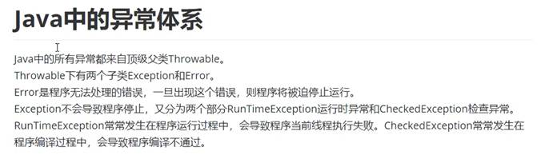
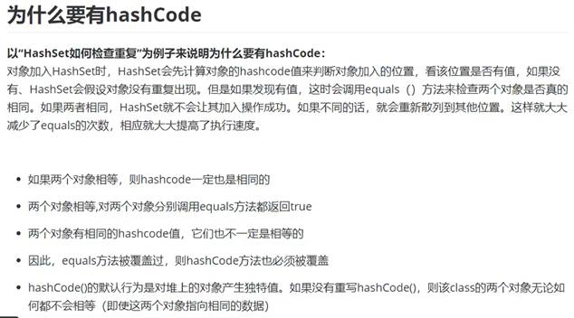
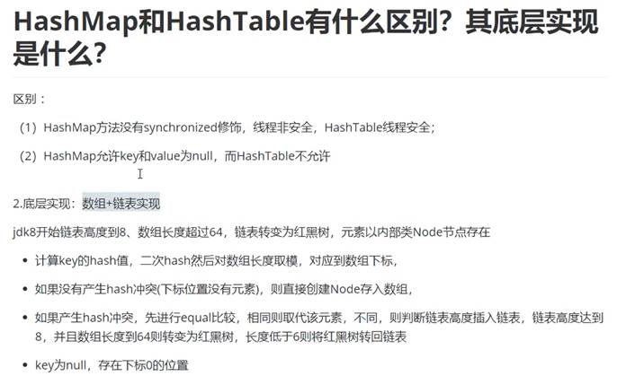
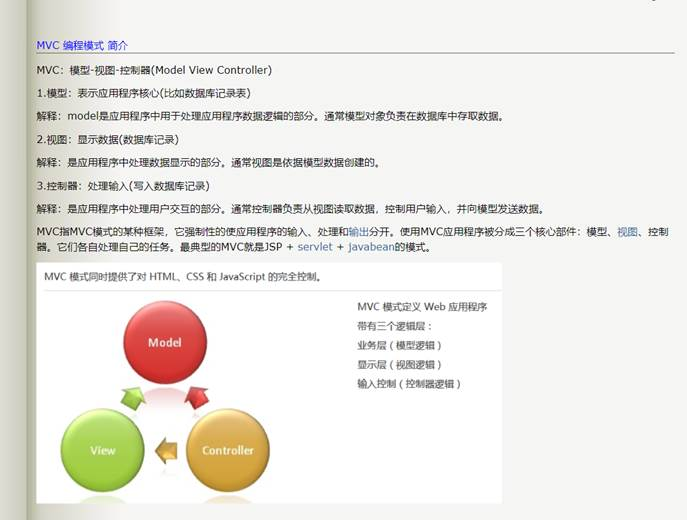
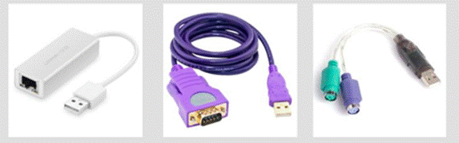
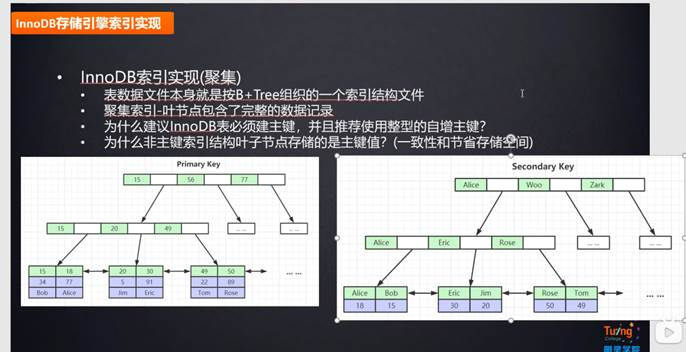

| Java面试题及答案2019版（上） | https://blog.csdn.net/qq_41701956/article/details/86686492 |  |
| ---------------------------- | ---------------------------------------------------------- | ------------------------------------------------------------ |
| Java面试题及答案2019版（下） | https://blog.csdn.net/qq_41701956/article/details/86699263 |                                                              |

# 一、Java基础

## 1. 重写与重载之间的区别

https://www.runoob.com/java/java-override-overload.html


## 2. String、StringBuffer、StringBuilder区别

1）String是final修饰的，不可变的，StringBuffer、StringBuilder是可变的

2）StringBuffer是线程安全的，每个方法都有synchronized修饰

StringBuilder是线程不安全的

3)线程不安全性能更高，在开发中，优先采用StringBuilder

优先级：StringBuilder > StringBuffer > String

## 3. Java的异常体系

java中的所有异常都来自顶级父类Throwable。

Throwable下有两个子类Exception和Error。

Error是程序无法处理的错误，一旦出现这个错误，则程序将被迫停止运行。

Exception不会导致程序停止，又分为两个部分RunTimeException运行时异常和CheckedException检查异常。

RunTimeException常常发生在程序运行过程中，会导致程序当前线程执行失败。CheckedException常常发生在程序编译过程中，会导致程序编译不通过。



## 4. equals 和 ==

https://blog.csdn.net/qq_36522306/article/details/80550210

答案一：

i.      ==对比的是栈中的值，基本数据类型是变量值，引用数据类型是堆中内存对象的地址

ii.      equals:Object中默认也是采用==比较，通常会重写equals()方法，比如String类

 

| Object类                                                     | String类                                                     |
| ------------------------------------------------------------ | ------------------------------------------------------------ |
| public boolean equals(Object obj) {        return (this == obj);    } | public boolean equals(Object anObject) {        if (this == anObject) {return true; }        if (anObject instanceof String) {          String anotherString = (String)anObject;          int n = value.length;          if (n == anotherString.value.length) {          char v1[] = value;          char v2[] =  anotherString.value;          int i = 0;          while (n-- != 0) {            if (v1[i] != v2[i])              return false;            i++;          }          return true;          }        }        return false; } |

上述代码可以看出，String类中被复写的equals()方法其实是比较两个字符串的内容

 

答案二：初步认识equals与==的区别：

a)    ==是判断两个变量或实例是不是指向同一个内存空间，equals是判断两个变量或实例所指向的内存空间的值是不是相同 

b)    ==是指对内存地址进行比较 ， equals()是对字符串的内容进行比较

c)    ==指引用是否相同， equals()指的是值是否相同

 

equals与==的区别详解：

​    == 比较的是变量(栈)内存中存放的对象的(堆)内存地址，用来判断两个对象的地址是否相同，即是否是指相同一个对象。比较的是真正意义上的指针操作。equals用来比较的是两个对象的内容是否相等，由于所有的类都是继承自java.lang.Object类的，所以适用于所有对象，如果没有对该方法进行覆盖的话，调用的仍然是Object类中的方法，而Object中的equals方法返回的却是==的判断。String s="abcd"是一种非常特殊的形式,和new 有本质的区别。它是java中唯一不需要new 就可以产生对象的途径。以String s="abcd";形式赋值在java中叫直接量,它是在常量池中而不是象new一样放在压缩堆中。 这种形式的字符串，在JVM内部发生字符串拘留，即当声明这样的一个字符串后，JVM会在常量池中先查找有有没有一个值为"abcd"的对象,如果有,就会把它赋给当前引用.即原来那个引用和现在这个引用指点向了同一对象, 如果没有,则在常量池中新创建一个"abcd",下一次如果有String s1 = "abcd";又会将s1指向"abcd"这个对象,即以这形式声明的字符串,只要值相等,任何多个引用都指向同一对象.

　　 而String s = new String("abcd");和其它任何对象一样.每调用一次就产生一个对象，只要它们调用。

 也可以这么理解: String str = "hello"; 先在内存中找是不是有"hello"这个对象,如果有，就让str指向那个"hello".

 

 如果内存里没有"hello"，就创建一个新的对象保存"hello". String str=new String ("hello") 就是不管内存里是不是已经有"hello"这个对象，都新建一个对象保存"hello"。

## 5. 线程

### (1) 并发和并行

[并发和并行的区别（图解）](http://c.biancheng.net/view/9486.html)

- 并行是指两个或者多个事件在同一时刻发生，而并发是指两个或多个事件在同一时间间隔发生。
- 并行是在不同实体上的多个事件，并发是在同一实体上的多个事件。

**1. 并行和并发有什么区别？**

- 并行是指两个或者多个事件在同一时刻发生；而并发是指两个或多个事件在同一时间间隔发生。
- 并行是在不同实体上的多个事件，并发是在同一实体上的多个事件。
- 在一台处理器上“同时”处理多个任务，在多台处理器上同时处理多个任务。如hadoop分布式集群。

所以并发编程的目标是充分的利用处理器的每一个核，以达到最高的处理性能。

**2. 线程和进程的区别？**

简而言之，进程是程序运行和资源分配的基本单位，一个程序至少有一个进程，一个进程至少有一个线程。进程在执行过程中拥有独立的内存单元，而多个线程共享内存资源，减少切换次数，从而效率更高。线程是进程的一个实体，是cpu调度和分派的基本单位，是比程序更小的能独立运行的基本单位。同一进程中的多个线程之间可以并发执行。

**3. 守护线程是什么？**

守护线程（即daemon thread），是个服务线程，准确地来说就是服务其他的线程。


### (2) runable 和 callable 有什么区别

Callable和Runnable有几点不同:

​    ①Callable规定的方法是call()，而Runnable规定的方法是run().

​    ②Callable的任务执行后可返回值，而Runnable的任务是不能返回值的

​    ③call()方法可抛出异常，而run()方法是不能抛出异常的。

​    ④运行Callable任务可拿到一个Future对象，Future表示异步计算的结果。它提供了检查计算是否完成的方法,以等待计算的完成,并检索计算的结果.通过Future对象可了解任务执行情况,可取消任务的执行,还可获取任务执行的结果


- Runnable接口中的run()方法的返回值是void，它做的事情只是纯粹地去执行run()方法中的代码而已；
- Callable接口中的call()方法是有返回值的，是一个泛型，和Future、FutureTask配合可以用来获取异步执行的结果。


### (3) java多线程都有几种方式实现

有三种：

#### a)  继承Thread类，重写run函数

```java
// 创建：
class xx extends Thread{
     public void run(){
     	Thread.sleep(1000)  //线程休眠1000毫秒，sleep使线程进入Block状态，并释放资源
	}
}

// 开启线程：
对象.start()  //启动线程，run函数运行
```


#### b)  实现Runnable接口，重写run函数

```java
// 开启线程：
Thread t = new Thread(对象)  //创建线程对象
t.start()
```


#### c)   实现Callable接口，重写call函数

​    Callable是类似于Runnable的接口，实现Callable接口的类和实现Runnable的类都是可被其它线程执行的任务。


### (4) 线程的生命周期

进程与线程一样，都具有一定的生命周期，线程的生命周期包括四个状态：创建状态、就绪状态、阻塞状态、死亡状态。

a)    新建状态(new)：新创建了一个线程对象

b)    就绪状态(Runnable)：线程对象创建后，其他线程调用了该对象的start()。该状态的线程位于可运行线程池中，变得可运行，等待获取CPU的使用权。

c)    运行状态(Running)：就绪状态的线程获取了CPU，执行程序代码。

d)    阻塞状态：等待阻塞、同步阻塞、其他阻塞

​           i.      等待阻塞：运行的线程执行wait()方法，该线程会释放占用的所有资源，JVM会把该线程放入“等待池“中。进入这个状态后，是不能自动唤醒的，必须依靠其他线程调用notify或notifyAll方法才能被唤醒，wait()是Object类的方法

​          ii.      同步阻塞：运行的线程在获取对象的同步锁时，若该同步锁被别的线程占用，则JVM会把线程放入“锁池“中。

​         iii.      其他阻塞：运行的线程执行sleep()或join()方法，或者发出了I/O请求时，JVM会把该线程设置为阻塞状态。当sleep状态超时、join等待线程终止或者超时、或者I/O处理完毕时，线程重新转入就绪状态。Sleep是Thread类的方法。

解释：

​              i.      Sleep：不会释放持有的对象锁

​             ii.      Join：等待另一个线程执行完成

​            iii.      Wait：会释放持有的对象锁

​            iv.      Synchronized：运行同步代码，但是没有获得指定对象的锁，于是进入指定对象的锁池等待。

e)    终止（死亡）

​              i.      不建议使用stop、destroy终止，不会释放锁

​             ii.      建议通过Boolean变量，正常终止线程运行

### (5) 什么是线程安全？

a) 多线程环境下

b) 对这个对象的访问不想需要加入额外的同步控制

c) 操作的数据的结果依然是正确的

### (6) 实现线程安全

a)    加锁——同步代码（synchronized）

同步块

```java
synchronized (this) {//（）中的内容 就是 ----“锁”---同步监视器
}
```

同步方法

```java
public synchronized void buy(){ 
} 
```

b)    Lock锁

```java
//锁住：
lock.lock();

//解开锁：
lock.unlock();
```

### 乐观锁和悲观锁

**悲观锁：**

- 很悲观，认为什么时候都会出现问题，无论做什么都会加锁

**乐观锁：**

- 很乐观，认为什么时候都不会出现问题，所以不会上锁！更新数据的时候去判断一下，在此期间是否有人修改过这个数据
- 获取version
- 更新的时候比较version


### (7) 线程的优先级

a)    1-10，默认是5

b)    优先级低只是意味着调用的概率低，并不是不被调用


### (8) 线程池


## 8. int 可以使用equals吗

## 9. hashCode和equals




## 10. 有了thread 为什么还要runable

## 11. Java中的run()方法和start()的区别

### a)  区别

Java中启动线程有两种方法，继承Thread类和实现Runnable接口，由于Java无法实现多重继承，所以一般通过实现Runnable接口来创建线程。但是无论哪种方法都可以通过start()和run()方法来启动线程，下面就来介绍一下他们的区别。

### b)  start方法：

通过该方法启动线程的同时也创建了一个线程，真正实现了多线程。无需等待run()方法中的代码执行完毕，就可以接着执行下面的代码。此时start()的这个线程处于就绪状态，当得到CPU的时间片后就会执行其中的run()方法。这个run()方法包含了要执行的这个线程的内容，run()方法运行结束，此线程也就终止了。

### c)   run方法：

通过run方法启动线程其实就是调用一个类中的方法，当作普通的方法的方式调用。并没有创建一个线程，程序中依旧只有一个主线程，必须等到run()方法里面的代码执行完毕，才会继续执行下面的代码，这样就没有达到写线程的目的。

## 12. 抽象类和接口(Interface)的区别

## 13. 集合相关

### (1) 常见的Java集合

集合的顶层接口是Collection（单列集合）和Map（双列集合），

① Collection接口包括List接口、Set接口和Queue接口，

List接口的实现类有：

- ArrayList（数组，排列有序，可重复，查询快、增删慢，线程不安全。使用默认构造器时，jdk7初始容量是10，jdk8初始容量为0，一个空数组，在add()的时候进行数组扩容为10，扩容大小为原来的1.5倍，newCapacity = oldCapacity + (oldCapacity >> 1)  ）
- LinkedList（底层使用双向链表（jdk1.6之前为循环链表，1.7取消了循环），查询慢，增删快（add()、remove()），线程不安全）
- Vector（底层使用数组，排列有序，可重复，查询快，增删慢，线程安全，效率低，默认扩展一倍容量）

Set接口的实现类有：

- HashSet（底层使用Hash表，排列无序，不可重复，存取速度快，内部是HashMap）
  - 子类LinkedHashSet类（采用Hash表存储，使用双向链表记录插入顺序，内部是LinkedHashMap）
- TreeSet（底层使用二叉树实现，排列无序，不可重复，内部是TreeMap的SortedSet）

Queue接口：在两端出入的List，所以也可以用数组或链表来实现

② Map接口的实现类或子接口有：

- HashMap类（底层是Hash表（数组+链表）；线程不安全；允许KV都为null；键不可重复，值可以重复；负载因子0.75，阈值就是 table 容量乘以负载因子；扩容是直接容量变为2倍；key为null，null 的哈希值永远为 0，因此放在 table[0] 的位置）
- HashTable类（底层是Hash表，使用synchronize保证线程安全，KV都不允许为null，键不可重复，值可以重复）
- ConcurrentHashMap类（ConcurrentHashMap结合了HashMap和HashTable的优点，HashTable每次同步都锁住了整个结构，ConcurrentHashMap的锁是细颗粒度的）
- SortedMap接口
  - NavigableMap接口
    - 实现类TreeMap类
- WeekHashMap类

HashMap详解：https://blog.csdn.net/qq_29051413/article/details/107860264

### (2) list 有初始长度吗

使用默认的构造器，List list = new ArrayList();初始容量被设置为10
JDK8，

### (3) list如何扩容的

扩容机制为：当前容量 * 1.5 + 1

### (4) 如何给list中的元素进行排序

 

### (5) ArrayList和LinkedList区别


### (6) list和set的区别

List：有序，按对象进入的顺序保存对象，可重复，允许多个Null元素对象，可以使用Iterator取出所有元素，再逐一遍历；也可以使用get(int index)获取指定下标的元素

Set：无序，不可重复，最多允许一个null元素对象存在，取元素时，只能使用Iterator接口取得所有元素，再逐一遍历各个元素

### (7) HashMap和HashTable区别及底层实现



 

## 14. IO流：输入输出流

字节流

​    字节输入流：键盘/文件  --》  程序

​    字节输出流

字符流

a)    InputStream

​           i.      FileInputStream

​          ii.      ByteArrayInputStream

​         iii.      ObjectInputStream：对象序列化，实现空接口serilizable

​         iv.      DataInputStream

​          v.      BufferedInputStream

 

b)    OutputStream

​           i.      FileOutputStream

​          ii.      ByteArrayIOutputStream

​         iii.      ObjectOutputStream

​         iv.      DataOutputStream

​          v.      PrintStream

​         vi.      BufferedOutputStream

c)    Reader

​           i.      FileReader

​          ii.      InputStreamReader：转换流，将字节流转化为字符流

​         iii.      BufferedReader

d)    Writer

​           i.      FileWriter

​          ii.      OutputStreamWriter：转换流

​         iii.      BufferedWriter

## 15. java数据类型

定义：Java语言是强类型语言，对于每一种数据都定义了明确的具体的数据类型，在内存中分配了不同大小的内存空间。

分类

- 基本数据类型
  - 数值型
    - 整数类型(byte,short,int,long)
    - 浮点类型(float,double)
  - 字符型(char)
  - 布尔型(boolean)
- 引用数据类型
  - 类(class)
  - 接口(interface)
  - 数组([])

<table>
    <tr>
        <td colspan="2" style="text-align: center;vertical-align:middle;">基本数据类型</td>
        <td>长度(位)</td>
    </tr>
    <tr>
        <td rowspan="4" style="text-align: center;vertical-align:middle;">整数类型（数值型）</td>
        <td>byte</td>
        <td>8</td>
    </tr>
    <tr>
        <td>short</td>
        <td>16</td>
    </tr>
    <tr>
        <td>int</td>
        <td>32</td>
    </tr>
    <tr>
        <td>long</td>
        <td>64</td>
    </tr>
    <tr>
        <td rowspan="2" style="text-align: center;vertical-align:middle;">浮点类型（数值型）</td>
        <td>float</td>
        <td>32</td>
    </tr>
    <tr>
        <td>double</td>
        <td>64</td>
    </tr>
    <tr>
        <td style="text-align: center;vertical-align:middle;">字符型</td>
        <td>char</td>
        <td>16</td>
    </tr>
    <tr>
        <td style="text-align: center;vertical-align:middle;">布尔型</td>
        <td>boolean</td>
        <td>~</td>
    </tr>
</table>
## 16. 访问修饰符

访问修饰符 public,private,protected,以及不写（默认）时的区别
定义：Java中，可以使用访问修饰符来保护对类、变量、方法和构造方法的访问。Java 支持 4 种不同的访问权限。

分类

private : 在同一类内可见。使用对象：变量、方法。 注意：不能修饰类（外部类）
default (即缺省，什么也不写，不使用任何关键字）: 在同一包内可见，不使用任何修饰符。使用对象：类、接口、变量、方法。
protected : 对同一包内的类和所有子类可见。使用对象：变量、方法。 注意：不能修饰类（外部类）。
public : 对所有类可见。使用对象：类、接口、变量、方法

> https://www.runoob.com/java/java-modifier-types.html#protected-desc

访问修饰符图

| 修饰符    | 当前类 | 同包 | 子类（同包） | 子类（不同包） | 其他包 |
| --------- | ------ | ---- | ------------ | -------------- | ------ |
| private   | √      | ×    | ×            | ×              | ×      |
| default   | √      | √    | √            | ×              | ×      |
| protected | √      | √    | √            | √/×(说明)      | ×      |
| public    | √      | √    | √            | √              | √      |


① 私有访问修饰符-private

私有访问修饰符是最严格的访问级别，所以被声明为 **private** 的方法、变量和构造方法只能被所属类访问，并且类和接口不能声明为 **private**。

声明为私有访问类型的变量只能通过类中公共的 getter 方法被外部类访问。

Private 访问修饰符的使用主要用来隐藏类的实现细节和保护类的数据。


② 默认访问修饰符-不使用任何关键字

使用默认访问修饰符声明的变量和方法，对同一个包内的类是可见的。接口里的变量都隐式声明为 **public static final**,而接口里的方法默认情况下访问权限为 **public**。


③ 公有访问修饰符-public

被声明为 public 的类、方法、构造方法和接口能够被任何其他类访问。

如果几个相互访问的 public 类分布在不同的包中，则需要导入相应 public 类所在的包。由于类的继承性，类所有的公有方法和变量都能被其子类继承。


④ 受保护的访问修饰符-protected

protected 需要从以下两个点来分析说明：

- **子类与基类在同一包中**：被声明为 protected 的变量、方法和构造器能被同一个包中的任何其他类访问；
- **子类与基类不在同一包中**：那么在子类中，子类实例可以访问其从基类继承而来的 protected 方法，而不能访问基类实例的protected方法。

访问控制和继承

请注意以下方法继承的规则：

- 父类中声明为 public 的方法在子类中也必须为 public。
- 父类中声明为 protected 的方法在子类中要么声明为 protected，要么声明为 public，不能声明为 private。
- 父类中声明为 private 的方法，不能够被子类继承。


## 17. 说一个你熟悉的设计模式

https://juejin.cn/post/6844904125721772039

 

### 1) 设计模式的六大原则：


#### 开放封闭原则（Open Close Principle）

- 原则思想：尽量通过扩展软件实体来解决需求变化，而不是通过修改已有的代码来完成变化
- 描述：一个软件产品在生命周期内，都会发生变化，既然变化是一个既定的事实，我们就应该在设计的时候尽量适应这些变化，以提高项目的稳定性和灵活性。
- 优点：单一原则告诉我们，每个类都有自己负责的职责，里氏替换原则不能破坏继承关系的体系。

#### 里氏代换原则（Liskov Substitution Principle）

- 原则思想：使用的基类可以在任何地方使用继承的子类，完美的替换基类。
- 大概意思是：子类可以扩展父类的功能，但不能改变父类原有的功能。子类可以实现父类的抽象方法，但不能覆盖父类的非抽象方法，子类中可以增加自己特有的方法。
- 优点：增加程序的健壮性，即使增加了子类，原有的子类还可以继续运行，互不影响。

#### 依赖倒转原则（Dependence Inversion Principle）

·    依赖倒置原则的核心思想是面向接口编程.

·    依赖倒转原则要求我们在程序代码中传递参数时或在关联关系中，尽量引用层次高的抽象层类，

·    这个是开放封闭原则的基础，具体内容是：对接口编程，依赖于抽象而不依赖于具体。

#### 接口隔离原则（Interface Segregation Principle）

- 这个原则的意思是：使用多个隔离的接口，比使用单个接口要好。还是一个降低类之间的耦合度的意思，从这儿我们看出，其实设计模式就是一个软件的设计思想，从大型软件架构出发，为了升级和维护方便。所以上文中多次出现：降低依赖，降低耦合。
- 例如：支付类的接口和订单类的接口，需要把这俩个类别的接口变成俩个隔离的接口

#### 迪米特法则（最少知道原则）（Demeter Principle）

- 原则思想：一个对象应当对其他对象有尽可能少地了解，简称类间解耦
- 大概意思就是一个类尽量减少自己对其他对象的依赖，原则是低耦合，高内聚，只有使各个模块之间的耦合尽量的低，才能提高代码的复用率。
- 优点：低耦合，高内聚。

#### 单一职责原则（Principle of single responsibility）

- 原则思想：一个方法只负责一件事情。
- 描述：单一职责原则很简单，一个方法 一个类只负责一个职责，各个职责的程序改动，不影响其它程序。 这是常识，几乎所有程序员都会遵循这个原则。
- 优点：降低类和类的耦合，提高可读性，增加可维护性和可拓展性，降低可变性的风险。

---
在面向对象的程序设计中，存在着五个基本原则，即 SOLID(单一功能、开闭原则、里氏替换、接口隔离以及依赖反转)。当这些原则被应用在一起时，可以使得开发一个易于维护和扩展的系统成为可能。

一、单一功能原则（Single Responsibility Principle）
单一功能原则规定每一个类都应该有一个单一的功能，并且该功能应该由这个类完全封装起来。所有它的服务都应该严密的和该功能平行（功能平行，意味着没有依赖）。

通常意义下的单一功能，就是指类只有一种功能，而不为其实现过多的功能点，从而保证实体对象只有一个引起它变化的原因。一个具体的例子就是，想象有一个用于编辑和打印报表的模块。这样的一个模块存在两个改变的原因。第一，报表的内容可以改变（编辑）。第二，报表的格式可以改变（打印）。这两方面会的改变因为完全不同的起因而发生：一个是本质的修改，一个是表面的修改。单一功能原则认为这两方面的问题事实上是两个分离的功能，因此他们应该分离在不同的类或者模块里。把有不同的改变原因的事物耦合在一起的设计是糟糕的。

保持一个类专注于单一功能点上的一个重要的原因是，它会使得类更加的健壮。继续上面的例子，如果有一个对于报表编辑流程的修改，那么将存在极大的危险性，因为假设这两个功能存在于同一个类中，修改报表的编辑流程会导致公共状态或者依赖关系的改变，打印功能的代码会因此不工作。

二、开闭原则（Open Closed Principle）
开闭原则规定软件中的对象（类、模块、函数等）对于扩展是开放的，但对于修改是封闭的，这意味着一个实体是允许在不改变它的源代码的前提下变更它的行为。

开放封闭原则主要体现在两个方面：1. 对扩展开放，意味着有新的需求或变化时，可以对现有代码进行扩展，以适应新的情况。2. 对修改封闭，意味着类一旦设计完成，就可以独立完成其工作，而不要对其进行任何尝试的修改。

实现开开放封闭原则的核心思想就是对抽象编程，而不对具体编程，因为抽象相对稳定。让类依赖于固定的抽象，所以修改就是封闭的；而通过面向对象的继承和多态机制，又可以实现对抽象类的继承，通过覆写其方法来改变固有行为，实现新的拓展方法，所以就是开放的

三、里氏替换原则（Liskov Substitution Principle）
里氏替换原则是对子类型的特别定义，它规定子类对象可以在程序中替换其父类对象。这一思想体现为对继承机制的约束规范，只有子类能够替换基类时，才能保证系统在运行期内识别子类，这是保证继承复用的基础。

在父类和子类的具体行为中，必须严格把握继承层次中的关系和特征，将基类替换为子类，程序的行为不会发生任何变化。同时，这一约束反过来则是不成立的，子类可以替换基类，但是基类不一定能替换子类。
 里氏替换原则，主要着眼于对抽象和多态建立在继承的基础上，因此只有遵循了里氏替换原则，才能保证继承复用是可靠的。实现的方法是面向接口编程：将公共部分抽象为基类接口或抽象类，在子类中通过覆写父类的方法实现新的功能。

里氏替换原则是关于继承机制的设计原则，违反了里氏替换原则就必然导致违反开放封闭原则。

里氏替换原则能够保证系统具有良好的拓展性，同时实现基于多态的抽象机制，能够减少代码冗余，避免运行期的类型判别。

四、接口隔离原则（Interface Segregation Principles）
接口隔离原则规定一个类应该不依赖于它不使用的方法。接口隔离原则(ISP)拆分非常庞大臃肿的接口成为更小的和更具体的接口，这样客户将会只需要知道他们感兴趣的方法。这种缩小的接口也被称为角色接口（role interfaces）。接口隔离原则的目的是系统解开耦合，从而容易重构，更改和重新部署。

具体而言，接口隔离原则体现在：接口应该是内聚的，应该避免“胖”接口。一个类对另外一个类的依赖应该建立在最小的接口上，不要强迫依赖不用的方法，这是一种接口污染。

接口有效地将细节和抽象隔离，体现了对抽象编程的一切好处，接口隔离强调接口的单一性。而胖接口存在明显的弊端，会导致实现的类型必须完全实现接口的所有方法、属性等；而某些时候，实现类型并非需要所有的接口定义，在设计上这是“浪费”，而且在实施上这会带来潜在的问题，对胖接口的修改将导致一连串的客户端程序需要修改，有时候这是一种灾难。在这种情况下，将胖接口分解为多个特点的定制化方法，使得客户端仅仅依赖于它们的实际调用的方法，从而解除了客户端不会依赖于它们不用的方法。

分离的手段主要有以下两种：1、委托分离，通过增加一个新的类型来委托客户的请求，隔离客户和接口的直接依赖，但是会增加系统的开销。2、多重继承分离，将胖接口分为多个不同的小接口，通过接口多继承来实现客户的需求，这种方式是较好的。


五、依赖反转原则（Dependecy Inversion Principle）
依赖反转原则是指一种特定的解耦（传统的依赖关系创建在高层次上，而具体的策略设置则应用在低层次的模块上）形式，使得高层次的模块不依赖于低层次的模块的实现细节，依赖关系被颠倒，从而使得低层次模块依赖于高层次模块的需求抽象。

该原则规定：1. 高层次的模块不应该依赖于低层次的模块，两者都应该依赖于抽象接口。2. 抽象接口不应该依赖于具体实现。而具体实现则应该依赖于抽象接口。该原则颠倒了一部分人对于面向对象设计的认识方式。如高层次和低层次对象都应该依赖于相同的抽象接口。


图1中，高层对象A依赖于底层对象B的实现；图2中，把高层对象A对底层对象的需求抽象为一个接口A，底层对象B实现了接口A，这就是依赖反转。

依赖一定会存在于类与类、模块与模块之间。当两个模块之间存在紧密的耦合关系时，最好的方法就是分离接口和实现：在依赖之间定义一个抽象的接口使得高层模块调用接口，而底层模块实现接口的定义，以此来有效控制耦合关系，达到依赖于抽象的设计目标。抽象的稳定性决定了系统的稳定性，因为抽象是不变的，依赖于抽象是面向对象设计的精髓，也是依赖反转原则的核心。

依赖于抽象是一个通用的原则，而某些时候依赖于细节则是在所难免的，必须权衡在抽象和具体之间的取舍，方法不是一层不变的。依赖于抽象，就是对接口编程，不要对实现编程。


总结：

以上就是5个基本的面向对象设计原则，它们就像面向对象程序设计中的金科玉律，遵守它们可以使我们的代码更加鲜活，易于复用，易于拓展，灵活优雅。不同的设计模式对应不同的需求，而设计原则则代表永恒的灵魂，需要在实践中时时刻刻地遵守。

---


### 2) 单例模式

#### (1) 什么是单例模式、

- 保证一个类只有一个实例，并且提供一个访问该全局访问点

#### (2) 那些地方用到了单例模式

1. 网站的计数器，一般也是采用单例模式实现，否则难以同步。
2. 应用程序的日志应用，一般都是单例模式实现，只有一个实例去操作才好，否则内容不好追加显示。
3. 多线程的线程池的设计一般也是采用单例模式，因为线程池要方便对池中的线程进行控制
4. Windows的（任务管理器）就是很典型的单例模式，他不能打开俩个
5. windows的（回收站）也是典型的单例应用。在整个系统运行过程中，回收站只维护一个实例。

#### (3) 单例优缺点

**优点：**

1. 在单例模式中，活动的单例只有一个实例，对单例类的所有实例化得到的都是相同的一个实例。这样就防止其它对象对自己的实例化，确保所有的对象都访问一个实例
2. 单例模式具有一定的伸缩性，类自己来控制实例化进程，类就在改变实例化进程上有相应的伸缩性。
3. 提供了对唯一实例的受控访问。
4. 由于在系统内存中只存在一个对象，因此可以节约系统资源，当需要频繁创建和销毁的对象时单例模式无疑可以提高系统的性能。
5. 允许可变数目的实例。
6. 避免对共享资源的多重占用。

**缺点：**

1. 不适用于变化的对象，如果同一类型的对象总是要在不同的用例场景发生变化，单例就会引起数据的错误，不能保存彼此的状态。
2. 由于单利模式中没有抽象层，因此单例类的扩展有很大的困难。
3. 单例类的职责过重，在一定程度上违背了“单一职责原则”。
4. 滥用单例将带来一些负面问题，如为了节省资源将数据库连接池对象设计为的单例类，可能会导致共享连接池对象的程序过多而出现连接池溢出；如果实例化的对象长时间不被利用，系统会认为是垃圾而被回收，这将导致对象状态的丢失。

#### (4) 单例模式使用注意事项：

1. 使用时不能用反射模式创建单例，否则会实例化一个新的对象
2. 使用懒单例模式时注意线程安全问题
3. 饿单例模式和懒单例模式构造方法都是私有的，因而是不能被继承的，有些单例模式可以被继承（如登记式模式）

#### (5)单例创建方式

**（主要使用懒汉和懒汉式）**

1. 饿汉式:类初始化时,会立即加载该对象，线程天生安全,调用效率高。
2. 懒汉式: 类初始化时,不会初始化该对象,真正需要使用的时候才会创建该对象,具备懒加载功能。
3. 静态内部方式:结合了懒汉式和饿汉式各自的优点，真正需要对象的时候才会加载，加载类是线程安全的。
4. 枚举单例: 使用枚举实现单例模式 优点:实现简单、调用效率高，枚举本身就是单例，由jvm从根本上提供保障!避免通过反射和反序列化的漏洞， 缺点没有延迟加载。
5. 双重检测锁方式 (因为JVM本质重排序的原因，可能会初始化多次，不推荐使用)

##### ① 饿汉式

饿汉式:类初始化时,会立即加载该对象，线程天生安全,调用效率高。

##### ② 懒汉式

懒汉式: 类初始化时,不会初始化该对象,真正需要使用的时候才会创建该对象,具备懒加载功能。

##### ③ 静态内部类

静态内部方式:结合了懒汉式和饿汉式各自的优点，真正需要对象的时候才会加载，加载类是线程安全的。

##### ④ 枚举单例式

枚举单例: 使用枚举实现单例模式 优点:实现简单、调用效率高，枚举本身就是单例，由jvm从根本上提供保障!避免通过反射和反序列化的漏洞， 缺点没有延迟加载。

##### ⑤ 检测锁方式

双重检测锁方式 (因为JVM本质重排序的原因，可能会初始化多次，不推荐使用)

### 3) 简单工厂模式

略。

## 18. 注解和反射

### 1) 注解

#### 什么是注解

​    i.      Annotation是从JDK5.0开始引入的新技术

   ii.      不是程序本身，可以对程序做出解释。（这一点和注释(comment)没什么区别）

  iii.       可以被其他程序(比如：编译器等)读取。

  iv.      格式：@注解名

   v.      使用：可以附加在package、class、method、field等上面，相当于给他们添加了额外辅助信息，我们可以通过反射机制编程实现对这些元数据的访问。

#### 内置注解

@Override

@Deprecated

@SuppressWarnings


#### 元注解

元注解的作用就是负责注解其他注解。Java定义了4个标准的meta-annotation类型，他们被用来提供对其他annotation类型作说明。

这些类型都从属于java,lang.annotation包

a)   @Target：用于描述注解的使用范围（即：被描述的注解可以用在什么地方）

@Target(ElementType.TYPE)  //接口、类、枚举

@Target(ElementType.FIELD) //字段、枚举的常量

@Target(ElementType.METHOD) //方法

@Target(ElementType.PARAMETER) //方法参数

@Target(ElementType.CONSTRUCTOR) //构造函数

@Target(ElementType.LOCAL_VARIABLE)//局部变量

@Target(ElementType.ANNOTATION_TYPE)//注解

@Target(ElementType.PACKAGE) ///包 

 

b)   @Retention：表示需要在什么级别保存该注解信息，用描述注解的生命周期。

RetentionPoicy

(SOURCE<CLASS<RUNTIME)

c)   @Document：表示是否将注解生成在Javadoc中

d)   @Inherited：说明子类可以继承父类中的该注解


### 2) 反射机制

Java.Reflection

#### Java的反射机制概述


#### Class类


#### 获取class类的三种方式


#### Java内存分析


#### 类加载过程


## 19. Java有哪些数据类型

定义：Java语言是强类型语言，对于每一种数据都定义了明确的具体的数据类型，在内存中分配了不同大小的内存空间。

分类

- 基本数据类型
  - 数值型
    - 整数类型(byte,short,int,long)
    - 浮点类型(float,double)
  - 字符型(char)
  - 布尔型(boolean)
- 引用数据类型
  - 类(class)
  - 接口(interface)
  - 数组([])

<table>
    <tr>
        <td colspan="2" style="text-align: center;vertical-align:middle;">基本数据类型</td>
        <td>长度(位)</td>
    </tr>
    <tr>
        <td rowspan="4" style="text-align: center;vertical-align:middle;">整数类型（数值型）</td>
        <td>byte</td>
        <td>8</td>
    </tr>
    <tr>
        <td>short</td>
        <td>16</td>
    </tr>
    <tr>
        <td>int</td>
        <td>32</td>
    </tr>
    <tr>
        <td>long</td>
        <td>64</td>
    </tr>
    <tr>
        <td rowspan="2" style="text-align: center;vertical-align:middle;">浮点类型（数值型）</td>
        <td>float</td>
        <td>32</td>
    </tr>
    <tr>
        <td>double</td>
        <td>64</td>
    </tr>
    <tr>
        <td style="text-align: center;vertical-align:middle;">字符型</td>
        <td>char</td>
        <td>16</td>
    </tr>
    <tr>
        <td style="text-align: center;vertical-align:middle;">布尔型</td>
        <td>boolean</td>
        <td>~</td>
    </tr>
</table>

## 20、Java访问修饰符

1. 访问修饰符 public,private,protected,以及不写（默认）时的区别
   定义：Java中，可以使用访问修饰符来保护对类、变量、方法和构造方法的访问。Java 支持 4 种不同的访问权限。

分类

private : 在同一类内可见。使用对象：变量、方法。 注意：不能修饰类（外部类）
default (即缺省，什么也不写，不使用任何关键字）: 在同一包内可见，不使用任何修饰符。使用对象：类、接口、变量、方法。
protected : 对同一包内的类和所有子类可见。使用对象：变量、方法。 注意：不能修饰类（外部类）。
public : 对所有类可见。使用对象：类、接口、变量、方法

> https://www.runoob.com/java/java-modifier-types.html#protected-desc

访问修饰符图

| 修饰符    | 当前类 | 同包 | 子类（同包） | 子类（不同包） | 其他包 |
| --------- | ------ | ---- | ------------ | -------------- | ------ |
| private   | √      | ×    | ×            | ×              | ×      |
| default   | √      | √    | √            | ×              | ×      |
| protected | √      | √    | √            | √/×(说明)      | ×      |
| public    | √      | √    | √            | √              | √      |


① 私有访问修饰符-private

私有访问修饰符是最严格的访问级别，所以被声明为 **private** 的方法、变量和构造方法只能被所属类访问，并且类和接口不能声明为 **private**。

声明为私有访问类型的变量只能通过类中公共的 getter 方法被外部类访问。

Private 访问修饰符的使用主要用来隐藏类的实现细节和保护类的数据。

② 默认访问修饰符-不使用任何关键字

使用默认访问修饰符声明的变量和方法，对同一个包内的类是可见的。接口里的变量都隐式声明为 **public static final**,而接口里的方法默认情况下访问权限为 **public**。

③ 公有访问修饰符-public

被声明为 public 的类、方法、构造方法和接口能够被任何其他类访问。

如果几个相互访问的 public 类分布在不同的包中，则需要导入相应 public 类所在的包。由于类的继承性，类所有的公有方法和变量都能被其子类继承。

④ 受保护的访问修饰符-protected

protected 需要从以下两个点来分析说明：

- **子类与基类在同一包中**：被声明为 protected 的变量、方法和构造器能被同一个包中的任何其他类访问；
- **子类与基类不在同一包中**：那么在子类中，子类实例可以访问其从基类继承而来的 protected 方法，而不能访问基类实例的protected方法。

### 访问控制和继承

请注意以下方法继承的规则：

- 父类中声明为 public 的方法在子类中也必须为 public。
- 父类中声明为 protected 的方法在子类中要么声明为 protected，要么声明为 public，不能声明为 private。
- 父类中声明为 private 的方法，不能够被子类继承。


# 二、框架

## 1. Redis

### 1) 什么是redis

https://www.toutiao.com/i6740616409446875659/

### 2) redis的持久化策略

视频：https://www.bilibili.com/video/BV1qF41157D1

概述

Redis是基于内存的非关系型K-V数据库，既然它是基于内存的，如果Redis服务器挂了，数据就会丢失，为了避免数据丢失，Redis提供了持久化，即把数据保存到磁盘。

持久化机制：

RDB

RDB（Redis database）持久化，是指在指定的时间间隔内将内存中的数据集快照写入磁盘，也就是Snapshot快照，它是Redis默认的持久化方式，执行完操作后，在指定目录下生成一个dump.rdb，Redis重启的时候，通过加载dump.rdb文件来恢复数据。

配置（redis.conf）

Redis默认提供了三种会触发rdb持久化的条件

```
# 关闭rdb持久化功能
save ""

# 900秒之内至少有一个key被改变
save 900 1
# 300秒之内至少有十个key被改变
save 300 10
# 60秒之内有一万次key被改变
save 60 10000

# rdb默认配置文件名称
dbfilename dump.rdb
```

触发机制

手动触发

save：（同步）save时只管保存，其他不管，save是一个阻塞式命令，即当服务器接收了一条save命令之后就会开始拍摄快照，在此期间不会再去处理其他的请求，其他请求会被挂起直到备份结束，应该避免使用。

bgsave：（异步）Redis会在后台进行快照操作，快照操作同时还可以响应客户端请求，与save命令区别就在于bgsave不会阻塞主进程处理的操作。Redis会单独创建（Fork）一个子进程来进行持久化，先将数据写入到一个临时文件中，待持久化过程都结束了，再用这个临时文件替换上次持久化好的文件。

自动触发

```
# m秒内数据集存在n次修改时，自动触发bgsave（异步）
save m n
```

优点

① 如果需要进行大规模的数据恢复，且对于数据恢复的完整性不是非常敏感，那么RDB方式要比AOF方式更加的高效

② 与AOF相比，在恢复大的数据集的时候，RDB方式会更快一些

③ RDB很适用于灾备，单文件很方便就能传输到远程的服务器上

④ 可以定期备份RDB文件，直接写个脚本就可以，很方便

缺点

① 没有办法做到实时持久化/秒级持久化

② 最后一次持久化后的数据可能丢失

③ RDB需要经常fork子进程来保存数据集到硬盘上，当数据集比较大的时候，fork的进程是非常耗时的，可能导致Redis在一些毫秒级不能响应客户端请求


AOF

全称“append only file”，AOF是以日志的形式来记录每个写操作，将Redis执行过的所有写指令记录下来（读操作不记录），只许追加文件但不可以改写文件，Redis启动之初会读取该文件重新构建数据，Redis重启的话根据日志文件的内容将写指令从头到尾执行一次以完成数据的恢复。AOF方式持久化默认保存的是appendonly.aof文件，它主要解决数据持久化的实时性问题，默认是不开启的。

配置（redis.conf）

```
# AOF持久化开关，默认是关闭的
appendonly no

# AOF备份文件的名称
appendfilename "appendonly.aof"

# AOF持久化策略
# Always：同步持久化，每次发生数据变更会立即记录到磁盘，性能较差但数据完整性较好
# appendfsync always
# Everysec：默认配置，异步操作，每秒记录，如果一秒内宕机，有数据丢失
appendfsync everysec

# 默认配置是当AOF文件大小是上次rewrite后大小的一倍且文件大于64M时触发重写
auto-aof-rewrite-percentage 100
auto-aof-rewrite-min-size 64mb
```

原理

AOF方式持久化通过保存Redis执行时候的所有写操作命令，注意，读操作命令不追加，将写命令追加到appendonly.aof文件中，理论上只要保存了所有写操作命令，那么恢复时将这些命令从头到尾再执行一次就可以从正常恢复数据。

AOF持久化策略

- appendfsync always：always（同步持久化），每次发生数据变更会立即记录到磁盘，性能较差但数据完整性较好，always会严重影响服务器的性能
- appendfsync everysec：everysec，默认方式，异步操作，每秒记录，如果一秒内宕机，有数据丢失
- appendfsync no：从不同步

重写机制

AOF采用文件追加方式，文件会越来越大，为避免出现此种情况，Redis新增了重写机制，当AOF文件的大小超过所设定的阈值时，Redis就会启动AOF文件的内容压缩，只保留可以恢复数据的最小指令集。当然我们也可以使用命令bgrewriteaof手动告诉Redis进行AOF文件的重写，这样可以有效减少AOF文件的体积。

重写原理

- Redis会fork出一个子进程来对AOF文件进行重写，原理跟快照持久化命令bgsave的工作原理类似，值得注意的是，进行AOF文件重写时，如果原来的AOF文件体积已经非常大，那么重写AOF并删除旧的AOF文件的过程将会对Redis的性能造成较大的影响。
- auto-aof-rewrite-percentage：配置当AOF文件需要比旧AOF文件增大多少时才进行重写
- auto-aof-rewrite-min-size：配置当AOF文件需要达到多大体积时才进行重写

- 只有这两个配置的条件都达到时，才会进行重写。

优点

① 数据的一致性和完整性更高

② 使用默认的持久化策略：每秒同步一次，Redis数据最多只会丢失1秒的数据

③ AOF文件的格式可读性较强，同时还可以检查AOF文件中的错误并进行修复

缺点

① 对相同的数据集来说，AOF文件的体积通常要大于RDB文件的体积，恢复速度慢于RDB

加载流程


如果存在dump.rdb文件和aof文件的话，会优先加载aof文件


总结

- Redis允许同时存在rdb和aof两种持久化方式，但是重启时会优先加载aof文件
- 如果在项目中只是将redis作为缓存服务器的话，我们可以不用进行持久化，因为缓存对数据敏感性没那么强
- aof持久化方式最多只会丢失一秒的数据，但是这带来了很多额外的IO操作，其次就是重写造成的阻塞不可避免，所以应该尽量减少aof重写的频率，建议将参数auto-aof-rewrite-min-size修改为5G或者更大


### 3) redis如何保证缓存和数据库一致性

https://blog.csdn.net/weixin_43709538/article/details/123998052

想要保证缓存与数据库的双写一致，一共有4种方式，即4种同步策略：
先更新缓存，再更新数据库；
先更新数据库，再更新缓存；
先删除缓存，再更新数据库；
先更新数据库，再删除缓存。

那么我们需要做的就是根据不同的场景来使用合理的方式来解决数据问题。

**第一种：先删除缓存，再更新数据库**

在出现失败时可能出现的问题：

1：线程A删除缓存成功，线程A更新数据库失败；

2 ：线程B从缓存中读取数据；由于缓存被删，进程B无法从缓存中得到数据，进而从数据库读取数据；此时数据库中的数据更新失败，线程B从数据库成功获取旧的数据，然后将数据更新到了缓存。
最终，缓存和数据库的数据是一致的，但仍然是旧的数据。

**第二种：先更新数据库，再删除缓存**

假设这会有两个请求，一个请求A做查询操作，一个请求B做更新操作，那么会有如下情形产生

（1）缓存刚好失效
（2）请求A查询数据库，得一个旧值
（3）请求B将新值写入数据库
（4）请求B删除缓存
（5）请求A将查到的旧值写入缓存
如果发生上述情况，确实是会发生脏数据。
然而，发生这种情况的概率又有多少呢？
发生上述情况有一个先天性条件，就是步骤（3）的写数据库操作比步骤（2）的读数据库操作耗时更短，才有可能使得步骤（4）先于步骤（5）。
数据库的读操作的速度远快于写操作的（不然做读写分离干嘛，做读写分离的意义就是因为读操作比较快，耗资源少），因此步骤（3）耗时比步骤（2）更短，这一情形很难出现。
先更新数据库，再删缓存依然会有问题，不过，问题出现的可能性会因为上面说的原因，变得比较低。

**第三种：给所有的缓存一个失效期**

第三种方案可以说是一个大杀器，任何不一致，都可以靠失效期解决，失效期越短，数据一致性越高。但是失效期越短，查数据库就会越频繁。因此失效期应该根据业务来定。
1.并发不高的情况：
读: 读redis->没有，读mysql->把mysql数据写回redis，有的话直接从redis中取；
写: 写mysql->成功，再写redis；
2.并发高的情况：
读: 读redis->没有，读mysql->把mysql数据写回redis，有的话直接从redis中取；
写：异步话，先写入redis的缓存，就直接返回；定期或特定动作将数据保存到mysql，可以做到多次更新，一次保存；

**第四种：加锁，使线程顺序执行**

如果一个服务部署到了多个机器，就变成了分布式锁，或者是分布式队列按顺序去操作数据库或者 Redis，带来的副作用就是：数据库本来是并发的，现在变成串行的了，加锁或者排队执行的方案降低了系统性能，所以这个方案看起来不太可行。

**第五种：采用双删**

先删除缓存，再更新数据库，当更新数据后休眠一段时间再删除一次缓存。

方案推荐两种：

1：项目整合quartz等定时任务框架，去实现延时3–5s再去执行最后一步任务 。（推荐使用）
2：创建线程池，线程池中拿一个线程，线程体中延时3-5s再去执行最后一步任务（不能忘了启动线程）

**第六种：异步更新缓存(基于订阅binlog的同步机制)**

MySQL binlog增量订阅消费+消息队列+增量数据更新到redis读Redis

热数据基本都在Redis写

MySQL:增删改都是操作MySQL

更新Redis数据：MySQ的数据操作binlog，来更新到Redis：

1)数据操作主要分为两大块：一个是全量(将全部数据一次写入到redis)一个是增量(实时更新)。

这里说的是增量,指的是mysql的update、insert、delate变更数据。

2)读取binlog后分析 ，利用消息队列,推送更新各台的redis缓存数据。
这样一旦MySQL中产生了新的写入、更新、删除等操作，就可以把binlog相关的消息推送至Redis，Redis再根据binlog中的记录，对Redis进行更新。
其实这种机制，很类似MySQL的主从备份机制，因为MySQL的主备也是通过binlog来实现的数据一致性。
这里可以结合使用canal(阿里的一款开源框架)，通过该框架可以对MySQL的binlog进行订阅，而canal正是模仿了mysql的slave数据库的备份请求，使得Redis的数据更新达到了相同的效果。
当然，这里的消息推送工具你也可以采用别的第三方：kafka、rabbitMQ等来实现推送更新Redis。

以上就是redis和数据库数据保持一致的方案。


### 4) redis的淘汰机制


## 2. MVC编程模式



 

## 3. SSM框架

1.1、Spring是一个开源框架， 简单来说，Spring是一个轻量级的控制反转（IoC）和面向切面（AOP）的容器框架。

1.2、Spring MVC属于SpringFrameWork的后续产品，已经融合在Spring Web Flow里面。Spring MVC 分离了控制器、模型对象、分派器以及处理程序对象的角色，这种分离让它们更容易进行定制。

1.3、MyBatis是一个基于Java的持久层框架。MyBatis 使用简单的 XML或注解用于配置和原始映射，将接口和 Java 的POJOs（Plain Old Java Objects，普通的 Java对象）映射成数据库中的记录。

### (1) Spring MVC执行流程

Spring源码：https://www.bilibili.com/video/BV16Y411M7c8

https://blog.csdn.net/qq_39543984/article/details/111132789


第一步：发起请求到前端控制器

第二步：前端控制器请求HandlerMapping查找 Handler，可以根据xml配置、注解进行查找

第三步：处理器映射器HandlerMapping向前端控制器返回Handler

第四步：前端控制器调用处理器适配器去执行Handler

第五步：处理器适配器去执行Handler

第六步：Handler执行完成给适配器返回ModelAndView

第七步：处理器适配器向前端控制器返回ModelAndView，ModelAndView是springmvc框架的一个底层对象，包括Model和view

第八步：前端控制器请求视图解析器去进行视图解析，根据逻辑视图名解析成真正的视图(jsp)

第九步：视图解析器向前端控制器返回View

第十步：前端控制器进行视图渲染，视图渲染将模型数据(在ModelAndView对象中)填充到request域

第十一步：前端控制器向用户响应结果

### (2) springmvc组件详细介绍

https://m.itshutong.com/articles/669/common-mvc-spring-components

DispatcherServlet、HandlerMapping、Handler、HandlerAdapter、View Resolver


1、前端控制器DispatcherServlet（不需要程序员开发）

[DispatcherServlet详解](https://www.jianshu.com/p/9b7883c6a1a0)

用户请求到达前端控制器，它就相当于 mvc 模式中的 c，dispatcherServlet 是整个流程控制的中心，由它调用其它组件处理用户的请求，dispatcherServlet 的存在降低了组件之间的耦合性。

作用：接收请求，响应结果，相当于转发器，中央处理器。


2、处理器映射器HandlerMapping(不需要程序员开发)

负责根据用户请求找到 Handler 处理器，SpringMVC 提供了不同的映射器实现不同的映射方式，例如: 配置文件方式，实现接口方式，注解方式等。

作用：根据请求的url查找Handler


3、处理器适配器HandlerAdapter

通过 HandlerAdapter 对处理器进行执行，这是适配器模式的应用，通过扩展适配器可以对更多类型的处理器进行执行。



作用：按照特定规则（HandlerAdapter要求的规则）去执行Handler


4、处理器Handler(需要程序员开发)

它就是我们开发中要编写的具体业务控制器。由 DispatcherServlet 把用户请求转发到 Handler。由 Handler 对具体的用户请求进行处理。

注意：编写Handler时按照HandlerAdapter的要求去做，这样适配器才可以去正确执行Handler


5、视图解析器View resolver(不需要程序员开发)

负责将处理结果生成 View 视图，View Resolver 首先根据逻辑视图名解析成物理视图名，即具体的页面地址，再生成 View 视图对象，最后对 View 进行渲染将处理结果通过页面展示给用户。

作用：进行视图解析，根据逻辑视图名解析成真正的视图（view）


6、视图View(需要程序员开发jsp)

View是一个接口，实现类支持不同的View类型（jsp、freemarker、pdf...）


7、组件加载

在 SpringMVC 的各个组件中，处理器映射器、处理器适配器、视图解析器称为 SpringMVC 的三大组件。

使用 `<mvc:annotation-driven>` 自动加载 RequestMappingHandlerMapping(处理映射器)和 RequestMappingHandlerAdapter (处理适配器) ， 可替代注解处理器和适配器的配置

### (3) 什么是依赖注入（DI）

视频：https://www.bilibili.com/video/av508902066

#### 概念

DI 英文全称为 Dependency Injection，即 **依赖注入**，指的是应用程序在运行时依赖IOC容器来动态注入组件所需要的某个依赖对象，Spring的DI具体就是通过反射实现注入的，反射允许程序在运行的时候动态的生成对象、执行对象的方法、改变对象的属性等。

#### 理解DI的关键

”谁依赖谁，为什么需要依赖，谁注入谁，注入了什么“

- 谁依赖谁：应用程序依赖于IOC容器
- 为什么需要依赖：应用程序需要IOC容器来提供组件需要的外部资源
- 谁注入谁：IOC容器注入应用程序某个对象，即应用程序依赖的对象
- 注入了什么：注入某个对象所需要的外部资源（包括对象、资源、常量数据）

#### 好处

通过依赖注入，我们只需要通过简单的配置，而无需任何代码就可指定目标需要的资源，完成自身的业务逻辑，而不需要关心具体的资源来自何处，由谁实现。

---

依赖注入是控制反转最常见的一种应用方式，即通过控制反转，在对象创建的时候，自动注入一些依赖对象。

依赖注入就是参数传递。

依赖注入是在一个类中以参数传递的形式引入另外的类，它本身是参数传递的一种形式。但是，反过来就不成立，参数传递不一定是依赖注入，可能是普通的参数，而非某个类。

---

### (4) 什么是控制反转（IoC）

#### 概念

IoC 英文全称为 Inversion of Control，即 **控制反转**，是一种设计思想，指的是将原本在程序中由我们手动创建对象的控制权，在使用Spring之后，将这个控制权交给Spring框架来管理，由Spring来负责控制对象的生命周期（比如创建、销毁）和对象间的依赖关系。

IOC由专门的容器来帮忙创建对象，将所有的类都放在Spring容器中，当我们需要某个对象的时候，不再需要自己主动去new了，只需告诉Spring容器，然后Spring就会把对应的对象返回给你。

#### 好处：

- 传统应用程序都是由我们在类内部主动创建依赖对象，从而导致类与类之间高度耦合；有了Spring IOC容器之后，把创建和查找依赖对象的控制权交给了容器，由容器进行依赖对象的注入，所以对象与对象之间是松散耦合，有利于功能复用，更重要的是使得程序的整个体系结构变得非常灵活。
- IOC容器就像是一个工厂，当我们需要创建一个对象的时候，只需要配置好配置文件/注解即可，完全不用考虑对象是如何被创建出来的。例如，在实例项目中，一个Service接口可能依赖了很多其他接口，如果采用手动new依赖对象的话，我们需要搞清楚所有依赖对象的构造方法，使用了Spring框架之后，我们只需要配置好，然后在需要的地方引用就行，大大增加了项目的可维护性，而且降低了开发难度。

---

控制反转是面向对象编程中的一种原则，用于降低代码之间的耦合度。传统应用程序都是在类的内部主动创建依赖对象，这样将导致类与类之间耦合度非常高，并且不容易测试。有了 IoC 容器之后，可以将创建和查找依赖对象的控制权交给了容器，这样对象与对象之间就是松散耦合了，方便测试与功能复用，整个程序的架构体系也会变得非常灵活。

- 高等级的代码不能依赖低等级的代码；
- 抽象接口不能依赖具体实现；

所谓高等级的代码，可以理解为抽象类、接口、装饰类等等；所谓低等级的代码，可以理解为抽象类的具体实现，定义具体功能的类。

---

#### 总结

##### ① 制反转是目标，依赖注入是我们实现控制反转的一种手段

##### ② 控制反转

- 控制未反转：由开发者来控制对象的创建。
- 控制反转：我们将创建对象的控制权交给了Spring，由Spring来控制对象的创建。

##### ③ 依赖注入：对象


## 5. Mybatis中的 ${} 和 #{}区别与用法

1. #{}将传入的数据都当成一个字符串，会对自动传入的数据加一个引号（单引号？双引号？加了引号就对了）如：

//传入的值是sex

order by #{column}

解析后为

order by “sex” //将会出错

2. ${}将传入的数据直接显示生成在sql中，如：

//传入的值是sex

order by ${column}

解析后为

order by sex //正确的

3. #{}可以在很大程度上防止sql注入，${}无法防止sql注入

4. ${}一般用于传入数据库对象，例如传入表名（mybatis动态查询）

6. 能用#就别用$

7. #使用了PreparedStatement来进行预处理，然后用set的方式对占位符进行设置；

$则是通过Statement直接进行查询，当有参数时直接进行拼接进行查询。（具体大家可以去看jdbc里面的PreparedStatement和Statement的处理方式不同）

8. 但是#{}在动态解析的时候，会把参数部分解析成一个占位符？代替

9. 而${}则是简单的字符替换，在动态解析阶段，该sql会被解析成

## 6. 微服务如何调用的

https://blog.csdn.net/rfidgroup/article/details/89519577

## 7. springmvc 传参 传对象类型 后台需要怎么处理

## 8. 如何实现一个IOC容器


## 9. springboot常用注解

### 1) @SpringBootApplication

包含@Configuration、@EnableAutoConfiguration、@ComponentScan
通常用在主类上。

@SpringBootApplication包含的三个注解及其含义

第一个：@SpringBootConfiguration（在这个类的源码中又有一个Configuration的注解）

@Configuration这个注解的作用就是声明当前类是一个配置类，然后Spring会自动扫描到添加了@Configuration的类，读取其中的配置信息，而@SpringBootConfiguration是来声明当前类是SpringBoot应用的配置类，项目中只能有一个。所以一般我们无需自己添加。

第二个：@EnableAutoConfiguration

开启自动配置，告诉SpringBoot基于所添加的依赖，去“猜测”你想要如何配置Spring。比如我们引入了spring-boot-starter-web，而这个启动器中帮我们添加了tomcat、SpringMVC的依赖，此时自动配置就知道你是要开发一个web应用，所以就帮你完成了web及SpringMVC的默认配置了！我们使用SpringBoot构建一个项目，只需要引入所需框架的依赖，配置就可以交给SpringBoot处理了。

第三个：@ComponentScan

配置组件扫描的指令

提供了类似与<context:component-scan>标签的作用

通过basePackageClasses或者basePackages属性来指定要扫描的包。

如果没有指定这些属性，那么将从声明这个注解的类所在的包开始，扫描包及子包

而我们的@SpringBootApplication注解声明的类就是main函数所在的启动类，

因此扫描的包是该类所在包及其子包。因此，一般启动类会放在一个比较前的包目录中。

### 2) @Repository

用于标注数据访问组件，即DAO组件。

### 3) @Service

用于标注业务层组件。

### 4)  @RestController

用于标注控制层组件(如struts中的action)，包含@Controller和@ResponseBody

### 5) @ResponseBody

表示该方法的返回结果直接写入HTTP response body中

一般在异步获取数据时使用，在使用@RequestMapping后，返回值通常解析为跳转路径，加上@responsebody后返回结果不会被解析

为跳转路径，而是直接写入HTTP response body中。比如异步获取json数据，加上@responsebody后，会直接返回json数据。

### 6) @Component

泛指组件，当组件不好归类的时候，我们可以使用这个注解进行标注。

### 7) @ComponentScan

组件扫描。相当于，如果扫描到有@Component @Controller @Service等这些注解的类，则把

这些类注册为bean。

### 8) @Configuration

指出该类是 Bean 配置的信息源，相当于XML中的，一般加在主类上。


### 9) @Bean

相当于XML中的,放在方法的上面，而不是类，意思是产生一个bean,并交给spring管理。


### 10) @EnableAutoConfiguration

让 Spring Boot 根据应用所声明的依赖来对 Spring 框架进行自动配置，一般加在主类上。

### 11) @AutoWired

byType方式。把配置好的Bean拿来用，完成属性、方法的组装，它可以对类成员变量、方法及构造函数进行标注，完成自动装配的工作。

当加上（required=false）时，就算找不到bean也不报错。

### 12) @Qualifier

当有多个同一类型的Bean时，可以用@Qualifier("name")来指定。与@Autowired配合使用

### 13) @Resource(name="name",type="type")

没有括号内内容的话，默认byName。与@Autowired干类似的事。

### 14) @RequestMapping

RequestMapping是一个用来处理请求地址映射的注解，可用于类或方法上。用于类上，表示类中的所有响应请求的方法都是以该地址作为父路径。

 

该注解有六个属性：

 

params:指定request中必须包含某些参数值是，才让该方法处理。

 

headers:指定request中必须包含某些指定的header值，才能让该方法处理请求。

 

value:指定请求的实际地址，指定的地址可以是URI Template 模式

 

method:指定请求的method类型， RequestMethod.GET、POST、PUT、DELETE等

 

consumes:指定处理请求的提交内容类型（Content-Type），如application/json,text/html;

 

produces:指定返回的内容类型，仅当request请求头中的(Accept)类型中包含该指定类型才返回

 

### 15) @RequestParam

用在方法的参数前面。

 

@RequestParam String a =request.getParameter("a")。

 

### 16) @PathVariable

路径变量。参数与大括号里的名字一样要相同。

```java
RequestMapping("user/get/mac/{macAddress}")

 

public String getByMacAddress(@PathVariable String macAddress){

 

　　//do something;

 

　　}
```

### 17) @Profiles

Spring Profiles提供了一种隔离应用程序配置的方式，并让这些配置只能在特定的环境下生效。

任何@Component或@Configuration都能被@Profile标记，从而限制加载它的时机。

```java
@Configuration

@Profile("prod")

public class ProductionConfiguration {  // ...}
```


### 18)  @ConfigurationProperties

Spring Boot将尝试校验外部的配置，默认使用JSR-303（如果在classpath路径中）。

 

你可以轻松的为你的@ConfigurationProperties类添加JSR-303 javax.validation约束注解：


```java
@Component

@ConfigurationProperties(prefix="connection")

public class ConnectionSettings {

@NotNullprivate InetAddress remoteAddress;


// ... getters and setters

}
```
全局异常处理


### 19) @ControllerAdvice

包含@Component。可以被扫描到。

统一处理异常

### 20) @ExceptionHandler（Exception.class）：

用在方法上面表示遇到这个异常就执行以下方法

总结：以上就是本篇文章的全部内容了，希望对大家有所帮助。

以上就是springboot常用注解有哪些的详细内容，更多请关注php中文网其它相关文章！

## 10. 过滤器和拦截器

### 过滤器（filter）

web.xml中设置字符编码

对请求进行过滤，比如过滤一些敏感文字

过滤器是基于函数回调

filter可以负责拦截多个请求或响应，一个请求或响应也可以被多个filter拦截

作用：过滤没用的参数、安全校验（是否登录）

### 拦截器（interceptor）

配置在springmvc里面，使用interceptors标签

依赖于springmvc框架，基于Java的反射机制，属于面向切面编程（AOP），可以同过spring的依赖注入（DI）进行一些业务操作，只能对controller请求拦截

### 拦截器和过滤器的区别

| 区别     | 过滤器(Filter)                                          | 拦截器(Interceptor)                                          |
| -------- | ------------------------------------------------------- | ------------------------------------------------------------ |
| 使用范围 | 是Servlet规范中的一部分，任何Java Web工程都可以使用     | 是SpringMVC框架自己的，只有使用了SpringMVC框架的工程才可以用 |
| 拦截范围 | 在url-pattern中配置了/*之后，可以对所有要访问的资源拦截 | 在\<mvc:mapping path="" />中配置了/**之后，也可以对所有资源进行拦截，但是可以通过\<mvc:exclude-mapping path="" />标签排除不需要拦截的资源 |


## 11. solr的运行原理：

概念： 
顺序扫描: 
对数据挨个的进行比较，直到找出所有符合要求的数据。效率极地。 
全文检索: 
给数据创建一个索引目录，通过目录对符合要求的数据快速检索的方式。 
反向索引： 
保存了关键字和文档之间的对应关系的索引表，我们成为反向索引 
倒排表： 
保存了关键字对应的文档的ID数据的表 
词频： 
在词条化检索字段的数据后，词汇在文档中出现的频率。 
运行流程： 

### 1) 数据在solr库中的存储流程

将文档数据存储到solr库中(josn数据) 
----->使用词条化工具将检字段的值词条化：将数据分词，分成关键字 
----->将分词结果给语言组件：将分词结果转化为词根形式 
---->给检索字段创建索引目录（倒排索引） 
--->存储到索引库中(字段索引目录，文档数据 ) 

### 2) 检索流程

检索语句 
-->词条化工具分词 
-->根据分词后词汇信息，按照每个词汇检索索引目录 
-->返回所有的符合要求的文档数据 
注意： 
solr索引库的索引创建是基于字段创建的。 
Lucene和solr的区别： 
Lucene：Lucene是solr的底层 
solr：solr是对lucene的封装 
参照博客：http://www.importnew.com/12707.html 

## 12. Mybatis中#{}和${}的区别是什么

① #{}是预编译处理、是占位符，${}是字符串替换、是拼接符

② Mybatis在处理#{}时，会将sql中#{}替换为?，调用PreparedStatement来赋值

③ Mybatis在处理${}时，就是把${}替换为变量的值，调用Statement来赋值

④ 使用#{}可以有效的防止sql注入，提高系统安全性

```sql
-- 假设
-- name="zhangsan"
-- passsword="1 or 1=1"

select * from user where name = #{name} and password = #{password} 将转为
select * from user where name = 'zhouyu' and password = '1 or 1=1'

select * from user where name = ${name} and password = ${password} 将转为
select * from user where name = zhouyu and password = 1 or 1=1
```

## 13. 返回一个json格式 数据怎么做

## 14. 说说你最熟悉的项目 你做了什么

## 15. solr的运行原理：

概念： 

顺序扫描: 

对数据挨个的进行比较，直到找出所有符合要求的数据。效率极地。 

全文检索: 

给数据创建一个索引目录，通过目录对符合要求的数据快速检索的方式。 

反向索引： 

保存了关键字和文档之间的对应关系的索引表，我们成为反向索引 

倒排表： 

保存了关键字对应的文档的ID数据的表 

词频： 

在词条化检索字段的数据后，词汇在文档中出现的频率。 

运行流程： 

1、数据在solr库中的存储流程 

将文档数据存储到solr库中(josn数据) 

----->使用词条化工具将检字段的值词条化：将数据分词，分成关键字 

----->将分词结果给语言组件：将分词结果转化为词根形式 

---->给检索字段创建索引目录（倒排索引） 

--->存储到索引库中(字段索引目录，文档数据 ) 

2、检索流程 

检索语句 

-->词条化工具分词 

-->根据分词后词汇信息，按照每个词汇检索索引目录 

-->返回所有的符合要求的文档数据 

注意： 

solr索引库的索引创建是基于字段创建的。 

Lucene和solr的区别： 

Lucene：Lucene是solr的底层 

solr：solr是对lucene的封装 

参照博客：http://www.importnew.com/12707.html 

# 四. 数据库

底层架构原理：https://blog.csdn.net/m0_38075425/article/details/82256315

## MySQL索引

概念：索引是帮助MySQL高效获取数据的排好序的数据结构


## MySQL存储引擎

a)    MySQL在5.1版本之前默认存储引擎为MyISAM，在此版本之后为InnoDB

b)    MyISAM存储引擎

MyIsam 的存储文件有三个，后缀名分别是 .frm、.MYD、MYI，其中 .frm 是表的定义文件，.MYD 是数据文件，.MYI 是索引文件。MyIsam 只支持表锁，不支持事务。MyIsam 由于有单独的索引文件，在读取数据方面的性能很高。Myisam是以堆结构进行组织数据，其表容易损坏。

c)    InnoDB

InnoDB 的存储文件有两个，后缀名分别是 .frm 和 .idb，其中 .frm 是表的定义文件，而 idb 是数据文件。InnoDB 中存在表锁和行锁，不过行锁是在命中索引的情况下才会起作用。InnoDB 支持事务，且支持四种隔离级别（读未提交、读已提交、可重复读、串行化），默认的为可重复读。


 



 

## MyISAM与InnoDB的区别（9个不同点）

MyISAM与InnoDB 的区别（9个不同点）：

https://blog.csdn.net/qq_35642036/article/details/82820178

Mysql 中 MyISAM 和 InnoDB 的区别有哪些？：

https://www.zhihu.com/question/20596402

mysql 创建表_MySql 数据库文件介绍和存放位置，以及如何修改默认存放位置？：

​    https://blog.csdn.net/weixin_39714565/article/details/110863839

 

 

1. InnoDB支持事务，MyISAM不支持，对于InnoDB每一条SQL语言都默认封装成事务，自动提交，这样会影响速度，所以最好把多条SQL语言放在begin和commit之间，组成一个事务； 

 

2. InnoDB支持外键，而MyISAM不支持。对一个包含外键的InnoDB表转为MYISAM会失败； 

 

3. InnoDB是聚集索引，使用B+Tree作为索引结构，数据文件是和（主键）索引绑在一起的（表数据文件本身就是按B+Tree组织的一个索引结构），必须要有主键，通过主键索引效率很高。但是辅助索引需要两次查询，先查询到主键，然后再通过主键查询到数据。因此，主键不应该过大，因为主键太大，其他索引也都会很大。

 

​    MyISAM是非聚集索引，也是使用B+Tree作为索引结构，索引和数据文件是分离的，索引保存的是数据文件的指针。主键索引和辅助索引是独立的。

 

​    也就是说：InnoDB的B+树主键索引的叶子节点就是数据文件，辅助索引的叶子节点是主键的值；而MyISAM的B+树主键索引和辅助索引的叶子节点都是数据文件的地址指针。


\4. InnoDB不保存表的具体行数，执行select count(*) from table时需要全表扫描。而MyISAM用一个变量保存了整个表的行数，执行上述语句时只需要读出该变量即可，速度很快（注意不能加有任何WHERE条件）；

 

那么为什么InnoDB没有了这个变量呢？

 

  因为InnoDB的事务特性，在同一时刻表中的行数对于不同的事务而言是不一样的，因此count统计会计算对于当前事务而言可以统计到的行数，而不是将总行数储存起来方便快速查询。InnoDB会尝试遍历一个尽可能小的索引除非优化器提示使用别的索引。如果二级索引不存在，InnoDB还会尝试去遍历其他聚簇索引。

  如果索引并没有完全处于InnoDB维护的缓冲区（Buffer Pool）中，count操作会比较费时。可以建立一个记录总行数的表并让你的程序在INSERT/DELETE时更新对应的数据。和上面提到的问题一样，如果此时存在多个事务的话这种方案也不太好用。如果得到大致的行数值已经足够满足需求可以尝试SHOW TABLE STATUS

 

 

5. Innodb不支持全文索引，而MyISAM支持全文索引，在涉及全文索引领域的查询效率上MyISAM速度更快高；PS：5.7以后的InnoDB支持全文索引了

 

6. MyISAM表格可以被压缩后进行查询操作

 

7. InnoDB支持表、行(默认)级锁，而MyISAM支持表级锁

   InnoDB的行锁是实现在索引上的，而不是锁在物理行记录上。潜台词是，如果访问没有命中索引，也无法使用行锁，将要退化为表锁。

8、InnoDB表必须有唯一索引（如主键）（用户没有指定的话会自己找/生产一个隐藏列Row_id来充当默认主键），而Myisam可以没有

9、Innodb存储文件有frm、ibd，而Myisam是frm、MYD、MYI

​    Innodb：frm是表定义文件，ibd是数据文件

​    Myisam：frm是表定义文件，myd是数据文件，myi是索引文件

 

## MySQL去重

关键字：distinct

## MySQL的事务

https://www.cnblogs.com/limuzi1994/p/9684083.html

### 事务的四个特性

原子性、一致性、隔离性、持久性

#### 1、原子性（Atomicity）

原子性是指事务包含的所有操作要么全部成功，要么全部失败回滚，因此事务的操作如果成功就必须要完全应用到数据库，如果操作失败则不能对数据库有任何影响。

#### 2、一致性（Consistency）

一致性是指事务必须使数据库从一个一致性状态变换到另一个一致性状态，也就是说一个事务执行之前和执行之后都必须处于一致性状态。举例来说，假设用户A和用户B两者的钱加起来一共是1000，那么不管A和B之间如何转账、转几次账，事务结束后两个用户的钱相加起来应该还得是1000，这就是事务的一致性。

#### 3、隔离性（Isolation）

隔离性是当多个用户并发访问数据库时，比如同时操作同一张表时，数据库为每一个用户开启的事务，不能被其他事务的操作所干扰，多个并发事务之间要相互隔离。关于事务的隔离性数据库提供了多种隔离级别，稍后会介绍到。

#### 4、持久性（Durability）

持久性是指一个事务一旦被提交了，那么对数据库中的数据的改变就是永久性的，即便是在数据库系统遇到故障的情况下也不会丢失提交事务的操作。例如我们在使用JDBC操作数据库时，在提交事务方法后，提示用户事务操作完成，当我们程序执行完成直到看到提示后，就可以认定事务已经正确提交，即使这时候数据库出现了问题，也必须要将我们的事务完全执行完成。否则的话就会造成我们虽然看到提示事务处理完毕，但是数据库因为故障而没有执行事务的重大错误。这是不允许的。

### 事务的隔离级别

数据库事务的隔离级别有4个，由低到高依次为Read uncommitted(未授权读取、读未提交)、Read committed（授权读取、读提交）、Repeatable read（可重复读取）、Serializable（序列化），这四个级别可以逐个解决脏读、不可重复读、幻象读这几类问题。

 第一种隔离级别：Read uncommitted(读未提交)
如果一个事务已经开始写数据，则另外一个事务不允许同时进行写操作，但允许其他事务读此行数据，该隔离级别可以通过“排他写锁”，但是不排斥读线程实现。这样就避免了更新丢失，却可能出现脏读，也就是说事务B读取到了事务A未提交的数据

解决了更新丢失，但还是可能会出现脏读

第二种隔离级别：Read committed(读提交)
如果是一个读事务(线程)，则允许其他事务读写，如果是写事务将会禁止其他事务访问该行数据，该隔离级别避免了脏读，但是可能出现不可重复读。事务A事先读取了数据，事务B紧接着更新了数据，并提交了事务，而事务A再次读取该数据时，数据已经发生了改变。

解决了更新丢失和脏读问题

第三种隔离级别：Repeatable read(可重复读取)
可重复读取是指在一个事务内，多次读同一个数据，在这个事务还没结束时，其他事务不能访问该数据(包括了读写)，这样就可以在同一个事务内两次读到的数据是一样的，因此称为是可重复读隔离级别，读取数据的事务将会禁止写事务(但允许读事务)，写事务则禁止任何其他事务(包括了读写)，这样避免了不可重复读和脏读，但是有时可能会出现幻读。(读取数据的事务)可以通过“共享读镜”和“排他写锁”实现。

解决了更新丢失、脏读、不可重复读、但是还会出现幻读

第四种隔离级别：Serializable(可序化)
提供严格的事务隔离，它要求事务序列化执行，事务只能一个接着一个地执行，但不能并发执行，如果仅仅通过“行级锁”是无法实现序列化的，必须通过其他机制保证新插入的数据不会被执行查询操作的事务访问到。序列化是最高的事务隔离级别，同时代价也是最高的，性能很低，一般很少使用，在该级别下，事务顺序执行，不仅可以避免脏读、不可重复读，还避免了幻读

解决了更新丢失、脏读、不可重复读、幻读(虚读)

以上四种隔离级别最高的是Serializable级别，最低的是Read uncommitted级别，当然级别越高，执行效率就越低，像Serializeble这样的级别，就是以锁表的方式(类似于Java多线程中的锁)使得其他线程只能在锁外等待，所以平时选用何种隔离级别应该根据实际情况来，在MYSQL数据库中默认的隔离级别是Repeatable read（可重复读）。

在MYSQL数据库中，支持上面四种隔离级别，默认的为Repeatable read(可重复读)；而在Oracle数据库中，只支持Serializeble(串行化)级别和Read committed(读已提交)这两种级别，其中默认的为Read committed级别

## 聚集索引、辅助索引、覆盖索引、联合索引

*参考书籍：**《**MySQL**技术内幕* *InnoDB**存储引擎》*

a)    聚集索引

聚集索引就是按照每张表的主键构造一棵B+树，同时叶子节点中存放的即为整张表的行记录数据。


聚集索引的叶子节点称为数据页，每个数据页通过一个双向链表来进行链接，而且数据页按照主键的顺序进行排列。

每个数据页上存放的是完整的行记录，而在非数据页的索引页中，存放的仅仅是键值及指向数据页的偏移量，而不是一个完整的行记录。

如果定义了主键，InnoDB会自动使用主键来创建聚集索引。如果没有定义主键，InnoDB会选择一个唯一的非空索引代替主键。如果没有唯一的非空索引，InnoDB会隐式定义一个主键来作为聚集索引。

 

b)    辅助索引

辅助索引，也叫非聚集索引。和聚集索引相比，叶子节点中并不包含行记录的全部数据。叶子节点除了包含键值以外，每个叶子节点的索引行还包含了一个书签（bookmark），该书签用来告诉InnoDB哪里可以找到与索引相对应的行数据。

 

c)    覆盖索引

d)    联合索引

联合索引是指对表上的多个列进行索引。

## 什么是读写分离，主从复制的原理

https://baijiahao.baidu.com/s?id=1668934778797715196

**1、MySQL的读写分离**

说到读写分离，我们先了解下什么是主从复制。

主从复制，是用来建立一个和主数据库完全一样的数据库环境，称为从数据库，主数据库一般是准实时的业务数据库。一台服务器充当主服务器，而另外一台服务器充当从服务器。

此时主服务器会将更新信息写入到一个特定的二进制文件中，并会维护文件的一个索引用来跟踪日志循环，这个日志可以记录并发送到从服务器的更新中去。

一台从服务器连接到主服务器时，从服务器会通知主服务器从服务器的日志文件中读取最后一次成功更新的位置。然后从服务器会接收从哪个时刻起发生的任何更新，然后锁住并等到主服务器通知新的更新。

读写分离简单俩说就是基于主从复制架构，一个主库，有多个从库，主库主要负责写，写完后主库会自动把数据给同步给从库。

**2、MySQL主从复制的原理**


主库将变更写入binlog日志，然后从库连接到主库之后，从库有一个 IO 线程，将主库的 binlog 日志拷贝到自己本地，写入一个 relay中继日志(relay log)中。接着从库中有一个SQL线程会从中继日志读取binlog，然后执行binlog日志中的内容，也就是在自己本地再次执行一遍SQL语句，从而使从服务器和主服务器的数据保持一致。

主从配置就是围绕这个原理配置，也就是说：从库会生成两个线程,一个I/O线程,一个SQL线程;I/O线程会去请求主库的binlog,并将得到的binlog写到本地的relay-log(中继日志)文件中;主库会生成一个log dump线程,用来给从库I/O线程传binlog;SQL线程,会读取relay log文件中的日志,并解析成sql语句逐一执行;。

有一点需要注意的是，就是从库同步主库数据的过程是串行化的，也就是说主库上并行的操作，在从库上会串行执行。

由于从库从主库拷贝日志以及串行执行 SQL 的特点，在高并发场景下，从库的数据是有延时的。

在实际运用中，时常会出现这样的情况，主库的数据已经有了，可从库还是读取不到，可能要过几十毫秒，甚至几百毫秒才能读取到。

- 一个是半同步复制，用来解决主库数据丢失问题；
- 一个是并行复制，用来解决从库复制延迟的问题。

半同步复制，也叫 semi-sync 复制，指的就是主库写入 binlog 日志之后，就会将强制此时立即将数据同步到从库，从库将日志写入自己本地的 relay log 之后，接着会返回一个 ack 给主库，主库接收到至少一个从库的 ack 之后才会认为写操作完成了。

并行复制，指的是从库开启多个线程，并行读取 relay log 中不同库的日志，然后并行重放不同库的日志，这是库级别的并行。

**3、MySQL 主从同步延时问题**

譬如用户升级条件达到了，主库也成功更新了用户状态，可在生产环境高峰期，这个时候，主从复制延时了，从库在高峰期时候却没更新。导致用户在手机app界面上显示的等级还是原来的。

主从延时排查方法

MySQL 有主从同步的状态信息，可以通过MySQL命令 show slave status获取，除了获知当前是否主从同步正常工作，另外一个重要指标就是 Seconds_Behind_Master，根据输出的Seconds_Behind_Master参数的值来判断：NULL，表示io_thread或是sql_thread有任何一个发生故障；0，该值为零，表示主从复制良好；正值，表示主从已经出现延时，数字越大表示从库延迟越严重。

**4、主从延迟解决方案**

- 分库，将一个主库拆分为多个主库，（可以是多主一从）这样每个主库的写并发会减少。
- 单个库读写分离，一主多从，主写从读，分散压力。这样从库压力比主库高，保护主库。
- MySQL 支持的并行复制，多个库并行复制。但要是单库写入并发太高，并行复制并没有意义。
- 升级Slave硬件配置

不知你有没有其他解决方案，欢迎交流！


# 五、前端基础

## 1. 三次握手和四次挥手

https://baijiahao.baidu.com/s?id=1693383134922615393

**0. 前言**

在面试中，计算机网络的 TCP 三次握手和四次挥手是很常见的问题，但是在实际面试中，面试官会更愿意听到怎样的回答呢？详细程度是怎样的？

**越简单常见的问题越不可小觑，万丈高楼平地起，把简单的问题深入化，才更能拉开与竞争者的距离**。掌握了本文讲的全部知识点，关于 TCP 三次握手和四次挥手基本就 OK 了

**1. TCP 和 UDP**

讲解 TCP 三次握手和四次握手之前，我们先了解一下 TCP 和 UDP 这两个重量级的传输层协议。

**用户数据报协议 UDP**（User Datagram Protocol）：

**UDP 在传送数据之前不需要先建立连接**，远程主机在收到 UDP 报文后，不需要给出任何确认。虽然 UDP **不提供可靠交付**，但在某些情况下 UDP 确是一种最有效的工作方式（一般用于即时通信），比如：QQ 语音、 QQ 视频 、直播等等**传输控制协议 TCP**（Transmission Control Protocol）：

TCP 提供 **面向连接**的服务。在传送数据之前必须先建立连接，数据传送结束后要释放连接。TCP 不提供广播或多播服务。由于 TCP 要提供 **可靠**的，面向连接的传输服务（TCP的可靠体现在TCP在传递数据之前，会有三次握手来建立连接，而且在数据传递时，有确认、窗口、重传、流量控制、拥塞控制机制，在数据传完后，还会四次挥手断开连接用来节约系统资源），这不仅使协议数据单元的首部增大很多，还要占用许多处理机资源。TCP **一般用于文件传输、发送和接收邮件、远程登录等场景**。**2. TCP 报文段首部格式**

TCP 报文段的具体格式大家可以不必都记住，但是其中的几个**控制位**与我们接下来要讲的三次握手和四次挥手息息相关，大家一定要牢记。


首部固定部分各字段意义如下：

1 - **源端口和目的端口**：各占 2 个字节，分别写入源端口和目的端口。IP 地址 + 端口号就可以确定一个进程地址2 - **序号/序列号**（Sequense Number，SN）：在一个 TCP 连接中传送的字节流中的每一个字节都按顺序编号。该字段表示本报文段所发送的数据的第一个字节的序号。**初始序号称为 Init Sequense Number, ISN**（序号/序列号这个字段很重要，大家留个印象，下文会详细讲解）例如，一报文段的序号是 101，共有 100 字节的数据。这就表明：本报文段的数据的第一个字节的序号是 101，最后一个字节的序号是 200。显然，下一个报文段的数据序号应当从 201 开始，即下一个报文段的序号字段值应为 201。3 - **确认号 ack**：期望收到对方下一个报文段的第一个数据字节的序号。若确认号为 N，则表明：到序号 N-1 为止的所有数据都已正确收到。4 - **数据偏移**（首部长度）：它指出 TCP 报文段的数据起始处距离 TCP 报文段的起始处有多远。这个字段实际上是指出TCP报文段的首部长度。5 - **保留**：占 6 位，应置为 0，保留为今后使用。大家看上图，保留位的右边还有 6 个控制位（重要），这是TCP 用来说明该报文段性质的：

**紧急位 URG**：当 URG = 1 时，表明此报文段中有紧急数据，是高优先级的数据，应尽快发送，不用在缓存中排队。该控制位需配合紧急指针使用（紧急指针指出本报文段中紧急数据的字节数）举个例子：我们需要取消一个已经发送了很长程序的运行，因此用户从键盘发出中断命令。如果不使用紧急数据，那么这个指令将存储在接收 TCP 的缓存末尾，只有在所有的数据被处理完毕后这两个字符才被交付接收方的应用进程，这样做就无法实现立即中断。**确认 ACK**：仅当 ACK = 1 时确认号字段才有效，当 ACK = 0 时确认号无效。TCP 规定，在连接建立后所有传送的报文段都必须把 ACK 置为 1。**推送 PSH**：当两个应用进程进行交互式的通信时，有时在一端的应用进程希望在键入一个命令后立即就能收到对方的响应。在这种情况下，TCP 就可以使用推送（push）操作。这时，发送方 TCP 把 PSH 置为 1，并立即创建一个报文段发送出去。接收方 TCP 收到 PSH = 1 的报文段，就尽快地交付接收应用进程。而不用等到整个缓存都填满了后再向上交付。**复位 RST**：当 RST = 1 时，表明 TCP 连接中出现了严重错误（如由于主机崩溃或其他原因），必须释放连接，然后再重新建立传输连接。**同步 SYN**：SYN = 1 表示这是一个连接请求或连接接受报文。当 SYN = 1 而 ACK = 0 时，表明这是一个连接请求报文段。对方若同意建立连接，则应在响应的报文段中使 SYN = 1 且 ACK = 1。**终止 FIN**：用来释放一个连接。当 FIN = 1时，表明此报文段的发送发的数据已发送完毕，并要求释放运输连接。

**3. TCP 三次握手建立连接**

**① 三次握手过程详解**

三次握手的原文是 three-way handshake，整个名词的可以翻译为：**需要三个步骤才能建立握手/连接的机制**。当然，三次握手也可以叫 three-message handshake，通过三条消息来建立的握手/连接。

进行三次握手的主要作用就是为了确认双方的接收能力和发送能力是否正常、指定自己的 **初始化序列号(Init Sequense Number,** **ISN****)**为后面的可靠性传输做准备。

三次握手过程如下图：


回顾一下图中字符的含义：

SYN：连接请求/接收 报文段seq：发送的第一个字节的序号ACK：确认报文段ack：确认号。希望收到的下一个数据的第一个字节的序号**刚开始客户端处于** **Closed** **的状态，而服务端处于** Listen **状态**：

CLOSED：没有任何连接状态LISTEN：侦听来自远方 TCP 端口的连接请求

**1）第一次握手**：客户端向服务端发送一个 SYN 报文（SYN = 1），并指明客户端的初始化序列号 ISN(x)，即图中的 seq = x，表示本报文段所发送的数据的第一个字节的序号。此时客户端处于 SYN_Send 状态。

SYN-SENT：在发送连接请求后等待匹配的连接请求

**2）第二次握手**：服务器收到客户端的 SYN 报文之后，会发送 SYN 报文作为应答（SYN = 1），并且指定自己的初始化序列号 ISN(y)，即图中的 seq = y。同时会把客户端的 ISN + 1 作为确认号 ack 的值，表示已经收到了客户端发来的的 SYN 报文，希望收到的下一个数据的第一个字节的序号是 x + 1，此时服务器处于 SYN_REVD 的状态。

SYN-RECEIVED：在收到和发送一个连接请求后等待对连接请求的确认

**3）第三次握手**：客户端收到服务器端响应的 SYN 报文之后，会发送一个 ACK 报文，也是一样把服务器的 ISN + 1 作为 ack 的值，表示已经收到了服务端发来的的 SYN 报文，希望收到的下一个数据的第一个字节的序号是 y + 1，并指明此时客户端的序列号 seq = x + 1（初始为 seq = x，所以第二个报文段要 +1），此时客户端处于 Establised 状态。服务器收到 ACK 报文之后，也处于 Establised 状态，至此，双方建立起了 TCP 连接。

ESTABLISHED：代表一个打开的连接，数据可以传送给用户

**② 为什么要三次握手**

三次握手的目的是建立可靠的通信信道，说到通讯，简单来说就是数据的发送与接收，而三次握手最主要的目的就是**双方确认自己与对方的发送与接收是正常的**。

只有经过三次握手才能确认双发的收发功能都正常，缺一不可：

第一次握手（客户端发送 SYN 报文给服务器，服务器接收该报文）：客户端什么都不能确认；服务器确认了对方发送正常，自己接收正常第二次握手（服务器响应 SYN 报文给客户端，客户端接收该报文）：客户端确认了：自己发送、接收正常，对方发送、接收正常；服务器确认了：对方发送正常，自己接收正常第三次握手（客户端发送 ACK 报文给服务器）：客户端确认了：自己发送、接收正常，对方发送、接收正常； 服务器确认了：自己发送、接收正常，对方发送、接收正常**③ ISN (Initial Sequence Number) 是固定的吗**

**三次握手的其中一个重要功能是客户端和服务端交换 ISN(Initial Sequence Number)，以便让对方知道接下来接收数据的时候如何按序列号组装数据**。

当一端为建立连接而发送它的 SYN 时，它会为连接选择一个初始序号。ISN 随时间而变化，因此每个连接都将具有不同的 ISN。**如果 ISN 是固定的，攻击者很容易猜出后续的确认号，因此 ISN 是动态生成的**。

**④ 三次握手过程中可以携带数据吗**

第三次握手的时候，是可以携带数据的。但是，**第一次、第二次握手绝对不可以携带数据**假如第一次握手可以携带数据的话，如果有人要恶意攻击服务器，那他每次都在第一次握手中的 SYN 报文中放入大量的数据，然后疯狂重复发 SYN 报文的话（因为攻击者根本就不用管服务器的接收、发送能力是否正常，它就是要攻击你），这会让服务器花费很多时间、内存空间来接收这些报文。

**简单的记忆就是，请求连接/接收 即** **SYN = 1****的时候不能携带数据**

而对于第三次的话，此时客户端已经处于 ESTABLISHED 状态。对于客户端来说，他已经建立起连接了，并且也已经知道服务器的接收、发送能力是正常的了，所以当然能正常发送/携带数据了。

**⑤ 半连接队列**

服务器第一次收到客户端的 SYN 之后，就会处于 SYN_RCVD 状态，此时双方还没有完全建立其连接，服务器会把这种状态下的请求连接放在一个队列里，我们把这种队列称之为**半连接队列**。

当然还有一个**全连接队列**，完成三次握手后建立起的连接就会放在全连接队列中。如果队列满了就有可能会出现丢包现象。

**⑥ SYN 洪泛攻击**

SYN 攻击就是 **Client 在短时间内伪造大量不存在的 IP 地址，并向 Server 不断地发送 SYN 包**，Server 则回复确认包，并等待 Client 确认，由于源地址不存在，因此 Server 需要不断重发直至超时，这些伪造的 SYN 包将长时间占用半连接队列，导致正常的 SYN 请求因为队列满而被丢弃，从而引起网络拥塞甚至系统瘫痪。

**⑦ 如果第三次握手丢失了，客户端服务端会如何处理**

服务器发送完 SYN-ACK 包，如果未收到客户端响应的确认包，也即第三次握手丢失。那么服务器就会进行首次重传，若等待一段时间仍未收到客户确认包，就进行第二次重传。如果重传次数超过系统规定的最大重传次数，则系统将该连接信息从半连接队列中删除。

注意，每次重传等待的时间不一定相同，一般会是指数增长，例如间隔时间为 1s，2s，4s，8s…

**4. TCP 四次挥手释放连接**

**① 四次挥手过程详解**

建立一个 TCP 连接需要三次握手，而终止一个 TCP 连接要经过四次挥手（也有将四次挥手叫做四次握手的）。这是由于 TCP 的**半关闭**（half-close）特性造成的，TCP 提供了连接的一端在结束它的发送后还能接收来自另一端数据的能力。

TCP 连接的释放需要发送四个包（执行四个步骤），因此称为四次挥手(Four-way handshake)，**客户端或服务端均可主动发起挥手动作**。


回顾一下上图中符号的意思：

FIN ：连接终止位seq：发送的第一个字节的序号ACK：确认报文段ack：确认号。希望收到的下一个数据的第一个字节的序号刚开始双方都处于ESTABLISHED 状态，假设是客户端先发起关闭请求。四次挥手的过程如下：

**1）第一次挥手**：客户端发送一个 FIN 报文（请求连接终止：FIN = 1），报文中会指定一个序列号 seq = u。并**停止再发送数据，主动关闭 TCP 连接**。此时客户端处于 FIN_WAIT1 状态，等待服务端的确认。

FIN-WAIT-1 - 等待远程TCP的连接中断请求，或先前的连接中断请求的确认；

**2）第二次挥手**：服务端收到 FIN 之后，会发送 ACK 报文，且把客户端的序号值 +1 作为 ACK 报文的序列号值，表明已经收到客户端的报文了，此时服务端处于 CLOSE_WAIT状态。

CLOSE-WAIT - 等待从本地用户发来的连接中断请求；

**此时的 TCP 处于半关闭状态，客户端到服务端的连接释放**。客户端收到服务端的确认后，进入FIN_WAIT2（终止等待 2）状态，等待服务端发出的连接释放报文段。

FIN-WAIT-2 - 从远程TCP等待连接中断请求；

**3）第三次挥手**：如果服务端也想断开连接了（没有要向客户端发出的数据），和客户端的第一次挥手一样，发送 FIN 报文，且指定一个序列号。此时服务端处于 LAST_ACK 的状态，等待客户端的确认。

LAST-ACK - 等待原来发向远程TCP的连接中断请求的确认；

**4）第四次挥手**：客户端收到 FIN 之后，一样发送一个 ACK 报文作为应答（ack = w+1），且把服务端的序列值 +1 作为自己 ACK 报文的序号值（seq=u+1），此时客户端处于 **TIME_WAIT****（时间等待）状态**。

TIME-WAIT - 等待足够的时间以确保远程TCP接收到连接中断请求的确认；

注意 ！！！这个时候由服务端到客户端的 TCP 连接并未释放掉，**需要经过时间等待计时器设置的时间 2MSL（一个报文的来回时间） 后才会进入** **CLOSED****状态**（这样做的目的是确保服务端收到自己的 ACK 报文。如果服务端在规定时间内没有收到客户端发来的 ACK 报文的话，服务端会重新发送 FIN 报文给客户端，客户端再次收到 FIN 报文之后，就知道之前的 ACK 报文丢失了，然后再次发送 ACK 报文给服务端）。服务端收到 ACK 报文之后，就关闭连接了，处于 CLOSED 状态。

**② 为什么要四次挥手**

由于 TCP 的**半关闭**（half-close）特性，TCP 提供了连接的一端在结束它的发送后还能接收来自另一端数据的能力。

任何一方都可以在数据传送结束后发出连接释放的通知，待对方确认后进入**半关闭状态**。当另一方也没有数据再发送的时候，则发出连接释放通知，对方确认后就**完全关闭**了TCP连接。

**通俗的来说，两次握手就可以释放一端到另一端的 TCP 连接，完全释放连接一共需要四次握手**。

举个例子：A 和 B 打电话，通话即将结束后，A 说 “我没啥要说的了”，B 回答 “我知道了”，于是 A 向 B 的连接释放了。但是 B 可能还会有要说的话，于是 B 可能又巴拉巴拉说了一通，最后 B 说“我说完了”，A 回答“知道了”，于是 B 向 A 的连接释放了，这样整个通话就结束了。


# 九十九、面试题(网址)

## Java面试题 | 锁定

https://blog.csdn.net/qq_41701956/article/details/86686492 | (1条消息) Java面试题及答案2019版（上）_Java笔记-CSDN博客_java面试题

https://blog.csdn.net/qq_41701956/article/details/86699263 | (1条消息) Java面试题及答案2019版（下）_Java笔记-CSDN博客_java面试题

https://www.bilibili.com/video/BV1er4y1A739?p=19&spm_id_from=pageDriver | 2021年JAVA面试必考篇，我肝了100道Java面试题直接给了30K，免费分享给大家！_哔哩哔哩 (゜-゜)つロ 干杯~-bilibili

https://www.bilibili.com/video/BV1uE411g77R?p=1 | 【面试必备】2020最新黑马Java就业班知识梳理_哔哩哔哩 (゜-゜)つロ 干杯~-bilibili

https://www.bilibili.com/video/BV11A411K7LE?p=17 | 九天Java面试突击集训，涨薪50%必备的JVM、多线程、Spring、MySQL、IO、分布式、微服务优质教程_哔哩哔哩 (゜-゜)つロ 干杯~-bilibili

https://www.bilibili.com/video/BV1oV411v71F | 马士兵Java大厂面试题全集（双清华主讲）-大厂高频面试题核心知识点（网络IO、TCP/IP、JVM、多线程、高性能）_哔哩哔哩 (゜-゜)つロ 干杯~-bilibili

https://github.com/Snailclimb/JavaGuide | Snailclimb/JavaGuide: 「Java学习+面试指南」一份涵盖大部分 Java 程序员所需要掌握的核心知识。准备 Java 面试，首选 JavaGuide！

https://leetcode-cn.com/leetbook/read/top-interview-questions/xm0u83/ | 算法面试题汇总 - LeetBook - 力扣（LeetCode）全球极客挚爱的技术成长平台

https://www.bilibili.com/video/BV1k74118721?p=6&spm_id_from=pageDriver | Java面试题突击100道！_哔哩哔哩 (゜-゜)つロ 干杯~-bilibili

https://www.bilibili.com/video/BV1oy4y1H7R6 | 【尚学堂】Java300集零基础适合初学者视频教程_Java300集零基础教程_Java初学入门视频基础巩固教程_Java语言入门到精通_哔哩哔哩 (゜-゜)つロ 干杯~-bilibili

 

## Spring框架学习 | 锁定

https://blog.csdn.net/ThinkWon/article/details/104397516 | Spring面试题（2020最新版）_ThinkWon的博客-CSDN博客_spring面试题2020

https://zhuanlan.zhihu.com/p/96901647 | Java面试题|105道框架面试题合集 - 知乎

https://zhuanlan.zhihu.com/p/40098726 | 最新JAVA面试题总结之框架（4） - 知乎

https://blog.csdn.net/qq_42914528/article/details/83684321 | (1条消息) 什么是spring，它能够做什么?_良月柒-CSDN博客_spring是什么

https://zhuanlan.zhihu.com/p/95504478 | 框架系列|Spring10道常见面试题！ - 知乎

https://www.jianshu.com/p/c89a3550588a | Spring @RestController、@Controller区别 - 简书

https://www.cnblogs.com/lixinjie/p/spring-tx-key-point-in-a-interview.html | 【面试】Spring事务面试考点吐血整理（建议珍藏） - 编程新说(李新杰) - 博客园

https://www.cnblogs.com/jasonZh/p/8953274.html | SSM框架中IoC、DI与AOP的理解 - Margaery - 博客园

https://www.jianshu.com/p/78ba8bafb90a | 理解Spring的AOP和IOC实现原理 - 简书

https://zhuanlan.zhihu.com/p/95507409 | 框架系列|SpringMVC 4道必看面试题！ - 知乎

https://blog.csdn.net/xwq911/article/details/51373258 | Spring MVC工作流程图_xwq911的专栏-CSDN博客

https://blog.csdn.net/qq_32671287/article/details/70212800 | Spring MVC ModelAndView详解_小小程序员-CSDN博客

https://blog.csdn.net/qq_33439525/article/details/78193190 | (1条消息) springmvc@RequestMapping-params参数规则_凉凉思语的博客-CSDN博客

https://zhuanlan.zhihu.com/p/96109192 | 框架系列|MyBatis 10道必看面试题 - 知乎

https://blog.csdn.net/PostersXu/article/details/79058365 | MyBatis学习——foreach标签的使用_t1heluosh1的博客-CSDN博客

https://www.php.cn/faq/417146.html | springboot常用注解有哪些-常见问题-PHP中文网

https://www.jianshu.com/p/39ee4f98575c | 简单讲讲@SpringBootApplication - 简书

https://zhuanlan.zhihu.com/p/95548893 | 框架系列|SpringBoot 6道必看面试题！ - 知乎

https://blog.csdn.net/rfidgroup/article/details/89519577 | (1条消息) SpringCloud底层服务之间是怎么相互调用的-微服务流程介绍_spring cloud 微服务技术开发-CSDN博客

https://juejin.cn/post/6844904125784653837 | Nginx面试题（总结最全面的面试题！！！）

https://blog.csdn.net/ThinkWon/article/details/103522351 | Redis面试题（2020最新版）_ThinkWon的博客-CSDN博客_redis面试题

https://www.toutiao.com/i6740616409446875659/ | Redis 21问，你接得住不？

 

## java多线程 | 解锁

https://segmentfault.com/a/1190000022648047 | 最近常问的99道Java多线程面试题 ！ - SegmentFault 思否

https://www.cnblogs.com/dolphin0520/p/3958019.html | Java线程面试题 Top 50 （转载） - Matrix海子 - 博客园

https://blog.csdn.net/Mypromise_TFS/article/details/81096007 | (1条消息) Java中的run()方法和start()的区别_Mr.Yin-CSDN博客

https://blog.csdn.net/grey_mouse/article/details/84193844 | (1条消息) java--进程和线程_grey_mouse的博客-CSDN博客_java 进程

 

## Java基础学习 | 解锁

https://www.cnblogs.com/zhuyeshen/p/10954275.html | equal与==的区别 - 那些年的代码 - 博客园

https://juejin.cn/post/6844904125721772039 | 设计模式面试题（总结最全面的面试题！！！）

https://www.runoob.com/java/java-override-overload.html | Java 重写(Override)与重载(Overload) | 菜鸟教程

https://www.cnblogs.com/chanshuyi/p/head_first_of_reflection.html | 大白话说Java反射：入门、使用、原理 - 陈树义 - 博客园

https://www.jianshu.com/p/9be58ee20dee | Java高级特性——反射 - 简书

https://blog.csdn.net/vivian_king/article/details/79610890 | (1条消息) Java的抽象类实例化_vivian的专栏-CSDN博客_java抽象类实例化

https://www.cnblogs.com/yesiamhere/p/6675067.html | java运算符 与（&）、非（~）、或（|）、异或（^） - 够硬的乙方 - 博客园

https://blog.csdn.net/czh500/article/details/88202971 | (1条消息) java中PreparedStatement和Statement详细讲解_冷囧囧-CSDN博客_preparedstatement

https://www.bilibili.com/video/BV1p4411P7V3?p=9 | 【狂神说Java】注解和反射_哔哩哔哩 (゜-゜)つロ 干杯~-bilibili

https://blog.csdn.net/m0_37116405/article/details/79421034 | [Java面试]六：常见面试题之设计模式_Louis的博客-CSDN博客_java常用的设计模式面试题

 

## MySQL面试题 | 解锁

https://blog.csdn.net/w_linux/article/details/79655073 | (1条消息) MySQL——约束(constraint)详解_浅然的专栏-CSDN博客

https://blog.csdn.net/xts5701046/article/details/81395958 | (1条消息) MySQL 表锁和行锁机制_xts5701046的博客-CSDN博客_mysql 行锁

https://blog.csdn.net/m0_38075425/article/details/82256315 | (1条消息) MySQL底层架构原理，工作流程和存储引擎的数据结构讲解_翻过一座座山-CSDN博客_mysql底层数据结构

https://blog.csdn.net/qq_35642036/article/details/82820178 | (1条消息) MyISAM与InnoDB 的区别（9个不同点）_张花生的博客-CSDN博客_innodb和myisam的区别

https://blog.csdn.net/qq_38224812/article/details/105636890 | (1条消息) mysql中drop、truncate和delete的区别_LBF的博客-CSDN博客

https://blog.csdn.net/ThinkWon/article/details/104778621 | MySQL数据库面试题（2020最新版）_ThinkWon的博客-CSDN博客_mysql面试题及答案2020

https://blog.csdn.net/ljinxin/article/details/78209496?utm_medium=distribute.pc_relevant.none-task-blog-OPENSEARCH-2.control&dist_request_id=7d42deb3-7fdc-4a33-a1aa-5eada459f5e2&depth_1-utm_source=distribute.pc_relevant.none-task-blog-OPENSEARCH-2.control | Oracle连接查询，彻底搞懂外连接（左外连接&右外连接）_ljinxin的博客-CSDN博客_oracle连接查询

 

## Java集合相关 | 解锁

https://blog.csdn.net/qq493820798/article/details/82257492 | 集合常用方法合集_辰小白-CSDN博客_集合常用方法

https://blog.csdn.net/jiuqiyuliang/article/details/32697903 | 【java读书笔记】——Collection集合之六大接口（Collection、Set、List、Map、Iterator和Comparable）_努力+坚持，而且还很年轻-CSDN博客_collection

https://blog.csdn.net/zlx312/article/details/79398557 | 面试常见的Linux命令及问题整理_zlx312的博客-CSDN博客_面试linux常考命令

https://blog.csdn.net/ThinkWon/article/details/104588551 | Java集合容器面试题（2020最新版）_ThinkWon的博客-CSDN博客_集合面试题java

https://github.com/Snailclimb/JavaGuide/blob/master/docs/java/collection/Java%E9%9B%86%E5%90%88%E6%A1%86%E6%9E%B6%E5%B8%B8%E8%A7%81%E9%9D%A2%E8%AF%95%E9%A2%98.md | JavaGuide/Java集合框架常见面试题.md at master · Snailclimb/JavaGuide

 

## 学习软件 | 解锁

https://www.notion.so/desktop | Mac & Windows – Notion

https://www.processon.com/ | ProcessOn - Create Flowcharts and Mindmaps Online for Free, Collaborate in Real-time

 