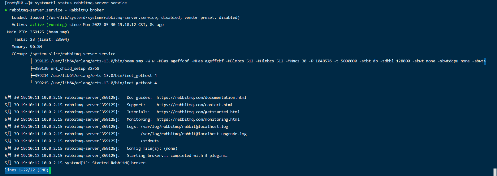
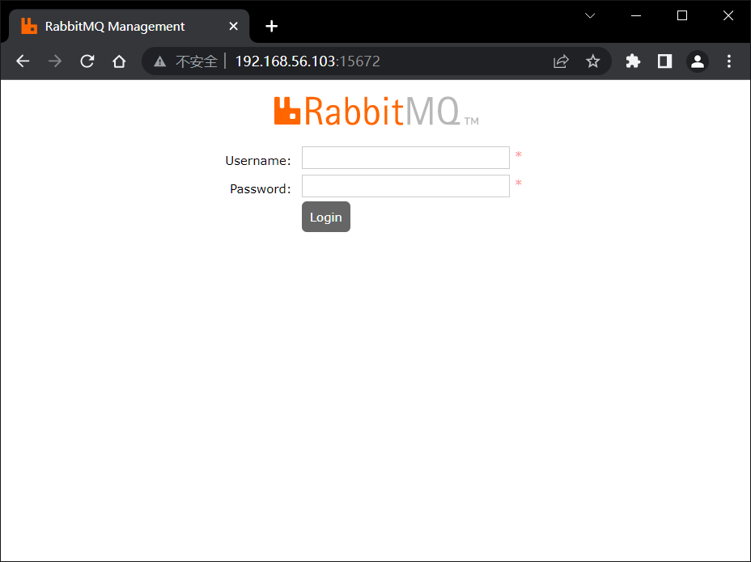

> 官方文档：https://www.rabbitmq.com/documentation.html
>
> 入门教程：https://www.toutiao.com/article/6811460945009705479
>
> https://juejin.cn/post/6844904113788944397

# 一、安装RabbitMQ

## 1.基础依赖安装

如果你的操作系统是Linux的最小安装包，那么应该有很多基础的依赖包没有安装，在安装RabbitMQ之前，需要安装好这些基础依赖包，可以运行如下命令：

```
yum install openssl openssl-devel make gcc gcc-c++ kernel-devel
```

## 2.安装Socat

RabbitMQ依赖于Socat，因此在安装RabbitMQ前要安装Socat，如下：

```
yum install -y socat
```

## 3.安装Erlang

因为RabbitMQ是用Erlang语言开发，所以在安装RabbitMQ前，要先安装Erlang运行环境，我们使用Erlang语言的rpm安装包。

> https://github.com/rabbitmq/erlang-rpm

### 3.1 Erlang依赖相关

```
[root@10 wollo]# ll
总用量 878916
# Erlang相关
-rw-r--r--. 1 root     root      21117240 5月  30 18:00 erlang-25.0-1.el8.x86_64.rpm
-rw-r--r--. 1 root     root       1537652 5月  30 18:00 openssl-libs-1.1.1k-6.el8.x86_64.rpm

# RabbitMQ
-rw-r--r--. 1 root     root      14797137 5月  30 18:22 rabbitmq-server-3.10.2-1.el8.noarch.rpm
[root@10 wollo]# 
```

## 4.安装RabbitMQ

上面所说的依赖安装完成后，最后我们可以运行下面的命令安装RabbitMQ：

> https://github.com/rabbitmq/rabbitmq-server


# 二、使用RabbitMQ

## 1.启动命令（方式一）

```
# CentOS Stream 8  https://www.centos.org/centos-stream/
# 启动命令
[root@10 ~]# systemctl start rabbitmq-server.service
# 查看运行状态
[root@10 ~]# systemctl status rabbitmq-server.service
# 停止命令
[root@10 ~]# systemctl stop rabbitmq-server.service
```

> Web管理程序的端口号是15672，在浏览器中输入http://localhost:15672，即可以访问。


### 1.1 插件管理

上面我们使用rabbitmq-server启动服务器，也可以使用rabbitmqctl命令管理服务器，包括创建交换机、队列、用户管理等操作，除了命令管理工具，RabbitMQ还提供了Web管理工具，而Web管理工具作为RabbitMQ的插件，如果要开启，可以使用下面的命令 ：

> rabbitmq-plugins是RabbitMQ管理插件的命令。

```shell
[root@10 ~]# rabbitmq-plugins enable rabbitmq_management
Enabling plugins on node rabbit@localhost:
rabbitmq_management
The following plugins have been configured:
  rabbitmq_management
  rabbitmq_management_agent
  rabbitmq_web_dispatch
Applying plugin configuration to rabbit@localhost...
The following plugins have been enabled:
  rabbitmq_management
  rabbitmq_management_agent
  rabbitmq_web_dispatch

set 3 plugins.
Offline change; changes will take effect at broker restart.
[root@10 ~]# 
```

启动插件后，我们再启动服务器，最后一行显示运行了3个插件，如下：

```
[root@10 ~]# systemctl status rabbitmq-server.service
● rabbitmq-server.service - RabbitMQ broker
   Loaded: loaded (/usr/lib/systemd/system/rabbitmq-server.service; disabled; vendor preset: disabled)
   Active: active (running) since Mon 2022-05-30 19:10:12 CST; 8s ago
 Main PID: 359125 (beam.smp)
    Tasks: 23 (limit: 23504)
   Memory: 96.2M
   CGroup: /system.slice/rabbitmq-server.service
           ├─359125 /usr/lib64/erlang/erts-13.0/bin/beam.smp -W w -MBas ageffcbf -MHas ageffcbf -MBlmbcs 512 -MHlmbcs 512 -MMmcs 30 -P 1048576 -t 5000000 -stbt db -zdbbl 128000 -sbwt none -sbwtdcpu none -sbwt>
           ├─359139 erl_child_setup 32768
           ├─359214 /usr/lib64/erlang/erts-13.0/bin/inet_gethost 4
           └─359215 /usr/lib64/erlang/erts-13.0/bin/inet_gethost 4

5月 30 19:10:11 10.0.2.15 rabbitmq-server[359125]:   Doc guides:  https://rabbitmq.com/documentation.html
5月 30 19:10:11 10.0.2.15 rabbitmq-server[359125]:   Support:     https://rabbitmq.com/contact.html
5月 30 19:10:11 10.0.2.15 rabbitmq-server[359125]:   Tutorials:   https://rabbitmq.com/getstarted.html
5月 30 19:10:11 10.0.2.15 rabbitmq-server[359125]:   Monitoring:  https://rabbitmq.com/monitoring.html
5月 30 19:10:11 10.0.2.15 rabbitmq-server[359125]:   Logs: /var/log/rabbitmq/rabbit@localhost.log
5月 30 19:10:11 10.0.2.15 rabbitmq-server[359125]:         /var/log/rabbitmq/rabbit@localhost_upgrade.log
5月 30 19:10:11 10.0.2.15 rabbitmq-server[359125]:         <stdout>
5月 30 19:10:11 10.0.2.15 rabbitmq-server[359125]:   Config file(s): (none)
5月 30 19:10:12 10.0.2.15 rabbitmq-server[359125]:   Starting broker... completed with 3 plugins.
5月 30 19:10:12 10.0.2.15 systemd[1]: Started RabbitMQ broker.
lines 1-22/22 (END)
```



重新启动服务器后，可以打开浏览器访问RabbitMQ的Web管理界面

> http://192.168.56.103:15672/




## 2.启动命令（方式二）

```
# 直接启动
$ sudo rabbitmq-server
-detached为可选参数，表示后台开启
$ sudo rabbitmq-server -detached
#关闭RabbitMQ服务：  
$ sudo rabbitmqctl stop  
```

