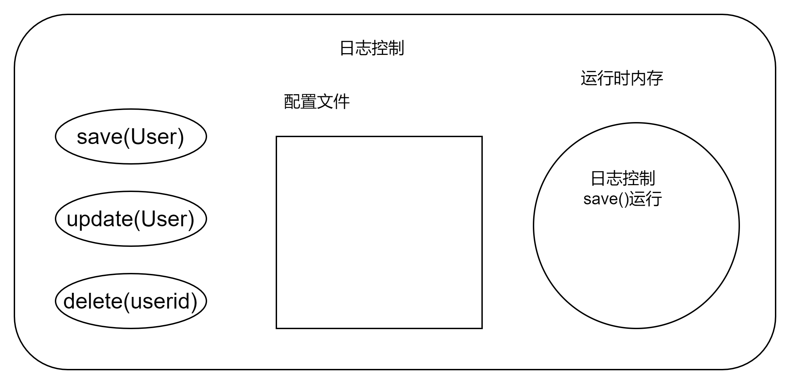
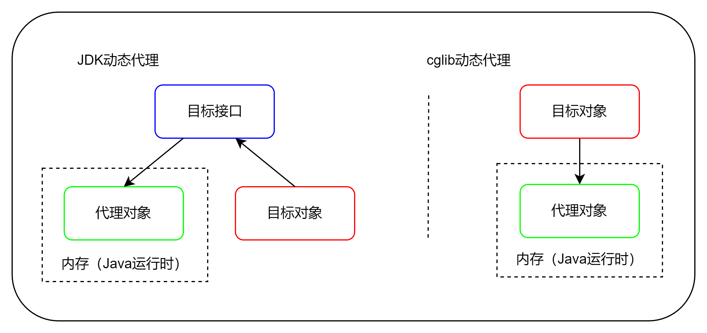
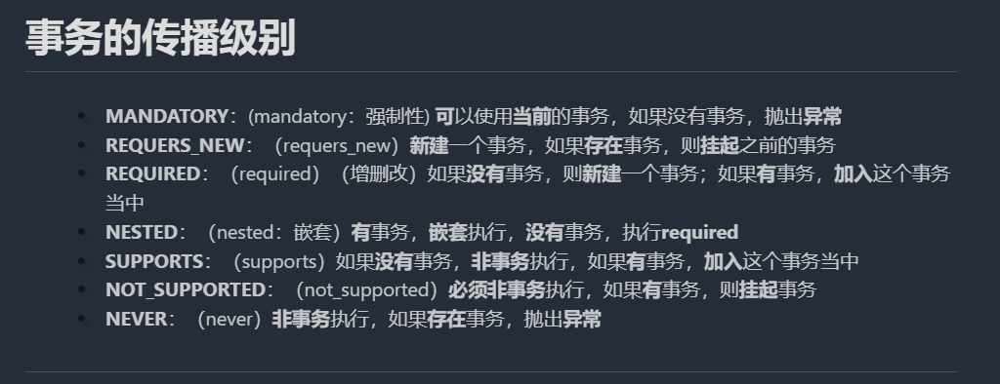

# Spring基础知识

> 视频链接：[黑马程序员最全SSM框架教程|Spring+SpringMVC+MyBatis全套教程](https://www.bilibili.com/video/BV1WZ4y1P7Bp/ "SSM框架")

## 一、Spring简介

### 1. Spring是什么

Spring是分层的Java SE/EE应用full-stack轻量级开源框架，以loc(Inverse Of Control：反转控制)和AOP(Aspect Oriented Programming：面向切面编程)为核心。

提供了展现层SpringMVC和持久层Spring JDBCTmplate以及业务层事务管理等众多的业务级应用技术，还能整合开源世界众多著名的第三方框架和类库，逐渐成为使用最多的Java EE企业应用开源应用框架。

### 2. Spring的优势

#### 1)方使解耦，简化开发
​		通过Spring提供的IOC容器，可以将对象间的依赖关系交由Spring进行控制，避免硬编码所造成的过度耦合。
用户也不必再为单例模式类、属性文件解析等这些很底层的需求编写代码，可以更专注于上层的应用。

#### 2)AOP编程的支持

​		通过Spring的AOP功能，方便进行面向切面编程，许多不容易用传统OOP实现的功能可以通过AOP轻松实现.
#### 3)声明式事务的支持

​		可以将我们从单调烦闷的事务管理代码中解脱出来，通过声明式方式灵活的进行事务管理，提高开发效率和质量。
#### 4)方便程序的测试

​		可以用非容器依赖的编程方式进行几乎所有的测试江作，测试不再是昂贵的操作，而是随手可做的事情。
#### 5)方便集成各种优秀框架

​		Spring对各种优秀框架(Struts、Hibernate、Hessian、Quartz等)的支持。
#### 6)降低JavaEE API的使用难度

​		Spring对JavaEE API(如JDBC、JavaMail、远程调用等)进行了薄薄的封装层，使这些API的使用难度大为降低。
#### 7)Java源码是经典学习范例

​		Spring的源代码设计精妙、结构清晰、匠心独用，处处体现着大师对Java设计模式灵活运用以及对Java技术的高深
造诣。它的源代码无意是Java技术的最佳实践的范例。

### 3. Spring的体系结构


## 二、Spring快速入门

### 1. Spring程序开发步骤


① 导入Spring开发的基本坐标

```xml
<properties>
    <spring.version>5.0.5.RELEASE</spring.version>
</properties>

<dependencies>
    <!--spring-->
    <dependency>
        <groupId>org.springframework</groupId>
        <artifactId>spring-test</artifactId>
        <version>${spring.version}</version>
    </dependency>

    <dependency>
        <groupId>org.springframework</groupId>
        <artifactId>spring-context</artifactId>
        <version>${spring.version}</version>
    </dependency>
</dependencies>
```

② 编写Dao接口和实现类

③ 创建Spring核心配置文件

在类路径下（resources）创建applicationContext.xml配置文件

```xml
<?xml version="1.0" encoding="UTF-8"?>
<beans xmlns="http://www.springframework.org/schema/beans"
       xmlns:xsi="http://www.w3.org/2001/XMLSchema-instance"
       xmlns:context="http://www.springframework.org/schema/context"
       xmlns:aop="http://www.springframework.org/schema/aop"
       xmlns:tx="http://www.springframework.org/schema/tx"
       xsi:schemaLocation="http://www.springframework.org/schema/beans http://www.springframework.org/schema/beans/spring-beans.xsd
                           http://www.springframework.org/schema/context http://www.springframework.org/schema/context/spring-context.xsd
                           http://www.springframework.org/schema/aop http://www.springframework.org/schema/aop/spring-aop.xsd
                           http://www.springframework.org/schema/tx http://www.springframework.org/schema/tx/spring-tx.xsd
       ">

    <!--  注入方式采用注解的方式  -->
    <!--  引入service配置文件  -->
	<import resource="applicationContext-user-service.xml" />
    <!--  引入dao配置文件  -->
    <import resource="applicationContext-user-dao.xml" />

</beans>
```

④ 在Spring配置文件中配置UserDaoImpl

```xml
<!--单例模式-->
<bean id="userDao" class="com.shubao.dao.impl.UserDaoImpl" scope="singleton">
    <!--  <property name="jdbcTemplate" ref="jdbcTemplate" />  -->
</bean>
 <!--多例模式-->
<bean id="userDao" class="com.shubao.dao.impl.UserDaoImpl" scope="prototype"></bean>
```

⑤ 使用Spring的API获得Bean实例

```java
@Test
/**
 测试scope属性
 //单例模式
 <bean id="userDao" class="com.shubao.dao.impl.UserDaoImpl" scope="singleton"></bean>
 //多例模式
 <bean id="userDao" class="com.shubao.dao.impl.UserDaoImpl" scope="prototype"></bean>
 */
public void testBeanScope() {
    ApplicationContext context = new ClassPathXmlApplicationContext("applicationContext.xml");
    UserDao userDao1 = (UserDao) context.getBean("userDao");
    UserDao userDao2 = (UserDao) context.getBean("userDao");
    System.out.println(userDao1);
    System.out.println(userDao2);
}
```

### 2. Spring的配置文件

#### (1) Bean标签的基本配置

用于配置对象交由Spring来创建

默认情况下它调用的是类中的无参构造函数，如果没有无参构造函数不能创建成功。

基本属性：

- id:Bean实例在spring容器中的唯一标识
- class:Bean的全限定名称

#### (2) Bean标签的配置范围

scope：指对象的作用范围，取值如下：

| 取值范围          | 说明                                                         |
| ------------- | ---------------------------------------------------------- |
| singleton     | 默认值，单例模式                                                   |
| prototype     | 多例的                                                        |
| request       | WEB项目中，Spring创建一个bean的对象，将对象存入到request域中                   |
| session       | WEB项目中，Spring创建一个bean的对象，将对象存入到session域中                   |
| globalSession | WEB项目中，应用到Portlet环境，如果没有Portlet环境那么globalSession相当于session |

##### ① 当scope的取值为singleton时

Bean的实例化个数：1个

Bean的实例化时机：当Spring核心配置文件被加载时，实例化配置文件中配置的Bean对象

Bean的生命周期：

- 对象创建：当应用加载，创建容器时，对象就被创建了
- 对象运行：只要容器在，对象一直活着
- 对象销毁：当应用卸载，销毁容器时，对象就被销毁了

##### ② 当scope的取值为prototype时

Bean的实例化个数：多个

Bean的实例化时机：当调用getBean()方法时实例化Bean

Bean的生命周期：

- 对象创建：当使用对象时，创建新的对象实例
- 对象运行：只要对象在使用中，就一直活着
- 对象销毁：当对象长时间不使用时，就被Java的垃圾回收器回收了

#### (3) Bean生命周期配置

* init-method:指定类中的初始化方法名称

* destroy-method:指定类中的销毁方法名称

#### (4) Bean实例化的三种方式

- 无参构造方法实例化
- 工厂静态方法实例化
- 工厂实例方法实例化

##### ① 使用无参构造方法实例化

它会根据默认无参构造方法来创建类对象，如果bean中没有默认无参构造函数，将会创建失败

```xml
<bean id="userDao" class="com.shubao.dao.impl.UserDaoImpl"/>
```

##### ② 工厂静态方法实例化

工厂的静态方法返回Bean实例

```java
package com.shubao.factory;

import com.shubao.dao.UserDao;
import com.shubao.dao.impl.UserDaoImpl;

/**
 * 静态工厂
 */
public class StaticFactory {
    public static UserDao getUserDao(){
        return new UserDaoImpl();
    }
}

```

```xml
<!--静态工厂方式创建Bean-->
<bean id="userDao" class="com.shubao.factory.StaticFactory" factory-method="getUserDao"></bean>
```

##### ③ 工厂实例方法实例化

工厂的非静态方法返回Bean实例

```java
package com.shubao.factory;

import com.shubao.dao.UserDao;
import com.shubao.dao.impl.UserDaoImpl;

/**
 * 实例工厂
 */
public class DynamicFactory {
    public UserDao getUserDao(){
        return new UserDaoImpl();
    }
}
```

```xml
<!--实例工厂方式创建Bean-->
<bean id="factory" class="com.shubao.factory.DynamicFactory"></bean>
<bean id="userDao" factory-bean="factory" factory-method="getUserDao"></bean>
```

#### (5) Bean的依赖注入入门

##### ①  创建 UserService，UserService 内部在调用 UserDao的save() 方法

```java
public class UserServiceImpl implements UserService {
    @Override
    public void save() {
        ApplicationContext applicationContext = new ClassPathXmlApplicationContext("applicationContext.xml");
        UserDao userDao = (UserDao) applicationContext.getBean("userDao");
        userDao.save();
    }
}
```

##### ② 将 UserServiceImpl 的创建权交给 Spring

```xml
<bean id="userService" class="com.shubao.service.impl.UserServiceImpl"/>
```

##### ③ 从 Spring 容器中获得 UserService 进行操作

```java
ApplicationContext applicationContext = new ClassPathXmlApplicationContext("applicationContext.xml");
UserService userService = (UserService) applicationContext.getBean("userService");
userService.save();
```

#### (6) Bean的依赖注入分析

目前UserService实例和UserDao实例都存在于Spring容器中，当前的做法是在容器外部获得UserService实例和UserDao实例，然后在程序中进行结合。


因为UserService和UserDao都在Spring容器中，而最终程序直接使用的是UserService，所以可以在 Spring容器中，将UserDao设置到UserService内部。


#### (7) Bean的依赖注入的概念

依赖注入（Dependency Injection）：它是Spring框架核心IOC的具体实现。

在编写程序时，通过控制反转，把对象的创建交给了Spring，但是代码中不可能出现没有依赖的情况。IOC解耦只是降低他们都依赖关系，但是不会完全消除。例如，业务层仍会调用持久层的方法。

那这种业务层和持久层的依赖关系，在使用Spring之后，就让Spring来维护了。简单的说，就是让框架把持久层对象传入到业务层，而不用我们自己去获取。

#### (8) Bean的依赖注入方式

- set方法注入（p命名空间注入）
  
  在UserServiceImpl中添加setUserDao方法
  
  ```java
  public class UserServiceImpl implements UserService {
      private UserDao userDao;
      public void setUserDao(UserDao userDao) {
          this.userDao = userDao;
      }
      @Override
      public void save() {
          userDao.save();
      }
  }
  ```
  
  配置Spring容器调用set方法进行注入
  
  ```xml
  <bean id="userDao" class="com.shubao.dao.impl.UserDaoImpl"/>
  <bean id="userService" class="com.shubao.service.impl.UserServiceImpl">
      <property name="userDao" ref="userDao"/>
  </bean>
  ```
  
  P命名空间注入的本质也是set方法注入，但比起上述的set方法注入更加方便，主要提现在配置文件中，如下：
  
  首先需要引入P命名空间：
  
  ```xml
  xmlns:p="<http://www.springframework.org/schema/p>"
  ```
  
  其次，需要修改注入方式
  
  ```xml
  <bean id="userService" class="com.shubao.service.impl.UserServiceImpl" p:userDao-ref="userDao">
  ```
  
- 构造方法注入
  
  创建有参构造
  
  ```java
  public class UserServiceImpl implements UserService {
      @Override
      public void save() {
          ApplicationContext applicationContext = new
          ClassPathXmlApplicationContext("applicationContext.xml");
          UserDao userDao = (UserDao) applicationContext.getBean("userDao");
          userDao.save();
      }
  }
  ```
  
  配置Spring容器调用有参构造时进行注入
  
  ```xml
  <!--有参构造注入方式-->
  <bean id="userDao" class="com.shubao.dao.impl.UserDaoImpl"/>
  <bean id="userService" class="com.shubao.service.impl.UserServiceImpl">
      <constructor-arg name="userDao" ref="userDao"></constructor-arg>
  </bean>
  ```

#### (9) Bean的依赖注入的数据类型

上面的操作，都是注入的引用Bean，除了对象的引用可以注入，普通数据类型，集合等都可以在容器中进行注入。

注入数据的三种数据类型

- 普通数据类型
- 引用数据类型
- 集合数据类型

##### ① 普通数据类型的注入

```java
public class UserDaoImpl implements UserDao {
    private String company;
    private int age;
    public void setCompany(String company) {
        this.company = company;
    }
    public void setAge(int age) {
        this.age = age;
    }
    public void save() {
        System.out.println(company + "===" + age);
        System.out.println("UserDao save method running....");
    }
}
```

```xml
<bean class="com.shubao.dao.impl.UserDaoImpl" id="userDao">
    <property name="company" value="123"/>
    <property name="age" value="15"/>
</bean>
```

##### ② 集合数据类型（List\<String>）的注入

```java
public class UserDaoImpl implements UserDao {
    private List<String> strList;
    public void setStrList(List<String> strList) {
        this.strList = strList;
    }
    public void save() {
        System.out.println(strList);
        System.out.println("UserDao save method running....");
    }
}
```

```xml
<bean class="com.shubao.dao.impl.UserDaoImpl" id="userDao">
    <property name="strList">
        <list>
            <value>aaa</value>
            <value>bbb</value>
            <value>ccc</value>
        </list>
    </property>
</bean>
```

##### ③ 集合数据类型（List\<User>）的注入

```java
public class UserDaoImpl implements UserDao {
    private List<User> userList;
    public void setUserList(List<User> userList) {
        this.userList = userList;
    }
    public void save() {
        System.out.println(userList);
        System.out.println("UserDao save method running....");
    }
}
```

```xml
<bean id="u1" class="com.shubao.domain.User" />
<bean id="u2" class="com.shubao.domain.User" />
<bean id="userDao" class="com.shubao.dao.impl.UserDaoImpl">
    <property name="userList">
        <list>
            <bean class="com.shubao.domain.User" />
            <bean class="com.shubao.domain.User" />
            <ref bean="u1" />
            <ref bean="u2" />
        </list>
    </property>
</bean>
```

##### ④ 集合数据类型（Map\<String, User>）的注入

```java
public class UserDaoImpl implements UserDao {
    private Map<String, User> userMap;
    public void setUserMap(Map<String, User> userMap) {
        this.userMap = userMap;
    }
    public void save() {
        System.out.println(userMap);
        System.out.println("UserDao save method running....");
    }
}
```

```xml
<bean id="u1" class="com.shubao.domain.User" />
<bean id="u2" class="com.shubao.domain.User" />
<bean id="userDao" class="com.shubao.dao.impl.UserDaoImpl">
    <property name="userMap">
        <map>
            <entry key="user1" value-ref="u1" />
            <entry key="user2" value-ref="u2" />
        </map>
    </property>
</bean>
```

##### ⑤ 集合数据类型（Properties）的注入

```java
public class UserDaoImpl implements UserDao {
    private Properties properties;
    public void setProperties(Properties properties) {
        this.properties = properties;
    }
    public void save() {
        System.out.println(properties);
        System.out.println("UserDao save method running....");
    }
}
```

```xml
<bean id="userDao" class="com.shubao.dao.impl.UserDaoImpl">
    <property name="properties">
        <props>
            <prop key="p1">aaa</prop>
            <prop key="p2">bbb</prop>
            <prop key="p3">ccc</prop>
        </props>
    </property>
</bean>
```

#### (10) 引入其他配置文件（分模块开发）

实际开发中，Spring的配置内容非常多，导致Spring配置很繁琐而且体积很大，所以，可以将部分配置拆解到其他的配置文件中，在Spring住配置文件中通过import标签进行加载

```xml
<import resource="applicationContext-user-dao.xml"></import>
```

#### (11) 小结

- Spring的重点配置

```xml
<bean>标签
    id属性：在容器中bean实例的唯一标识，不允许重复
    class属性：要实例化的bean的全限定名
    scope属性：bean的作用范围，常用的是Singleton(默认)和prototype
    <property>标签：属性注入
        name属性：属性名称
        value属性：注入的普通属性值
        ref属性：注入的对象引用值
        <list>标签
        <map>标签
        <properties>标签
    <constructor-arg>标签
<import>标签：导入其他的Spring的配置文件 
```

## 三、Spring相关API

### 1. ApplicationContext的继承体系

> https://blog.csdn.net/Growing_stu/article/details/82354272
>
> https://blog.csdn.net/snowy_way/article/details/50173535

applicationContext：接口类型，代表应用上下文，可以通过其实例获得Spring容器中的Bean对象


### 2. ApplicationContext的实现类

#### (1) ClassPathXmlApplicationContext

它是从类的根路径下加载配置文件，推荐使用这种

#### (2) FileSystemXmlApplicationContext

它是从磁盘路径下加载配置文件，配置文件可以在磁盘的任意位置

#### (3) AnnotationConfigApplicationContext

当使用注解配置容器对象时，需要使用此类来创建Spring容器。它用来读取注解。

### 3. getBean()方法使用

```java
/**
 * org/springframework/context/support/AbstractApplicationContext.java 
 */
@Override
public Object getBean(String name) throws BeansException {
    assertBeanFactoryActive();
    return getBeanFactory().getBean(name);
}

@Override
public <T> T getBean(String name, @Nullable Class<T> requiredType) throws BeansException {
    assertBeanFactoryActive();
    return getBeanFactory().getBean(name, requiredType);
}

@Override
public Object getBean(String name, Object... args) throws BeansException {
    assertBeanFactoryActive();
    return getBeanFactory().getBean(name, args);
}

@Override
public <T> T getBean(Class<T> requiredType) throws BeansException {
    assertBeanFactoryActive();
    return getBeanFactory().getBean(requiredType);
}

@Override
public <T> T getBean(Class<T> requiredType, Object... args) throws BeansException {
    assertBeanFactoryActive();
    return getBeanFactory().getBean(requiredType, args);
}
```

其中，当参数的数据类型是字符串时，表示根据Bean的id从容器中获得Bean实例，返回是Object，需要强转。 当参数的数据类型是Class类型时，表示根据类型从容器中匹配Bean实例，当容器中相同类型的Bean有多个时， 则此方法会报错。

```java
ApplicationContext applicationContext = new ClassPathXmlApplicationContext("applicationContext.xml");
UserService userService1 = (UserService) applicationContext.getBean("userService");
UserService userService2 = applicationContext.getBean(UserService.class);
```

### 4. 知识要点

**Spring的重点API**

```xml
<!--applicationContext.xml-->  
<!--单例模式-->
<bean id="userDao" class="com.shubao.dao.impl.UserDaoImpl" scope="singleton">
    <!--注入JdbcTemplate模板对象-->
    <!--<property name="jdbcTemplate" ref="jdbcTemplate" />-->
</bean>
```

```java
ApplicationContext context = new ClassPathXmlApplicationContext("applicationContext.xml");
//1.通过id获取Bean
UserDao userDao = (UserDao) context.getBean("userDao");
//2.通过Class获取Bean
UserService userService = context.getBean(UserService.class);
```

## 四、Spring配置数据源

### 1. 数据源(连接池)的作用

- 数据源(连接池)是提高程序性能而出现的

- 事先实例化数据源，初始化部分连接资源

- 使用连接资源时从数据源中获取

- 使用完毕后将连接资源归还给数据源
  
  常见的数据源(连接池)：DBCP、C3P0、Bonecp、Druid等

### 2. 数据源的开发步骤

1. 导入数据源的坐标和数据库驱动坐标

2. 创建数据源对象

3. 设置数据源的基本连接数据

4. 使用数据源获取连接资源和归还连接资源

### 3. 数据源的手动创建

#### ①  导入c3p0和druid的坐标

```xml
<!--<c3p0.version>0.9.5.2</c3p0.version>-->
<c3p0.version>0.9.1.1</c3p0.version>
<druid.version>1.1.16</druid.version>

<!-- 数据源 -->
<!-- https://zhidao.baidu.com/question/1308159611527260859.html  -->
<!-- <dependency> -->
<!--   <groupId>com.mchange</groupId> -->
<!--   <artifactId>c3p0</artifactId> -->
<!--   <version>${c3p0.version}</version> -->
<!-- </dependency> -->
<dependency>
    <groupId>c3p0</groupId>
    <artifactId>c3p0</artifactId>
    <version>${c3p0.version}</version>
</dependency>

<dependency>
    <groupId>com.alibaba</groupId>
    <artifactId>druid</artifactId>
    <version>${druid.version}</version>
</dependency>
```

#### ② 导入mysql数据库驱动坐标

```xml
<!-- <mysql.version>5.1.3</mysql.version> -->
<mysql.version>8.0.27</mysql.version>

<!--数据源学习-->
<!--MySQL数据库-->
<dependency>
    <groupId>mysql</groupId>
    <artifactId>mysql-connector-java</artifactId>
    <version>${mysql.version}</version>
</dependency>
```

#### ③ 创建连接池

```java
package com.shubao.test;

import com.alibaba.druid.pool.DruidDataSource;
import com.alibaba.druid.pool.DruidPooledConnection;
import com.mchange.v2.c3p0.ComboPooledDataSource;
import org.junit.Test;
import org.springframework.context.ApplicationContext;
import org.springframework.context.support.ClassPathXmlApplicationContext;

import javax.sql.DataSource;
import java.beans.PropertyVetoException;
import java.sql.Connection;
import java.sql.SQLException;
import java.util.ResourceBundle;

public class DataSourceTest {

    @Test
    //测试手动创建c3p0数据源
    public void testC3p0() throws PropertyVetoException, SQLException {
        ComboPooledDataSource dataSource = new ComboPooledDataSource();
        dataSource.setDriverClass("com.mysql.jdbc.Driver");
        dataSource.setJdbcUrl("jdbc:mysql://localhost:3306/test");
        dataSource.setUser("root");
        dataSource.setPassword("1106135");
        Connection connection = dataSource.getConnection();
        System.out.println(connection);
        connection.close();
    }

    @Test
    //测试手动创建druid数据源
    public void testDruid() throws PropertyVetoException, SQLException {
        DruidDataSource dataSource = new DruidDataSource();
        dataSource.setDriverClassName("com.mysql.jdbc.Driver");
        dataSource.setUrl("jdbc:mysql://localhost:3306/test");
        dataSource.setUsername("root");
        dataSource.setPassword("1106135");
        DruidPooledConnection connection = dataSource.getConnection();
        System.out.println(connection);
        connection.close();
    }

    @Test
    //测试手动创建c3p0数据源(加载properties配置文件)
    public void testProperties() throws PropertyVetoException, SQLException {
        //读取配置文件
        ResourceBundle resourceBundle = ResourceBundle.getBundle("jdbc");
        String driver = resourceBundle.getString("jdbc.driver");
        String url = resourceBundle.getString("jdbc.url");
        String username = resourceBundle.getString("jdbc.username");
        String password = resourceBundle.getString("jdbc.password");

        //创建数据源对象，设置连接参数
        ComboPooledDataSource dataSource = new ComboPooledDataSource();
        dataSource.setDriverClass(driver);
        dataSource.setJdbcUrl(url);
        dataSource.setUser(username);
        dataSource.setPassword(password);

        Connection connection = dataSource.getConnection();
        System.out.println(connection);
        connection.close();
    }

    @Test
    //测试spring容器创建产生数据源对象
    public void testSpringCreateDatasource() throws PropertyVetoException, SQLException {
        //加载配置文件
        ApplicationContext app = new ClassPathXmlApplicationContext("applicationContext.xml");
        DataSource dataSource = app.getBean(DataSource.class);

        //获取连接
        Connection connection = dataSource.getConnection();
        System.out.println(connection);
        connection.close();
    }
}
```


### 4. Spring配置数据源

#### 1) 可以将DataSource的创建权交由Spring容器去完成

- DataSource有无参构造方法，而Spring默认就是通过无参构造方法实例化对象的

- DataSource要想使用需要通过set方法设置数据库连接信息，而Spring可以通过set方法进行字符串注入

```xml
<!--  2.配置数据源bean  -->
<bean id="dataSource" class="com.mchange.v2.c3p0.ComboPooledDataSource">
    <property name="driverClass" value="${jdbc.driver}" />
    <property name="jdbcUrl" value="${jdbc.url}" />
    <property name="user" value="${jdbc.username}" />
    <property name="password" value="${jdbc.password}" />
</bean>
```

#### 2) 抽取jdbc配置文件

① applicationContext.xml加载jdbc.properties配置文件获取连接信息。

```properties
# jdbc.properties
jdbc.driver=com.mysql.jdbc.Driver
#jdbc.url=jdbc:mysql://localhost:3306/wollo
jdbc.url=jdbc:mysql://localhost:3306/wollo?characterEncoding=utf8
jdbc.username=root
jdbc.password=1106135
```

② 首先，需要引入context命名空间和约束路径：

- 命名空间：
  
  ```xml
  xmlns:context="http://www.springframework.org/schema/context"
  ```

- 约束路径：
  
  ```xml
  http://www.springframework.org/schema/context
  http://www.springframework.org/schema/context/spring-context.xsd
  ```

```xml
<?xml version="1.0" encoding="UTF-8"?>
<beans xmlns="http://www.springframework.org/schema/beans"
       xmlns:xsi="http://www.w3.org/2001/XMLSchema-instance"
       xmlns:context="http://www.springframework.org/schema/context"
       xsi:schemaLocation="http://www.springframework.org/schema/beans http://www.springframework.org/schema/beans/spring-beans.xsd
                           http://www.springframework.org/schema/context http://www.springframework.org/schema/context/spring-context.xsd
       ">
    <!--  加载外部的properties文件  -->
    <context:property-placeholder location="classpath:jdbc.properties"></context:property-placeholder>

    <!--  配置数据源bean  -->
    <bean id="dataSource" class="com.mchange.v2.c3p0.ComboPooledDataSource">
        <property name="driverClass" value="${jdbc.driver}"></property>
        <property name="jdbcUrl" value="${jdbc.url}"></property>
        <property name="user" value="${jdbc.username}"></property>
        <property name="password" value="${jdbc.password}"></property>
    </bean>
</beans>
```

### 5. 知识要点

Spring容器加载properties文件

```xml
<!--  加载外部的properties文件  -->
<context:property-placeholder location="classpath:jdbc.properties"></context:property-placeholder>

<!--  配置数据源bean  -->
<bean id="dataSource" class="com.mchange.v2.c3p0.ComboPooledDataSource">
    <property name="driverClass" value="${jdbc.driver}"></property>
        ...
</bean>
```

## 五、Spring的注解开发

### 1. Spring原始注解

Spring是轻代码而重配置的框架，配置比较繁重，影响开发效率，所以注解开发是一种趋势，注解代替xml配置文件可以简化配置，提高开发效率。

Spring原始注解主要是替代\<Bean>的配置

| 注解           | 说明                                            |
| -------------- | ----------------------------------------------- |
| @Component     | 使用在类上用于实例化Bean                        |
| @Controller    | 使用在web层类上用于实例化Bean                   |
| @Service       | 使用在service层类上用于实例化Bean               |
| @Repository    | 使用在dao层类上用于实例化Bean                   |
| @Autowired     | 使用在字段上用于根据类型依赖注入                |
| @Qualifier     | 结合@Autowired一起使用用于根据名称进行依赖注入  |
| @Resource      | 相当于@Autowired + @Qualifier，按照名称进行注入 |
| @Value         | 注入普通属性                                    |
| @Scope         | 标注Bean的作用范围                              |
| @PostConstruct | 使用在方法上标注该方法是Bean的初始化方法        |
| @PreDestroy    | 使用在方法上标注该方法是Bean的销毁方法          |

注意：

使用注解进行开发时，需要在applicationContext.xml中配置组件扫描，作用是指定哪个包及其子包下的Bean需要进行扫描以便识别和使用注解的类、字段和方法。

```xml
<!--  配置组件扫描  -->
<context:component-scan base-package="com.shubao"></context:component-scan>
```

-  使用@Compont或@Repository标识UserDaoImpl需要Spring进行实例化。

```java
//@Component("userDao")
@Repository("userDao")
public class UserDaoImpl implements UserDao {
    @Override
    public void save() {
        System.out.println("save running... ...");
    }
}
```

- 使用@Compont或@Service标识UserServiceImpl需要Spring进行实例化
- 使用@Autowired或者@Autowired+@Qulifier或者@Resource进行userDao的注入

```java
package com.shubao.service.impl;

import com.shubao.dao.UserDao;
import com.shubao.domain.User;
import com.shubao.service.UserService;
import org.springframework.beans.factory.annotation.Autowired;
import org.springframework.context.annotation.Scope;
import org.springframework.dao.EmptyResultDataAccessException;
import org.springframework.stereotype.Service;

import java.util.List;

//@Component("userService")
@Service("userService")
//@Scope("prototype") //标注bean的作用范围
@Scope("singleton")
public class UserServiceImpl implements UserService {

    @Autowired //按照数据类型从Spring容器中进行匹配
//    @Qualifier("userDao") //按照id值从容器中进行匹配的，但是此处@Qualifier结合@Autowired一起使用
//    @Resource(name = "userDao") //@Resource相当于@Autowired + @Qualifier
    private UserDao userDao;

}
```

-  使用@Value进行字符串的注入

```java
@Repository("userDao")
public class UserDaoImpl implements UserDao {
    @Value("注入普通数据")
    private String str;
    @Value("${jdbc.driver}")
    private String driver;
    @Override
    public void save() {
        System.out.println(str);
        System.out.println(driver);
        System.out.println("save running... ...");
    }
}
```

-  使用@Scope标注Bean的范围

```java
//@Scope("prototype")
@Scope("singleton")
public class UserDaoImpl implements UserDao {
    //此处省略代码

}
```

-  使用@PostConstruct标注初始化方法，使用@PreDestroy标注销毁方法

```java
@PostConstruct
public void init() {
    System.out.println("初始化方法....");
}
@PreDestroy
public void destroy() {
    System.out.println("销毁方法.....");
}
```

### 2. Spring的新注解

使用上面的注解还不能全部替代xml配置文件，还需要使用Spring的其他注解替代。

- 非自定义的Bean的配置：<bean>
- 加载properties文件的配置：context:property-placeholder
- 组件扫描的配置：context:component-scan
- 引入其他文件：<import>

| 注解              | 说明                                                                                                       |
| --------------- | -------------------------------------------------------------------------------------------------------- |
| @Configuration  | 用于指定当前类是一个Spring配置类，当创建容器时会从该类上加载注解                                                                      |
| @ComponentScan  | 用于指定Spring在初始化容器时要扫描的包。<br />作用和在Spring的xml配置文件中的\<context:component-scan base-package="com.shubao" />一样 |
| @Bean           | 使用在方法上，标注将该方法的返回值存储到Spring容器中                                                                            |
| @PropertySource | 用于加载properties文件中的配置                                                                                     |
| @Import         | 用于导入其他配置类                                                                                                |

```java
package com.shubao.config;

import org.springframework.context.annotation.ComponentScan;
import org.springframework.context.annotation.Configuration;
import org.springframework.context.annotation.Import;

//配置该类是Spring的核心配置类
@Configuration
/*
 <!--  配置组件扫描  -->
 <context:component-scan base-package="com.shubao"></context:component-scan>
 */
@ComponentScan("com.shubao")

/*
引入子配置文件类
<import resource="xxx.xxx"></import>
 */
@Import({DataSourceConfiguration.class})
public class SpringConfiguration {

}
```

```java
package com.shubao.config;

import com.mchange.v2.c3p0.ComboPooledDataSource;
import org.springframework.beans.factory.annotation.Value;
import org.springframework.context.annotation.Bean;
import org.springframework.context.annotation.PropertySource;

import javax.sql.DataSource;
import java.beans.PropertyVetoException;

/*
<!--  加载外部的properties文件  -->
    <context:property-placeholder location="classpath:jdbc.properties"></context:property-placeholder>
 */
@PropertySource("classpath:jdbc.properties")
public class DataSourceConfiguration {

    @Value("${jdbc.driver}")
    private String driver;

    @Value("${jdbc.url}")
    private String url;

    @Value("${jdbc.username}")
    private String username;

    @Value("${jdbc.password}")
    private String password;

    @Bean("dataSource") //Spring会将当前方法的返回值以指定名称存储到Spring容器中
    public DataSource getDataSource() throws PropertyVetoException {
        ComboPooledDataSource dataSource = new ComboPooledDataSource();
        dataSource.setDriverClass(driver);
        dataSource.setJdbcUrl(url);
        dataSource.setUser(username);
        dataSource.setPassword(password);
        return dataSource;
    }
}
```

## 六、Spring整合Junit

### 1. 原始Junit测试Spring的问题

在测试类中，每个测试方法都有以下两行代码：

```xml
ApplicationContext context = new ClassPathXmlApplicationContext("applicationContext.xml");
UserDao userDao = (UserDao) context.getBean("userDao");
```

这两行代码的作用是获取容器，如果不写的话，会提示空指针异常，所以不能轻易删掉。

### 2. 解决思路

- 让SpringJunit负责创建Spring容器，但是需要将配置文件的名称告诉它
- 将需要进行测试的Bean直接在测试类中进行注入

### 3. Spring集成Junit的步骤

- 导入Spring集成Junit的坐标

```xml
<junit.version>4.12</junit.version>
<spring.version>5.0.5.RELEASE</spring.version>

<dependency>
    <groupId>junit</groupId>
    <artifactId>junit</artifactId>
    <version>${junit.version}</version>
    <scope>test</scope>
</dependency>

<!--spring-->
<!--此处需要注意的是，spring5 及以上版本要求 junit 的版本必须是 4.12 及以上-->
<dependency>
    <groupId>org.springframework</groupId>
    <artifactId>spring-test</artifactId>
    <version>${spring.version}</version>
</dependency>
```

- 使用@Runwith注解替换原来的运行器，让测试类运行于Spring测试环境
- 使用@ContextConfiguration指定配置文件或配置类
- 使用@Autowired注入需要测试的对象
- 创建测试方法进行测试

```java
package com.shubao.test;

import com.shubao.config.SpringConfiguration;
import com.shubao.service.UserService;
import org.junit.Test;
import org.junit.runner.RunWith;
import org.springframework.beans.factory.annotation.Autowired;
import org.springframework.test.context.ContextConfiguration;
import org.springframework.test.context.junit4.SpringJUnit4ClassRunner;

import javax.sql.DataSource;
import java.sql.SQLException;

/*
 https://blog.csdn.net/weixin_43671497/article/details/90543225
 @RunWith作用
 @RunWith 就是一个运行器
 @RunWith(JUnit4.class) 就是指用JUnit4来运行
 @RunWith(SpringJUnit4ClassRunner.class),让测试运行于Spring测试环境
 @RunWith(Suite.class) 的话就是一套测试集合，
 @ContextConfiguration Spring整合JUnit4测试时，使用注解引入多个配置文件
 */
@RunWith(SpringJUnit4ClassRunner.class)
//@ContextConfiguration("classpath:applicationContext.xml")
@ContextConfiguration(classes = {SpringConfiguration.class})
public class SpringJunitTest {

    @Autowired
    private UserService userService;

    @Autowired
    private DataSource dataSource;

    @Test
    public void testSpringJunitXML() throws SQLException {
//        userService.save();
        System.out.println(dataSource.getConnection());
    }
}
```

## 七、Spring集成web环境

### 1. ApplicationContext应用上下文获取方式

应用上下文对象是通过new ClasspathXmlApplicationContext(Spring配置文件)方式获取的，但是每次从容器中获得Bean时都要编写new ClasspathXmlApplicationContext(Spring配置文件)，这样的弊端时配置文件加载多次，应用上下文对象创建多次。

在web项目中，可以使用ServletContextListener监听web应用的启动，我们可以在web应用启动时，就加载Spring的配置文件，创建应用上下文对象ApplicationContext，在将其存储到最大的域ServletContext域中，这样就可以在任意位置从域中获得应用上下文ApplicationContext对象了。

### 2. Spring提供获取应用上下文的工具

上面的分析不用手动实现，Spring提供了一个监听器ContextLoaderListener就是对上述功能的封装，该监听器内部加载Spring配置文件，创建应用上下文对象，并存储到ServletContext域中，提供了一个客户端工具WebApplicationContextUtils供使用者获得应用上下文对象。

所以我们需要做的只有两件事：

- 在web.xml中配置ContextLoaderListener监听器(导入Spring-web坐标)
- 使用WebApplicationContextUtils获得应用上下文对象

#### 1) 导入Spring集成web的坐标

```xml
<dependency>
  <groupId>org.springframework</groupId>
  <artifactId>spring-web</artifactId>
  <version>5.3.14</version>
</dependency>
```

#### 2) 配置ContextLoaderListener监听器

```xml
<!-- 全局初始化参数 -->
 <context-param>
   <param-name>contextConfigLocation</param-name>
   <param-value>classpath:applicationContext.xml</param-value>
 </context-param>

 <!-- 配置监听器 -->
 <!-- 自定义监听器 -->
<!--  <listener>-->
<!--    <listener-class>com.shubao.listener.ContextLoaderListener</listener-class>-->
<!--  </listener>-->

 <!-- 导入spring-web的监听器 -->
 <listener>
   <listener-class>org.springframework.web.context.ContextLoaderListener</listener-class>
 </listener>
```

#### 3)  通过工具获得应用上下文对象

```java
ApplicationContext applicationContext = WebApplicationContextUtils.getWebApplicationContext(servletContext);
Object obj = applicationContext.getBean("id");
```

### 3. 知识要点

    Spring集成web环境步骤

* ①配置ContextLoaderListener监听器

* ②使用WebApplicationContextUtils获得应用上下文

## 八、SpringMVC简介

### 1. SpringMVC概述

SpringMVC是一种基于Java的实现MVC设计模型的请求驱动类型的轻量级web框架，属于SpringFrameWork的后续产品，已经融合在Spring Web Flow中。


### 2. SpringMVC快速入门

开发步骤

1. 导入Spring和SpringMVC相关坐标

   ```xml
   <spring.version>5.0.5.RELEASE</spring.version>
   
   <dependency>
       <groupId>org.springframework</groupId>
       <artifactId>spring-context</artifactId>
       <version>${spring.version}</version>
   </dependency>
   
   <!--  spring mvc  -->
   <dependency>
       <groupId>org.springframework</groupId>
       <artifactId>spring-webmvc</artifactId>
       <version>${spring.version}</version>
   </dependency>
   ```

    导入Servlet和Jsp的坐标

   ```xml
   <jsp-api.version>2.2.1</jsp-api.version>
   <servlet-api.version>3.0.1</servlet-api.version>
   
   <!--servlet-->
   <dependency>
       <groupId>javax.servlet.jsp</groupId>
       <artifactId>javax.servlet.jsp-api</artifactId>
       <version>${jsp-api.version}</version>
       <scope>provided</scope>
   </dependency>
   
   <dependency>
       <groupId>javax.servlet</groupId>
       <artifactId>javax.servlet-api</artifactId>
       <version>${servlet-api.version}</version>
       <scope>provided</scope>
   </dependency>
   ```

2. 配置SpringMVC核心控制器DispathcerServlet

   ```xml
   <!-- 配置Spring MVC的前端控制器 -->
   <servlet>
       <servlet-name>DispatcherServlet</servlet-name>
       <servlet-class>org.springframework.web.servlet.DispatcherServlet</servlet-class>
       <init-param>
           <param-name>contextConfigLocation</param-name>
           <param-value>classpath:spring-mvc.xml</param-value>
       </init-param>
       <load-on-startup>1</load-on-startup>
   </servlet>
   <servlet-mapping>
       <servlet-name>DispatcherServlet</servlet-name>
       <url-pattern>/</url-pattern>
   </servlet-mapping>
   ```

3. 创建Controller类和视图页面

   ```jsp
   <%--
     Created by IntelliJ IDEA.
     User: chris
     Date: 2022/1/8 0008
     Time: 16:36
     To change this template use File | Settings | File Templates.
   --%>
   <%@ page contentType="text/html;charset=UTF-8" language="java" %>
   <html>
   <head>
       <title>Success</title>
   </head>
   <body>
       <h1>success...</h1>
   </body>
   </html>
   ```

4. 使用注解配置Controller类中业务方法的映射地址

   ```java
   @RequestMapping(value = "/quick", method = RequestMethod.GET, params = {"username"})
   public String quick(String username){
       System.out.println("UserController.save() running...");
       System.out.println("username = " + username);
   
       // return "/success.jsp";//默认方式：forward 转发
       // return "forward:/success.jsp";//forward 转发
       // return "redirect:/success.jsp";//redirect 重定向
       return "success";//配置视图解析器
   }
   ```

5. 配置SpringMVC核心文件spring-mvc.xml

   ```xml
   <?xml version="1.0" encoding="UTF-8"?>
   <beans xmlns="http://www.springframework.org/schema/beans"
          xmlns:xsi="http://www.w3.org/2001/XMLSchema-instance"
          xmlns:context="http://www.springframework.org/schema/context"
          xmlns:mvc="http://www.springframework.org/schema/mvc"
          xsi:schemaLocation="http://www.springframework.org/schema/beans http://www.springframework.org/schema/beans/spring-beans.xsd
                              http://www.springframework.org/schema/context http://www.springframework.org/schema/context/spring-context.xsd
                              http://www.springframework.org/schema/mvc http://www.springframework.org/schema/mvc/spring-mvc.xsd
           ">
   
       <!--  Controller的组件扫描  -->
       <!--<context:component-scan base-package="com.shubao.controller"></context:component-scan>-->
   
       <!--  组件扫描：主要扫描Controller  -->
       <context:component-scan base-package="com.shubao.controller">
           <!-- include 包括 ， exclude 不包括、排除-->
           <!--<context:include-filter type="annotation" expression="org.springframework.stereotype.Controller"></context:include-filter>-->
       </context:component-scan>
   
   
       <!--2.配置内部资源视图解析器-->
       <bean id="viewResolver" class="org.springframework.web.servlet.view.InternalResourceViewResolver">
           <property name="prefix" value="/pages/" />
           <!--<property name="prefix" value="/jsp/" />-->
   <!--        <property name="prefix" value="/" />-->
           <property name="suffix" value=".jsp" />
       </bean>
   
   </beans>
   ```

6. 客户端发起请求


### 3. SpringMVC流程图示


## 九、SpringMVC组件解析

### 1. SpringMVC的执行流程

① 用户发送请求到前端控制器DispatcherServlet

② DispatcherServlet收到请求调用HandlerMapping处理器映射器

③ 处理器映射器找到具体的处理器(可以根据xml配置，注解进行查找)，生成处理器对象及处理器拦截器(如果有则生成)，一并返回给DispatcherServlet。

④ DispatcherServlet调用HandlerAdapter处理器适配器

⑤ HandlerAdapter经过适配器调用具体的处理器(Controller，也叫后端控制器)

⑥ Controller执行完成返回MOdelAndView

⑦ HandlerAdapter将Controller执行结果ModelAndView返回给DispatcherServlet

⑧ DispatcherServlet将ModelAndView传给ViewResolver视图解析器

⑨ ViewResolver解析后返回具体的View

⑩ DispatcherServlet根据View进行渲染试图(即将模型数据填充至试图中)，DispatcherServlet响应用户。


1. 前端控制器：DispatcherServlet

   用户请求到达前端控制器，它就相当于 MVC 模式中的 C，DispatcherServlet 是整个流程控制的中心，由它调用其它组件处理用户的请求，DispatcherServlet 的存在降低了组件之间的耦合性。 

2. 处理器映射器：HandlerMapping

   HandlerMapping 负责根据用户请求找到 Handler 即处理器，SpringMVC 提供了不同的映射器实现不同的 映射方式，例如：配置文件方式，实现接口方式，注解方式等。 

3. 处理器适配器：HandlerAdapter

   通过 HandlerAdapter 对处理器进行执行，这是适配器模式的应用，通过扩展适配器可以对更多类型的处理 器进行执行。

4. 处理器：Handler

   它就是我们开发中要编写的具体业务控制器。由 DispatcherServlet 把用户请求转发到 Handler。由 Handler 对具体的用户请求进行处理。 

5. 视图解析器：View Resolver

   View Resolver 负责将处理结果生成 View 视图，View Resolver 首先根据逻辑视图名解析成物理视图名，即 具体的页面地址，再生成 View 视图对象，最后对 View 进行渲染将处理结果通过页面展示给用户。 

6. 视图：View

   SpringMVC 框架提供了很多的 View 视图类型的支持，包括：jstlView、freemarkerView、pdfView等。最 常用的视图就是 jsp。一般情况下需要通过页面标签或页面模版技术将模型数据通过页面展示给用户，需要由程 序员根据业务需求开发具体的页面。

### 2. SpringMVC注解解析

@RequestMapping

作用：用户建立请求URL和处理请求方法之间的对应关系

位置：

- 类上：请求URL的第一级访问目录。此处不写的话，就相当于应用的根目录

- 方法上：请求URL的第二级访问目录，与类上的使用@RequestMapping标注的一级目录一起组成访问虚拟路径

属性：

- value：用于指定请求的URL，它和path属性的作用是一样的

- method：用于指定请求的方式

- params：用于指定限制请求参数的条件。它支持简单的表达式，要求请求参数的key和value必须配置的一模一样

例如：

- params = {"username"}，表示请求参数必须要有username

- params = {"money!100"}，表示请求参数中money不能是100

#### ① MVC的命名空间引入

命名空间：

```xml
xmlns:context="http://www.springframework.org/schema/context"
xmlns:mvc="http://www.springframework.org/schema/mvc"
```

约束条件：

```xml
http://www.springframework.org/schema/context 
http://www.springframework.org/schema/context/spring-context.xsd
http://www.springframework.org/schema/mvc 
http://www.springframework.org/schema/mvc/spring-mvc.xsd
```

示例：

```xml
<?xml version="1.0" encoding="UTF-8"?>
<beans xmlns="http://www.springframework.org/schema/beans"
       xmlns:xsi="http://www.w3.org/2001/XMLSchema-instance"
       xmlns:context="http://www.springframework.org/schema/context"
       xmlns:mvc="http://www.springframework.org/schema/mvc"
       xsi:schemaLocation="http://www.springframework.org/schema/beans http://www.springframework.org/schema/beans/spring-beans.xsd
                           http://www.springframework.org/schema/context http://www.springframework.org/schema/context/spring-context.xsd
                           http://www.springframework.org/schema/mvc http://www.springframework.org/schema/mvc/spring-mvc.xsd
        ">
    <!-- 相关配置内容 -->
</beans>
```

#### ② 组件扫描

SpringMVC基于Spring容器，所以在进行SpringMVC操作时，需要将Controller存储到Spring容器中，如果使用@Controller注解标注的话，就需要使用<context:component-sacn base-package="com.shubao.controller" />进行组件扫描

```xml
<context:component-scan base-package="com.shubao.controller">
    <!-- include 包括 ， exclude 不包括、排除-->
    <!--<context:include-filter type="annotation" expression="org.springframework.stereotype.Controller"></context:include-filter>-->
</context:component-scan>
```

### 3. SpringMVC的XML配置解析

#### ① 视图解析器

SpringMVC有默认组件配置，默认组件都是DispatcherServlet.properties配置文件中配置的，该配置文件地址为：org/springframework/web/servlet/DispatcherServlet.properties，该文件中配置了默认的视图解析器，如下：

```properties
org.springframework.web.servlet.ViewResolver=org.springframework.web.servlet.view.InternalResourceViewResolver
```

翻开该解析器源码，可以看到该解析器的默认配置，如下：

> org.springframework.web.servlet.view.UrlBasedViewResolver

```java
/**
 * Prefix for special view names that specify a redirect URL (usually
 * to a controller after a form has been submitted and processed).
 * Such view names will not be resolved in the configured default
 * way but rather be treated as special shortcut.
 */
public static final String REDIRECT_URL_PREFIX = "redirect:";//重定向前缀

/**
 * Prefix for special view names that specify a forward URL (usually
 * to a controller after a form has been submitted and processed).
 * Such view names will not be resolved in the configured default
 * way but rather be treated as special shortcut.
 */
public static final String FORWARD_URL_PREFIX = "forward:";//转发前缀（默认值）

private String prefix = "";//视图名称前缀

private String suffix = "";//视图名称后缀
```

我们可以通过属性注入的方式修改视图的的前后缀

```xml
<!--2.配置内部资源视图解析器-->
<bean id="viewResolver" class="org.springframework.web.servlet.view.InternalResourceViewResolver">
    <property name="prefix" value="/pages/" />
    <!--<property name="prefix" value="/jsp/" />-->
    <!--<property name="prefix" value="/" />-->
    <property name="suffix" value=".jsp" />
</bean>
```

### 4. 知识要点

**SpringMVC的相关组件**

- 前端控制器：DispatcherServlet

- 处理器映射器：HandlerMapping

- 处理器适配器：HandlerAdapter

- 处理器：Handler

- 视图解析器：ViewResolver

- 视图：View

**SpringMVC的注解和配置**

- 请求映射注解：@RequestMapping

- 视图解析器配置：
  
  ```xml
  <!--2.配置内部资源视图解析器-->
  <bean id="viewResolver" class="org.springframework.web.servlet.view.InternalResourceViewResolver">
      <property name="prefix" value="/pages/" />
      <!--<property name="prefix" value="/jsp/" />-->
      <!--<property name="prefix" value="/" />-->
      <property name="suffix" value=".jsp" />
  </bean>
  ```

## 十、SpringMVC的数据响应

### 1. SpringMVC的数据响应方式

#### (1) 页面跳转

- 直接返回字符串

- 通过ModelAndView对象返回

#### (2) 回写数据

- 直接返回字符串

- 返回对象或集合

#### (3) 页面跳转

##### ① 返回字符串形式

直接返回字符串：此种方式会将返回的字符串与视图解析器的前后缀拼接后跳转。


返回带有前缀的字符串：

转发：forward:/WEB-INF/view/index.jsp

重定向：redirect:/index.jsp

#### (4) 回写数据

##### ① 返回对象或集合

在方法上添加@ResponseBody就可以返回json格式的字符串，但是这样配置比较麻烦，配置的代码比较多，可以使用MVC的注解驱动代替上述配置

```xml
<!--1.mvc的注解驱动-->
<mvc:annotation-driven />
```

在SpringMVC的各个组件中，**处理器映射器**、**处理器适配器**、**视图解析器**称为SpringMVC的三大组件。

使用<mvc:annotation-driven />自动加载RequestMappingHandlerMapping（处理器映射器）和RequestMappingHandlerAdapt（处理器适配器），可以在spring-xml.xml配置文件中使用<mvc:annotation-driven />替代注解处理器和适配器的配置。

同时，使用<mvc:annotation-driven />默认底层就会集成Jackson进行对象或者集合的json格式字符串的转换。

#### (5) 知识要点

##### ① 页面跳转

- 直接返回字符串

- 通过ModelAndView对象返回

##### ② 回写数据

- 直接返回字符串

- 返回对象或集合

### 2. Spring MVC获得请求数据

#### (1) 获得请求参数

客户端请求参数的格式是：name=value1&age=value2...

服务器端要获得请求的参数，有时还需要进行数据的封装，SpringMVC可以接收如下类型的参数：

- 基本数据类型参数

- POJO类型参数

- 数据类型参数

- 集合类型参数

#### (2) 获得基本类型参数

Controller中业务方法的参数名称要与请求参数的name一致，参数值会自动映射匹配。

> 请求地址：http://localhost:8080/user/quick11?username=zhangsan&age=12

```java
/**
 * 请求参数类型为普通数据类型
 * @param username 用户名
 * @param age 年龄
 */
@RequestMapping(value = "/quick11")
@ResponseBody
public void quick11(String username, int age) {
    System.out.println(username);
    System.out.println(age);
}
```

#### (3) 获得POJO类型参数

Controller中的业务方法的POJO参数的属性名与请求参数的name一致，参数值会自动映射匹配。

> 请求地址：http://localhost:8080/user/quick12?username=zhangsan&age=12

```java
public class User {

    private String username;

    private int age;

    //getting&setting
}

/**
 * 请求参数类型为POJO对象
 * @param user 请求参数对象
 */
@RequestMapping(value = "/quick12")
@ResponseBody
public void quick12(User user) {
    System.out.println(user);
}
```

#### (4) 获得数据类型参数

Controller中的业务方法数据名称与请求参数的name一致，参数值会自动映射匹配。

> 请求地址：http://localhost:8080/user/quick13?strs=11&strs=22&strs=33

```java
/**
 * 请求参数类型为数组
 * @param strs 请求参数数组
 */
@RequestMapping(value = "/quick13")
@ResponseBody
public void quick13(String[] strs) {
    System.out.println(Arrays.asList(strs));
}
```

#### (5) 获得集合类型参数

获得集合参数时，要将集合参数包装到一个POJO中才可以

当使用Ajax提交时，可以指定contentType为json形式，那么在方法参数位置使用@RequestBody可以直接接收集合数据而无需使用POJO进行包装。

```html
<script>
var userList = new Array();
userList.push({ username: "zhangsan", age: 18 });
userList.push({ username: "lisi", age: 20 });
$.ajax({
    type: "POST",
    url: "${pageContext.request.contextPath}/user/quick15",
    data: JSON.stringify(userList),
    contentType: "application/json;charset=utf-8"
});
</script>
```

#### (6) 请求数据乱码问题

当post请求时，数据会出现乱码，我们可以配置一个过滤器来进行编码的过滤。

```xml
<!--配置全局过滤器filter-->
<filter>
  <filter-name>CharacterEncodingFilter</filter-name>
  <filter-class>org.springframework.web.filter.CharacterEncodingFilter</filter-class>
  <init-param>
    <param-name>encoding</param-name>
    <param-value>UTF-8</param-value>
  </init-param>
</filter>
<filter-mapping>
  <filter-name>CharacterEncodingFilter</filter-name>
  <url-pattern>/*</url-pattern>
</filter-mapping>
```

#### (7) 参数绑定注解@requestParam

当请求的参数名称与Controller的业务方法参数名称不一致时，需要通过@RequestParam注解显式的绑定。

```html
<form action="${pageContext.request.contextPath}/user/quick14" method="post">
    <input type="text" name="name"><br />
    <input type="submit" value="提交">
</form>
```

```java
@RequestMapping(value = "/quick16")
@ResponseBody
public void quick16(@RequestParam("name") String username) {
    System.out.println(username);
}
```

注解@RequestParam有如下参数可以使用：

- value：请求参数名称

- required：表示在该请求中指定的请求参数是否必须包括，默认是true，提交时如果没有此参数则报错

- defaultValue：当没有指定请求参数时，则使用指定的默认值赋值

```java
@RequestMapping(value = "/quick16")
@ResponseBody
public void quick16(@RequestParam(value = "username", required = false, defaultValue = "tom") String username) {
    System.out.println(username);
}
```

#### (8) 获得Restful风格的参数

Restful是一种软件架构风格、设计风格，而不是标准，只是提供了一组设计原则和约束条件。主要用于客户端和服务器交互类的软件，基于这个风格设计的软件可以更简洁，更有层次，更易于实现缓存机制等。

Restful风格的请求是使用“url+请求方式”表示一次i请求目的的，HTTP协议里面四个表示操作方式的动词如下：

- GET：用于获取资源

- POST：用于新建资源

- PUT：用于更新资源

- DELETE：用于删除资源

例如：

- /user/1 GET：得到id=1的user

- /user/1 DELETE：删除id=1的user

- /user/1 PUT：更新id=1的user

- /user POST：新增user

上面的url地址/user/1中的1就是要获得的请求参数，在SpringMVC中可以使用占位符进行参数绑定。地址/user/1可以写成/user/{id}，占位符{id}对应的就是1的值。在业务方法中，我们可以使用@PathVariable注解进行占位符的匹配获取工作。

> 请求地址：http://localhost:8080/user/quick17/zhangsan

```java
 /**
 * Restful风格
 * @param username 用户名
 */
@RequestMapping(value = "/quick17/{username}")
@ResponseBody
public void quick17(@PathVariable("username") String username) {
    System.out.println(username);
}
```

#### (9) 自定义类型转换器

SpringMVC默认已经提供了一些常用的类型转换器，例如客户端提交的字符串转换成int类型进行参数设置。

但是不是所有的数据类型都提供了转换器，没有提供的就需要自定义转换器，例如：日期类型就需要自定义转换器。

自定义类型转换器的开发步骤：

##### ① 定义转换器类实现Converter接口

```java
package com.shubao.converter;


import org.springframework.core.convert.converter.Converter;

import java.text.ParseException;
import java.text.SimpleDateFormat;
import java.util.Date;

public class DateConverter implements Converter<String, Date> {

    @Override
    public Date convert(String source) {
        //将日期字符串转换成日期对象，返回
        SimpleDateFormat format = new SimpleDateFormat("yyyy-MM-dd");
        Date date = null;
        try {
            date = format.parse(source);
        } catch (ParseException e) {
            e.printStackTrace();
        }
        return date;
    }
}
```

##### ② 在配置文件中申明转换器

```xml
<!--  申明转换器  -->
<bean id="conversionService" class="org.springframework.context.support.ConversionServiceFactoryBean">
    <property name="converters">
        <list>
            <bean class="com.shubao.converter.DateConverter" />
        </list>
    </property>
</bean>
```

##### ③ 在<mvc:annotation-driven conversion-service="conversionService" />中引用转换器

```xml
<!--1.mvc的注解驱动-->
<mvc:annotation-driven conversion-service="conversionService" />
```

#### (10) 获得Servlet相关API

SpringMVC支持使用原始Servlet API对象作为控制器方法的参数进行注入，常用的对象如下：

- HttpServletRequest

- HttpServletResponse

- HttpSession

```java
/**
 * 获取Servlet相关API
 * @param request request对象
 * @param response response对象
 * @param session session对象
 */
@RequestMapping(value = "/quick19")
@ResponseBody
public void quick19(HttpServletRequest request, HttpServletResponse response, HttpSession session) {
    System.out.println("request = " + request);
    System.out.println("response = " + response);
    System.out.println("session = " + session);
}
```

#### (11) 获得请求头

##### ① @RequestHeader

使用@RequestHeader可以获取请求头信息，相当于web阶段的request.getHeader(name)

@RequestHeader注解的属性如下：

- value：请求头的名称

- required：是否必须携带此请求头

```java
/**
 * 使用注解@RequestHead获取请求头
 * @param user_agent user_agent对象
 */
@RequestMapping(value = "/quick20")
@ResponseBody
public void quick20(@RequestHeader(value = "User-Agent", required = false) String user_agent) {
    System.out.println("user_agent = " + user_agent);
}
```

##### ② @CookieValue

使用@CookieValue可以获得指定Cookie的值

@CookieValue注解的属性如下：  

- value：指定cookie的名称

- required：是否必须携带此cookie

```java
/**
 * 使用@CookieValue获取cookie的value
 * @param jsessionId JSESSIONID对象
 */
@RequestMapping(value = "/quick21")
@ResponseBody
public void quick21(@CookieValue(value = "JSESSIONID", required = false) String jsessionId) {
    System.out.println("jsessionId = " + jsessionId);
}
```

#### (12) 文件上传

##### ① 文件上传客户端三要素

- 表单项type = "file"

- 表单的提交方式是post

- 表单的enctype属性是多部份表单形式，及enctype="multipart/form-data"

```html
<form action="${pageContext.request.contextPath}/user/quick22" method="post" enctype="multipart/form-data">
    名称<input type="text" name="username"><br/>
    文件<input type="file" name="file"><br/>
    <input type="submit" value="提交">
</form>
```

##### ② 文件上传原理

- 当form表单修改为多部份表单时，request.getParameter()将失效。

- enctype="application/x-www-form-urlencoded"时，form表单的正文内容格式是：key=value1&key=value2&key=value3

- 当form表单的enctype取值为multipart/form-data时，请求正文内容就变成多部份形式：


#### (13) 单文件上传步骤

##### ① 导入fileupload和io坐标

##### ② 配置文件上传解析器

##### ③ 编写文件上传代码

#### (14) 单文件上传实现

① 导入fileupload和io坐标

```xml
<!--   文件上传坐标   -->
<!-- https://mvnrepository.com/artifact/commons-fileupload/commons-fileupload -->
<dependency>
    <groupId>commons-fileupload</groupId>
    <artifactId>commons-fileupload</artifactId>
    <version>${commons-fileupload.version}</version>
</dependency>

<dependency>
    <groupId>commons-io</groupId>
    <artifactId>commons-io</artifactId>
    <version>${commons-io.version}</version>
</dependency>
```

② 配置文件上传解析器

```xml
<!--  配置文件上传解析器  -->
<bean id="multipartResolver" class="org.springframework.web.multipart.commons.CommonsMultipartResolver">
    <!--    上传文件的编码类型    -->
    <property name="defaultEncoding" value="UTF-8" />
    <!--    上传文件总大小    -->
    <property name="maxUploadSize" value="524800" />
    <!--    上传单个文件的大小    -->
    <property name="maxUploadSizePerFile" value="5242800" />
</bean>
```

##### ③ 编写文件上传代码

```html
<%--
  Created by IntelliJ IDEA.
  User: chris
  Date: 2022/1/23 0023
  Time: 19:22
  To change this template use File | Settings | File Templates.
--%>
<%@ page contentType="text/html;charset=UTF-8" language="java" %>
<html>
<head>
    <title>Title</title>
</head>
<body>
    <form action="${pageContext.request.contextPath}/user/quick22" method="post" enctype="multipart/form-data">
        名称<input type="text" name="username"><br/>
        文件<input type="file" name="file"><br/>
        <input type="submit" value="提交">
    </form>
</body>
</html>
```

```java
/**
 * 单文件上传
 * @param username 用户名
 * @param file 文件
 * @throws Exception IO异常
 */
@RequestMapping(value = "/quick22")
@ResponseBody
public void quick22(String username, MultipartFile file) throws Exception {
    System.out.println("username = " + username);
    //获得上传文件的名称
    String originalFilename = file.getOriginalFilename();
    System.out.println("originalFilename = " + originalFilename);
    file.transferTo(new File("D:\\logs\\" + originalFilename));
}
```

#### (15) 知识要点

**MVC实现数据请求方式**

- 基本类型参数

- POJO类型参数

- 数组类型参数

- 集合类型参数

**MVC获取数据细节**

- 中文乱码问题

- @RequestParam和@PathVariable

- 自定义类型转换器

- 获得Servlet相关API

- @RequestHeader和@CookieValue

- 文件上传

## 十一、Spring JdbcTemplate基本使用

### 1. JdbcTemplate概述

它是spring框架中提供的一个对象，是对原始繁琐的Jdbc API对象的简单封装，spring框架为我们提供了很多的操作模板类，例如：操作关系型数据库的JdbcTemplate，操作nosql数据库的RedisTemplate，操作消息队列的JmsTemplate等等。

### 2. JdbcTemplate开发步骤

#### ① 导入spring-jdbc和spring-tx坐标

#### ② 创建数据库表和实体

#### ③ 创建JdbcTemplate对象

#### ④ 执行数据库操作

### 3. Spring产生JdbcTemplate对象

我们可以将JdbcTemplate的创建权交给spring，将数据源DataSource的创建权也交给Spring，在Spring容器内部将数据源DataSource注入到JdbcTemplate模板对象中，配置如下：

```properties
# jdbc.properties
jdbc.driver=com.mysql.jdbc.Driver
#jdbc.url=jdbc:mysql://localhost:3306/wollo
jdbc.url=jdbc:mysql://localhost:3306/wollo?characterEncoding=utf8
jdbc.username=root
jdbc.password=1106135
```

```xml
<!--  1.加载外部的properties文件  -->
<context:property-placeholder location="classpath:jdbc.properties" />
```

```xml
<!--  2.配置数据源bean  -->
<bean id="dataSource" class="com.mchange.v2.c3p0.ComboPooledDataSource">
    <property name="driverClass" value="${jdbc.driver}" />
    <property name="jdbcUrl" value="${jdbc.url}" />
    <property name="user" value="${jdbc.username}" />
    <property name="password" value="${jdbc.password}" />
</bean>
```

```xml
<!--  3.jdbc模板对象  -->
<bean id="jdbcTemplate" class="org.springframework.jdbc.core.JdbcTemplate">
    <property name="dataSource" ref="dataSource" />
</bean>
```

### 4. JdbcTemplate的常用操作

修改操作：

```java
package com.shubao.test;

import com.shubao.domain.Account;
import org.junit.Test;
import org.junit.runner.RunWith;
import org.springframework.beans.factory.annotation.Autowired;
import org.springframework.jdbc.core.BeanPropertyRowMapper;
import org.springframework.jdbc.core.JdbcTemplate;
import org.springframework.test.context.ContextConfiguration;
import org.springframework.test.context.junit4.SpringJUnit4ClassRunner;

import java.util.List;

@RunWith(SpringJUnit4ClassRunner.class)
@ContextConfiguration("classpath:applicationContext.xml")
public class JdbcTemplateCRUDTest {

    @Autowired
    private JdbcTemplate jdbcTemplate;

    @Test
    public void testUpdate(){
        jdbcTemplate.update("update account set money = ? where name = ?", 15000, "zhangsan");
    }

    @Test
    public void testDelete(){
        jdbcTemplate.update("delete from account where name = ?", "tom");
    }

    @Test
    public void testQueryAll(){
        List<Account> list = jdbcTemplate.query("select * from account", new BeanPropertyRowMapper<Account>(Account.class));
        System.out.println("list = " + list);
    }

    @Test
    public void testQueryOne(){
        Account account = jdbcTemplate.queryForObject("select * from account where name = ?", new BeanPropertyRowMapper<Account>(Account.class), "zhangsan");
//        Account account = jdbcTemplate.queryForObject("select * from account where money = ?", new BeanPropertyRowMapper<Account>(Account.class), 8000);
        System.out.println("account = " + account);
    }

    @Test
    public void testQueryCount(){
        Long count = jdbcTemplate.queryForObject("select count(*) from account", Long.class);
        System.out.println("count = " + count);
    }

}
```

### 5. 知识要点

#### ① 导入spring-jdbc和spring-tx坐标

#### ② 创建数据库表和实体

#### ③ 创建JdbcTemplate对象

```java
JdbcTemplate jdbcTemplate = new JdbcTemplate();
//设置数据源对象，知道数据库在哪
jdbcTemplate.setDataSource(dataSource);
```

#### ④ 执行数据库操作

```java
//更新操作：
jdbcTemplate.update(sql, params)
```

```java
//查询操作：
jdbcTemplate.query(sql, Mapper, params)
jdbcTemplate.queryForObject(sql, Mapper, params)
```

## 十二、Spring练习环境搭建

## 十二、SpringMVC拦截器

### 1.拦截器(interceptor)的作用

        Spring MVC的拦截器类似于Servlet开发中的过滤器Filter，用于对处理器进行预处理和后处理

        将拦截器按一定的顺序联结成一条链，这条链称为拦截器链（Interceptor Chain）。在访问被拦截的方法或字段时，拦截器链中的拦截器就会按之前定义的顺序被调用。拦截器也是AOP思想的具体实现。

### 2.拦截器和过滤器的区别

| 区别   | 过滤器(Filter)                        | 拦截器(Interceptor)                                                                                   |
| ---- | ---------------------------------- | -------------------------------------------------------------------------------------------------- |
| 使用范围 | 是Servlet规范中的一部分，任何Java Web工程都可以使用  | 是SpringMVC框架自己的，只有使用了SpringMVC框架的工程才可以用                                                            |
| 拦截范围 | 在url-pattern中配置了/*之后，可以对所有要访问的资源拦截 | 在\<mvc:mapping path="" />中配置了/**之后，也可以对所有资源进行拦截，但是可以通过\<mvc:exclude-mapping path="" />标签排除不需要拦截的资源 |

[Spring 拦截器和过滤器的区别？ - 知乎](https://www.zhihu.com/question/30212464/answer/1786967139)

**1、实现原理不同**
过滤器和[拦截器](https://so.csdn.net/so/search?q=拦截器&spm=1001.2101.3001.7020) 底层实现方式大不相同，过滤器 是基于函数回调的，拦截器 则是基于Java的反射机制（动态代理）实现的。
**2、使用范围不同**
我们看到过滤器 实现的是 javax.[servlet](https://so.csdn.net/so/search?q=servlet&spm=1001.2101.3001.7020).Filter 接口，而这个接口是在Servlet规范中定义的，也就是说过滤器Filter 的使用要依赖于Tomcat等容器，导致它只能在web程序中使用。
而拦截器(Interceptor) 它是一个Spring组件，并由Spring容器管理，并不依赖Tomcat等容器，是可以单独使用的。不仅能应用在web程序中，也可以用于Application、Swing等程序中。
**3、触发时机不同**
过滤器Filter是在请求进入容器后，但在进入servlet之前进行预处理，请求结束是在servlet处理完以后。

拦截器 Interceptor 是在请求进入servlet后，在进入Controller之前进行预处理的，Controller 中渲染了对应的视图之后请求结束。
**4、拦截的请求范围不同**
过滤器Filter执行了两次，拦截器Interceptor只执行了一次。这是因为过滤器几乎可以对所有进入容器的请求起作用，而拦截器只会对Controller中请求或访问static目录下的资源请求起作用。
**5、注入Bean情况不同**
这是因为加载顺序导致的问题，拦截器加载的时间点在springcontext之前，而Bean又是由spring进行管理。
**6、控制执行顺序不同**
过滤器用@Order注解控制执行顺序，通过@Order控制过滤器的级别，值越小级别越高越先执行。
拦截器默认的执行顺序，就是它的注册顺序，也可以通过Order手动设置控制，值越小越先执行

### 3. 拦截器快速入门

自定义拦截器的三步：

#### ① 创建拦截器类实现HandlerInterceptor

#### ② 配置拦截器

#### ③ 测试拦截器的拦截效果

### 4. 拦截器方法说明

| 方法名               | 说明                                                                                                                                                            |
| ----------------- | ------------------------------------------------------------------------------------------------------------------------------------------------------------- |
| preHandle()       | 方法将在请求处理之前进行调用，该方法的返回值是布尔值Boolean类型的，当它返回为false时，表示请求结束，后续的Interceptor和Controller都不会再执行；当返回值为true时，就会继续调用下一个Interceptor的preHandle方法。（返回true表示放行，返回false表示不放行） |
| postHandle()      | 该方法是当前请求进行处理之后被调用，前提是preHandle方法的返回值为true时才能被调用，且它会在DispatcherServlet进行视图返回渲染之前被调用，所以我们可以在这个方法中对Controller处理之后的ModelAndView对象进行操作。                            |
| afterCompletion() | 该方法将在整个请求结束之后，也就是在DispatcherServlet渲染了对应的视图之后执行，前提是preHandle方法的返回值为true时才能被调用。                                                                                |

### 5. 知识要点

自定义拦截器的步骤：

#### ① 创建拦截器类实现HandlerInterceptor接口

#### ② 配置拦截器

#### ③ 测试拦截器的拦截效果

### 6. 案例：用户登录权限控制

需求：用户在没有登录的情况下，不能对后台菜单进行访问，点击菜单跳转到登录页面，只有用户登录成功后才能进行后台功能的操作。


## 十三、Spring MVC异常处理

### 1.异常处理的思路

系统中异常包括两类：预期异常和运行时异常RuntimeException，前者通过捕获异常从而获取异常信息，后者主要通过规范代码开发，测试等手段减少运行时异常的发生。

系统的Dao、Service、Controller出现都通过throws Exception向上抛出，最后由SpringMVC前端控制器交由异常处理器进行异常处理，如下图：


### 2. 异常处理两种方式

- 使用SpringMVC提供的简单异常处理器SimpleMappingExceptionResolver

- 实现Spring的异常处理接口HandlerExceptionResolver自定义自己的异常处理器

### 3. 简单异常处理器SimpleMappingExceptionResolver

SpringMVC已经定义好了该类型转换器，在使用时可以根据项目情况进行相应异常与视图的映射配置

```xml
<!--  配置异常处理器  -->
<bean class="org.springframework.web.servlet.handler.SimpleMappingExceptionResolver">
    <property name="defaultErrorView" value="error" /><!--  默认错误视图  -->
    <property name="exceptionMappings">
        <map>
            <entry key="java.lang.ClassCastException" value="error1" />
            <entry key="com.shubao.exception.MyException" value="error2" />
        </map>
    </property>
</bean>
```

### 4. 自定义异常处理步骤

#### ①创建异常处理类实现HandleExceptionResolver

#### ②配置异常处理器

#### ③编写异常页面

#### ④测试异常跳转

### 5. 知识要点

#### (1) 异常处理方式

- 配置简单异常处理器SimpleMappingExceptionResolver

- 自定义异常处理器

#### (2) 自定义异常处理步骤

##### ① 创建异常处理类实现HandleExceptionResolver

##### ② 配置异常处理器

##### ③ 编写异常页面

##### ④ 测试异常跳转

## 十四、Spring AOP

### 1. Spring的AOP简介

#### (1) 什么是AOP

AOP(Aspect Oriented Programming)，意思为面向切面编程，是通过预编译方式和运行期动态代理实现程序功能的统一维护的一种技术。

AOP是OOP（面向对象编程）的延续，是软件开发中的一个热点，也是Spring框架中的一个重要内容，是函数式编程的一种衍生范型。利用AOP可以对业务逻辑的各个部分进行隔离，从而使得业务逻辑各部分之间的耦合度降低，提高程序的可重用性，同时提高了开发的效率。

#### (2) AOP的作用及其优势

- 作用：在程序运行期间在不修改源码的情况下对方法进行功能增强

- 优势：减少重复代码，提高开发效率，并且便于维护



#### (3) AOP的底层实现

实际上，AOP的底层是通过Spring提供的动态代理技术实现的。在运行期间，Spring通过动态代理技术动态的生成代理对象，代理对象方法执行时进行增强功能的介入，在去调佣目标对象的方法，从而完成功能的增强。

#### (4) AOP的动态代理技术

常用的动态代理技术：

- JDK代理：基于接口的动态代理技术

- cglib代理：基于父类的动态代理技术



#### (5) AOP的相关概念

Spring的AOP实现底层就是对上述的动态代理的代码进行了封装，封装后我们只需要对需要关注的部分进行代码编写，并通过配置的方式完成指定目标的方法增强。

AOP的常用术语：

- Target（目标对象）：代理的目标对象

- Proxy（代理）：一个类被AOP织入增强后，就产生一个结果代理类

- Joinpoint（连接点）：是指那些被拦截到的点。在Spring中，这些点指的是方法，因为Spring只支持方法类型的连接点。

- Pointcut（切入点）：是指我们要对哪些Joinpoint进行拦截的定义

- Advice（通知/增强）：拦截到Joinpoint之后所要做的事情就是通知

- Aspect（切面）：是切入点和通知（引介）的结合

- Weaving（织入）：是指把增强应用到目标对象来创建新的代码的代理对象的过程。Spring采用动态代理织入，而Aspect采用编译期织入和类装载期织入

#### (6) AOP开发明确的事项

##### ① 需要编写的内容

- 编写核心业务代码（目标类的目标方法）

- 编写切面类，切面类中有通知（增强功能方法）

- 在配置文件中，配置织入关系，即将哪些通知与哪些连接点进行结合

##### ② AOP技术实现的内容

Spring框架监控切入点方法的执行，一旦检测到切入点方法被运行，使用代理机制，动态创建目标对象的代理对象，根据通知类别，在代理对象的对应位置，将通知对应的功能织入，完成完整的代码逻辑运行。

##### ③ AOP底层使用了哪代理方式

在Spring中，框架会根据目标类是否实现了接口来决定采用哪种动态代理的方式

#### (7) 知识要点

- AOP：面向切面编程

- AOP底层实现：基于JDK的动态代理和基于cglib的动态代理

- AOP的重点概念

- 开发明确事项：
  
  谁是切点（切点表达式配置）
  
  谁是通知（切面类中的增强方法）
  
  将切点和通知进行织入配置

### 2. 基于XML的AOP开发

#### 1) 快速入门

##### ① 导入AOP相关坐标

##### ② 创建目标接口和目标类（内部有切点）

##### ③ 创建切面类（内部有增强方法）

##### ④ 将目标类和切面类的对象创建权交给Spring

##### ⑤ 在applicationContext.xml中配置织入关系

##### ⑥ 测试代码

#### 2) XML配置AOP详解

##### (1) 切点表达式的写法

表达式语法

> execution([修饰符] 返回值类型 包名.类名.方法名(参数))

- 访问修饰符可以省略

- 返回值类型、包名、类名、方法名可以使用星号*代表任意

- 包名与类名之间一个点.代表当前包下的类，两个点.表示当前包及其子包下的类

- 参数列表可以使用两个点..表示任意个数，任意类型的参数列表

例如：

```java
execution(public void com.shubao.aop.Target.save())
execution(void com.shubao.aop.Target.*(..))
execution(* com.shubao.aop.*.*(..))
execution(* com.shubao.aop..*.*(..))
execution(* *..*.*(..))
```

##### ② 通知的类型

通知的配置语法：

\<aop:通知类型 method="切面类中的方法名" pointcut="切点表达式"></aop:通知类型>

| 名称     | 标签                     | 说明                             |
| ------ | ---------------------- | ------------------------------ |
| 前置通知   | \<aop:before>          | 用于配置前置通知，指定增强的方法在切入点方法之前执行     |
| 后置通知   | \<aop:after-returning> | 用于配置后置通知，指定增强的方法在切入点方法之后执行     |
| 环绕通知   | \<aop:around>          | 用于配置环绕通知，指定增强的方法在切入点方法之前和之后都执行 |
| 异常抛出通知 | \<aop:throwing>        | 用于配置异常抛出通知，指定增强的方法在出现异常时执行     |
| 最终通知   | \<aop:after>           | 用于配置最终通知，无论增强方式执行是否有异常都会执行     |

##### ③ 切点表达式的抽取

有多个增强的切点表达式相同时，可以将切点表达式进行抽取，在增强中使用pointcut-ref属性代替pointcut属性来引用抽取后的切点表达式。

```xml
<!--  配置织入：告诉Spring框架，哪些方法(切点)需要进行哪些增强(前置、后置。。。)  -->
<aop:config>
    <!--    申明切面    -->
    <aop:aspect ref="myAspect">
        <!-- 切面：切点+通知 -->
        <!--抽取切点表达式-->
        <aop:pointcut id="myPointcut" expression="execution(* com.shubao.aop.*.*(..))" />

        <!--前置增强-->
        <!--<aop:before method="before" pointcut="execution(public void com.shubao.aop.Target.save())" />-->
        <aop:before method="before" pointcut="execution(* com.shubao.aop.*.*(..))" />
        <!--后置增强-->
        <aop:after-returning method="afterReturning" pointcut="execution(* com.shubao.aop.*.*(..))" />
        <!--环绕增强-->
        <!--<aop:around method="around" pointcut="execution(* com.shubao.aop.*.*(..))" />-->
        <aop:around method="around" pointcut-ref="myPointcut" />
        <!--异常抛出增强-->
        <aop:after-throwing method="afterThrowing" pointcut="execution(* com.shubao.aop.*.*(..))" />
        <!--最终增强-->
        <!--<aop:after method="after" pointcut="execution(* com.shubao.aop.*.*(..))" />-->
        <aop:after method="after" pointcut-ref="myPointcut" />
    </aop:aspect>
</aop:config>
```

##### ④ 知识要点

- AOP织入的配置

```xml
<aop:config>
    <!--    申明切面    -->
    <aop:aspect ref="切面类">
        <aop:before method="通知方法名称" pointcut="切点表达式" />
    </aop:aspect>
</aop:config>
```

- 通知的类型：前置通知、后置通知、环绕通知、异常抛出通知和最终通知

- 切点表达式的写法：

> execution([修饰符] 返回值类型 包名.类名.方法名(参数))

#### 3) 基于注解的AOP开发

##### (1) 快速入门

基于注解的AOP开发步骤：

###### a. 创建目标接口和目标类（内部有切点）

###### b. 创建切面类（内部有增强方法）

###### c. 将目标类和切面类的对象创建权交给Spring

###### d. 在切面类中使用注解配置织入关系

###### e. 在配置文件中开启组件扫描和AOP的自动代理

###### f. 测试

```xml
<?xml version="1.0" encoding="UTF-8"?>
<beans xmlns="http://www.springframework.org/schema/beans"
       xmlns:xsi="http://www.w3.org/2001/XMLSchema-instance"
       xmlns:context="http://www.springframework.org/schema/context"
       xmlns:aop="http://www.springframework.org/schema/aop"
       xsi:schemaLocation="http://www.springframework.org/schema/beans http://www.springframework.org/schema/beans/spring-beans.xsd
                           http://www.springframework.org/schema/context http://www.springframework.org/schema/context/spring-context.xsd http://www.springframework.org/schema/aop http://www.springframework.org/schema/aop/spring-aop.xsd">

    <!--  配置组件扫描  -->
    <context:component-scan base-package="com.shubao.anno" />

    <!--aop自动代理-->
    <aop:aspectj-autoproxy />

</beans>
```

```java
package com.shubao.anno;

import org.aspectj.lang.ProceedingJoinPoint;
import org.aspectj.lang.annotation.*;
import org.springframework.stereotype.Component;

/**
 * 输出顺序：
     前置增强。。。。
     环绕前增强。。。。
     save() running...
     最终增强
     环绕后增强。。。。
     后置增强。。。。
 *
 */
@Component("myAspect")
@Aspect //表示当前MyAspect是一个切面类
public class MyAspect {

    //定义切点表达式方法
    @Pointcut("execution(* com.shubao.anno.*.*(..))")
    public void myPointcut(){}

    //配置前置通知
    @Before("execution(* com.shubao.anno.*.*(..))")
    public void before(){
        System.out.println("前置增强。。。。");
    }

    public void afterReturning(){
        System.out.println("后置增强。。。。");
    }

    //Proceeding JoinPoint 正在执行的连接点
//    @Around("execution(* com.shubao.anno.*.*(..))")
    @Around("myPointcut()")
    public Object around(ProceedingJoinPoint proceedingJoinPoint) throws Throwable {
        System.out.println("环绕前增强。。。。");
        //切点方法
        Object proceed = proceedingJoinPoint.proceed();
        System.out.println("环绕后增强。。。。");
        return proceed;
    }

    public void afterThrowing() {
        System.out.println("异常抛出增强。。。。");
    }

//    @After("execution(* com.shubao.anno.*.*(..))")
    @After("MyAspect.myPointcut()")
    public void after() {
        System.out.println("最终增强");
    }
}
```

##### (2) 注解配置AOP开发

###### ① 注解通知的类型

通知的配置语法：@通知注解("切点表达式")

| 名称     | 注解              | 说明                           |
| ------ | --------------- | ---------------------------- |
| 前置通知   | @Before         | 用于配置前置通知，指定增强的方法在切入点方法之前执行   |
| 后置通知   | @AfterReturning | 用于配置后置通知，指定增强的方法在切入点方法之后执行   |
| 环绕通知   | @Around         | 用于配置环绕通知，指定增强的方法在切入点之前和之后都执行 |
| 异常抛出通知 | @AfterThrowing  | 用于配置异常抛出通知，指定增强的方法在出现异常时执行   |
| 最终通知   | @After          | 用于配置最终通知，无论增强方法执行是否有异常都会执行   |

###### ② 切点表达式的抽取

同XML配置AOP一样，我们可以将切点表达式抽取。抽取的方式是在切面内定义一个方法，在该方法上使用@Pointcut注解定义切点表达式，然后在增强注解中进行引用。如下：

```java
package com.shubao.anno;

import org.aspectj.lang.ProceedingJoinPoint;
import org.aspectj.lang.annotation.*;
import org.springframework.stereotype.Component;

@Component("myAspect")
@Aspect //表示当前MyAspect是一个切面类
public class MyAspect {

    //定义切点表达式方法
    @Pointcut("execution(* com.shubao.anno.*.*(..))")
    public void myPointcut(){}

    //Proceeding JoinPoint 正在执行的连接点
//    @Around("execution(* com.shubao.anno.*.*(..))")
    @Around("myPointcut()")
    public Object around(ProceedingJoinPoint proceedingJoinPoint) throws Throwable {
        System.out.println("环绕前增强。。。。");
        //切点方法
        Object proceed = proceedingJoinPoint.proceed();
        System.out.println("环绕后增强。。。。");
        return proceed;
    }

//    @After("execution(* com.shubao.anno.*.*(..))")
    @After("MyAspect.myPointcut()")
    public void after() {
        System.out.println("最终增强");
    }
}
```

###### ③ 知识要点

- 注解AOP开发步骤
  
    a. 使用@Aspect注解标注切面类
  
    b. 使用@通知标注(@Before)
  
    c. 在配置文件中配置AOP自动代理\<aop:aspectj-autoproxy />

- 通知注解类型

| 名称     | 注解              | 说明                           |
| ------ | --------------- | ---------------------------- |
| 前置通知   | @Before         | 用于配置前置通知，指定增强的方法在切入点方法之前执行   |
| 后置通知   | @AfterReturning | 用于配置后置通知，指定增强的方法在切入点方法之后执行   |
| 环绕通知   | @Around         | 用于配置环绕通知，指定增强的方法在切入点之前和之后都执行 |
| 异常抛出通知 | @AfterThrowing  | 用于配置异常抛出通知，指定增强的方法在出现异常时执行   |
| 最终通知   | @After          | 用于配置最终通知，无论增强方法执行是否有异常都会执行   |


## 十五、Spring事务管理

> [事务隔离级别和Spirng事务传播级别 - 极品小芝麻](https://www.jpxzm.com/2020/08/06/%E4%BA%8B%E5%8A%A1%E9%9A%94%E7%A6%BB%E7%BA%A7%E5%88%AB%E5%92%8CSpirng%E4%BA%8B%E5%8A%A1%E4%BC%A0%E6%92%AD%E7%BA%A7%E5%88%AB/)

### 1. 编程式事务控制相关对象

#### 1) PlatformTransactionManager

PlatformTransactionManager接口是Spring的事务管理器，它里面提供了我们常用的操作事务的方法。

| 方法                                                                                                        | 说明        |
| --------------------------------------------------------------------------------------------------------- | --------- |
| TransactionStatus getTransaction(@Nullable TransactionDefinition definition) throws TransactionException; | 获取事务的状态信息 |
| void commit(TransactionStatus status) throws TransactionException;                                        | 提交事务      |
| void rollback(TransactionStatus status) throws TransactionException;                                      | 回滚事务      |

注意：

PlatformTransactionManager是接口类型，不同的Dao层技术有不同的实现类，

例如：Dao层的技术是jdbc或mybatis时，org.springframework.jdbc.datasource.DataSourceTransactionManager;

Dao层技术是hibernate时，org.springframework.orm.hibernate5.HibernateTransactionManager.

#### 2) TransactionDefinition

TransactionDefinition是事务的定义信息对象，里面有如下方法：

| 方法                            | 说明        |
| ----------------------------- | --------- |
| int getIsolationLevel();      | 获得事务的隔离级别 |
| int getPropagationBehavior(); | 获得事务的传播行为 |
| int getTimeout();             | 获得超时时间    |
| boolean isReadOnly();         | 是否只读      |

##### ① 事务隔离级别

设置隔离级别，可以解决事务并发产生的问题，如脏读、不可重复读和虚读。

isolation_default、isolation_read_uncommitted、isolation_read_committed、isolation_repeatable_read、isolation_serializable

- ISOLATION_DEFAULT
- ISOLATION_READ_UNCOMMITTED
- ISOLATION_READ_COMMITTED
- ISOLATION_REPEATABLE_READ
- ISOLATION_SERIALIZABLE

第一种隔离级别：Read uncommitted(读未提交)
如果一个事务已经开始写数据，则另外一个事务不允许同时进行写操作，但允许其他事务读此行数据，该隔离级别可以通过“排他写锁”，但是不排斥读线程实现。这样就避免了更新丢失，却可能出现脏读，也就是说事务B读取到了事务A未提交的数据

解决了更新丢失，但还是可能会出现脏读

第二种隔离级别：Read committed(读提交)
如果是一个读事务(线程)，则允许其他事务读写，如果是写事务将会禁止其他事务访问该行数据，该隔离级别避免了脏读，但是可能出现不可重复读。事务A事先读取了数据，事务B紧接着更新了数据，并提交了事务，而事务A再次读取该数据时，数据已经发生了改变。

解决了更新丢失和脏读问题

第三种隔离级别：Repeatable read(可重复读取)
可重复读取是指在一个事务内，多次读同一个数据，在这个事务还没结束时，其他事务不能访问该数据(包括了读写)，这样就可以在同一个事务内两次读到的数据是一样的，因此称为是可重复读隔离级别，读取数据的事务将会禁止写事务(但允许读事务)，写事务则禁止任何其他事务(包括了读写)，这样避免了不可重复读和脏读，但是有时可能会出现幻读。(读取数据的事务)可以通过“共享读镜”和“排他写锁”实现。

解决了更新丢失、脏读、不可重复读、但是还会出现幻读

第四种隔离级别：Serializable(可序化)
提供严格的事务隔离，它要求事务序列化执行，事务只能一个接着一个地执行，但不能并发执行，如果仅仅通过“行级锁”是无法实现序列化的，必须通过其他机制保证新插入的数据不会被执行查询操作的事务访问到。序列化是最高的事务隔离级别，同时代价也是最高的，性能很低，一般很少使用，在该级别下，事务顺序执行，不仅可以避免脏读、不可重复读，还避免了幻读

解决了更新丢失、脏读、不可重复读、幻读(虚读)

以上四种隔离级别最高的是Serializable级别，最低的是Read uncommitted级别，当然级别越高，执行效率就越低，像Serializeble这样的级别，就是以锁表的方式(类似于Java多线程中的锁)使得其他线程只能在锁外等待，所以平时选用何种隔离级别应该根据实际情况来，在MYSQL数据库中默认的隔离级别是Repeatable read（可重复读）。

在MYSQL数据库中，支持上面四种隔离级别，默认的为Repeatable read(可重复读)；而在Oracle数据库中，只支持Serializeble(串行化)级别和Read committed(读已提交)这两种级别，其中默认的为Read committed级别

##### ② 事务传播行为

例如：a业务调用b业务（理解）

- REQUIRED：(required)如果当前没有事务，就新建一个事务，如果已经存在一个事务，就加入到这个事务中，一般的选择（默认值）
- SUPPORTS：(supports)支持当前事务，如果当前没有事务，就以非事务方式执行（没有事务）
- MANDATORY：(mandatory)使用当前的事务，如果当前没有事务，就抛出异常
- REQUERS_NEW：(requers_new)新建事务，如果当前在事务中，把当前事务挂起
- NOT_SUPPORTED：(not_supported)以非事务方式执行操作，如果当前存在事务，就把当前事务挂起
- NEVER：(never)以非事务方式运行，如果当前存在事务，抛出异常
- NESTED：(nested：嵌套)如果当前存在事务，则在嵌套事务内执行，如果当前没有事务，则执行REQUIRED类似的操作
- 超时时间：默认值是-1，没有超时限制。如果有，以秒为单位进行设置
- 是否只读：建议查询时设置为只读



#### 3) TransactionStatus

TransactionStatus接口提供的是事务具体的运行状态，方法介绍如下。

| 方法                          | 说明      |
| --------------------------- | ------- |
| boolean hasSavepoint();     | 是否存储回滚点 |
| boolean isCompleted();      | 事务是否完成  |
| boolean isNewTransaction(); | 是否是新事务  |
| boolean isRollbackOnly();   | 事务是否回滚  |

#### 4) 知识要点

编程式事务控制三大对象

- PlatformTransactionManager

- TransactionDefinition

- TransactionStatus

### 2. 基于XML的声明式事务控制

#### 1)  什么是声明式事务控制

Spring的声明式事务顾名思义就是采用声明的方式来处理事务。这里所说的声明，就是指在配置文件中声明，用在Spring配置文件中声明式的处理事务来代替代码式的处理事务。

声明式事务处理的作用

- 事务管理不侵入开发的组件。具体来说，业务逻辑对象就不会意识到正在事务管理之中，事实上也应该如此，因为事务管理是属于系统层面的服务，而不是业务逻辑的一部分，如果想要改变事务管理策划的话，也只需要在定义文件中重新配置即可。

- 在不需要事务管理的时候，只要在设定文件上修改一下，即可移去事务管理事务，无需改变代码重新编译，这样维护起来极其方便。

注意：Spring声明式事务控制底层就是AOP。

#### 2) 声明式事务控制的实现

声明式事务控制明确事项：

- 谁是切点？

- 谁是通知？

- 配置切面

#### 3) 切点方法的事务参数的配置

```xml
<!--  2.配置数据源bean  -->
<bean id="dataSource" class="com.mchange.v2.c3p0.ComboPooledDataSource">
    <property name="driverClass" value="${jdbc.driver}" />
    <property name="jdbcUrl" value="${jdbc.url}" />
    <property name="user" value="${jdbc.username}" />
    <property name="password" value="${jdbc.password}" />
</bean>
```

```xml
<!--  通知 事务的增强  -->
<tx:advice id="txAdvice" transaction-manager="transactionManager">
    <tx:attributes>
        <tx:method name="transfer" isolation="REPEATABLE_READ" propagation="REQUIRED" read-only="false" />
        <tx:method name="save" isolation="REPEATABLE_READ" propagation="REQUIRED" read-only="false" />
        <tx:method name="find" isolation="REPEATABLE_READ" propagation="REQUIRED" read-only="true" />
        <!--<tx:method name="*" />-->
    </tx:attributes>
</tx:advice>
```

```xml
<!--  配置事务的aop的织入  -->
<aop:config>
    <aop:pointcut id="txPointcut" expression="execution(* com.shubao.service.impl.*.*(..))" />
    <aop:advisor advice-ref="txAdvice" pointcut-ref="txPointcut" />
</aop:config>
```

其中，<tx:method name="*" />代表切点方法的事务参数的配置，例如：

<tx:method name="transfer" isolation="REPEATABLE_READ" propagation="REQUIRED" read-only="false" />

- name：切点方法名称

- isolation：事务的隔离级别

- propagation：事务的传播行为

- timeout：超时时间

- read-only：是否只读

#### 4) 知识要点

声明式事务控制的配置要点

- 平台事务管理器配置

- 事务通知的配置

- 事务AOP织入的配置

### 3. 基于注解的声明式事务控制

#### 1) 注解配置声明式事务控制解析

① 使用@Transactional在需要进行事务控制的类或是方法上修饰，注解可用的属性同XML配置方式，例如：隔离级别(isolation)、传播行为(propagation)

② 注解使用在类上，那么该类下的所有方法都使用同一套注解参数配置

③ 使用在方法上，不同的方法可以采用不同的事务参数配置

④ XML配置文件中要开启事务的注解驱动

```xml
<!--  事务的注解驱动  -->
<tx:annotation-driven transaction-manager="transactionManager" />
```

```java
package com.shubao.service.impl;

import com.shubao.dao.AccountDao;
import com.shubao.service.AccountService;
import org.springframework.beans.factory.annotation.Autowired;
import org.springframework.stereotype.Service;
import org.springframework.transaction.annotation.Isolation;
import org.springframework.transaction.annotation.Propagation;
import org.springframework.transaction.annotation.Transactional;

@Service("accountService")
//@Transactional(isolation = Isolation.REPEATABLE_READ)
public class AccountServiceImpl implements AccountService {

    @Autowired
    private AccountDao accountDao;

//    public void setAccountDao(AccountDao accountDao) {
//        this.accountDao = accountDao;
//    }

    @Transactional(isolation = Isolation.READ_COMMITTED, propagation = Propagation.REQUIRED) //配置在方法上优先级最高
    @Override
    public void transfer(String outName, String inName, double money) {
        accountDao.out(outName, money);
//        int i = 1/0;
        accountDao.in(inName, money);
    }
}
```

#### 2) 知识要点

注解声明式事务控制的配置要点

- 平台事务管理器配置（XML方式）

- 事务通知的配置（@Transactional注解配置）

- 事务注解驱动的配置<tx:annotion-driven />

## 十六、MyBatis

- MyBatis的简介
- MyBatis的快速入门
- MyBatis的映射文件概述
- MyBatis的增删改查操作
- MyBatis的核心配置文件概述
- MyBatis的相应API

### 1. MyBatis的简介

#### 1) 原始Jdbc操作（查询数据）

```
省略。。。
```

#### 2) 原始Jdbc操作（插入数据）

```
省略。。。
```

#### 3) 原始Jdbc操作的分析

原始Jdbc开发存在的问题如下：

① 数据库的连接创建、释放频繁造成系统资源浪费从而影响系统性能

② SQL语句在代码中硬编码，造成代码不易维护，实际应用SQL变化的可能较大，SQL变动需要改变Java代码

③ 查询操作时，需要手动将结果集中的数据封装到实体中；插入操作时，需要手动将实体的数据设置到SQL语句的占位符位置

解决方案：

① 使用数据库连接池初始化连接资源

② 将SQL语句抽取到XML配置文件中

③ 使用反射、内省等底层技术，自动将实体与表进行属性与字段的自动映射

#### 4) 什么是MyBatis

- MyBatis是一个优秀的基于Java的持久层框架，它内部封装了Jdbc，使开发者只需要关注SQL语句本身，而不需要花费精力去处理加载驱动、创建连接、创建statement等繁杂的过程。
- MyBatis通过XML或注解的方式将要执行的各种statement配置起来，并通过Java对象和statement中SQL的动态参数进行映射生成最终执行的SQL语句
- MyBatis框架执行SQL并将结果映射为Java对象并返回，采用ORM思想解决了实体和数据库映射的问题，对Jdbc进行了封装，屏蔽了Jdbc API底层访问细节，使我们不用与Jdbc API打交道，就可以完成对数据库的持久化操作。

### 2. MyBatis的快速入门

#### MyBatis开发步骤

##### ① 添加MyBatis的坐标

```xml
<properties>
    <!--   MyBatis   -->
    <mybatis.version>3.5.9</mybatis.version>
</properties>

<!--   MyBatis   -->
<!-- https://mvnrepository.com/artifact/org.mybatis/mybatis -->
<dependency>
    <groupId>org.mybatis</groupId>
    <artifactId>mybatis</artifactId>
    <version>${mybatis.version}</version>
</dependency>
```

##### ② 创建数据表

```sql
-- ----------------------------
-- Table structure for `sys_user`
-- ----------------------------
DROP TABLE IF EXISTS `sys_user`;
CREATE TABLE `sys_user` (
  `id` bigint NOT NULL AUTO_INCREMENT,
  `username` varchar(50) DEFAULT NULL,
  `email` varchar(50) DEFAULT NULL,
  `password` varchar(80) DEFAULT NULL,
  `phoneNum` varchar(20) DEFAULT NULL,
  `birthday` varchar(255) DEFAULT NULL,
  PRIMARY KEY (`id`)
) ENGINE=InnoDB AUTO_INCREMENT=5 DEFAULT CHARSET=utf8mb3;
```

##### ③ 编写实体类

```java
package com.shubao.domain;

import java.util.Date;
import java.util.List;

public class User {

    private Long id;

    private String username;

    private String email;

    private String password;

    private String phoneNum;

    private Date birthday;

    //当前用户具备哪些角色
    private List<Role> roles;

    //当前用户存在那些订单：一对多
    private List<Order> orderList;

    public User() {
    }

    public User(Long id, String username, String email, String password, String phoneNum, Date birthday, List<Role> roles, List<Order> orderList) {
        this.id = id;
        this.username = username;
        this.email = email;
        this.password = password;
        this.phoneNum = phoneNum;
        this.birthday = birthday;
        this.roles = roles;
        this.orderList = orderList;
    }

    public Long getId() {
        return id;
    }

    public void setId(Long id) {
        this.id = id;
    }

    public String getUsername() {
        return username;
    }

    public void setUsername(String username) {
        this.username = username;
    }

    public String getEmail() {
        return email;
    }

    public void setEmail(String email) {
        this.email = email;
    }

    public String getPassword() {
        return password;
    }

    public void setPassword(String password) {
        this.password = password;
    }

    public String getPhoneNum() {
        return phoneNum;
    }

    public void setPhoneNum(String phoneNum) {
        this.phoneNum = phoneNum;
    }

    public Date getBirthday() {
        return birthday;
    }

    public void setBirthday(Date birthday) {
        this.birthday = birthday;
    }

    public List<Role> getRoles() {
        return roles;
    }

    public void setRoles(List<Role> roles) {
        this.roles = roles;
    }

    public List<Order> getOrderList() {
        return orderList;
    }

    public void setOrderList(List<Order> orderList) {
        this.orderList = orderList;
    }

    @Override
    public String toString() {
        return "User{" +
                "id=" + id +
                ", username='" + username + '\'' +
                ", email='" + email + '\'' +
                ", password='" + password + '\'' +
                ", phoneNum='" + phoneNum + '\'' +
                ", birthday=" + birthday +
                ", roles=" + roles +
                ", orderList=" + orderList +
                '}';
    }
}
```

##### ④ 编写映射文件XXXMapper.xml

```xml
<?xml version="1.0" encoding="UTF-8"?>
<!DOCTYPE mapper PUBLIC "-//mybatis.org//DTD Mapper 3.0//EN" " http://mybatis.org/dtd/mybatis-3-mapper.dtd">
<!-- 配置mapper标签,namespace属性，作用：唯一的 标识一个Mapper配置文件，保护文件中的标签ID不被污染。注意值不能重复-->
<mapper namespace="com.shubao.mapper.UserMapper">

    <!--配置SQL资源：
     查询:select标签
        属性：
         id:唯一标识一个SQL语句参数
         resultType:声明使用哪个实体类存储查询的结果。一条结果一个实体类对象存储。
         parameterType:声明实参类型。
     增加:insert标签
     修改:update标签
     删除:delete标签
     注意：
        同一个文件内的标签ID不能重复。
    -->

    <!--  sql语句抽取  -->
    <sql id="selectUser">
        select * from sys_user
    </sql>


    <!--  查询操作  -->
<!--    <select id="findAllForMybatis" resultType="user">-->
<!--        select * from sys_user-->
<!--    </select>-->

    <!--  插入操作  -->
    <insert id="insertForMybatis" parameterType="com.shubao.domain.User">
        <!--    #{实体属性名}：里面传入的是实体对象的属性名    -->
        insert into sys_user values(#{id}, #{username}, #{email}, #{password}, #{phoneNum})
    </insert>

    <!--  修改操作  -->
    <update id="updateForMybatis" parameterType="com.shubao.domain.User">
        update sys_user set email = #{email} where username = #{username}
    </update>

    <!--  删除操作  -->
    <delete id="deleteForMybatis" parameterType="java.lang.Integer">
        delete from sys_user where id = #{id}
    </delete>

    <!--  根据id查询  -->
<!--    <select id="findOneForMybatis" resultType="user" parameterType="int">-->
<!--        select * from sys_user where id = #{id}-->
<!--    </select>-->

    <!--  多条件查询  -->
    <select id="findByCondition" parameterType="user" resultType="user">
        select * from sys_user
        <where>
            <if test="id != 0">
                and id = #{id}
            </if>
            <if test="username != null">
                and username = #{username}
            </if>
            <if test="password != null">
                and password = #{password}
            </if>
        </where>
    </select>

    <select id="findByIds" parameterType="list" resultType="user">
        <include refid="selectUser" />
        <where>
            <foreach collection="list" open="id in(" close=")" item="id" separator=",">
                #{id}
            </foreach>
        </where>
    </select>

<!--    <insert id="save" parameterType="user">-->
<!--        insert into sys_user values(#{id}, #{username}, #{email}, #{password}, #{phoneNum}, #{birthday})-->
<!--    </insert>-->

    <select id="findByid" parameterType="int" resultType="user">
        <include refid="selectUser" />
        <where>
            <if test="id != 0">
                and id = #{id}
            </if>
        </where>
    </select>

    <resultMap id="userMap" type="user">
        <id column="uid" property="id" />
        <result column="username" property="username" />
        <result column="email" property="email" />
        <result column="password" property="password" />
        <result column="phoneNum" property="phoneNum" />
        <result column="birthday" property="birthday" />

        <!--
            配置集合信息
                property: 集合名称
                ofType: 当前集合中的数据类型
         -->
        <collection property="orderList" ofType="order">
            <!-- 封装order的数据 -->
            <id column="oid" property="id" />
            <result column="ordertime" property="ordertime" />
            <result column="total" property="total" />
        </collection>

    </resultMap>

    <select id="findAll" resultMap="userMap">
        select *, o.id oid from sys_user u, sys_order o where u.id = o.uid
    </select>

    <resultMap id="userRoleMap" type="user">
        <!-- user的信息 -->
        <id column="userId" property="id" />
        <result column="username" property="username" />
        <result column="email" property="email" />
        <result column="password" property="password" />
        <result column="phoneNum" property="phoneNum" />
        <result column="birthday" property="birthday" />

        <!-- user内部的roleList的信息 -->
        <collection property="roles" ofType="role">
            <id column="roleId" property="id" />
            <result column="roleName" property="roleName" />
            <result column="roleDesc" property="roleDesc" />
        </collection>

    </resultMap>

    <select id="findUserAndRole" resultMap="userRoleMap">
        select * from sys_user u, sys_user_role ur, sys_role r where u.id = ur.userId and ur.roleId = r.id
    </select>

</mapper>
```

##### ⑤ 编写核心文件mybatis.xml

```xml
<?xml version="1.0" encoding="UTF-8"?>
<!DOCTYPE configuration PUBLIC "-//mybatis.org//DTD Config 3.0//EN" "http://mybatis.org/dtd/mybatis-3-config.dtd">
<configuration>

    <!--  通过properties标签加载外部properties文件  -->
    <!--<properties resource="jdbc.properties" />-->

    <!--  自定义别名  -->
    <typeAliases>
<!--        <typeAlias type="com.shubao.domain.User" alias="user" />-->
<!--        <typeAlias type="com.shubao.domain.Order" alias="order" />-->
<!--        <typeAlias type="com.shubao.domain.Role" alias="role" />-->
<!--        <typeAlias type="com.shubao.domain.Account" alias="account" />-->
        <!--    扫描domain下所有实体类    -->
        <package name="com.shubao.domain" />
    </typeAliases>

    <!--  注册自定义类型处理器  -->
    <!--<typeHandlers>-->
        <!--<typeHandler handler="com.shubao.handler.DateTypeHandler" />-->
    <!--</typeHandlers>-->
    
    <!--  配置分页插件助手  -->
    <plugins>
        <plugin interceptor="com.github.pagehelper.PageHelper">
            <!-- 指定方言 -->
            <property name="dialect" value="mysql"/>
        </plugin>
    </plugins>

    <!--  数据源环境  -->
    <!--<environments default="developement">-->
        <!--<environment id="developement">-->
            <!--<transactionManager type="JDBC" />-->
            <!--<dataSource type="POOLED">-->
                <!--<property name="driver" value="${jdbc.driver}" />-->
                <!--<property name="url" value="${jdbc.url}" />-->
                <!--<property name="username" value="${jdbc.username}" />-->
                <!--<property name="password" value="${jdbc.password}" />-->
            <!--</dataSource>-->
        <!--</environment>-->
    <!--</environments>-->

    <!--  加载映射文件  -->
    <!--<mappers>-->
        <!--<mapper resource="com/shubao/mapper/UserMapper.xml" />-->
        <!--<mapper resource="com/shubao/mapper/OrderMapper.xml" />-->
    <!--</mappers>-->

    <!--加载映射关系-->
    <mappers>
        <!--指定接口所在的包-->
        <package name="com.shubao.mapper" />
    </mappers>


</configuration>
```

##### ⑥ 编写测试类

```java
package com.shubao.test;

import com.github.pagehelper.PageHelper;
import com.github.pagehelper.PageInfo;
import com.shubao.domain.Order;
import com.shubao.domain.User;
import com.shubao.mapper.OrderMapper;
import com.shubao.mapper.UserMapper;
import org.apache.ibatis.io.Resources;
import org.apache.ibatis.session.SqlSession;
import org.apache.ibatis.session.SqlSessionFactory;
import org.apache.ibatis.session.SqlSessionFactoryBuilder;
import org.junit.Before;
import org.junit.Test;

import java.io.IOException;
import java.io.InputStream;
import java.util.Date;
import java.util.List;

public class MyBatisTest {

    private UserMapper userMapper;

    private OrderMapper orderMapper;

    @Before
    public void before() throws IOException {
        InputStream resourceAsStream = Resources.getResourceAsStream("mybatis.xml");
        SqlSessionFactory sqlSessionFactory = new SqlSessionFactoryBuilder().build(resourceAsStream);
        SqlSession sqlSession = sqlSessionFactory.openSession(true);
        userMapper = sqlSession.getMapper(UserMapper.class);
        orderMapper = sqlSession.getMapper(OrderMapper.class);
    }

    /**
     * 查询操作
     * @throws IOException
     */
    @Test
    public void test1() throws IOException {
        //获取核心配置文件
        InputStream resourceAsStream = Resources.getResourceAsStream("mybatis.xml");
        //获得session工厂对象
        SqlSessionFactory sqlSessionFactory = new SqlSessionFactoryBuilder().build(resourceAsStream);
        //获得session会话对象
        SqlSession sqlSession = sqlSessionFactory.openSession();
        //执行操作，参数：namespace + id
        List<User> userList = sqlSession.selectList("userMapper.findAllForMybatis");
        //打印数据
        System.out.println("userList = " + userList);
        //释放资源
        sqlSession.close();
    }

    /**
     * 插入操作
     * @throws IOException
     */
    @Test
    public void test2() throws IOException {
        //创建User对象
        User user = new User();
        user.setUsername("tom");
        user.setEmail("tom@@sinosoft.com.cn");
        user.setPassword("123");
        user.setPhoneNum("19911001122");

        //打印数据
        System.out.println("user = " + user);

        //获取核心配置文件
        InputStream resourceAsStream = Resources.getResourceAsStream("mybatis.xml");
        //获得session工厂对象
        SqlSessionFactory sqlSessionFactory = new SqlSessionFactoryBuilder().build(resourceAsStream);
        //获得session会话对象
//        SqlSession sqlSession = sqlSessionFactory.openSession();
        SqlSession sqlSession = sqlSessionFactory.openSession(true);//true表示不需要手动提交事务
        //执行操作，参数：namespace + id
        sqlSession.insert("userMapper.insertForMybatis", user);
        //mybatis如果执行更新操作，需要手动提交事务
//        sqlSession.commit();
        //释放资源
        sqlSession.close();
    }

    /**
     * 更新操作
     * @throws IOException
     */
    @Test
    public void test3() throws IOException {
        //创建User对象
        User user = new User();
        user.setUsername("tom");
        user.setEmail("tom@@sinosoft.com.cn");

        //打印数据
        System.out.println("user = " + user);

        //获取核心配置文件
        InputStream resourceAsStream = Resources.getResourceAsStream("mybatis.xml");
        //获得session工厂对象
        SqlSessionFactory sqlSessionFactory = new SqlSessionFactoryBuilder().build(resourceAsStream);
        //获得session会话对象
        SqlSession sqlSession = sqlSessionFactory.openSession();
        //执行操作，参数：namespace + id
        sqlSession.update("userMapper.updateForMybatis", user);
        //mybatis如果执行更新操作，需要手动提交事务
        sqlSession.commit();
        //释放资源
        sqlSession.close();
    }

    /**
     * 删除操作
     * @throws IOException
     */
    @Test
    public void test4() throws IOException {
        //获取核心配置文件
        InputStream resourceAsStream = Resources.getResourceAsStream("mybatis.xml");
        //获得session工厂对象
        SqlSessionFactory sqlSessionFactory = new SqlSessionFactoryBuilder().build(resourceAsStream);
        //获得session会话对象
        SqlSession sqlSession = sqlSessionFactory.openSession();
        //执行操作，参数：namespace + id
        sqlSession.delete("userMapper.deleteForMybatis", 11);
        //mybatis如果执行更新操作，需要手动提交事务
        sqlSession.commit();
        //释放资源
        sqlSession.close();
    }

    /**
     * 查询一个对象
     * @throws IOException
     */
    @Test
    public void test5() throws IOException {
        //获取核心配置文件
        InputStream resourceAsStream = Resources.getResourceAsStream("mybatis.xml");
        //获得session工厂对象
        SqlSessionFactory sqlSessionFactory = new SqlSessionFactoryBuilder().build(resourceAsStream);
        //获得session会话对象
        SqlSession sqlSession = sqlSessionFactory.openSession();
        //执行操作，参数：namespace + id
        User user = sqlSession.selectOne("userMapper.findOneForMybatis", 1);
        //打印数据
        System.out.println("user = " + user);
        //释放资源
        sqlSession.close();
    }


    /**
     * 自定义类型转换器：保存一个对象
     * @throws IOException
     */
    @Test
    public void test6() throws IOException {
        //获取核心配置文件
        InputStream resourceAsStream = Resources.getResourceAsStream("mybatis.xml");
        //获得session工厂对象
        SqlSessionFactory sqlSessionFactory = new SqlSessionFactoryBuilder().build(resourceAsStream);
        //获得session会话对象
        SqlSession sqlSession = sqlSessionFactory.openSession();
        //执行操作，参数：namespace + id
        UserMapper userMapper = sqlSession.getMapper(UserMapper.class);

        //创建User对象
        User user = new User();
        user.setUsername("sakura");
        user.setPassword("123456");
        user.setEmail("sakura@gmail.com");
        user.setPhoneNum("18899523266");
        user.setBirthday(new Date("2002/05/20"));

        //执行保存操作
        userMapper.save(user);
        //提交事务
        sqlSession.commit();
        //释放资源
        sqlSession.close();
    }


    /**
     * 自定义类型转换器：查询
     * @throws IOException
     */
    @Test
    public void test7() throws IOException {
        //获取核心配置文件
        InputStream resourceAsStream = Resources.getResourceAsStream("mybatis.xml");
        //获得session工厂对象
        SqlSessionFactory sqlSessionFactory = new SqlSessionFactoryBuilder().build(resourceAsStream);
        //获得session会话对象
        SqlSession sqlSession = sqlSessionFactory.openSession();
        //执行操作，参数：namespace + id
        UserMapper userMapper = sqlSession.getMapper(UserMapper.class);

        User user = userMapper.findByid(15);
        System.out.println("user = " + user);

        //释放资源
        sqlSession.close();
    }


    /**
     * 分页插件：PageHelper
     * @throws IOException
     */
    @Test
    public void test8() throws IOException {
        //获取核心配置文件
        InputStream resourceAsStream = Resources.getResourceAsStream("mybatis.xml");
        //获得session工厂对象
        SqlSessionFactory sqlSessionFactory = new SqlSessionFactoryBuilder().build(resourceAsStream);
        //获得session会话对象
        SqlSession sqlSession = sqlSessionFactory.openSession();
        //执行操作，参数：namespace + id
        UserMapper userMapper = sqlSession.getMapper(UserMapper.class);

        //设置分页的相关参数  当前页、每页显示的条数
        PageHelper.startPage(3, 3);

        List<User> userList = userMapper.findAllForMybatis();
        for (User user : userList) {
            System.out.println("user = " + user);
        }

        //获得与分页相关的数据
        PageInfo<User> pageInfo = new PageInfo<>(userList);
        System.out.println("当前页：" + pageInfo.getPageNum());
        System.out.println("每页显示的条数：" + pageInfo.getPageSize());
        System.out.println("总条数：" + pageInfo.getTotal());
        System.out.println("总页数：" + pageInfo.getPages());
        System.out.println("上一页：" + pageInfo.getPrePage());
        System.out.println("下一页：" + pageInfo.getNextPage());
        System.out.println("是否是第一页：" + pageInfo.isIsFirstPage());
        System.out.println("是否是最后一页：" + pageInfo.isIsLastPage());


        //释放资源
        sqlSession.close();
    }

    /**
     * 多表联合查询：一对一
     * @throws IOException
     */
    @Test
    public void test9() throws IOException {
        //获取核心配置文件
        InputStream resourceAsStream = Resources.getResourceAsStream("mybatis.xml");
        //获得session工厂对象
        SqlSessionFactory sqlSessionFactory = new SqlSessionFactoryBuilder().build(resourceAsStream);
        //获得session会话对象
        SqlSession sqlSession = sqlSessionFactory.openSession();
        //执行操作，参数：namespace + id
        OrderMapper orderMapper = sqlSession.getMapper(OrderMapper.class);

        List<Order> orderList = orderMapper.findAll();
        for (Order order : orderList) {
            System.out.println("order = " + order);
        }

        //释放资源
        sqlSession.close();
    }


    /**
     * 多表联合查询：一对多
     * @throws IOException
     */
    @Test
    public void test10() throws IOException {
        //获取核心配置文件
        InputStream resourceAsStream = Resources.getResourceAsStream("mybatis.xml");
        //获得session工厂对象
        SqlSessionFactory sqlSessionFactory = new SqlSessionFactoryBuilder().build(resourceAsStream);
        //获得session会话对象
        SqlSession sqlSession = sqlSessionFactory.openSession();
        //执行操作，参数：namespace + id
        UserMapper userMapper = sqlSession.getMapper(UserMapper.class);

        List<User> userList = userMapper.findAll();
        for (User user : userList) {
            System.out.println("user = " + user);
        }

        //释放资源
        sqlSession.close();
    }

    /**
     * 多表联合查询：多对多  三表
     * @throws IOException
     */
    @Test
    public void test11() throws IOException {
        //获取核心配置文件
        InputStream resourceAsStream = Resources.getResourceAsStream("mybatis.xml");
        //获得session工厂对象
        SqlSessionFactory sqlSessionFactory = new SqlSessionFactoryBuilder().build(resourceAsStream);
        //获得session会话对象
        SqlSession sqlSession = sqlSessionFactory.openSession();
        //执行操作，参数：namespace + id
        UserMapper userMapper = sqlSession.getMapper(UserMapper.class);

        List<User> userList = userMapper.findUserAndRole();
        for (User user : userList) {
            System.out.println("user = " + user);
        }

        //释放资源
        sqlSession.close();
    }

    @Test
    public void test12() throws IOException {
        User user = new User();
        user.setUsername("wangwu");
        user.setEmail("wangwu@gmail.com");
        user.setPassword("123");
        user.setPhoneNum("110119120");

        userMapper.save(user);
    }

    @Test
    public void test13() throws IOException {
        List<User> userList = userMapper.findAllForMybatis();
        for (User user : userList) {
            System.out.println("user = " + user);
        }
    }

    @Test
    public void test14() throws IOException {
        List<Order> orderList = orderMapper.findAll();
        for (Order order : orderList) {
            System.out.println("order = " + order);
        }
    }

    @Test
    public void test15() throws IOException {
        List<User> userList = userMapper.findUserAndOrderAll();
        for (User user : userList) {
            System.out.println("user = " + user);
        }
    }

    @Test
    public void test16() throws IOException {
        List<User> userList = userMapper.findUserAndRoleAll();
        for (User user : userList) {
            System.out.println("user = " + user);
        }
    }

}
```

### 3. MyBatis的映射文件概述

```xml
<?xml version="1.0" encoding="UTF-8"?>
<!-- 映射文件DTO约束头 -->
<!DOCTYPE mapper PUBLIC "-//mybatis.org//DTD Mapper 3.0//EN" " http://mybatis.org/dtd/mybatis-3-mapper.dtd">
<!-- 配置mapper标签,namespace属性，作用：唯一的 标识一个Mapper配置文件，保护文件中的标签ID不被污染。注意值不能重复 -->
<mapper namespace="com.shubao.mapper.UserMapper">
    <!-- select：查询操作，还有insert、update、delete -->
    <!-- resultType：查询结果对应的实体类型 -->
    <select id="findAll" resultType="com.shubao.domain.User">
        select * from sys_user
    </select>
</mapper>
```

### 4. MyBatis的增删改查操作

#### 1) MyBatis的插入数据操作

##### (1) 插入操作注意问题

- 插入语句使用insert标签
- 在映射文件中使用parameterType属性指定要插入的数据类型
- SQL语句中使用#{实体属性名}方式引用实体中的属性值
- 插入操作使用的API是SqlSession.insert("命名空间.id", 实体对象)
- 插入操作涉及数据库数据的变化，所以要使用SqlSession对象显式的提交事务，即sqlSession.commit();

```xml
<mapper namespace="userMapper">
    <!--  插入操作  -->
    <insert id="insertForMybatis" parameterType="com.shubao.domain.User">
        <!--    #{实体属性名}：里面传入的是实体对象的属性名    -->
        insert into sys_user values(#{id}, #{username}, #{email}, #{password}, #{phoneNum})
    </insert>
</mapper>
```

```java
/**
 * 插入操作
 * @throws IOException
 */
@Test
public void test2() throws IOException {
    //创建User对象
    User user = new User();
    user.setUsername("tom");
    user.setEmail("tom@@sinosoft.com.cn");
    user.setPassword("123");
    user.setPhoneNum("19911001122");

    //打印数据
    System.out.println("user = " + user);

    //获取核心配置文件
    InputStream resourceAsStream = Resources.getResourceAsStream("mybatis.xml");
    //获得session工厂对象
    SqlSessionFactory sqlSessionFactory = new SqlSessionFactoryBuilder().build(resourceAsStream);
    //获得session会话对象
    //        SqlSession sqlSession = sqlSessionFactory.openSession();
    SqlSession sqlSession = sqlSessionFactory.openSession(true);//true表示不需要手动提交事务
    //执行操作，参数：namespace + id
    sqlSession.insert("userMapper.insertForMybatis", user);
    //mybatis如果执行更新操作，需要手动提交事务
    //        sqlSession.commit();
    //释放资源
    sqlSession.close();
}
```

#### 2) MyBatis的修改数据操作

```xml
<mapper namespace="userMapper">
    <!--  修改操作  -->
    <update id="updateForMybatis" parameterType="com.shubao.domain.User">
        update sys_user set email = #{email} where username = #{username}
    </update>
</mapper>
```

```java
/**
 * 更新操作
 * @throws IOException
 */
@Test
public void test3() throws IOException {
    //创建User对象
    User user = new User();
    user.setUsername("tom");
    user.setEmail("tom@@sinosoft.com.cn");

    //打印数据
    System.out.println("user = " + user);

    //获取核心配置文件
    InputStream resourceAsStream = Resources.getResourceAsStream("mybatis.xml");
    //获得session工厂对象
    SqlSessionFactory sqlSessionFactory = new SqlSessionFactoryBuilder().build(resourceAsStream);
    //获得session会话对象
    SqlSession sqlSession = sqlSessionFactory.openSession();
    //执行操作，参数：namespace + id
    sqlSession.update("userMapper.updateForMybatis", user);
    //mybatis如果执行更新操作，需要手动提交事务
    sqlSession.commit();
    //释放资源
    sqlSession.close();
}
```

##### (1) 修改操作注意问题

- 修改语句使用update标签
- 修改操作使用的API是sqlSession.update("命名空间.id", 实体对象);

#### 3) MyBatis的删除操作

```xml
<mapper namespace="userMapper">
    <!--  删除操作  -->
    <delete id="deleteForMybatis" parameterType="java.lang.Integer">
        delete from sys_user where id = #{id}
    </delete>
</mapper>
```

```java
/**
 * 删除操作
 * @throws IOException
 */
@Test
public void test4() throws IOException {
    //获取核心配置文件
    InputStream resourceAsStream = Resources.getResourceAsStream("mybatis.xml");
    //获得session工厂对象
    SqlSessionFactory sqlSessionFactory = new SqlSessionFactoryBuilder().build(resourceAsStream);
    //获得session会话对象
    SqlSession sqlSession = sqlSessionFactory.openSession();
    //执行操作，参数：namespace + id
    sqlSession.delete("userMapper.deleteForMybatis", 11);
    //mybatis如果执行更新操作，需要手动提交事务
    sqlSession.commit();
    //释放资源
    sqlSession.close();
}
```

##### (1) 删除操作注意问题

- 删除语句使用delete标签
- SQL语句中使用#{任意字符串}方式引用传递的单个参数
- 删除操作使用的API是sqlSession.delete("命名空间.id", Object);

#### 4) MyBatis的查询操作

```xml
<mapper namespace="userMapper">
    <!--  查询操作  -->
    <select id="findAllForMybatis" resultType="user">
        select * from sys_user
    </select>
</mapper>
```

```java
/**
 * 查询操作
 * @throws IOException
 */
@Test
public void test1() throws IOException {
    //获取核心配置文件
    InputStream resourceAsStream = Resources.getResourceAsStream("mybatis.xml");
    //获得session工厂对象
    SqlSessionFactory sqlSessionFactory = new SqlSessionFactoryBuilder().build(resourceAsStream);
    //获得session会话对象
    SqlSession sqlSession = sqlSessionFactory.openSession();
    //执行操作，参数：namespace + id
    List<User> userList = sqlSession.selectList("userMapper.findAllForMybatis");
    //打印数据
    System.out.println("userList = " + userList);
    //释放资源
    sqlSession.close();
}
```

### 5. MyBatis的核心配置文件概述

#### 1) 层级关系

- configuration配置
  - properties属性
  - setting设置
  - typeAliases类型别名
    - typeAlias
  - typeHandlers类型处理器
  - objectFactory对象工厂
  - plugins插件
  - environments环境
    - environment环境变量
      - transactionManager事务管理器
      - dataSource数据源
  - databaseProvider数据库厂商标识
  - mappers映射器

#### 2) MyBatis常用配置解析

##### (1) environments标签

数据库环境的配置，支持多环境配置

```properties
# jdbc.properties
jdbc.driver=com.mysql.jdbc.Driver
#jdbc.url=jdbc:mysql://localhost:3306/wollo
jdbc.url=jdbc:mysql://localhost:3306/wollo?characterEncoding=utf8
jdbc.username=root
jdbc.password=1106135
```

```xml
<!--  通过properties标签加载外部properties文件  -->
<properties resource="jdbc.properties" />

<!--  数据源环境  -->
<environments default="developement"><!-- 指定默认的环境名称 -->
    <environment id="developement"><!-- 指定当前的环境名称 -->
        <transactionManager type="JDBC" /><!-- 指定事务管理类型是JDBC -->
        <dataSource type="POOLED"><!-- 指定当前数据源类型是连接池 -->
            <!-- 数据源配置的基本信息 -->
            <property name="driver" value="${jdbc.driver}" />
            <property name="url" value="${jdbc.url}" />
            <property name="username" value="${jdbc.username}" />
            <property name="password" value="${jdbc.password}" />
        </dataSource>
    </environment>
</environments>
```

其中，事务管理器(transactionManager)类型有两种：

- JDBC：这个配置就是直接使用了JDBC的提交和回滚设置，它依赖于从数据源得到的连接来管理事务作用域。
- MANAGED：这个配置几乎没做什么。它从来不提交或回滚一个连接，而是让容器来管理事务的整个生命周期(比如JEE应用服务器的上下文)。默认情况下它会关闭连接，然而一些容器并不希望这样，因此需要将closeConnection属性设置为false来阻止它默认的关闭行为。

> 注：JEE服务器就是一些拦截器的整合，你的EJB存在于这些拦截器之后，容器帮你完成了很多预定义的工作，通过你的接口（2.1）或注解（3.0）来帮你拦截，帮你完成工作。
>
> https://www.cnblogs.com/yecllsl/articles/574147.html


其中，数据源(dataSource)类型有三种：

- UNPOOLED：这个数据源的实现只是每次被请求时打开和关闭连接
- POOLED：这种数据源的实现利用“池”的概念将JDBC连接对象组织起来
- JNDI：这个数据源的实现是为了能在如EJB或应用服务器这类容器中使用，容器可以集中或在外部配置数据源，然后放置一个JNDI上下文的引用

##### (2) mapper标签

该标签的作用是加载映射的，加载方式有如下几种：

- 使用相对于类路径的资源引用，例如：<mapper resource="org/mybatis/builder/AuthorMapper.xml"/>
- 使用完全限定资源定位符（URL），例如：<mapper url="file:///var/mappers/AuthorMapper.xml"/>
- 使用映射器接口实现类的完全限定类名，例如：<mapper class="org.mybatis.builder.AuthorMapper"/>
- 将包内的映射器接口实现全部注册为映射器，例如：<package name="org.mybatis.builder"/>

##### (3) Properties标签

将数据源的配置信息单独抽取成一个properties文件，该标签可以加载额外配置的properties文件

```xml
<!--  通过properties标签加载外部properties文件  -->
<properties resource="jdbc.properties" />

<!--  数据源环境  -->
<environments default="developement">
    <environment id="developement">
        <transactionManager type="JDBC" />
        <dataSource type="POOLED">
            <property name="driver" value="${jdbc.driver}" />
            <property name="url" value="${jdbc.url}" />
            <property name="username" value="${jdbc.username}" />
            <property name="password" value="${jdbc.password}" />
        </dataSource>
    </environment>
</environments>
```

##### (4) typeAliases标签

类型别名是为Java类型设置的一个短的名字，原来的类型名称配置如下：

```xml
<select id="findAll" resultType="com.shubao.domain.User">
	select * from User
</select>
```

配置typeAliases，为全限定名(com.shubao.domain.User)定义别名为：user

```xml
<!--  自定义别名  -->
<typeAliases>
<!-- <typeAlias type="com.shubao.domain.User" alias="user" /> -->
<!-- <typeAlias type="com.shubao.domain.Order" alias="order" /> -->
<!-- <typeAlias type="com.shubao.domain.Role" alias="role" /> -->
<!-- <typeAlias type="com.shubao.domain.Account" alias="account" /> -->
    <!-- 扫描domain下所有实体类 -->
    <package name="com.shubao.domain" />
</typeAliases>

<!--  查询操作  -->
<select id="findAllForMybatis" resultType="user">
    select * from sys_user
</select>
```

除了自定义的别名，mybatis框架自带的一些常用的数据类型的别名

| 别名    | 数据类型 |
| ------- | -------- |
| string  | String   |
| long    | Long     |
| int     | Integer  |
| double  | Double   |
| boolean | Boolean  |
| ...     | ...      |

### 6. MyBatis的相应API

#### (1) SqlSession工厂构建器SqlSessionFactoryBuilder

常用API：SqlSessionFactory build(InputStream inputStream)

通过加载mybatis的核心文件的输入流的形式，构建一个SQLSessionFactory对象

```java
//获取核心配置文件
InputStream resourceAsStream = Resources.getResourceAsStream("mybatis.xml");
//获得session工厂对象
SqlSessionFactory sqlSessionFactory = new SqlSessionFactoryBuilder().build(resourceAsStream);
//获得session会话对象
//SqlSession sqlSession = sqlSessionFactory.openSession();
SqlSession sqlSession = sqlSessionFactory.openSession(true);//true表示不需要手动提交事务
```

其中，Resources工具类，在org.apache.ibatis.io包中。Resources类可以从类路径下、文件系统或者一个web URL中加载资源文件。

#### (2) SqlSession工厂对象SqlSessionFactory

SqlSessionFactory有多个方法创建SQLSession实例。常用的有如下两个：

| 方法                                       | 解释                                                         |
| ------------------------------------------ | ------------------------------------------------------------ |
| SqlSession openSession()                   | 会默认开启一个事务，但事务不会自动提交，也就意味着需要手动提交该事务，更新操作数据才会持久化到数据库中 |
| SqlSession openSession(boolean autoCommit) | 参数为是否自动提交，如果设置为true，那么不需要手动提交事务   |

#### (3) SqlSession会话对象

SqlSession类中有执行语句、提交或回滚事务和获取映射器实例的方法。执行语句的方法主要有：

```java
// org.apache.ibatis.session.SqlSession

/**
  * Retrieve a single row mapped from the statement key.
  * @param <T> the returned object type
  * @param statement
  *          the statement
  * @return Mapped object
  */
<T> T selectOne(String statement);
/**
* Retrieve a single row mapped from the statement key and parameter.
* @param <T> the returned object type
* @param statement Unique identifier matching the statement to use.
* @param parameter A parameter object to pass to the statement.
* @return Mapped object
*/
<T> T selectOne(String statement, Object parameter);
/**
 * Retrieve a list of mapped objects from the statement key.
 * @param <E> the returned list element type
 * @param statement Unique identifier matching the statement to use.
 * @return List of mapped object
 */
<E> List<E> selectList(String statement);

/**
 * Retrieve a list of mapped objects from the statement key and parameter.
 * @param <E> the returned list element type
 * @param statement Unique identifier matching the statement to use.
 * @param parameter A parameter object to pass to the statement.
 * @return List of mapped object
 */
<E> List<E> selectList(String statement, Object parameter);
/**
 * Execute an insert statement with the given parameter object. Any generated
 * autoincrement values or selectKey entries will modify the given parameter
 * object properties. Only the number of rows affected will be returned.
 * @param statement Unique identifier matching the statement to execute.
 * @param parameter A parameter object to pass to the statement.
 * @return int The number of rows affected by the insert.
 */
int insert(String statement, Object parameter);
/**
 * Execute an update statement. The number of rows affected will be returned.
 * @param statement Unique identifier matching the statement to execute.
 * @param parameter A parameter object to pass to the statement.
 * @return int The number of rows affected by the update.
 */
int update(String statement, Object parameter);
/**
 * Execute a delete statement. The number of rows affected will be returned.
 * @param statement Unique identifier matching the statement to execute.
 * @param parameter A parameter object to pass to the statement.
 * @return int The number of rows affected by the delete.
 */
int delete(String statement, Object parameter);
```

操作事务的方法主要有：

```java
  /**
   * Flushes batch statements and commits database connection.
   * Note that database connection will not be committed if no updates/deletes/inserts were called.
   * To force the commit call {@link SqlSession#commit(boolean)}
   */
  void commit();
    /**
   * Discards pending batch statements and rolls database connection back.
   * Note that database connection will not be rolled back if no updates/deletes/inserts were called.
   * To force the rollback call {@link SqlSession#rollback(boolean)}
   */
  void rollback();
```

### 7. MyBatis的Dao层实现

#### 1) 代理开发方式

##### (1) 代理开发方式介绍

采用 Mybatis 的代理开发方式实现 DAO 层的开发，这种方式是我们后面进入企业的主流。 

Mapper 接口开发方法只需要程序员编写Mapper 接口（相当于Dao 接口），由Mybatis 框架根据接口定义创建接 口的动态代理对象，代理对象的方法体同上边Dao接口实现类方法。 

Mapper 接口开发需要遵循以下规范： 

1、 Mapper.xml文件中的namespace与mapper接口的全限定名相同 

2、 Mapper接口方法名和Mapper.xml中定义的每个statement的id相同 

3、 Mapper接口方法的输入参数类型和mapper.xml中定义的每个sql的parameterType的类型相同 

4、 Mapper接口方法的输出参数类型和mapper.xml中定义的每个sql的resultType的类型相同

##### (2) 示例

```java
package com.shubao.mapper;

import com.shubao.domain.User;

public interface UserMapper {
    public User findByid(int id);
}

```

```xml
<?xml version="1.0" encoding="UTF-8"?>
<!DOCTYPE mapper PUBLIC "-//mybatis.org//DTD Mapper 3.0//EN" " http://mybatis.org/dtd/mybatis-3-mapper.dtd">
<!-- 配置mapper标签,namespace属性，作用：唯一的 标识一个Mapper配置文件，保护文件中的标签ID不被污染。注意值不能重复-->
<mapper namespace="com.shubao.mapper.UserMapper">
    <!--配置SQL资源：
     查询:select标签
        属性：
         id:唯一标识一个SQL语句参数
         resultType:声明使用哪个实体类存储查询的结果。一条结果一个实体类对象存储。
         parameterType:声明实参类型。
     增加:insert标签
     修改:update标签
     删除:delete标签
     注意：
        同一个文件内的标签ID不能重复。
    -->

    <!--  sql语句抽取  -->
    <sql id="selectUser">
        select * from sys_user
    </sql>

    <select id="findByid" parameterType="int" resultType="user">
        <include refid="selectUser" />
        <where>
            <if test="id != 0">
                and id = #{id}
            </if>
        </where>
    </select>
</mapper>
```

```java
/**
 * 查询
 * @throws IOException
 */
@Test
public void test7() throws IOException {
    //获取核心配置文件
    InputStream resourceAsStream = Resources.getResourceAsStream("mybatis.xml");
    //获得session工厂对象
    SqlSessionFactory sqlSessionFactory = new SqlSessionFactoryBuilder().build(resourceAsStream);
    //获得session会话对象
    SqlSession sqlSession = sqlSessionFactory.openSession();
    //执行操作，参数：namespace + id
    UserMapper userMapper = sqlSession.getMapper(UserMapper.class);

    User user = userMapper.findByid(15);
    System.out.println("user = " + user);

    //释放资源
    sqlSession.close();
}
```

### 8. MyBatis映射文件深入

#### 1) 动态sql语句

##### (1) 动态sql语句概述

> https://mybatis.org/mybatis-3/dynamic-sql.html
>
> https://mybatis.org/mybatis-3/zh/dynamic-sql.html
>
> ## Dynamic SQL
>
> One of the most powerful features of MyBatis has always been its Dynamic SQL capabilities. If you have any experience with JDBC or any similar framework, you understand how painful it is to conditionally concatenate strings of SQL together, making sure not to forget spaces or to omit a comma at the end of a list of columns. Dynamic SQL can be downright painful to deal with.
>
> While working with Dynamic SQL will never be a party, MyBatis certainly improves the situation with a powerful Dynamic SQL language that can be used within any mapped SQL statement.
>
> The Dynamic SQL elements should be familiar to anyone who has used JSTL or any similar XML based text processors. In previous versions of MyBatis, there were a lot of elements to know and understand. MyBatis 3 greatly improves upon this, and now there are less than half of those elements to work with. MyBatis employs powerful OGNL based expressions to eliminate most of the other elements:
>
> - if
> - choose (when, otherwise)
> - trim (where, set)
> - foreach

##### (2) 动态sql之\<if>

我们根据实体类的不同取值，使用不同的sql语句来进行查询。比如在id如果不为空时可以根据id查询，如果username不为空时还要加入用户名作为调节。常见于多条件组合查询中。

```xml
<!--  多条件查询  -->
<select id="findByCondition" parameterType="user" resultType="user">
    select * from sys_user
    <where>
        <if test="id != 0">
            and id = #{id}
        </if>
        <if test="username != null">
            and username = #{username}
        </if>
        <if test="password != null">
            and password = #{password}
        </if>
    </where>
</select>
```

##### (3) 动态sql之\<foreach>

循环执行sql的拼接操作，例如：select * from sys_user where id in (1,2,3);

```xml
<select id="findByIds" parameterType="list" resultType="user">
    <include refid="selectUser" />
    <where>
        <foreach collection="list" open="id in(" close=")" item="id" separator=",">
            #{id}
        </foreach>
    </where>
</select>
```

#### 2) sql片段抽取

sql中可将重复的sql提取出来，使用时用include引用。达到sql重用的目的。

```xml
<!--  sql语句抽取  -->
<sql id="selectUser">
    select * from sys_user
</sql>

<select id="findByid" parameterType="int" resultType="user">
    <include refid="selectUser" />
    <where>
        <if test="id != 0">
            and id = #{id}
        </if>
    </where>
</select>
```

#### 3) typeHandlers标签

无论是mybatis在预处理语句(PreparedStatement)中设置一个参数时，还是从结果集中取出一个值时，都会用类型处理器将获取的值以合适的方式转换成Java类型。下面是一些默认的类型处理器。

| 类型处理器                                | Java类型                   | JDBC类型                           |
| ----------------------------------------- | -------------------------- | ---------------------------------- |
| org.apache.ibatis.type.BooleanTypeHandler | java.lang.Boolean, boolean | 数据库兼容的BOOLEAN                |
| org.apache.ibatis.type.ByteTypeHandler    | java.lang.Byte, byte       | 数据库兼容的NUMERIC或BYTE          |
| org.apache.ibatis.type.ShortTypeHandler   | java.lang.Short, short     | 数据库兼容的NUMERIC或SHORT INTEGER |
| org.apache.ibatis.type.IntegerTypeHandler | java.lang.Integer, int     | 数据库兼容的NUMERIC或INTEGER       |
| org.apache.ibatis.type.LongTypeHandler    | java.lang.Long, long       | 数据库兼容的NUMERIC或LONG INTEGER  |

可以重新类型处理器或者创建自己的类型处理器来处理不支持的或非标准的类型。具体做法为：实现org.apache.ibatis.type.TypeHandler接口，或者继承org.apache.ibatis.type.BaseTypeHandler，然后可以选择性的将它映射到一个JDBC类型。例如：一个Java中的Date数据类型，将之存储数据库的时候转换成一个时间戳(1970年至今的毫秒数)，取出来时转换成Java的Date类型，即Java的Date类型与数据库的varchar毫秒值之间的转换。

开发步骤：

① 定义一个转换类继承类BaseTypeHandler\<T>

② 覆盖4个未实现的方法，其中setNonNullParameter为Java程序设置数据到数据库的回调方法，getNullableResult为查询时MySQL的字符串类型转换成Java的Type类型中的方法

```java
public abstract void setNonNullParameter(PreparedStatement ps, int i, T parameter, JdbcType jdbcType) throws SQLException;

/**
 * Gets the nullable result.
 *
 * @param rs
 *          the rs
 * @param columnName
 *          Column name, when configuration <code>useColumnLabel</code> is <code>false</code>
 * @return the nullable result
 * @throws SQLException
 *           the SQL exception
 */
public abstract T getNullableResult(ResultSet rs, String columnName) throws SQLException;

public abstract T getNullableResult(ResultSet rs, int columnIndex) throws SQLException;

public abstract T getNullableResult(CallableStatement cs, int columnIndex) throws SQLException;
```

```java
package com.shubao.handler;

import org.apache.commons.logging.Log;
import org.apache.commons.logging.LogFactory;
import org.apache.ibatis.type.BaseTypeHandler;
import org.apache.ibatis.type.JdbcType;

import java.sql.CallableStatement;
import java.sql.PreparedStatement;
import java.sql.ResultSet;
import java.sql.SQLException;
import java.util.Date;

public class DateTypeHandler extends BaseTypeHandler<Date> {

    /**
     *
     * log.debug("debug"); //调试
     * log.info("information"); //信息
     * log.warn("warning"); //警告
     * log.error("error"); //错误
     * log.fatal("fatal"); //致命错误
     *
     */
    private static final Log logger = LogFactory.getLog(DateTypeHandler.class);

    /**
     * 将Java类型转换成数据库需要的类型
     * @param ps
     * @param i
     * @param parameter
     * @param jdbcType
     * @throws SQLException
     */
    @Override
    public void setNonNullParameter(PreparedStatement ps, int i, Date parameter, JdbcType jdbcType) throws SQLException {
        long time = parameter.getTime();
        ps.setLong(i, time);
    }

    /**
     * 将数据中类型转换为Java类型
     * @param rs 查询出的结果集
     * @param columnName 要转换的字段名称
     * @return
     * @throws SQLException
     */
    @Override
    public Date getNullableResult(ResultSet rs, String columnName) throws SQLException {
        //获得结果集中的数据，将需要转换的数据(long)转换成Date类型，返回
        long aLong = rs.getLong(columnName);
        Date date = new Date(aLong);
        return date;
    }

    /**
     * 将数据库中的类型，转换成Java类型
     * @param rs
     * @param columnIndex
     * @return
     * @throws SQLException
     */
    @Override
    public Date getNullableResult(ResultSet rs, int columnIndex) throws SQLException {
        //获得结果集中的数据，将需要转换的数据(long)转换成Date类型，返回
        long aLong = rs.getLong(columnIndex);
        Date date = new Date(aLong);
        return date;
    }

    /**
     * 将数据库中的类型，转换成Java类型
     * @param cs
     * @param columnIndex
     * @return
     * @throws SQLException
     */
    @Override
    public Date getNullableResult(CallableStatement cs, int columnIndex) throws SQLException {
        long aLong = cs.getLong(columnIndex);
        Date date = new Date(aLong);
        return date;
    }
}
```

⑤ 在mybatis核心配置文件中进行注册

```xml
<!--  注册自定义类型处理器  -->
<typeHandlers>
    <typeHandler handler="com.shubao.handler.DateTypeHandler" />
</typeHandlers>
```

⑥ 测试

```java
/**
 * 自定义类型转换器：保存一个对象
 * @throws IOException
 */
@Test
public void test6() throws IOException {
    //获取核心配置文件
    InputStream resourceAsStream = Resources.getResourceAsStream("mybatis.xml");
    //获得session工厂对象
    SqlSessionFactory sqlSessionFactory = new SqlSessionFactoryBuilder().build(resourceAsStream);
    //获得session会话对象
    SqlSession sqlSession = sqlSessionFactory.openSession();
    //执行操作，参数：namespace + id
    UserMapper userMapper = sqlSession.getMapper(UserMapper.class);

    //创建User对象
    User user = new User();
    user.setUsername("sakura");
    user.setPassword("123456");
    user.setEmail("sakura@gmail.com");
    user.setPhoneNum("18899523266");
    user.setBirthday(new Date("2002/05/20"));

    //执行保存操作
    userMapper.save(user);
    //提交事务
    sqlSession.commit();
    //释放资源
    sqlSession.close();
}
```

```java
/**
 * 自定义类型转换器：查询
 * @throws IOException
 */
@Test
public void test7() throws IOException {
    //获取核心配置文件
    InputStream resourceAsStream = Resources.getResourceAsStream("mybatis.xml");
    //获得session工厂对象
    SqlSessionFactory sqlSessionFactory = new SqlSessionFactoryBuilder().build(resourceAsStream);
    //获得session会话对象
    SqlSession sqlSession = sqlSessionFactory.openSession();
    //执行操作，参数：namespace + id
    UserMapper userMapper = sqlSession.getMapper(UserMapper.class);

    User user = userMapper.findByid(15);
    System.out.println("user = " + user);

    //释放资源
    sqlSession.close();
}
```

#### 4) plugins标签

MyBatis可以使用第三方的插件来对功能进行扩展，分页助手PageHelper是将分页的复杂操作进行封装，使用简单的方式即可获得分页的相关数据。

开发步骤：

① 导入通用的PageHelper的坐标

```xml
<!-- PageHelper -->
<!-- <pagehelper.version>5.3.0</pagehelper.version> -->
<pagehelper.version>3.7.5</pagehelper.version>
<!-- <jsqlparser.version>4.3</jsqlparser.version> -->
<jsqlparser.version>0.9.1</jsqlparser.version>


<!--  PageHelper插件    -->
<!--
 https://blog.csdn.net/IPI715718/article/details/83384131
 异常：
    org.apache.ibatis.exceptions.PersistenceException:
    ### Error building SqlSession.
    ### The error may exist in SQL Mapper Configuration
    ### Cause: org.apache.ibatis.builder.BuilderException: Error parsing SQL Mapper Configuration. Cause: java.lang.ClassCastException: com.github.pagehelper.PageHelper cannot be cast to org.apache.ibatis.plugin.Interceptor

 解决：
    我使用的pagehelper的版本是5.1，5.0之后的版本使用com.github.pagehelper.PageInterceptor这个类。
-->
<dependency>
  <groupId>com.github.pagehelper</groupId>
  <artifactId>pagehelper</artifactId>
  <version>${pagehelper.version}</version>
</dependency>

<dependency>
  <groupId>com.github.jsqlparser</groupId>
  <artifactId>jsqlparser</artifactId>
  <version>${jsqlparser.version}</version>
</dependency>
```

② 在MyBatis核心配置文件中配置PageHelper插件

```xml
<!--  配置分页插件助手  -->
<plugins>
    <plugin interceptor="com.github.pagehelper.PageHelper">
        <!-- 指定方言 -->
        <property name="dialect" value="mysql"/>
    </plugin>
</plugins>
```

③ 测试分页

```java
/**
 * 分页插件：PageHelper
 * @throws IOException
 */
@Test
public void test8() throws IOException {
    //获取核心配置文件
    InputStream resourceAsStream = Resources.getResourceAsStream("mybatis.xml");
    //获得session工厂对象
    SqlSessionFactory sqlSessionFactory = new SqlSessionFactoryBuilder().build(resourceAsStream);
    //获得session会话对象
    SqlSession sqlSession = sqlSessionFactory.openSession();
    //执行操作，参数：namespace + id
    UserMapper userMapper = sqlSession.getMapper(UserMapper.class);

    //设置分页的相关参数  当前页、每页显示的条数
    PageHelper.startPage(3, 3);

    List<User> userList = userMapper.findAllForMybatis();
    for (User user : userList) {
        System.out.println("user = " + user);
    }

    //获得与分页相关的数据
    PageInfo<User> pageInfo = new PageInfo<>(userList);
    System.out.println("当前页：" + pageInfo.getPageNum());
    System.out.println("每页显示的条数：" + pageInfo.getPageSize());
    System.out.println("总条数：" + pageInfo.getTotal());
    System.out.println("总页数：" + pageInfo.getPages());
    System.out.println("上一页：" + pageInfo.getPrePage());
    System.out.println("下一页：" + pageInfo.getNextPage());
    System.out.println("是否是第一页：" + pageInfo.isIsFirstPage());
    System.out.println("是否是最后一页：" + pageInfo.isIsLastPage());

    //释放资源
    sqlSession.close();
}
```

### 9. MyBatis多表操作

#### 1) 一对一配置：使用\<resultMap>做配置

```xml
<?xml version="1.0" encoding="UTF-8"?>
<!DOCTYPE mapper PUBLIC "-//mybatis.org//DTD Mapper 3.0//EN" " http://mybatis.org/dtd/mybatis-3-mapper.dtd">
<!-- 配置mapper标签,namespace属性，作用：唯一的 标识一个Mapper配置文件，保护文件中的标签ID不被污染。注意值不能重复-->
<mapper namespace="com.shubao.mapper.OrderMapper">

    <resultMap id="orderMap" type="order">
        <!--
            手动指定字段与实体属性的映射关系
                column: 数据表的字段名称
                property: 实体的属性名称
        -->
        <id column="oid" property="id" />
        <result column="ordertime" property="ordertime" />
        <result column="total" property="total" />

<!--        <result column="uid" property="user.id" />-->
<!--        <result column="username" property="user.username" />-->
<!--        <result column="email" property="user.email" />-->
<!--        <result column="password" property="user.password" />-->
<!--        <result column="phoneNum" property="user.phoneNum" />-->
<!--        <result column="birthday" property="user.birthday" />-->

        <!--
            property：当前实体（order）中的属性名称（private User user）
            javaType：当前实体（order）中的属性的类型(User)
        -->
        <association property="user" javaType="user">
            <id column="uid" property="id" />
            <result column="username" property="username" />
            <result column="email" property="email" />
            <result column="password" property="password" />
            <result column="phoneNum" property="phoneNum" />
            <result column="birthday" property="birthday" />
        </association>

    </resultMap>

    <select id="findAll" resultMap="orderMap">
        select *, o.id oid from sys_order o, sys_user u where o.uid = u.id
    </select>

</mapper>
```

```java
/**
 * 多表联合查询：一对一
 * @throws IOException
 */
@Test
public void test9() throws IOException {
    //获取核心配置文件
    InputStream resourceAsStream = Resources.getResourceAsStream("mybatis.xml");
    //获得session工厂对象
    SqlSessionFactory sqlSessionFactory = new SqlSessionFactoryBuilder().build(resourceAsStream);
    //获得session会话对象
    SqlSession sqlSession = sqlSessionFactory.openSession();
    //执行操作，参数：namespace + id
    OrderMapper orderMapper = sqlSession.getMapper(OrderMapper.class);

    List<Order> orderList = orderMapper.findAll();
    for (Order order : orderList) {
        System.out.println("order = " + order);
    }

    //释放资源
    sqlSession.close();
}
```

#### 2) 一对多：使用\<resultMap> + \<collection>做配置

```xml
<resultMap id="userMap" type="user">
    <id column="uid" property="id" />
    <result column="username" property="username" />
    <result column="email" property="email" />
    <result column="password" property="password" />
    <result column="phoneNum" property="phoneNum" />
    <result column="birthday" property="birthday" />

    <!--
        配置集合信息
            property: 集合名称
            ofType: 当前集合中的数据类型
     -->
    <collection property="orderList" ofType="order">
        <!-- 封装order的数据 -->
        <id column="oid" property="id" />
        <result column="ordertime" property="ordertime" />
        <result column="total" property="total" />
    </collection>

</resultMap>

<select id="findAll" resultMap="userMap">
    select *, o.id oid from sys_user u, sys_order o where u.id = o.uid
</select>
```

```java
/**
 * 多表联合查询：一对多
 * @throws IOException
 */
@Test
public void test10() throws IOException {
    //获取核心配置文件
    InputStream resourceAsStream = Resources.getResourceAsStream("mybatis.xml");
    //获得session工厂对象
    SqlSessionFactory sqlSessionFactory = new SqlSessionFactoryBuilder().build(resourceAsStream);
    //获得session会话对象
    SqlSession sqlSession = sqlSessionFactory.openSession();
    //执行操作，参数：namespace + id
    UserMapper userMapper = sqlSession.getMapper(UserMapper.class);

    List<User> userList = userMapper.findAll();
    for (User user : userList) {
        System.out.println("user = " + user);
    }

    //释放资源
    sqlSession.close();
}
```


#### 3) 多对多：使用\<resultMap> + \<collection>做配置

```xml
<resultMap id="userRoleMap" type="user">
    <!-- user的信息 -->
    <id column="userId" property="id" />
    <result column="username" property="username" />
    <result column="email" property="email" />
    <result column="password" property="password" />
    <result column="phoneNum" property="phoneNum" />
    <result column="birthday" property="birthday" />

    <!-- user内部的roleList的信息 -->
    <collection property="roles" ofType="role">
        <id column="roleId" property="id" />
        <result column="roleName" property="roleName" />
        <result column="roleDesc" property="roleDesc" />
    </collection>

</resultMap>

<select id="findUserAndRole" resultMap="userRoleMap">
    select * from sys_user u, sys_user_role ur, sys_role r where u.id = ur.userId and ur.roleId = r.id
</select>
```

```java
/**
 * 多表联合查询：多对多  三表
 * @throws IOException
 */
@Test
public void test11() throws IOException {
    //获取核心配置文件
    InputStream resourceAsStream = Resources.getResourceAsStream("mybatis.xml");
    //获得session工厂对象
    SqlSessionFactory sqlSessionFactory = new SqlSessionFactoryBuilder().build(resourceAsStream);
    //获得session会话对象
    SqlSession sqlSession = sqlSessionFactory.openSession();
    //执行操作，参数：namespace + id
    UserMapper userMapper = sqlSession.getMapper(UserMapper.class);

    List<User> userList = userMapper.findUserAndRole();
    for (User user : userList) {
        System.out.println("user = " + user);
    }

    //释放资源
    sqlSession.close();
}
```

### 10. MyBatis的注解开发

#### 1) 常用注解

- @Insert：实现新增
- @Update：实现更新
- @Delete：实现删除
- @Select：实现查询
- @Result：实现结果集封装
- @Results：可以与@Result一起使用，封装多个结果集
- @One：实现一对一结果集封装
- @Many：实现一对多结果集封装

#### 2) MyBatis的增删改查

修改MyBatis的核心配置文件，我们使用了注解替代的映射文件，所以我们只需要加载使用了注解的Mapper接口即可

```xml
<!--  加载映射文件  -->
<mappers>
    <mapper resource="com/shubao/mapper/UserMapper.xml" />
    <mapper resource="com/shubao/mapper/OrderMapper.xml" />
</mappers>
```

或者指定扫描包含映射关系的接口所在的包也可以

```xml
<!--加载映射关系-->
<mappers>
    <!--指定接口所在的包-->
    <package name="com.shubao.mapper" />
</mappers>
```

```java
@Insert("insert into sys_user values(#{id}, #{username}, #{email}, #{password}, #{phoneNum}, #{birthday})")
public void save(User user);
```

```java
@Select("select * from sys_user")
List<User> findAllForMybatis() throws IOException;

@Select("select * from sys_user where id = #{id}")
User findOneForMybatis(int id) throws IOException;

@Select("select * from sys_order where uid = #{uid}")
public List<Order> findByUid(int uid);
```

#### 3) MyBatis的注解实现复杂映射开发

实现复杂关系映射之前我们可以在映射文件中通过配置\<resultMap>来实现，使用注解开发后，可以使用@Results注解，@Result注解，@One注解，@Many注解组合完成复杂关系的配置

| 注解     | 说明                                                         |
| -------- | ------------------------------------------------------------ |
| @Results | 代替的是标签<resultMap>。该注解中可以使用单个@Result注解，也可以使用@Result集合。使用格式：@Results({@Result(), @Result()})或@Results(@Result()) |
| @Result  | 代替了<id>标签和<result>标签<br>@Result中属性介绍：<br>column：数据库的列名<br>property：需要装配的属性名<br>one：需要使用的@One注解（@Result(one=@One())）<br>many：需要使用的@Many注解（@Result(many=@many())） |

```java
@Select("select * from sys_user")
@Results({
    @Result(id = true, column = "id", property = "id"),
    @Result(column = "username", property = "username"),
    @Result(column = "email", property = "email"),
    @Result(column = "password", property = "password"),
    @Result(column = "phoneNum", property = "phoneNum"),
    @Result(column = "birthday", property = "birthday"),
    @Result(
        property = "orderList",
        column = "id",
        javaType = List.class,
        many = @Many(select = "com.shubao.mapper.OrderMapper.findByUid")
    )
})
public List<User> findUserAndOrderAll();


@Select("SELECT * FROM sys_user")
@Results({
    @Result(id = true, column = "id", property = "id"),
    @Result(column = "username", property = "username"),
    @Result(column = "email", property = "email"),
    @Result(column = "password", property = "password"),
    @Result(column = "phoneNum", property = "phoneNum"),
    @Result(column = "birthday", property = "birthday"),
    @Result(
        property = "roles",
        column = "id",
        javaType = List.class,
        many = @Many(select = "com.shubao.mapper.RoleMapper.findByUid")
    )
})
public List<User> findUserAndRoleAll();
```

```java
//    @Select("select *, o.id oid from sys_order o, sys_user u where o.uid = u.id")
//    @Results({
//            @Result(column = "oid", property = "id"),
//            @Result(column = "ordertime", property = "ordertime"),
//            @Result(column = "total", property = "total"),
//            @Result(column = "uid", property = "user.id"),
//            @Result(column = "username", property = "user.username"),
//            @Result(column = "email", property = "user.email"),
//            @Result(column = "password", property = "user.password"),
//            @Result(column = "phoneNum", property = "user.phoneNum"),
//            @Result(column = "birthday", property = "user.birthday")
//
//    })
//    public List<Order> findAll();

    @Select("select * from sys_order o, sys_user u where o.uid = u.id")
    @Results({
            @Result(column = "oid", property = "id"),
            @Result(column = "ordertime", property = "ordertime"),
            @Result(column = "total", property = "total"),
            @Result(
                    property = "user",  //要封装的属性名
                    column = "uid",  //根据哪个字段查询user表的数据
                    javaType = User.class,  //要封装的实体类型
                    //select属性，代表查询哪个接口的方法获得数据
                    one = @One(select = "com.shubao.mapper.UserMapper.findOneForMybatis")
            )

    })
    public List<Order> findAll();
```

| 注解          | 说明                                                         |
| ------------- | ------------------------------------------------------------ |
| @One(一对一)  | 代替了标签，是多表查询的关键，在注解中用来指定子查询返回单一对象。<br>@One注解属性介绍： <br/>select: 指定用来多表查询的 sqlmapper<br/>使用格式：@Result(column=" ",property="",one=@One(select="")) |
| @Many(多对多) | 代替了标签, 是多表查询的关键，在注解中用来指定子查询返回对象集合。 <br/>使用格式：@Result(property="",column="",many=@Many(select="")) |

## 十七、SSM框架整合

### 1. 整合思路

```java
/**
 * 查询操作
 * @throws IOException
 */
@Test
public void test1() throws IOException {
    //获取核心配置文件
    InputStream resourceAsStream = Resources.getResourceAsStream("mybatis.xml");
    //获得session工厂对象
    SqlSessionFactory sqlSessionFactory = new SqlSessionFactoryBuilder().build(resourceAsStream);
    //获得session会话对象
    SqlSession sqlSession = sqlSessionFactory.openSession();
    //执行操作，参数：namespace + id
    List<User> userList = sqlSession.selectList("userMapper.findAllForMybatis");
    //打印数据
    System.out.println("userList = " + userList);
    //释放资源
    sqlSession.close();
}
```

- 将Session工厂交给Spring容器管理，从容器中获得执行操作的Mapper实例即可
- 将事务的控制权交给Spring容器进行声明式事务控制

#### (1) 将SqlSessionFactory配置到Spring容器中

```xml
<!--  1.加载外部的properties文件  -->
<context:property-placeholder location="classpath:jdbc.properties" />

<!--  2.配置数据源bean  -->
<bean id="dataSource" class="com.mchange.v2.c3p0.ComboPooledDataSource">
    <property name="driverClass" value="${jdbc.driver}" />
    <property name="jdbcUrl" value="${jdbc.url}" />
    <property name="user" value="${jdbc.username}" />
    <property name="password" value="${jdbc.password}" />
</bean>

<!--配置MyBatis的SqlSessionFactory-->
<bean id="sqlSessionFactory" class="org.mybatis.spring.SqlSessionFactoryBean">
    <property name="dataSource" ref="dataSource" />
    <!--加载MyBatis核心配置你文件-->
    <property name="configLocation" value="classpath:mybatis.xml" />
</bean>
```

#### (2) 扫描Mapper，让Spring容器产生Mapper实现类(applicationContext.xml)

```xml
<!--扫描mapper所在的包，为mapper创建实现类-->
<bean class="org.mybatis.spring.mapper.MapperScannerConfigurer">
    <property name="basePackage" value="com.shubao.mapper" />
</bean>
```

#### (3) 配置声明式事务控制

```xml
<!--  Spring声明式事务管理  -->
    <!--  目标对象、内部的方式就是切点(bean注入见applicationContext-service.xml)  -->
<!--    <bean id="accountService" class="com.shubao.service.impl.AccountServiceImpl">-->
<!--        <property name="accountDao" ref="accountDao" />-->
<!--    </bean>-->

<!--  配置平台事务管理器  -->
<bean id="transactionManager" class="org.springframework.jdbc.datasource.DataSourceTransactionManager">
    <property name="dataSource" ref="dataSource" />
</bean>

<!--  通知 事务的增强  -->
<tx:advice id="txAdvice" transaction-manager="transactionManager">
    <tx:attributes>
        <tx:method name="transfer" isolation="REPEATABLE_READ" propagation="REQUIRED" read-only="false" />
        <tx:method name="save" isolation="REPEATABLE_READ" propagation="REQUIRED" read-only="false" />
        <tx:method name="find" isolation="REPEATABLE_READ" propagation="REQUIRED" read-only="true" />
        <!--<tx:method name="*" />-->
    </tx:attributes>
</tx:advice>

<!--  配置事务的aop的织入  -->
<aop:config>
    <aop:pointcut id="txPointcut" expression="execution(* com.shubao.service.impl.*.*(..))" />
    <aop:advisor advice-ref="txAdvice" pointcut-ref="txPointcut" />
</aop:config>

<!--  事务的注解驱动  -->
<tx:annotation-driven transaction-manager="transactionManager" />
```

### 2. 完整配置

> https://github.com/Chris-z-su/spring

applicationContex.xml

```xml
<?xml version="1.0" encoding="UTF-8"?>
<beans xmlns="http://www.springframework.org/schema/beans"
       xmlns:xsi="http://www.w3.org/2001/XMLSchema-instance"
       xmlns:context="http://www.springframework.org/schema/context"
       xmlns:aop="http://www.springframework.org/schema/aop"
       xmlns:tx="http://www.springframework.org/schema/tx"
       xsi:schemaLocation="http://www.springframework.org/schema/beans http://www.springframework.org/schema/beans/spring-beans.xsd
                           http://www.springframework.org/schema/context http://www.springframework.org/schema/context/spring-context.xsd
                           http://www.springframework.org/schema/aop http://www.springframework.org/schema/aop/spring-aop.xsd
                           http://www.springframework.org/schema/tx http://www.springframework.org/schema/tx/spring-tx.xsd
       ">

    <!--  注入方式采用注解的方式  -->
    <!--  引入service配置文件  -->
<!--    <import resource="applicationContext-user-service.xml" />-->
    <!--  引入dao配置文件  -->
<!--    <import resource="applicationContext-user-dao.xml" />-->

    <!--  配置组件扫描  -->
<!--    <context:component-scan base-package="com.shubao.service,com.shubao.dao" />-->
<!--    <context:component-scan base-package="com.shubao" />-->
    <context:component-scan base-package="com.shubao">
        <!-- 排除controller的扫描：因为controller会被SpringMVC管理，被SpringMVC扫描 -->
        <context:exclude-filter type="annotation" expression="org.springframework.stereotype.Controller" />
    </context:component-scan>

    <!--  1.加载外部的properties文件  -->
    <context:property-placeholder location="classpath:jdbc.properties" />

    <!--  2.配置数据源bean  -->
    <bean id="dataSource" class="com.mchange.v2.c3p0.ComboPooledDataSource">
        <property name="driverClass" value="${jdbc.driver}" />
        <property name="jdbcUrl" value="${jdbc.url}" />
        <property name="user" value="${jdbc.username}" />
        <property name="password" value="${jdbc.password}" />
    </bean>

    <!--  3.jdbc模板对象  -->
    <bean id="jdbcTemplate" class="org.springframework.jdbc.core.JdbcTemplate">
        <property name="dataSource" ref="dataSource" />
    </bean>

    <!--  Spring声明式事务管理  -->
    <!--  目标对象、内部的方式就是切点(bean注入见applicationContext-service.xml)  -->
<!--    <bean id="accountService" class="com.shubao.service.impl.AccountServiceImpl">-->
<!--        <property name="accountDao" ref="accountDao" />-->
<!--    </bean>-->

    <!--  配置平台事务管理器  -->
    <bean id="transactionManager" class="org.springframework.jdbc.datasource.DataSourceTransactionManager">
        <property name="dataSource" ref="dataSource" />
    </bean>

    <!--  通知 事务的增强  -->
<!--    <tx:advice id="txAdvice" transaction-manager="transactionManager">-->
<!--        <tx:attributes>-->
<!--            <tx:method name="transfer" isolation="REPEATABLE_READ" propagation="REQUIRED" read-only="false" />-->
<!--            <tx:method name="save" isolation="REPEATABLE_READ" propagation="REQUIRED" read-only="false" />-->
<!--            <tx:method name="find" isolation="REPEATABLE_READ" propagation="REQUIRED" read-only="true" />-->
<!--            &lt;!&ndash;<tx:method name="*" />&ndash;&gt;-->
<!--        </tx:attributes>-->
<!--    </tx:advice>-->

    <!--  配置事务的aop的织入  -->
<!--    <aop:config>-->
<!--        <aop:pointcut id="txPointcut" expression="execution(* com.shubao.service.impl.*.*(..))" />-->
<!--        <aop:advisor advice-ref="txAdvice" pointcut-ref="txPointcut" />-->
<!--    </aop:config>-->

    <!--  事务的注解驱动  -->
    <tx:annotation-driven transaction-manager="transactionManager" />

    <!--配置sessionFactory-->
    <bean id="sqlSessionFactory" class="org.mybatis.spring.SqlSessionFactoryBean">
        <property name="dataSource" ref="dataSource" />
        <!--加载MyBatis核心配置你文件-->
        <property name="configLocation" value="classpath:mybatis.xml" />
    </bean>

    <!--扫描mapper所在的包，为mapper创建实现类-->
    <bean class="org.mybatis.spring.mapper.MapperScannerConfigurer">
        <property name="basePackage" value="com.shubao.mapper" />
    </bean>

</beans>
```

mybatis.xml

```xml
<?xml version="1.0" encoding="UTF-8"?>
<!DOCTYPE configuration PUBLIC "-//mybatis.org//DTD Config 3.0//EN" "http://mybatis.org/dtd/mybatis-3-config.dtd">
<configuration>

    <!--  通过properties标签加载外部properties文件  -->
    <!--<properties resource="jdbc.properties" />-->

    <!--  自定义别名  -->
    <typeAliases>
<!--        <typeAlias type="com.shubao.domain.User" alias="user" />-->
<!--        <typeAlias type="com.shubao.domain.Order" alias="order" />-->
<!--        <typeAlias type="com.shubao.domain.Role" alias="role" />-->
<!--        <typeAlias type="com.shubao.domain.Account" alias="account" />-->
        <!--    扫描domain下所有实体类    -->
        <package name="com.shubao.domain" />
    </typeAliases>

    <!--  注册自定义类型处理器  -->
    <!--<typeHandlers>-->
        <!--<typeHandler handler="com.shubao.handler.DateTypeHandler" />-->
    <!--</typeHandlers>-->
    
    <!--  配置分页插件助手  -->
    <plugins>
        <plugin interceptor="com.github.pagehelper.PageHelper">
            <!-- 指定方言 -->
            <property name="dialect" value="mysql"/>
        </plugin>
    </plugins>

    <!--  数据源环境  -->
    <!--<environments default="developement">-->
        <!--<environment id="developement">-->
            <!--<transactionManager type="JDBC" />-->
            <!--<dataSource type="POOLED">-->
                <!--<property name="driver" value="${jdbc.driver}" />-->
                <!--<property name="url" value="${jdbc.url}" />-->
                <!--<property name="username" value="${jdbc.username}" />-->
                <!--<property name="password" value="${jdbc.password}" />-->
            <!--</dataSource>-->
        <!--</environment>-->
    <!--</environments>-->

    <!--  加载映射文件  -->
    <!--<mappers>-->
        <!--<mapper resource="com/shubao/mapper/UserMapper.xml" />-->
        <!--<mapper resource="com/shubao/mapper/OrderMapper.xml" />-->
    <!--</mappers>-->

    <!--加载映射关系-->
    <mappers>
        <!--指定接口所在的包-->
        <package name="com.shubao.mapper" />
    </mappers>

</configuration>
```

web.xml

```xml
<?xml version="1.0" encoding="UTF-8"?>
<web-app xmlns:xsi="http://www.w3.org/2001/XMLSchema-instance"
         xmlns="http://java.sun.com/xml/ns/j2ee"
         xsi:schemaLocation="http://java.sun.com/xml/ns/j2ee http://java.sun.com/xml/ns/j2ee/web-app_2_4.xsd "
         version="2.4">

  <display-name>Archetype Created Web Application</display-name>

  <!-- 全局初始化参数 -->
  <context-param>
    <param-name>contextConfigLocation</param-name>
    <param-value>classpath:applicationContext.xml</param-value>
  </context-param>

  <!-- 配置监听器 -->
  <!-- 自定义监听器 -->
<!--  <listener>-->
<!--    <listener-class>com.shubao.listener.ContextLoaderListener</listener-class>-->
<!--  </listener>-->

  <!-- 导入spring-web的监听器 -->
  <listener>
    <listener-class>org.springframework.web.context.ContextLoaderListener</listener-class>
  </listener>

  <!-- 配置普通的servlet -->
  <servlet>
    <servlet-name>userServlet</servlet-name>
    <servlet-class>com.shubao.web.UserServlet</servlet-class>
  </servlet>

  <!-- 配置Spring MVC的前端控制器 -->
  <servlet>
    <servlet-name>DispatcherServlet</servlet-name>
    <servlet-class>org.springframework.web.servlet.DispatcherServlet</servlet-class>
    <init-param>
      <param-name>contextConfigLocation</param-name>
      <param-value>classpath:spring-mvc.xml</param-value>
    </init-param>
    <load-on-startup>1</load-on-startup>
  </servlet>

  <!--配置全局过滤器filter-->
  <filter>
    <filter-name>CharacterEncodingFilter</filter-name>
    <filter-class>org.springframework.web.filter.CharacterEncodingFilter</filter-class>
    <init-param>
      <param-name>encoding</param-name>
      <param-value>UTF-8</param-value>
    </init-param>
  </filter>
  <filter-mapping>
    <filter-name>CharacterEncodingFilter</filter-name>
    <url-pattern>/*</url-pattern>
  </filter-mapping>

  <servlet-mapping>
    <servlet-name>userServlet</servlet-name>
    <url-pattern>/userServlet</url-pattern>
  </servlet-mapping>

  <servlet-mapping>
    <servlet-name>DispatcherServlet</servlet-name>
    <url-pattern>/</url-pattern>
  </servlet-mapping>

</web-app>
```

jdbc.properties

```properties
#jdbc.driver=com.mysql.jdbc.Driver
jdbc.driver=com.mysql.cj.jdbc.Driver
#jdbc.url=jdbc:mysql://localhost:3306/wollo
jdbc.url=jdbc:mysql://localhost:3306/wollo?characterEncoding=utf8
jdbc.username=root
jdbc.password=1106135
```
