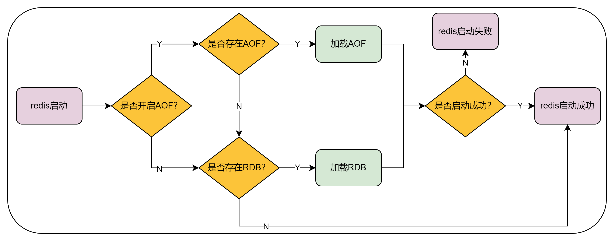

# redis启动命令

```
[root@10 ~]# redis-server /usr/local/bin/rdconf/redis.conf 
[root@10 ~]# 
[root@10 ~]# systemctl status redis
Unit redis.service could not be found.
[root@10 ~]# fuser -n tcp 6379
6379/tcp:            21168
[root@10 ~]# 
[root@10 ~]# ps -ef|grep redis
root       21168       1  0 09:48 ?        00:00:00 redis-server 127.0.0.1:6379
root       34592    3136  0 09:53 pts/1    00:00:00 grep --color=auto redis
[root@10 ~]# redis-cli
127.0.0.1:6379> ping
PONG
127.0.0.1:6379> 
```

# CentOS Stream 8 开放端口

> https://www.centos.org/centos-stream/

```
# 新系统中应先判断 firewalld 是否在运行（Centos8 查看服务命令）
systemctl status firewalld
# 开放端口
firewall-cmd --permanent --zone=public --add-port=6379/tcp
# 使规则生效
firewall-cmd --reload
# 查看所有端口
firewall-cmd --list-all
```


# redis的持久化策略

> 视频：https://www.bilibili.com/video/BV1qF41157D1

概述

Redis是基于内存的非关系型K-V数据库，既然它是基于内存的，如果Redis服务器挂了，数据就会丢失，为了避免数据丢失，Redis提供了持久化，即把数据保存到磁盘。

持久化机制：RDB和AOF

## RDB

RDB（Redis database）持久化，是指在指定的时间间隔内将内存中的数据集快照写入磁盘，也就是Snapshot快照，它是Redis默认的持久化方式，执行完操作后，在指定目录下生成一个dump.rdb，Redis重启的时候，通过加载dump.rdb文件来恢复数据。

### 配置（redis.conf）

Redis默认提供了三种会触发rdb持久化的条件

```
# 关闭rdb持久化功能
save ""

# 900秒之内至少有一个key被改变
save 900 1
# 300秒之内至少有十个key被改变
save 300 10
# 60秒之内有一万次key被改变
save 60 10000

# rdb默认配置文件名称
dbfilename dump.rdb
```

### 触发机制

#### 手动触发

save：（同步）save时只管保存，其他不管，save是一个阻塞式命令，即当服务器接收了一条save命令之后就会开始拍摄快照，在此期间不会再去处理其他的请求，其他请求会被挂起直到备份结束，应该避免使用。

bgsave：（异步）Redis会在后台进行快照操作，快照操作同时还可以响应客户端请求，与save命令区别就在于bgsave不会阻塞主进程处理的操作。Redis会单独创建（Fork）一个子进程来进行持久化，先将数据写入到一个临时文件中，待持久化过程都结束了，再用这个临时文件替换上次持久化好的文件。

#### 自动触发

```
# m秒内数据集存在n次修改时，自动触发bgsave（异步）
save m n
```

### 优点

① 如果需要进行大规模的数据恢复，且对于数据恢复的完整性不是非常敏感，那么RDB方式要比AOF方式更加的高效

② 与AOF相比，在恢复大的数据集的时候，RDB方式会更快一些

③ RDB很适用于灾备，单文件很方便就能传输到远程的服务器上

④ 可以定期备份RDB文件，直接写个脚本就可以，很方便

### 缺点

① 没有办法做到实时持久化/秒级持久化

② 最后一次持久化后的数据可能丢失

③ RDB需要经常fork子进程来保存数据集到硬盘上，当数据集比较大的时候，fork的进程是非常耗时的，可能导致Redis在一些毫秒级不能响应客户端请求


## AOF

全称“append only file”，AOF是以日志的形式来记录每个写操作，将Redis执行过的所有写指令记录下来（读操作不记录），只许追加文件但不可以改写文件，Redis启动之初会读取该文件重新构建数据，Redis重启的话根据日志文件的内容将写指令从头到尾执行一次以完成数据的恢复。AOF方式持久化默认保存的是appendonly.aof文件，它主要解决数据持久化的实时性问题，默认是不开启的。

### 配置（redis.conf）

```
# AOF持久化开关，默认是关闭的
appendonly no

# AOF备份文件的名称
appendfilename "appendonly.aof"

# AOF持久化策略
# Always：同步持久化，每次发生数据变更会立即记录到磁盘，性能较差但数据完整性较好
# appendfsync always
# Everysec：默认配置，异步操作，每秒记录，如果一秒内宕机，有数据丢失
appendfsync everysec

# 默认配置是当AOF文件大小是上次rewrite后大小的一倍且文件大于64M时触发重写
auto-aof-rewrite-percentage 100
auto-aof-rewrite-min-size 64mb
```

### 原理

AOF方式持久化通过保存Redis执行时候的所有写操作命令，注意，读操作命令不追加，将写命令追加到appendonly.aof文件中，理论上只要保存了所有写操作命令，那么恢复时将这些命令从头到尾再执行一次就可以从正常恢复数据。

### AOF持久化策略

- appendfsync always：always（同步持久化），每次发生数据变更会立即记录到磁盘，性能较差但数据完整性较好，always会严重影响服务器的性能
- appendfsync everysec：everysec，默认方式，异步操作，每秒记录，如果一秒内宕机，有数据丢失
- appendfsync no：从不同步

### 重写机制

AOF采用文件追加方式，文件会越来越大，为避免出现此种情况，Redis新增了重写机制，当AOF文件的大小超过所设定的阈值时，Redis就会启动AOF文件的内容压缩，只保留可以恢复数据的最小指令集。当然我们也可以使用命令bgrewriteaof手动告诉Redis进行AOF文件的重写，这样可以有效减少AOF文件的体积。

### 重写原理

- Redis会fork出一个子进程来对AOF文件进行重写，原理跟快照持久化命令bgsave的工作原理类似，值得注意的是，进行AOF文件重写时，如果原来的AOF文件体积已经非常大，那么重写AOF并删除旧的AOF文件的过程将会对Redis的性能造成较大的影响。
- auto-aof-rewrite-percentage：配置当AOF文件需要比旧AOF文件增大多少时才进行重写
- auto-aof-rewrite-min-size：配置当AOF文件需要达到多大体积时才进行重写

- 只有这两个配置的条件都达到时，才会进行重写。

### 优点

① 数据的一致性和完整性更高

② 使用默认的持久化策略：每秒同步一次，Redis数据最多只会丢失1秒的数据

③ AOF文件的格式可读性较强，同时还可以检查AOF文件中的错误并进行修复

### 缺点

① 对相同的数据集来说，AOF文件的体积通常要大于RDB文件的体积，恢复速度慢于RDB

加载流程



如果存在dump.rdb文件和aof文件的话，会优先加载aof文件


## 总结

- Redis允许同时存在rdb和aof两种持久化方式，但是重启时会优先加载aof文件
- 如果在项目中只是将redis作为缓存服务器的话，我们可以不用进行持久化，因为缓存对数据敏感性没那么强
- aof持久化方式最多只会丢失一秒的数据，但是这带来了很多额外的IO操作，其次就是重写造成的阻塞不可避免，所以应该尽量减少aof重写的频率，建议将参数auto-aof-rewrite-min-size修改为5G或者更大


