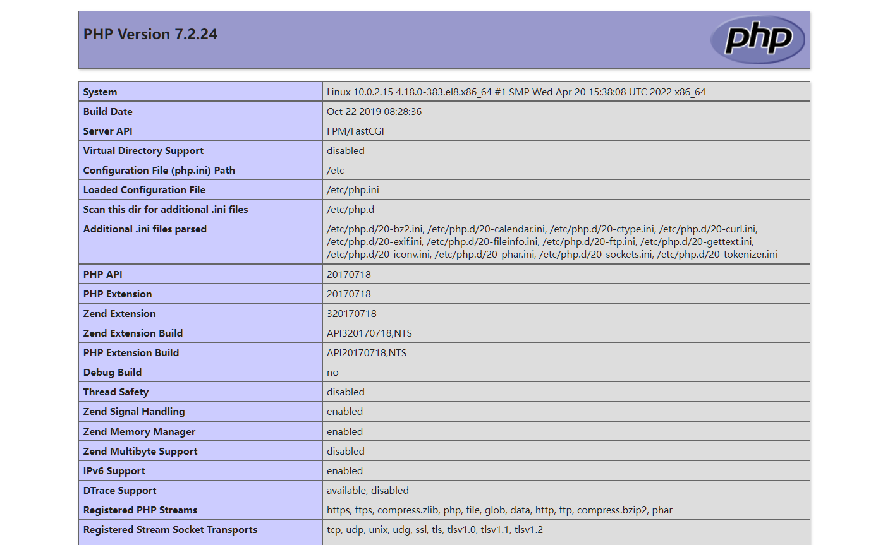
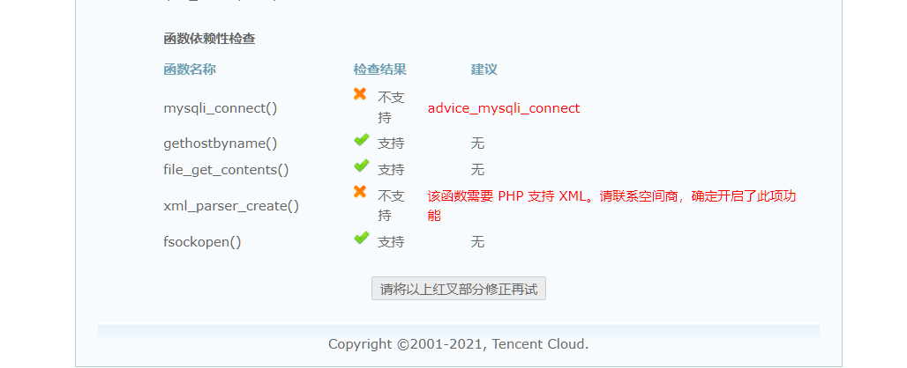

# Linux环境配置PHP

> https://gitee.com/Discuz/DiscuzX

## 一、yum方式

> https://blog.csdn.net/m0_67428420/article/details/124920101
>
> 

```shell
yum install -y php
cd /var/www/html/    # 进入目录
tounch index.php     # 创建一个PHP页面
vim index.php         # 编辑输入内容
<?php
phpinfo();
?>

# 这里我们使用了 phpinfo() 函数，这个函数的主要作用是显示 PHP 的相关信息，这些信息包括 PHP 的编译信息、PHP 的版本、服务器信息和环境、PHP 的环境、操作系统信息、路径、主要的配置选项、HTTP 头信息和 PHP 的许可等。我们一般使用这个函数来测试 PHP 是否安装成功，接下来在浏览器中输入“http://服务器IP/index.php”来执行该文件，如图1 所示。

systemctl restart httpd  # 重启服务
systemctl start httpd
systemctl stop httpd

[root@localhost php-5.4.25]# /usr/local/apache2/bin/apachectl stop
[root@localhost php-5.4.25]# /usr/local/apache2/bin/apachectl start

# 这里最好不要使用 restart 参数，因为对于源码包的 apache 启动命令，restart 参数有时会不起作用。

# 访问：http://192.168.56.103/

```




```shell
# 关于Linux查找文件参考：https://blog.csdn.net/xxmonstor/article/details/80507769
[root@10 html]# find / -name php  # 根据文件名查找文件
find: ‘/proc/133668’: 没有那个文件或目录
find: ‘/proc/133712’: 没有那个文件或目录
find: ‘/proc/133717’: 没有那个文件或目录
/var/lib/php
/usr/bin/php
/usr/lib64/php
/usr/share/php

[root@10 html]# php -v
PHP 7.2.24 (cli) (built: Oct 22 2019 08:28:36) ( NTS )
Copyright (c) 1997-2018 The PHP Group
Zend Engine v3.2.0, Copyright (c) 1998-2018 Zend Technologies


```


## 二、其他方式

> http://c.biancheng.net/view/1128.html


## 三、卸载PHP

```shell
参考：https://www.php.cn/php-ask-455491.html

[root@10 ~]# rpm -qa|grep php
php-common-7.2.24-1.module_el8.2.0+313+b04d0a66.x86_64
php-fpm-7.2.24-1.module_el8.2.0+313+b04d0a66.x86_64
php-7.2.24-1.module_el8.2.0+313+b04d0a66.x86_64
php-cli-7.2.24-1.module_el8.2.0+313+b04d0a66.x86_64
[root@10 ~]# 

[root@10 ~]# rpm -qa|grep php
php-xml-7.2.24-1.module_el8.2.0+313+b04d0a66.x86_64
php-common-7.2.24-1.module_el8.2.0+313+b04d0a66.x86_64
php-mysqlnd-7.2.24-1.module_el8.2.0+313+b04d0a66.x86_64
php-fpm-7.2.24-1.module_el8.2.0+313+b04d0a66.x86_64
php-7.2.24-1.module_el8.2.0+313+b04d0a66.x86_64
php-cli-7.2.24-1.module_el8.2.0+313+b04d0a66.x86_64
php-pdo-7.2.24-1.module_el8.2.0+313+b04d0a66.x86_64
[root@10 ~]# 


# 卸载命令
1. pdo是mysql的依赖项；common是gd的依赖项；
# rpm -e php-pdo-5.1.6-27.el5_5.3
error: Failed dependencies:
php-pdo is needed by (installed) php-mysql-5.1.6-27.el5_5.3.i386

2. 正确的卸载顺序：
# rpm -e php-mysql-5.1.6-27.el5_5.3 
# rpm -e php-pdo-5.1.6-27.el5_5.3 
# rpm -e php-xml-5.1.6-27.el5_5.3 
# rpm -e php-cli-5.1.6-27.el5_5.3 
# rpm -e php-gd-5.1.6-27.el5_5.3 
# rpm -e php-common-5.1.6-27.el5_5.3

3. 最后查看有没有完全卸载即可
# php -v

```


## 四、安装依赖



```shell
参考：https://cloud.tencent.com/developer/article/1897918?from=15425
[root@10 ~]# yum install php-xml

[root@10 ~]# yum install php-mysql
上次元数据过期检查：0:34:54 前，执行于 2022年06月27日 星期一 09时37分21秒。
未找到匹配的参数: php-mysql
错误：没有任何匹配: php-mysql

[root@10 ~]# yum install php-mysqli


# 配置php-mysql依赖
参考：https://jingyan.baidu.com/article/870c6fc3304c8ab03fe4bec2.html
extension=php_curl.dll
extension=php_gd2.dll
extension=php_mbstring.dll
extension=php_exif.dll
extension=php_mysql.dll
extension=php_mysqli.dll
extension=php_pdo_mysql.dll


extension=php_curl.dll
extension=pdo_mysql.dll


# https://blog.csdn.net/weixin_29818013/article/details/113900459
php.ini中，也只有extension=php_mysqli.dll，而不再有extension=php_mysql.dll这个拓展了。

extension=php_mysql.dll
extension=php_mysqli.dll

```


## 五、PHP安装路径

## php:

如果采用RPM包安装，安装路径应在 /etc/目录下

php的配置文件:/etc/php.ini

如果采用源代码安装，一般默认安装在/usr/local/lib目录下

php配置文件: /usr/local/lib/php.ini

或/usr/local/php/etc/php.ini


作者：Sugar_ping
链接：https://www.jianshu.com/p/929254f885ea
来源：简书
著作权归作者所有。商业转载请联系作者获得授权，非商业转载请注明出处。


```shell
[root@10 ~]# yum install php-mysqli
上次元数据过期检查：1:14:51 前，执行于 2022年06月27日 星期一 09时37分21秒。
依赖关系解决。
======================================================================================================================================
 软件包                     架构                  版本                                                 仓库                      大小
======================================================================================================================================
安装:
 php-mysqlnd                x86_64                7.2.24-1.module_el8.2.0+313+b04d0a66                 appstream                190 k
安装依赖关系:
 php-pdo                    x86_64                7.2.24-1.module_el8.2.0+313+b04d0a66                 appstream                122 k

事务概要
======================================================================================================================================
安装  2 软件包

总下载：313 k
安装大小：647 k
确定吗？[y/N]： y
下载软件包：
(1/2): php-pdo-7.2.24-1.module_el8.2.0+313+b04d0a66.x86_64.rpm                                         22 kB/s | 122 kB     00:05    
(2/2): php-mysqlnd-7.2.24-1.module_el8.2.0+313+b04d0a66.x86_64.rpm                                     32 kB/s | 190 kB     00:05    
--------------------------------------------------------------------------------------------------------------------------------------
总计                                                                                                   27 kB/s | 313 kB     00:11     
运行事务检查
事务检查成功。
运行事务测试
事务测试成功。
运行事务
  准备中  :                                                                                                                       1/1 
  安装    : php-pdo-7.2.24-1.module_el8.2.0+313+b04d0a66.x86_64                                                                   1/2 
  安装    : php-mysqlnd-7.2.24-1.module_el8.2.0+313+b04d0a66.x86_64                                                               2/2 
  运行脚本: php-mysqlnd-7.2.24-1.module_el8.2.0+313+b04d0a66.x86_64                                                               2/2 
  验证    : php-mysqlnd-7.2.24-1.module_el8.2.0+313+b04d0a66.x86_64                                                               1/2 
  验证    : php-pdo-7.2.24-1.module_el8.2.0+313+b04d0a66.x86_64                                                                   2/2 

已安装:
  php-mysqlnd-7.2.24-1.module_el8.2.0+313+b04d0a66.x86_64             php-pdo-7.2.24-1.module_el8.2.0+313+b04d0a66.x86_64            

完毕！
[root@10 ~]# 
```


### memcached安装

```shell
yum install memcached
yum install php-memcached
yum apachectl graceful
    
yum install php7.2-memcache
yum install php7.2-memcached
    
```


## 解决办法

> https://blog.csdn.net/weixin_33797791/article/details/85894991

```
故障现象：linux 安装discuz 错误提示:mysql_connect() 不支持请检查mysql模块是否正确载入.

　　解决的方法：查看/usr/lib/php/modules/ (64位的看/usr/lib64/php/modules/)里面根本没有mysql.so

　　找到centos5.4安装盘，放入光驱，然后找到CentOS文件夹下的

　　php-mysql-5.1.6-20.el5.i386.rpm

　　php-pdo-5.1.6-20.el5.i386.rpm

　　二个文件。然后通过FTP上传到server。

　　运行安装：

　　rpm -i php-mysql-5.1.6-20.el5.i386.rpm --nodeps

　　pm -i php-pdo-5.1.6-20.el5.i386.rpm --nodeps

　　再查看so文件：

　　ls /usr/lib/php/modules/

　　dbase.so ldap.so mysqli.so mysql.so pdo_mysql.so pdo.so pdo_sqlite.so phpcups.so

　　mysql.so存在了。

　　然后配置

　　vi /etc/php.ini找到extension=msql.so，然后在它下方去掉前面分号然后加入例如以下：

　　extension=mysql.so

　　extension=mysqli.so

　　extension=pdo_MySQL.so

　　保存，重新启动httpd

　　/etc/init.d/httpd restart

　　刷新网页，mysql已经能连上了。
```


centos 8 仓库

> http://rpms.remirepo.net/enterprise/8/

https://blog.csdn.net/qq_59536202/article/details/125053130


