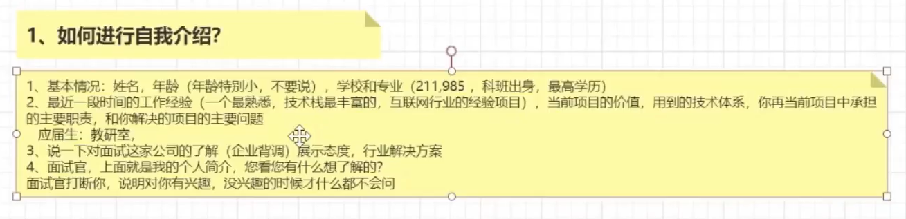
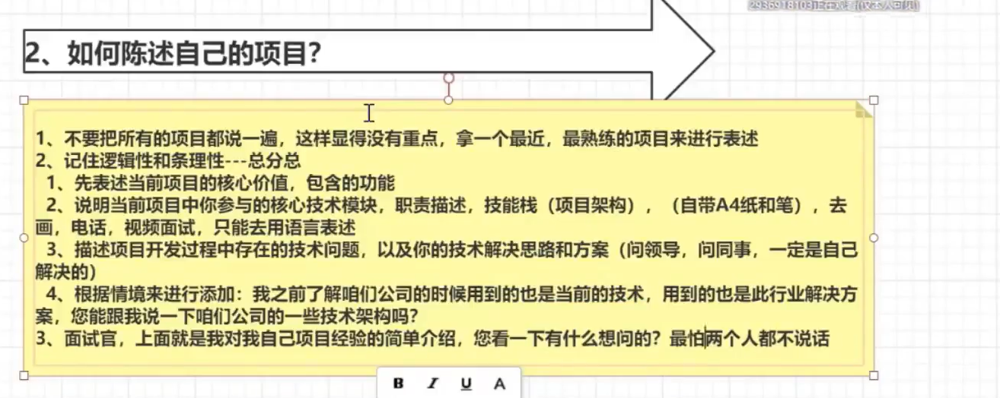
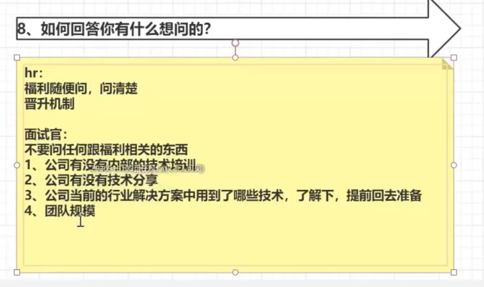

## 技术相关：

1. 精通、熟悉java核心，多年一线开发经验，具备良好的编码能力，并熟练使用设计模式

熟练掌握java相关知识，具备良好的面向对象的编程思想，对设计模式和设计原则有深入的理解

熟悉java核心的集合框架，对HashMap、concurrentHashMap和ArrayList等都有深入研究，研究过其底层源码

2. 熟悉JVM，JMM，GC算法，熟悉常见的垃圾回收器，熟悉JVM调优，并且参与过线上的实际调优工作

3. 精通、熟悉java并发编程，对java的各种锁机制、synchronized、线程池机制、AQS都有深入理解，对操作系统的并发有深入研究，并在项目中熟练使用
4. 精通、熟悉spring，springMVc，springboot，mybatis，mybatis-plus都有深入理解，多年实战经验，可以安装需求快速构建项目，并阅读过核心源码

对bean的生命周期、循环依赖。。。源码有深入研究

IOC、aop、生命周期、循环依赖、声明式事务、传播特性、项目中aop的扩展点、九大组件源码、源码的扩展点、自动装配的原理、springboot启动流程、内嵌Tomcat原理、代理模式的应用、如何集成和扩展

5. 精通、熟悉springcloud alibaba，（nocas，sentinel，。。。。），对分布式微服务特点，旧服务改造，服务划分，服务治理，服务分层都有深入理解，有线上项目经验

dubbo eureka ribbon

跟实际的项目生产关联

6. 精通、熟悉SQL语言和MySQL调优，多年实战经验，对索引的优化及存储引擎有深入的研究，对MySQL的事务、锁有深入理解，对MySQL集群，主从复制，读写分离，分库分表都有实战经验，对MHA，MMM等高可用架构有实际的经验
7. 精通、熟悉redis，了解底层磁盘及网络IO模型，数据持久化机制，多数据类型缓存应用，高可用机制以及分布式集群实现，主从复制、哨兵机制，分片集群
8. 精通、熟悉kafka，看过核心源码，了解数据刷盘机制，集群分片化机制，在高吞吐量情况下消息不丢和重复消费以及消息投递一致性问题，有实际的项目经验

rocketMQ，rabbitMQ，不建议写activeMQ，建议写kafka和rocketMQ

9. 精通、熟悉zookeeper底层实现原理，了解paxos，zab算法，对CAP定理有深入理解，选举机制，zookeeper实现分布式锁
10. 熟悉大型网站高并发设计方案，对Nginx，IVS，keepalived，cdn等都有深入的理解，参与过高并发、高可用、高吞吐、高性能的架构设计方案

## 自我介绍

## 陈述项目

## 问面试官什么问题

