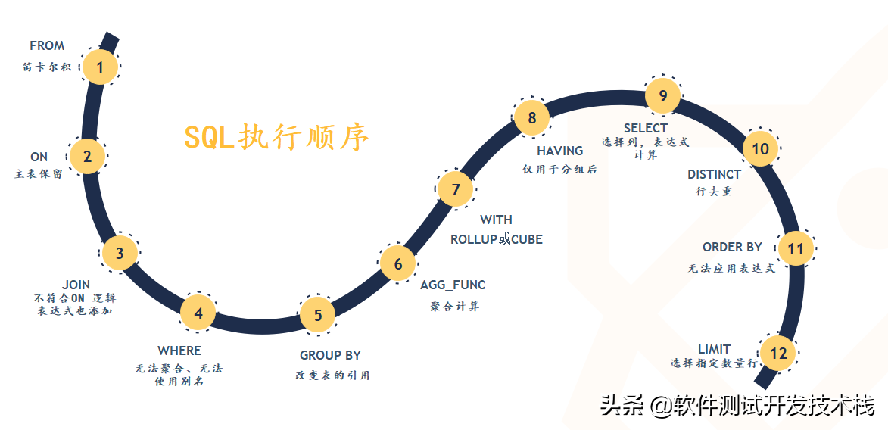
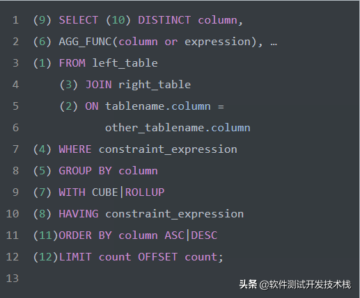
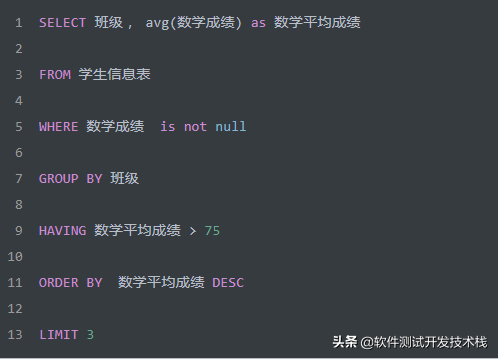
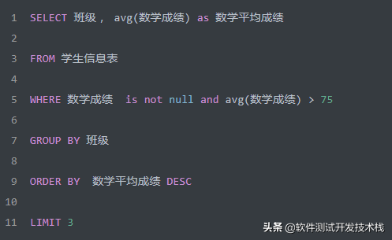

# SQL查询语句的执行顺序解析

> https://www.toutiao.com/article/6729452080848699918/

结合上图，整理出如下伪SQL查询语句。

从这个顺序中我们可以发现，所有的查询语句都是从 **FROM** 开始执行的。在实际执行过程中，每个步骤都会为下一个步骤生成一个虚拟表，这个虚拟表将作为下一个执行步骤的输入。 接下来，我们详细的介绍下每个步骤的具体执行过程。

------

# **1 FROM** 执行笛卡尔积

FROM 才是 SQL 语句执行的第一步，并非 SELECT 。对FROM子句中的前两个表执行笛卡尔积(交叉联接），生成虚拟表VT1，获取不同数据源的数据集。

**FROM子句执行顺序为从后往前、从右到左**，FROM 子句中写在最后的表(基础表 driving table)将被最先处理，即最后的表为驱动表，当FROM 子句中包含多个表的情况下，我们需要选择数据最少的表作为基础表。

------

# **2 ON 应用ON过滤器**

对虚拟表**VT1** 应用ON筛选器，ON 中的逻辑表达式将应用到虚拟表 **VT1**中的各个行，筛选出满足ON 逻辑表达式的行，生成虚拟表 **VT2** 。

------

# **3 JOIN 添加外部行**

如果指定了OUTER JOIN保留表中未找到匹配的行将作为外部行添加到虚拟表 **VT2**，生成虚拟表 **VT3**。保留表如下：

- LEFT OUTER JOIN把左表记为保留表
- RIGHT OUTER JOIN把右表记为保留表
- FULL OUTER JOIN把左右表都作为保留表

在虚拟表 **VT2**表的基础上添加保留表中被过滤条件过滤掉的数据，非保留表中的数据被赋予NULL值，最后生成虚拟表 **VT3**。

如果FROM子句包含两个以上的表，则对上一个联接生成的结果表和下一个表重复执行步骤1~3，直到处理完所有的表为止。

------

# **4 WHERE 应用WEHRE过滤器**

对虚拟表 **VT3**应用WHERE筛选器。根据指定的条件对数据进行筛选，并把满足的数据插入虚拟表 **VT4**。

- 由于数据还没有分组，因此现在还不能在WHERE过滤器中使用聚合函数对分组统计的过滤。
- 同时，由于还没有进行列的选取操作，因此在SELECT中使用列的别名也是不被允许的。

------

# **5 GROUP BY 分组**

按GROUP BY子句中的列/列表将虚拟表 **VT4**中的行唯一的值组合成为一组，生成虚拟表**VT5**。如果应用了GROUP BY，那么后面的所有步骤都只能得到的虚拟表VT5的列或者是聚合函数（count、sum、avg等）。原因在于最终的结果集中只为每个组包含一行。

同时，从这一步开始，后面的语句中都可以使用SELECT中的别名。

------

# **6** AGG_FUNC **计算聚合函数**

计算 max 等聚合函数。SQL Aggregate 函数计算从列中取得的值，返回一个单一的值。常用的 Aggregate 函数包涵以下几种：

- AVG：返回平均值
- COUNT：返回行数
- FIRST：返回第一个记录的值
- LAST：返回最后一个记录的值
- MAX： 返回最大值
- MIN：返回最小值
- SUM： 返回总和

------

# **7 WITH 应用ROLLUP或CUBE**

对虚拟表 **VT5**应用ROLLUP或CUBE选项，生成虚拟表 **VT6**。

CUBE 和 ROLLUP 区别如下：

- CUBE 生成的结果数据集显示了所选列中值的所有组合的聚合。
- ROLLUP 生成的结果数据集显示了所选列中值的某一层次结构的聚合。

------

# **8 HAVING 应用HAVING过滤器**

对虚拟表VT6应用HAVING筛选器。根据指定的条件对数据进行筛选，并把满足的数据插入虚拟表VT7。

**HAVING** 语句在SQL中的主要作用与**WHERE**语句作用是相同的，但是**HAVING**是过滤聚合值，在 SQL 中增加 HAVING 子句原因就是，WHERE 关键字无法与聚合函数一起使用，HAVING子句主要和GROUP BY子句配合使用。

------

# **9 SELECT 选出指定列**

将虚拟表 **VT7**中的在SELECT中出现的列筛选出来，并对字段进行处理，计算SELECT子句中的表达式，产生虚拟表 **VT8**。

------

# **10 DISTINCT 行去重**

将重复的行从虚拟表 **VT8**中移除，产生虚拟表 **VT9**。DISTINCT用来删除重复行，只保留唯一的。

------

# **11 ORDER BY 排列**

将虚拟表 **VT9**中的行按ORDER BY 子句中的列/列表排序，生成游标 **VC10** ，注意不是虚拟表。因此使用 ORDER BY 子句查询不能应用于表达式。同时，ORDER BY子句的执行顺序为从左到右排序，是非常消耗资源的。

------

# **12 LIMIT/OFFSET 指定返回行**

从VC10的开始处选择指定数量行，生成虚拟表 **VT11**，并返回调用者。

------

# **实例**

**接下来，我们看一个实例，以下SQL查询语句是否存在问题？**

首先，我们先看下如上**SQL**的执行顺序，如下：

1. 首先执行 FROM 子句, 从**学生成绩表**中组装数据源的数据。
2. 执行 WHERE 子句, 筛选**学生成绩表**中所有学生的数学成绩不为 NULL 的数据 。
3. 执行 GROUP BY 子句, 把**学生成绩表**按 "**班级**" 字段进行分组。
4. 计算 avg 聚合函数, 按找每个班级分组求出 **数学平均成绩**。
5. 执行 HAVING 子句, 筛选出班级 **数学平均成绩**大于 75 分的。
6. 执行SELECT语句，返回数据，但别着急，还需要执行后面几个步骤。
7. 执行 ORDER BY 子句, 把最后的结果按 "数学平均成绩" 进行排序。
8. 执行LIMIT ，限制仅返回3条数据。结合ORDER BY 子句，即返回所有班级中数学平均成绩的前三的班级及其数学平均成绩。

------

**思考一下，如果我们将上面语句改成，如下会怎样？**

我们发现，若将 **avg(数学成绩) > 75** 放到WHERE子句中，此时GROUP BY语句还未执行，因此此时聚合值 **avg(数学成绩)** 还是未知的，因此会报错。